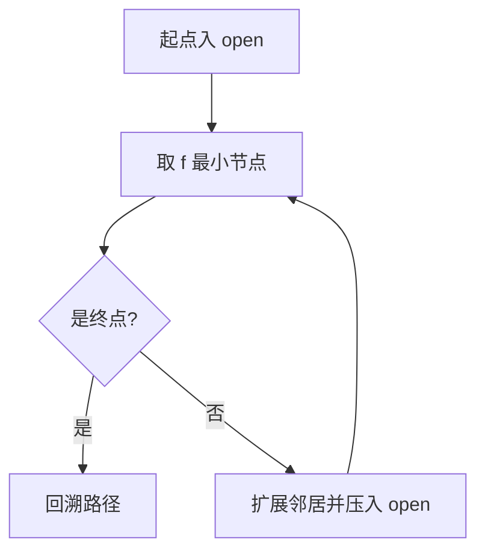

# 教学素材规范（图 / 流程图 / GIF）

> 用于 `algorithms/<pNN-族>/<算法名>/images/` 与 `make_teaching_assets.py`（纪律④）。
> 核心原则：**抽象概念优先用图讲；图必须能重生成、必须与代码数字一致。**

---

## 一、四类素材的分工

| 素材 | 讲什么 | 放哪 | 生成方式 |
|---|---|---|---|
| 概念图 | 核心量的含义与组合（如 `f = g + h` 的色条） | 基础篇 1–2 节 | matplotlib / SVG 脚本 |
| 流程图 | 主循环、判定分支、数据流 | 基础篇 3 节 | matplotlib 方框箭头或 Mermaid（Mermaid 直接写进 README 也行） |
| 对比图 | 手写 vs 对照、策略/参数差异、搜索范围 | 基础篇 6 节、进阶篇对照段 | 脚本生成多面板图 |
| 动画 / GIF | 过程与顺序（时间维度：扩展顺序、收敛过程） | 基础篇 4 或 6 节 | matplotlib `FuncAnimation` → `PillowWriter` |

选型口诀：**讲"是什么"用图，讲"怎么走"用流程图，讲"差别"用对比图，讲"过程"用动画。** 能用一张静态图讲清的，不要上动画（GIF 体积与维护成本都高）。

## 二、硬约束（可被检查）

1. **脚本生成**：`images/` 下每个文件都必须能由 `make_teaching_assets.py` 重跑生成；手绘、截图、外部下载一律不收
2. **数字对账**：脚本内断言素材中的数字与 `impl.py` / `demo.py` 输出一致，不一致即报错——这是"文档不漂移"的机器保险
3. **引用存在**：README 引用的素材路径必须存在（`validate.py` 检查；缺失记硬伤）
4. **命名**：`NN-用途.{png,gif}`（如 `03-四种策略对比.png`），编号与 README 出现顺序一致

## 三、生成器骨架（对账断言是重点）

```python
"""<算法名> 图文素材生成器。

原则：素材全部由本脚本生成，且与 impl.py 的数字逐项对账。
产出（images/）：01-概念图.png / 02-主循环.png / 03-对比图.png / 04-动画.gif
运行：cd algorithms/<族>/<算法名> && ../../../.venv/bin/python make_teaching_assets.py
"""

import os
import sys
from pathlib import Path

os.environ.setdefault("MPLCONFIGDIR", "/tmp/mplcfg")   # 无写权限环境下的缓存兜底

import matplotlib

matplotlib.use("Agg")

import matplotlib.pyplot as plt
from matplotlib import animation, font_manager

HERE = Path(__file__).resolve().parent
sys.path.insert(0, str(HERE))
IMAGES = HERE / "images"
IMAGES.mkdir(exist_ok=True)

# 中文字体：优先 Noto，其次文泉驿；都没有就让脚本报错而不是画出方块
FONT_CANDIDATES = [
    "/usr/share/fonts/opentype/noto/NotoSansCJK-Regular.ttc",
    "/usr/share/fonts/truetype/wqy/wqy-zenhei.ttc",
]
for _f in FONT_CANDIDATES:
    if Path(_f).exists():
        font_manager.fontManager.addfont(_f)
        plt.rcParams["font.family"] = font_manager.FontProperties(fname=_f).get_name()
        break

from impl import solve  # noqa: E402  素材数字的唯一来源
from demo import make_case  # noqa: E402


def verify() -> None:
    """素材与 impl/demo 对账：不一致直接报错、不出图。"""
    case = make_case(seed=42)
    ref = solve(case.grid, case.start, case.goal)
    drawn = trace(case)          # 教学脚本自己的复算
    assert drawn.expanded == ref.nodes_expanded, "扩展数与 impl 不一致"
    assert drawn.cost == ref.path_cost, "路径代价与 impl 不一致"


def make_compare() -> None:
    fig, ax = plt.subplots(figsize=(8, 5))
    ...
    fig.savefig(IMAGES / "03-对比图.png", dpi=120)
    plt.close(fig)


def make_animation() -> None:
    fig, ax = plt.subplots(figsize=(6, 6))
    anim = animation.FuncAnimation(fig, update, frames=range(0, 200, 5))
    anim.save(IMAGES / "04-动画.gif", writer=animation.PillowWriter(fps=8))
    plt.close(fig)


if __name__ == "__main__":
    verify()
    make_compare()
    make_animation()
    print("✓ 已与 impl 对账；素材输出到", IMAGES)
```

三种常见失效与对策：

| 失效 | 症状 | 对策 |
|---|---|---|
| 数字漂移 | 图里的扩展数与实测表不符 | `verify()` 断言；改算法后重跑脚本 |
| 中文变方块 | 图里出现「豆腐块」 | 脚本内注册中文字体；找不到字体直接报错 |
| 缓存写不进去 | matplotlib 报只读目录 | `os.environ.setdefault("MPLCONFIGDIR", "/tmp/mplcfg")` |

## 四、README 里怎么引用

```markdown

```

- alt 文本写"这张图说明了什么"，不写"图片 1"
- 图片前后各留空行；同一节不要超过 2 张图（信息密度过高等于没讲）
- GIF 体积控制在 2 MB 以内：超了就抽帧（`frames=range(0, n, 6)`）、降 dpi 或缩小画布

## 五、Mermaid 的用法（能写文本就别出图）

流程图若能用 Mermaid 表达，直接写进 README，不生成 PNG——文本可 diff、可搜索、零体积：

````markdown

````

图（概念/对比/动画）用脚本生成；**流程图优先 Mermaid**，只有 Mermaid 表达不了（如带计算的示意）才出 PNG。
