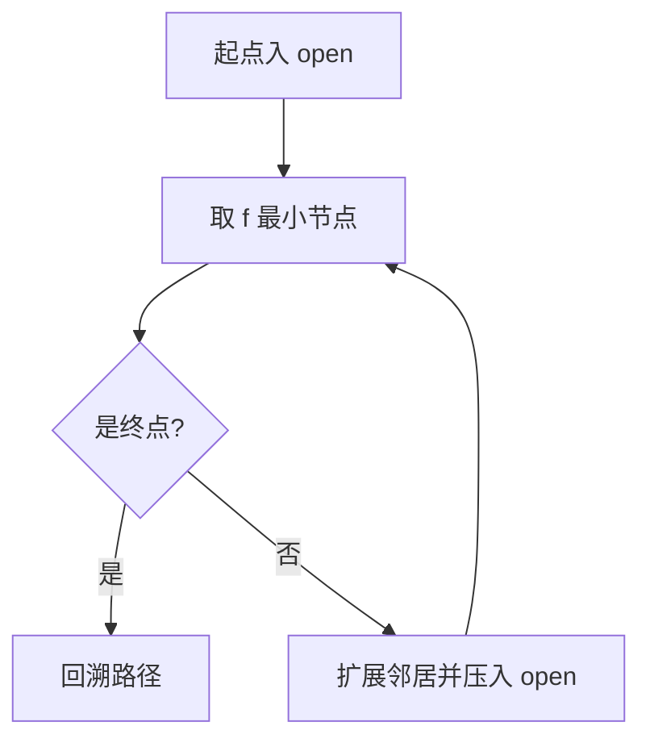

# 表现层规范（教学素材：图 / 流程图 / GIF）

> 用途：规定 `images/` 的素材类型、生成方式与引用格式（纪律④）。
> 权威关系：结构与章节归属见 `readme-structure.md`；基础篇 / 进阶篇写法见另两份模板。
> 读者：要为本实验生成素材的人。

---

## 四类素材分工

| 素材 | 讲什么 | 放哪 | 生成方式 |
|---|---|---|---|
| 概念图 | 核心量的含义与组合（如 `f = g + h` 的色条） | 基础篇 1–2 节 | matplotlib / SVG 脚本 |
| 流程图 | 主循环、判定分支、数据流 | 基础篇 3 节 | 优先 Mermaid（直接写进 README），复杂时出 PNG |
| 对比图 | 手写 vs 对照、策略 / 参数差异、搜索范围 | 基础篇 6 节、进阶篇「对照」段 | 脚本生成多面板图 |
| 动画 / GIF | 过程与顺序（时间维度：扩展顺序、收敛过程） | 基础篇 4 或 6 节 | matplotlib `FuncAnimation` → `PillowWriter` |

选型口诀：**讲"是什么"用图，讲"怎么走"用流程图，讲"差别"用对比图，讲"过程"用动画。** 能用一张静态图讲清的，不要上动画（GIF 体积与维护成本都高）。

## 硬约束

1. **脚本生成**：`images/` 下每个文件都必须能由 `make_teaching_assets.py` 重跑生成；手绘、截图、外部下载一律不收
2. **数字对账**：脚本内断言素材中的数字与 `impl.py` / `demo.py` 输出一致，不一致即报错——这是"文档不漂移"的机器保险
3. **引用存在**：README 引用的素材路径必须存在（`validate.py` 检查；缺失记硬伤）
4. **命名**：`NN-用途.{png,gif}`（如 `03-四种策略对比.png`），编号与 README 出现顺序一致

起手式（脚手架）：`python3 .dsh/skills/mindspring-lab/scripts/scaffold_assets.py algorithms/<族>/<算法名>` 生成骨架与 `images/`；`--check` 检查已有生成器是否具备断言 / 缓存 / 字体 / images 四项底线。

## 生成器骨架

```python
"""<算法名> 图文素材生成器。

原则：素材全部由本脚本生成，且与 impl.py 的数字逐项对账。
产出（images/）：01-概念图.png / 02-主循环.png / 03-对比图.png / 04-动画.gif
运行：cd algorithms/<族>/<算法名> && ../../../.venv/bin/python make_teaching_assets.py
"""

import os
import sys
from pathlib import Path

os.environ.setdefault("MPLCONFIGDIR", "/tmp/mplcfg")   # 无写权限环境下的缓存兜底

import matplotlib

matplotlib.use("Agg")

import matplotlib.pyplot as plt
from matplotlib import animation, font_manager

HERE = Path(__file__).resolve().parent
sys.path.insert(0, str(HERE))
IMAGES = HERE / "images"
IMAGES.mkdir(exist_ok=True)

# 中文字体：按字体名查 + FreeType 字形校验，找不到就报错，绝不画方块。
#
# 为什么不用「硬编码 Linux 字体路径 + exists() 判断」：那个写法在 macOS / Windows
# 上一个候选都命不中，循环静默跳过 → font.family 保持默认 DejaVu Sans（无中文字形）
# → 整张图中文变方框；而 matplotlib 只在 stderr 发 UserWarning、退出码仍是 0，
# 于是"重跑生成器 + git add"会把好素材静默换成方块版（git status 只显示图片有变更）。
def setup_cjk_font() -> str:
    cjk_names = (
        "Noto Sans CJK SC", "Noto Sans CJK JP", "Source Han Sans SC", "Source Han Sans CN",
        "WenQuanYi Zen Hei", "WenQuanYi Micro Hei",           # Linux
        "Hiragino Sans GB", "PingFang SC", "Heiti TC",
        "STHeiti", "Songti SC", "Arial Unicode MS",           # macOS
        "Microsoft YaHei", "SimHei",                          # Windows
    )
    for path in ("/usr/share/fonts/opentype/noto/NotoSansCJK-Regular.ttc",
                 "/usr/share/fonts/truetype/wqy/wqy-zenhei.ttc"):
        if Path(path).exists():
            font_manager.fontManager.addfont(path)

    available = {f.name for f in font_manager.fontManager.ttflist}
    chosen = next((n for n in cjk_names if n in available), None)
    if chosen is None:
        raise SystemExit(
            "找不到含中文字形的字体，拒绝生成方块版素材。\n"
            f"fontManager 已扫描到 {len(available)} 个字体族，但无候选命中。\n"
            "请安装任一中文字体（如 Noto Sans CJK / 文泉驿）后重跑。"
        )

    font_path = font_manager.findfont(font_manager.FontProperties(family=chosen))
    from matplotlib import ft2font

    if ft2font.FT2Font(font_path).get_char_index(ord("中")) == 0:
        raise SystemExit(f"字体 {chosen}（{font_path}）不含中文字形，拒绝生成方块版素材")

    plt.rcParams["font.family"] = chosen
    plt.rcParams["axes.unicode_minus"] = False  # 负号走 ASCII，避免 U+2212 缺字形
    return chosen


FONT_USED = setup_cjk_font()

# TODO: 导入本实验的实现入口（素材数字的唯一来源）
# from impl import <主函数>


def verify() -> None:
    """素材与实现对账：不一致直接报错、不出图。"""
    # ref = <主函数>(...)
    # assert <素材里的数> == ref.<对应字段>, "扩展数与 impl 不一致"
    raise NotImplementedError("先写 verify()：素材数字必须与实现对账")


def make_compare() -> None:
    fig, ax = plt.subplots(figsize=(8, 5))
    # TODO: 画对比图
    fig.savefig(IMAGES / "03-对比图.png", dpi=120)
    plt.close(fig)


def make_animation() -> None:
    fig, ax = plt.subplots(figsize=(6, 6))
    # anim = animation.FuncAnimation(fig, update, frames=range(0, 200, 5))
    # anim.save(IMAGES / "04-动画.gif", writer=animation.PillowWriter(fps=8))
    plt.close(fig)


if __name__ == "__main__":
    verify()
    make_compare()
    make_animation()
    print("✓ 已与 impl 对账；素材输出到", IMAGES)
```

三种常见失效与对策：

| 失效 | 症状 | 对策 |
|---|---|---|
| 数字漂移 | 图里的数字与实测表不符 | `verify()` 断言；改算法后重跑脚本 |
| 中文变方块 | 图里出现「豆腐块」 | `setup_cjk_font()`：按字体名查 + FreeType 字形校验，找不到直接报错 |
| 缓存写不进去 | matplotlib 报只读目录 | `os.environ.setdefault("MPLCONFIGDIR", "/tmp/mplcfg")` |

**为什么字体这一项不能只靠"脚本里写了 font_manager"来判断**：脚本 import 了
`font_manager` 却一个中文字体都没注册成功时，图里照样全是方块，退出码还是 0——
`scaffold_assets.py --check` 早期版本就是 grep 关键字，于是"检查通过 + 图已坏"
同时成立。现在 `--check` 会**真的把 `setup_cjk_font()` 跑一遍**（子进程 + AST 抽取，
不触发生成器其它副作用），拿不到含「中」字形的字体名就报错。

## README 引用规范

```markdown

```

- alt 文本写"这张图说明了什么"，不写"图片 1"
- 图片前后各留空行；同一节不要超过 2 张图（信息密度过高等于没讲）
- GIF 体积控制在 2 MB 以内：超了就抽帧（`frames=range(0, n, 6)`）、降 dpi 或缩小画布

## Mermaid 优先

流程图若能用 Mermaid 表达，直接写进 README，不生成 PNG——文本可 diff、可搜索、零体积：

````markdown

````

图（概念 / 对比 / 动画）用脚本生成；**流程图优先 Mermaid**，只有 Mermaid 表达不了（如带计算的示意）才出 PNG。

## 自查清单

- [ ] `images/` 下每个文件都能由 `make_teaching_assets.py` 重跑生成
- [ ] 生成器里有 `verify()` 对账断言，且实跑通过
- [ ] README 引用的素材路径全部存在、有 alt 文本、编号与出现顺序一致
- [ ] GIF ≤ 2 MB；能用 Mermaid 的流程图没有出 PNG
- [ ] 中文字体已注册（图中无方块，`--check` 的运行时探测通过），只读环境下 `MPLCONFIGDIR` 有兜底
- [ ] `axes.unicode_minus = False`（否则带负值的图里负号是方块）
