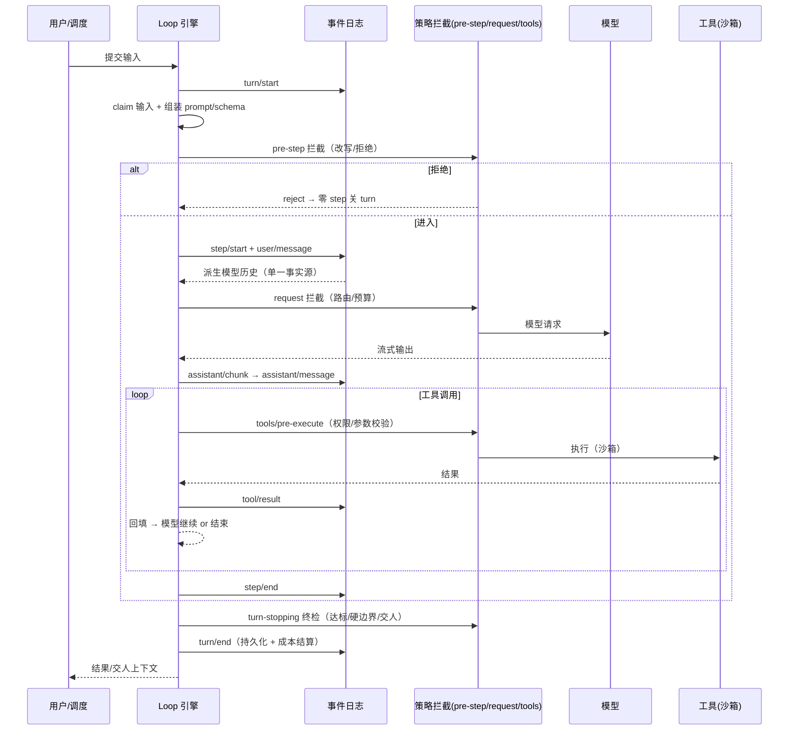

# Agent Loop 标准企业设计（可落地产物）

> 本专题回答**"怎么照着搭一个企业级 loop"**：五条设计原则 → 九步流程 → 时序图 → 组件清单 → 按团队阶段落地建议 → 检查清单 → 实战产物（运行实录 / YAML / 无进展检测伪码 / 验收脚本）。
>
> **定位说明**：本文的"标准设计"是一套**综合参考骨架**，主范本为 dsh（DeepSeek Harness——本环境即运行于其上）的 turn/step + 事件日志架构，再吸收 Codex 的预算/回放、Claude Code 的 hooks 拦截、Dify 的显式图各一点。它**不是多方验证的行业事实标准**，而是以一家实现为主线、结合 [02-横向对比.md](02-横向对比.md) 四款对比的泛化设计；落地时请结合自家引擎能力与团队阶段裁剪（见 §5）。

---

## 1. 五条设计原则

**原则一：单一事实源（Single Source of Truth）**

**一切模型可见的内容必须落在可追加的事件日志里（model-visible means logged）。**

- 重放、恢复、审计、遥测全部从这条流派生
- 架构上杜绝"日志里重建不出来的模型输入"（dsh 用运行时不变式强制）
- 反模式：模型输入散落在内存、文件、对话记录多处，无法复盘

**原则二：循环分层（Turn / Step 两段式）**

**step = 一次模型请求 + 工具调用（最小可审计单元）；turn = 有界的一组 step（有输入则开、无欠账则关）。**

- 粒度清晰才能谈治理：成本按 step 计、失败按 step 重试、审计按 step 追溯
- 反模式：整个会话是一个大黑盒循环，无法定位"哪一步烧了钱、哪一步错了"

**原则三：确定性拦截点（Deterministic Interception）**

**在四个位置设 waterfall 拦截点，策略以插件挂载，不侵入循环核心：**

| 位置 | 拦截什么 | 典型策略 |
|:--|:--|:--|
| **pre-step** | 模型这一步看什么 | 输入改写、敏感信息过滤、拒绝 |
| **request** | 请求构造 | 模型路由、token 上限、reasoning effort |
| **tools** | 工具执行 | 权限校验、参数校验、审计、重试 |
| **turn-stopping** | 是否结束 | 达标判定、硬边界检查、交人 |

- 反模式：策略写死在循环代码里（改策略要改引擎）

**原则四：显式停止条件（Explicit Stop）**

**停止用代码验证而非模型自评；三道硬边界 + 一条交人通道（四款横向差异见 [02-横向对比.md](02-横向对比.md) §4③）：**

| 停止条件 | 说明 |
|:--|:--|
| 完成判定 | 由测试/校验代码判定（如"pytest 全绿 AND lint 干净"），不是模型说"做完了" |
| 三道硬边界 | 最大迭代数（防死循环）／无进展检测（连续 N 轮无实质进展 → 停）／token·预算上限（成本硬边界，Codex goal 预算的实践） |
| 交人通道 | 无法自行解决 → 带上下文转人工（HITL） |

**原则五：可回放可观测（Replayable & Observable）**

- checkpoint / 事件日志支持任意步回滚重放——不可重放的循环是黑盒
- 每 step 记录 token 用量与来源事件序列（成本与行为都可审计）
- 生产级指标：成功率、平均 step 数、成本/任务、重试率、交人率

## 2. 标准 Loop 流程（九步）

> 骨架即 [02-横向对比.md](02-横向对比.md) §3③ 的 dsh 流程的编号版（补充治理注释）。

1. **claim 输入**（认领 next-step 输入 + 排队消息）
2. **组装 prompt 分区 + 工具 schema**（项目记忆 AGENTS.md/CLAUDE.md + skills 渐进加载）
3. **pre-step 拦截**：改写输入 / 拒绝（拒绝则零 step 关 turn，记录尝试）
4. **输入写入事件日志**（append-only）
5. **从日志派生模型历史**（单一事实源投影，不信任内存状态）
6. **request 拦截 → 模型流式输出** → assistant 消息落日志
7. **工具调用** → pre-execute（权限/参数校验）→ execute（沙箱）→ post-execute → result 落日志
8. **结果回填** → 若工具还欠请求或有新输入：回到 5 进入下一 step
9. **turn-stopping 终检**：达标（代码验证）→ 交付归档｜撞硬边界（迭代/无进展/预算）→ 强制停止留档｜无法解决 → 交人（HITL，带完整上下文）

turn/end 收尾：日志持久化、成本结算、遥测上报。

## 3. 标准 turn/step 时序图



## 4. 企业级组件清单

| 组件 | 职责 | 参考实现 |
|:--|:--|:--|
| **沙箱与权限** | 分环境 writable_roots、网络隔离、敏感操作审批链 | Codex workspace-write 模型；dsh sandbox/guard 插件 |
| **记忆分层** | 会话日志（事实）→ 项目记忆（AGENTS.md/CLAUDE.md）→ 长期记忆（goal/知识库） | Codex goal；Dify 知识库；dsh session log |
| **工具治理** | MCP 注册表、参数 schema 校验、调用审计、失败重试策略 | dsh tools 管道；Claude Code PreToolUse |
| **可观测** | tracing、按 step 计费、评估（evals）、红队测试 | Dify LLMOps；dsh 事件日志；Codex replay |
| **编排模式** | 串行/并行子代理、workflow DAG、goal 跨会话续跑 | Claude Code subagents；Codex parallel；Dify DAG |
| **护栏** | 预算上限、敏感操作确认、内容策略、三硬边界 | dsh guard；Claude Code hooks；Codex approval |

## 5. 按团队阶段落地建议

| 阶段 | 推荐组合 | 理由 |
|:--|:--|:--|
| **个人/小团队起步** | Claude Code 或 Codex + CLAUDE.md/AGENTS.md + hooks/approval | 零成本上手，先立"项目记忆 + 权限"两条底线 |
| **需要自主循环** | 加 /loop、/schedule 或 goal 系统 | 定时任务、PR 保姆、跨会话目标追踪 |
| **平台化/低代码** | Dify（应用层）+ 自研或 dsh（定制层） | 业务团队搭应用用 Dify；深度定制以 dsh 插件化底座 |
| **企业合规/强治理** | dsh（循环内核）+ 沙箱 + evals + 显式工作流 | 事件日志单一事实源保可审计；显式工作流保确定性 |
| **规模化生产** | 自研引擎（dsh 式） + 平台层（Dify 式） + 评估体系 | 循环引擎、应用平台、质量闸门三者解耦 |

## 6. 落地检查清单

上线一个企业 Agent 循环前，逐项确认：

- [ ] 模型可见的一切内容都能从事件日志重建（单一事实源）
- [ ] 循环按 turn/step 分层，成本可按 step 结算
- [ ] pre-step / request / tools / turn-stopping 四处都有策略挂载点
- [ ] 停止条件：完成判定是代码验证 + 三道硬边界 + 交人通道
- [ ] 任意 step 可回滚重放，出问题能定位到具体 step
- [ ] 沙箱隔离 + 敏感操作审批链已生效
- [ ] 每任务有 token 预算，超预算强制停止
- [ ] 生产指标可观测：成功率 / 平均 step / 成本 / 重试率 / 交人率

---

## 7. 实战示例与可运行产物

### 7.1 标准 Loop 的完整运行实录（dsh 风格事件日志，对应 §2 步骤 4–8）

> 事件名取自 dsh 官方架构（turn/step 生命周期），日志格式为演示性简化，非实际输出。
> 一个 turn 里 3 个 step 的流转与停止：

```text
turn/start                    # 触发：schedule 插件 cron */15（claim + 组装 + pre-step 注入 AGENTS.md/skill）
  step1 感知+推理: user/message → derive → request → read_file(pytest.log)
       [pre-execute 可读 ✓] → tool/result: KeyError 第 12 行
  step2 行动:     request → edit_file(orders.py) [writable_roots ✓ 预算内放行] → result: 已修改
  step3 观察+验证: request → exec_command(pytest orders/) [沙箱内 ✓ 网络 blocked] → result: 4 passed, 0 failed
  turn-stopping: 代码验证 "pytest 全绿 AND lint 干净" → ✅ 达标
turn/end                      # 交付：commit + push + 通知
```

**本回合统计**：3 steps ／ 3 次工具调用 ／ 3 次模型请求（每 step 一次，对应 §1 原则二）／ 每 step 有 token 记录 ／ 全部事件可重放。

**关键观察**：
- **循环为什么继续**：step1 的工具结果让模型"欠一次请求"→ step2；step2 改完文件模型主动要验证 → step3
- **循环为什么停止**：不是模型说"做完了"，而是 turn-stopping 用**代码验证**（pytest 全绿）判定达标
- **每一步都有日志**：任何一步出错都能从事件日志重建现场

### 7.2 同一任务在四款产品里的 loop 表现

> 同一任务（修 CI 失败）在 CC / Codex / dsh / Dify 的触发、拦截、失败处理、停止判定、跨会话续跑对照已移入 [02-横向对比.md](02-横向对比.md) §6.1（对比类内容归位对比文件，避免双源）。本节 7.1 的实录即该任务在 dsh 的完整事件流。

### 7.3 标准企业 Loop 的可运行配置示例（YAML）

把 §2 的标准设计落成一份可评审、可版本管理的配置：

```yaml
loop:
  trigger: cron "*/15 * * * *"      # 心跳：每 15 分钟
  goal: "修复 PR #1234 的 CI 失败，直到 pytest 全绿且 lint 干净"
  budget: { tokens: 200000, usd: 2.0 }   # 双预算硬边界（Codex goal 风格）

  context:
    memory: AGENTS.md               # 项目记忆（每 turn 注入）
    skills: [repo-conventions]      # 渐进加载，任务匹配才读全文

  sandbox:
    writable_roots: ["src/orders.py"]
    network: blocked                # 默认断网，需显式升级
    approval: [git-push, production-command]   # 敏感操作交人

  interception:                     # 四位置确定性拦截（dsh 风格）
    pre-step:    [注入上下文, 敏感信息过滤]
    request:     { 模型路由: true, max_tokens: 8000 }
    tools:       [权限校验, 参数 schema 校验, 审计日志]
    turn-stopping:
      - 完成判定: pytest 全绿 AND lint 干净（代码验证）

  hard_stop:                        # 三道硬边界
    max_iterations: 20
    no_progress: 3                  # 连续 3 个 step 无文件变更 → 停
    budget: 200000                  # token 预算（同 loop.budget.tokens，权威在 budget）

  hitl:
    when: [审批敏感命令, no_progress 触发时带上下文转人工]   # 循环无法推进时转人工（区别于 sandbox.approval 的执行前审批；键名不用 on，避免 YAML 1.1 布尔陷阱）

  on_complete: [commit + push, notify: "#ci-fix"]
  telemetry: { per_step: token, events: append-only }
```

### 7.4 停止判定实现示例：无进展检测（伪码）

"无进展检测"是三道硬边界里最容易被偷工减料的，给一个可实现的判定：

```python
def no_progress(events, window: int = 3) -> bool:
    """连续 window 个 step 无实质进展 → 停止（按事件窗口粗判）"""
    recent = [e for e in events if e.kind in ("step/end", "tool/result")][-window:]
    if len(recent) < window:       # 启动期样本不足 → 不判无进展（避免刚起步就停）
        return False
    for e in recent:
        if e.kind == "tool/result" and e.changed_files:   # 有文件变更 = 实质进展
            return False
        if e.kind == "step/end" and e.accomplished_goal:  # 有达成子目标 = 进展
            return False
    return True   # window 个事件全是只读/失败 → 判定无进展（严格按 step 计数可替换为统计 step/end 段内结果）
```

配合 `turn-stopping` 挂载：

```python
@turn_stopping
def check(events):
    if no_progress(events, window=3):
        return Stop(reason="3 轮无进展", handoff=Human)
    if not verify("pytest 全绿 AND lint 干净"):
        return Continue()          # 未达标 → 下轮继续（预算内）
    return Complete()
```

> 要点：停止判定必须是**可编程的代码**（验证/计数/预算），而不是让模型自己说"我完成了"。

### 7.5 一套可以直接抄的验收脚本（完成判定示例）

完成判定"pytest 全绿 AND lint 干净"的落地形式：

```bash
#!/usr/bin/env bash
# verify.sh —— turn-stopping 的完成判定（代码验证，非模型自评）
set -e
pytest --quiet --tb=short || exit 1      # 测试全绿
ruff check . || exit 1                    # lint 干净
echo "DONE: ci-fix verified"
```

> 这就是"显式停止条件"原则的最小实现：`turn-stopping` 调它，返回 0 = 达标交付，非 0 = 继续迭代或转人工。

---
