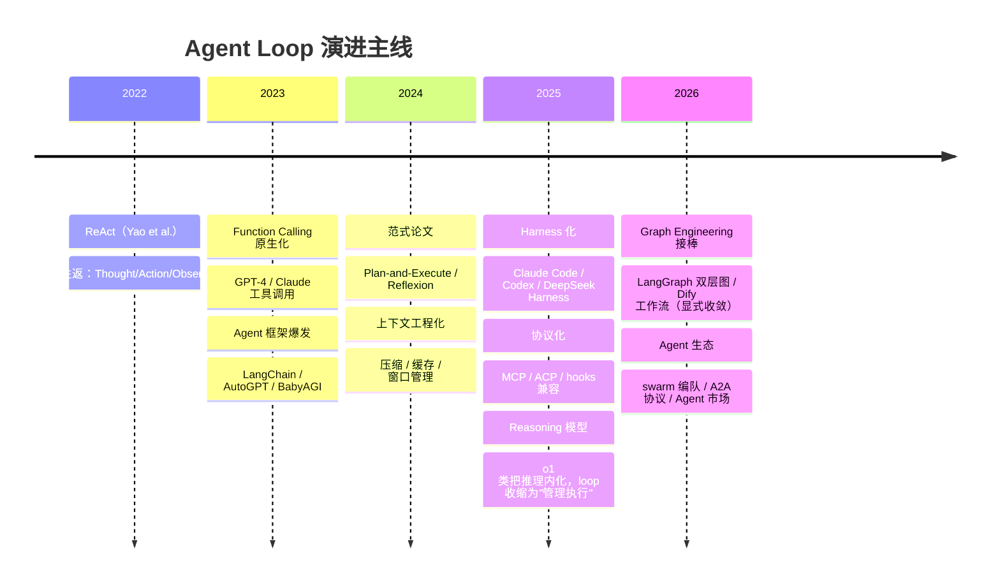

# Agent Loop 演进与设计全景（总纲 · 入口）

> **一句话主线**：ReAct 用"提示词"制造循环，现代 Agent Loop 用"运行时"制造循环——从 Prompt Engineering 走向 Loop Engineering。
>
> **定位说明**：Agent Loop 是六层演进链（Prompt → Context → Harness → Loop → Graph → Agent Economy）上的一环，行业焦点已移向 Graph Engineering（显式工作流）与平台化/Agent 生态——本目录以 Loop 为研究对象（它是理解后续一切形态的底座），拆分为三份专题：[01-演进机理](01-演进机理.md)（为什么演进）｜[02-横向对比](02-横向对比.md)（四款产品差在哪）｜[03-标准设计](03-标准设计.md)（怎么落地）。

---

## 1. 演进总图（一图流）



演进的三次跃迁：

```text
第一次跃迁（2022→2023）：循环介质 文本 → 结构化
   ReAct 的 Thought/Action 文本 → Function Calling 原生工具调用对象

第二次跃迁（2023→2024）：循环能力 单薄 → 工程化
   上下文压缩、显式规划、反思验证——循环开始有"骨架"

第三次跃迁（2024→2025+）：循环形态 脚本 → 运行时
   事件驱动、持久化恢复、权限守门、多 agent 编排、协议互操作、
   成本治理——循环变成可部署、可观测、可恢复的"系统"
```

**驱动演进的核心矛盾**：ReAct 作为工程方案有 14 个硬伤；现代 Agent Loop 的每一次演进，几乎都是冲着其中一个硬伤去的（详见 [01-演进机理.md](01-演进机理.md)）。

---

## 2. 范式本质：从 Prompt Engineering 到 Loop Engineering

| | ReAct 时代 | 现代 |
|---|---|---|
| 关注点 | **提示词怎么写**（Thought/Action 模板、few-shot） | **循环怎么设计**（事件协议、压缩、调度、恢复、权限、编排、验证、成本） |
| LLM 的角色 | 循环的一切（推理+行动都在文本里） | 循环的"大脑"，骨架由工程系统提供 |
| 可扩展方式 | 换提示词、换模型 | 挂插件、加原语、换 provider、接协议（MCP/ACP/hooks） |
| 深度瓶颈 | 上下文窗口（几千 token 只能跑几步） | 成本与可靠性（几百步靠压缩/恢复/重试/验证撑住） |
| 单点 vs 系统 | 一次对话 | 一个可部署、可观测、可恢复的运行时 |

**reasoning 模型的补充趋势**：o1 类模型把"推理"内化后，loop 职责从"引导推理"收缩为"管理执行"（调模型、守权限、调度工具、管上下文、处理失败、验证结果、编排子代理）——循环骨架的工程价值反而更突出。

> **结论**：现代 Agent Loop 不是 ReAct 的替代品，而是 ReAct 的"工程化容器"——循环语义还是"想→做→看"，但归属从模型转到引擎、粒度从对话细到 step、状态从上下文转到事件日志、停止从自评转到代码验证、工具从文本转到沙箱。**ReAct 教会模型循环，现代 Agent Loop 让循环可以被治理。**

---

## 3. 选型决策指南

> 完整选型矩阵（8 条规则 + 开源许可 + 决策矩阵）见 [../Agent主流开发框架/06-选型速查.md](../Agent主流开发框架/06-选型速查.md)；产品级评级见 [../Agent产品对比/05-横向解读与选型.md](../Agent产品对比/05-横向解读与选型.md)（本文只留目标导向的决策树）。

### 3.1 目标决策树

```text
你的目标是什么？
│
├─ 给业务系统加 AI 能力（客服、数据查询、表单处理），
│   要可视化编排、非程序员可维护、人审环节
│   └─► Dify（Agent 节点 + Workflow 画布）
│
├─ 流程明确、要稳定复现（合规/审批/固定业务流）
│   └─► Graph Engineering：LangGraph 式显式图（代码团队）
│       或 Dify 工作流（可视化团队）——收敛路径画死，可审计可审批（对照见 [01-演进机理.md](01-演进机理.md) §5）
│
├─ 让 AI 自主完成长任务（写代码、修 bug、数据分析、研究）
│   ├─ 要开箱即用、生态成熟、不在乎闭源
│   │   └─► Claude Code（偏好 Anthropic/本地）或 Codex（偏好云端沙箱/OpenAI）
│   ├─ 要开源可控、可嵌入自建产品、可替换循环本身
│   │   └─► DeepSeek Harness
│   └─ 要框架级编排原语（workflow 脚本 fan-out、fresh-agent 迭代、
│       长期目标、CC/CX hook 兼容）
│       └─► DeepSeek Harness（唯一同时具备这些的）
│
└─ 混合架构：Dify 负责业务编排，DSH/CC/CX 作为"长任务执行工具"
   通过 MCP 或工具调用包进业务应用（DSH 的 ACP/hook 桥接最顺）
```

### 3.2 关键判断点

0. **收敛路径是否可预画**：能画死 → Graph；画不死 → Loop/harness（判定细则见 [01-演进机理.md](01-演进机理.md) §5）；
1. **循环深度需求**：业务问答（3–15 轮够用）→ Dify；自主任务（几十~几百动作）→ harness 家族；
2. **环境交互需求**：只调 API → Dify；要改文件/跑命令/真实环境闭环 → harness 家族；
3. **可控性需求**：可视化 + 人审 → Dify；代码级控制 + 可嵌入 → DSH；产品化体验 → CC/CX；
4. **成本形态**：业务场景要可预测低延迟 → Dify；任务场景接受成本随深度增长 → harness（善用预算上限）。

### 3.3 场景速查表

| 场景 | 用哪种 | 理由 |
|:--|:--|:--|
| 单步推理、一次性问答 | ReAct 式（prompt 足够） | 没有循环，没有治理需求 |
| 短任务 + 工具调用 | 简单 loop（Function Calling） | 工具结构化即可，无需事件日志 |
| 长时域、需治理、企业生产 | **现代 turn/step loop** | 可停/可回放/可审计/成本可控 |
| 无人值守自主任务 | 现代 loop + goal + 定时 | 跨会话续跑 + 预算硬边界 |
| 个人/小团队起步 | CC 或 Codex + AGENTS.md + hooks/approval | 零成本上手 |
| 平台化/低代码 | Dify（应用层）+ dsh（定制层） | 业务搭应用、深度定制各取所长 |

**判断准则**：两问定案——① 任务会超过 3 步吗？错了能接受重来吗？需要审计/成本管控吗？任一为"是"就该用现代 loop；② 收敛路径可预画吗？能画死 → 图，画不死 → 循环（判定细则见 [01-演进机理.md](01-演进机理.md) §5）。

---

## 4. 术语表

| 术语 | 含义 |
|---|---|
| ReAct | Reasoning + Acting：Thought/Action/Observation 文本往返范式（Yao et al., 2022） |
| Function Calling | 模型原生"请求调用工具"的结构化能力 |
| Turn / Step / Round | 回合/步骤/轮次：turn=一次输入排空；step=一次推理+其工具执行；round=外层策略的一次迭代 |
| Session Event Log | 追加式事件日志，会话唯一事实源，模型历史由其派生 |
| Single Source of Truth | 单一事实源：一切模型可见内容必须能从事件日志重建（model-visible means logged） |
| Compaction | 上下文接近上限时把旧历史总结成摘要的机制；dsh 用"代际推进"保证压缩后可安全重试 |
| Condenser | CC 的跨会话长期记忆提炼机制 |
| Plan-and-Execute | 规划与执行分离的范式：先显式出计划，再逐步执行，可 replan |
| Reflexion | 反思范式：失败经验写回记忆，带着教训重试（self-correction） |
| Verifier / Critic | 验证者角色：执行后校验结果（测试、schema 校验、后置 hooks） |
| Tool Waterfall | 工具执行前的政策链（pre-execute → guards → execute → post-execute → result） |
| Monotonic Guard | 只能减少权限、不能撤销已拒绝决策的守卫（DSH） |
| Turn-stopping | turn 关闭前的串行终检点：达标判定 / 硬边界 / 交人 |
| 三硬边界 | 最大迭代数 + 无进展检测 + token/预算上限 |
| Subagent | 委派子任务给独立子会话，隔离上下文，只回结果 |
| Hook | 循环特定点触发的回调（PreToolUse / UserPromptSubmit / Stop 等） |
| MCP / ACP | Model Context Protocol（工具层）/ Agent Client Protocol（agent 层） |
| HITL | Human-in-the-Loop：带上下文转人工的通道 |
| Token Meter | 请求级 token/成本计量 |
| Loop Engineering | 以循环运行时（事件、调度、压缩、恢复、权限、验证）为设计对象的工程范式 |
| Reasoning Model | 把推理内化到模型内部的模型（o1 类），让循环收缩为"管理执行" |
| Harness | 承载 agent 循环的运行时/框架（如 DSH、Claude Code、Codex） |
| 代际推进（Compaction Generation） | 压缩先剪枝/摘要、推进"代际"后才允许开新重试 turn——压缩有可验证语义 |
| Checkpoint / Checkpointer | 会话按分段落盘的状态快照；重放/回滚基于快照（Codex / LangGraph） |
| claim / next-step | turn 打开时"认领"输入（排队消息 + 新输入），claim 后组装 prompt 并进入 step |
| deriveMessages | 从事件日志投影出模型历史（单一事实源派生，不信任内存状态） |
| 沙箱（Sandbox） | 受限执行环境：writable_roots、网络隔离、审批链 |
| AGENTS.md / CLAUDE.md | 项目级常驻记忆文件，每会话注入 |
| 瀑布拦截（Waterfall） | 事件链上可挂多个监听者、必须 next() 委派的确定性拦截点（pre-step/request/tools） |
| writable_roots | 沙箱内允许写入的根路径集合 |
| LLMOps / Evals | 平台级日志/成本/评估体系；对 agent 输出的质量评测 |

---
