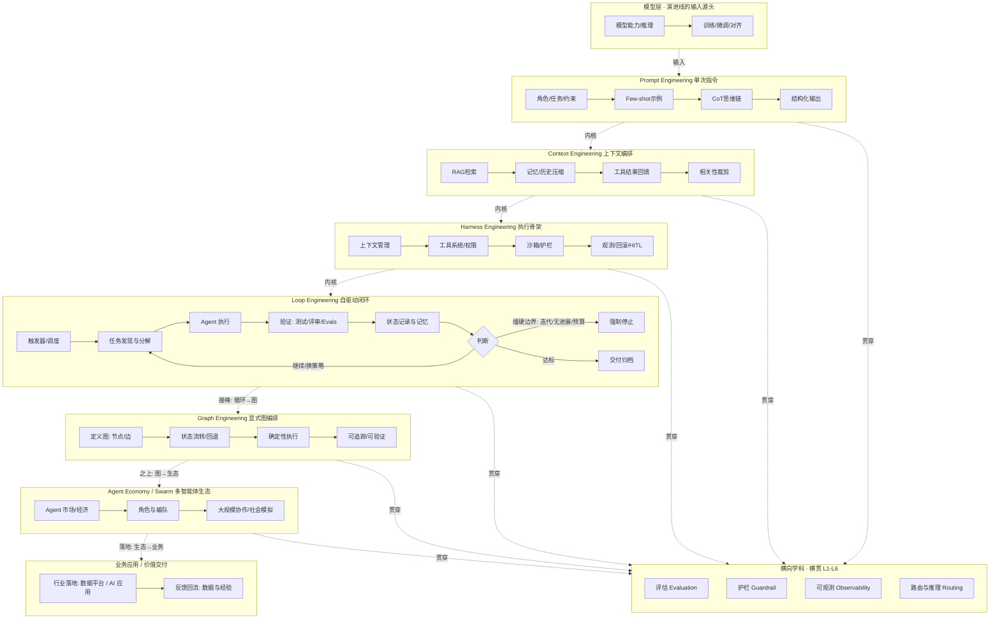

# Agent 工程范式演进

> 撰写时点：2026-08（六层演进方法论，各层机制细节以所引文档时点为准）
>
> **主线**：`Prompt → Context → Harness → Loop → Graph → Agent Economy / Swarm`，六层演进一条线
> 
> 每一层突破上一层"单次输入-输出"的局限，层层递进；本质是**控制权从人向系统的系统化迁移**。

## 一、六层演进栈

### 1. Prompt Engineering — 把单次指令说对

- **定位**：优化"人类意图 → 模型输入"接口，一次推理内给出高质量输出。
- **典型手段**：角色设定、Few-shot 示例、CoT 思维链、结构化输出。
- **局限**：单轮无状态、无法注入私有知识、无手脚执行 → 催生 Context。
- **机制要点**：指令三区结构（system 定规则 / user 给任务 / assistant 示例对齐输出风格）；输出约束用 JSON Schema 或工具调用参数声明（结构化输出）；推理预算用 reasoning effort / max_tokens 控制（模型自带推理时 CoT 让位给隐式推理）。

### 2. Context Engineering — 让模型每步看到该看的

- **定位**：上下文窗口是稀缺资源，系统性编排"模型每轮看到什么"。
- **典型手段**：RAG、向量库 + 重排序、记忆压缩与摘要、工具结果回填。
- **局限**：堆到 1M 上下文仍会失焦遗忘，且仍是被动问答、不能自主执行 → 催生 Harness。
- **机制要点**：检索管线为 chunk → embed → retrieve → rerank 四段；记忆分工作/会话/长期三层（各自生命周期与读写权限不同）；压缩分摘要型（损失细节）与剪枝型（删低价值内容），dsh 的 compaction 用"代际推进"保证压缩后可安全重试。

### 3. Harness Engineering — 让模型在真实世界可靠行动

- **定位**：核心公式 `Agent = Model + Harness`——模型负责想，Harness 负责边界、工具、记忆、对错。
- **典型手段**：MCP、Function Calling、沙箱隔离、Hook、AGENTS.md、护栏与回滚。
- **局限**：单 Agent 能持续干活，但"何时算完成、谁来喂下一轮"仍由人定 → 催生 Loop。
- **机制要点**：工具调用管道为 schema 声明 → 权限校验 → 沙箱执行 → 结果回填四步，每步可拦截（Claude Code 的 PreToolUse hook / Codex 的沙箱判定 / dsh 的 tools/pre-execute）；Hook 生命周期覆盖工具调用前后、权限请求、压缩前、子代理启停等事件（确定性控制，不依赖模型理解）。

### 4. Loop Engineering — 设计驱动 Agent 的系统

- **定位**：不再给模型写 prompt，而是写运行着的循环去驱动模型；人退出循环，只设计规则。
- **典型手段**：/loop、cron 触发、worktree 隔离、skills、subagent 校验分离、状态文件、预算上限。
- **铁律**：停止条件用代码验证而非模型自评；三道硬边界——最大迭代数、无进展检测、token/预算上限。
- **局限**：自由循环难以约束、调试极难、token 成本失控 → 催生 Graph Engineering。
- **机制要点**：turn/step 两段式——step 为一次模型请求+工具调用（最小可审计单元），turn 为有界的一组 step（有输入则开、无欠账则关）；事件日志为单一事实源（"model-visible means logged"，重放/恢复/遥测同源）；停止判定挂代码验证 + 三硬边界 + 交人通道。
- **深度专题**：14 维演进图谱与标准企业设计见 [AgentLoop演进与设计/](AgentLoop演进与设计/README.md)（演进机理 01 / 横向对比 02 / 标准设计 03）。

### 5. Graph Engineering — 把自由循环画成确定性图（当前最热）

- **定位**：用状态图 / DAG 显式编排 agent 流程——节点 = 步骤 / Agent，边 = 流转 / 回退，把"收敛路径"画死。
- **为什么出现**：Loop 的自由循环难以约束、调试极难、token 成本失控；Graph 牺牲自由度换确定性——可追踪、可回退、可验证。
- **与 Loop 的关系**：不是包裹式演进，而是 Loop 的**确定性接棒者**（社区当前最热讨论：LangGraph 双层 Graph、"Loop 时代终结？"）。
- **取舍**：任务路径明确、要稳定复现 → Graph；任务开放、需自主探索 → 仍用 Loop。
- **机制要点**：图状态机 = 节点（LLM/工具/条件）+ 边（流转/回退/循环）+ 状态（可持久化的 checkpointer）；收敛由图的拓扑保证（走完=结束），回退/分支在图上显式声明；代表实现 LangGraph 把"状态持久化"作为一等公民（中断/恢复/重放基于状态快照）。

### 6. Agent Economy / Swarm — 多智能体生态（宏观层）

- **定位**：所有层之上的宏观协作层——关注的不是"单个循环怎么收敛"，而是"一堆 agent 怎么形成生态"。
- **形态**：Agent 市场与经济激励、角色与编队（swarm）、大规模社会模拟。
- **代表**：agent economies（已进入主流 AI 工程课程）、AIvilization（大规模社会模拟）、swarm 编队实践。
- **横向学科**：评估（Evaluation）、护栏（Guardrail）、可观测（Observability）、路由与推理（Routing/Inference）已发展为横贯所有层的独立工程学科。
- **机制要点**：跨 agent 协作靠协议（A2A / MCP 作为工具协议底座）；编队机制为"角色声明 + 任务市场 + 结果汇聚"（swarm 模式）；激励与信誉机制决定长期协作质量——这是从"工程问题"上升到"社会系统问题"的一层，尚无统一标准，多为方向性探索。

## 二、全景图

**图例（层间连线含义）**：

| 连线 | 含义 |
| :--- | :--- |
| `输入` | L0 模型 → L1 Prompt：模型是演进线的输入源头 |
| `内核` | L1→L2→L3→L4：下一层把上一层当内核，层层包裹 |
| `接棒` | L4→L5：Graph 是 Loop 的确定性接棒者（时间上的范式更替，非包裹） |
| `之上` | L5→L6：生态是宏观层 |
| `落地` | L6→业务应用：生态向业务交付价值并回流反馈 |
| `贯穿` | 横向学科（评估/护栏/可观测/路由）横贯 L1-L6，是各层的质量/安全/成本底座 |

> 渲染说明：横向学科侧栏在部分渲染器中会落在图底，其虚线连接表示"横贯 L1-L6"而非层级关系。

## 三、层间递进机制（六层怎么咬合）

每一层不是孤立的——**上一层的产物是下一层的输入内核**：

| 层 | 产出物 | 被下一层如何消费 |
|:--|:--|:--|
| Prompt | 高质量单次指令 | Context 把它作为窗口内"最高优先级"内容编排 |
| Context | 编排好的上下文窗口 | Harness 在请求时组装（prompt 分区 + 工具 schema） |
| Harness | 可执行骨架 + 工具管道 | Loop 作为"一步"的执行环境（step = 请求 + 工具） |
| Loop | 有界的自主循环 | Graph 把循环的流转收敛为显式边（自由度换确定性） |
| Graph | 单系统的确定性编排 | Eco 把单系统接入多系统协作（协议 + 编队） |
| Eco | 多智能体生态 | —（宏观层，向上是业务价值交付） |

**边界条件**（决定"该用哪层"的机制依据）：
- 上一层产出不达标 → 下一层无法补偿（如 Context 喂了错信息，Harness 再强也白搭）
- 层间存在"成本跃迁"：Loop 起每次自主迭代都有 token 成本；Graph 起增加图维护成本；Eco 起增加组织协调成本

---

## 四、演进主线与选择准则

**控制权迁移**：人全程参与每次交互 → 人决定喂什么 → 人设护栏让单 Agent 干活 → 人只设计运转规则 →（Graph）人画死收敛路径 →（生态）人设计市场规则。

| 任务形态 | 用哪一层 |
| :--- | :--- |
| 单轮可收敛 | Prompt |
| 多轮但人能盯住 | Context + 简单 Harness |
| Agent 长时间自主干活 | 完整 Harness |
| 系统自己发现任务、迭代到完成 | Loop（代价：token 成本与调试难度） |
| 路径明确、需要稳定复现 | Graph（确定性编排，接棒 Loop） |
| 大规模 agent 协作、长期运转 | Agent Economy / Swarm（宏观生态） |

