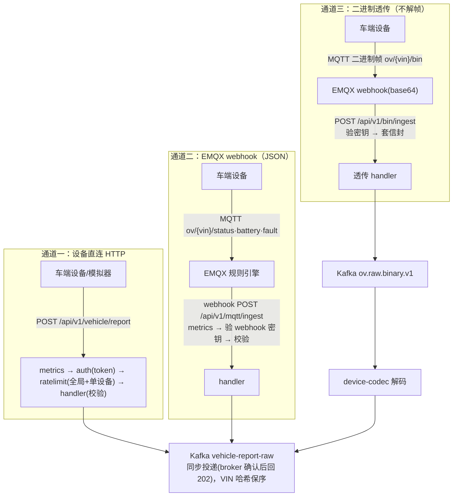
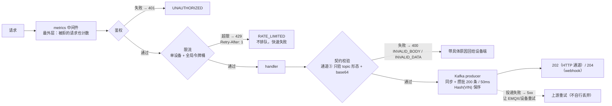

# device-gateway 车端接入网关

> 📚 **简称约定**：《接入层设计》= 《../docs/01-接入层设计-v1.md》｜《GB32960 映射》= 《../docs/02-GB32960协议规格-v1.md》｜《示例集》= 《../docs/03-验收示例集-v1.md》。下文以这三个简称标注跨文档引用。

> OceanVerse 第 1 阶段第 2 步 —— 平台的数据"国门"
> 职责: 设备鉴权 → 限流 → 协议解析/校验 → 写 Kafka → 全程可观测
> 原则: 网关无业务逻辑、无状态、不直连数据库; 越"笨"越稳。
> 📐 **设计见**《接入层设计》（含 §12 成熟度评估）；二进制链路见《GB32960 映射》

## 1. 处理链与端口



| 端点 | 说明 |
|---|---|
| `POST /api/v1/vehicle/report` | 车端上报(通道一: 设备直连 HTTP) |
| `POST /api/v1/mqtt/ingest` | 车端上报(通道二: EMQX 规则引擎 webhook, 密钥头 `X-Webhook-Token`) |
| `POST /api/v1/bin/ingest` | 二进制帧透传(通道三: **不解帧**, 套信封进 `ov.raw.binary.v1`, 解码归 device-codec) |
| `GET /health` | 健康探针 |
| `GET /metrics` | Prometheus 指标 |
| `GET /debug/pprof/*` | 性能剖析（**独立端口 18082，仅绑回环**） |

> 接入层整体设计(EMQX 链路/四支柱/生产加固清单)见 `ingest/README.md`

## 2. 配置（全部走环境变量）

| 变量 | 默认值 | 说明 |
|---|---|---|
| `GATEWAY_PORT` | `8080` | HTTP 端口 |
| `KAFKA_BROKERS` | `localhost:19092` | Kafka 地址(逗号分隔) |
| `KAFKA_TOPIC` | `vehicle-report-raw` | 车端数据 topic(JSON 通道) |
| `KAFKA_BIN_TOPIC` | `ov.raw.binary.v1` | 二进制原始帧 topic(通道三) |
| `DEVICE_TOKENS` | `demo-token-001=OV00000001` | 设备令牌白名单(逗号分隔)，**每条必须形如 `token=VIN`**：token 绑定到一辆车，载荷 `vin` 必须与之一致。未绑定 VIN 的 token 可上报任意车辆，故启动即 fail-fast |
| `GATEWAY_WEBHOOK_TOKEN` | `dev-webhook-secret` | EMQX webhook 来源密钥, 须与 emqx.conf 一致 |
| `GATEWAY_DEV_MODE` | `false` | ⚠️ 开发模式: 额外接受 `dev-{VIN}` 形态 token(仍**校验 VIN 一致性**)，生产必须关 |
| `RATE_PER_DEVICE` | `10` | 单设备限流(条/秒)；**必须 ≥1**，<1 会让令牌桶容量为 0 导致全量 429（启动即 fail-fast） |
| `RATE_GLOBAL` | `5000` | 全局限流(条/秒)；同样必须 ≥1 |
| `GATEWAY_METRICS_PORT` | `18081` | `/metrics` 专用端口(全网卡, 供容器内 Prometheus 抓取) |
| `GATEWAY_PPROF_BIND` / `GATEWAY_PPROF_PORT` | `127.0.0.1` / `18082` | `/debug/pprof/*` 监听地址(**默认仅回环**: 能读出进程内存) |
| `GATEWAY_READ_TIMEOUT` / `GATEWAY_WRITE_TIMEOUT` | `5s` | HTTP 超时 |
| `GATEWAY_SHUTDOWN_GRACE` | `10s` | 优雅退出宽限 |

## 3. 前置：Go 模块代理（国内必配）

```bash
go env -w GOPROXY=https://goproxy.cn,direct
```

## 4. 本地运行

```bash
# 0. 基础设施已就绪(deploy/README.md), Kafka 在 localhost:19092
cd ingest/device-gateway

# 1. 下载依赖 + 编译验证
go mod tidy
go build ./...
go vet ./...

# 1.5 单元测试(5 个测试包: 鉴权/限流/三通道 handler/配置/Kafka 投递; 契约与造帧器已迁独立模块)
go test ./... -count=1          # 全部通过
go test -race ./... -count=1    # 竞态检测(修复后新增)
go test ./... -cover            # 覆盖率快照(2026-09-20 实测): auth 100% / ratelimit 88.0% / config 84.9% / handler 81.9% / kafka 78.6%
#   —— 覆盖率随测试集变动, **以本命令输出为准**; 它刻意不进 check-docs 门禁:
#      门禁钉的是"可从源码推导的事实"(配置项数/测试包数/告警条数/面板图数),
#      覆盖率是"跑出来的测量值", 钉死它等于每加一个测例都要改文档

# 2. 开发模式启动(允许 dev- 前缀 token, 方便联调压测)
#    注意: 本机 8080~8083 被其他服务占用, 开发期固定 18080(与 emqx.conf webhook / prometheus 抓取一致)
GATEWAY_PORT=18080 GATEWAY_DEV_MODE=true go run ./cmd/server
#   可观测端点默认独立: GATEWAY_METRICS_PORT=18081(全网卡, 供 Prometheus 抓取)
#                       GATEWAY_PPROF_PORT=18082(仅 127.0.0.1)
```

启动日志应看到：`车端接入网关启动 port=8080 topic=vehicle-report-raw ...`

## 5. 验证（另开终端）

### ① 正常上报 → Kafka 消费到

```bash
# 发一条(dev 模式)
curl -i -X POST http://localhost:18080/api/v1/vehicle/report \
  -H "Content-Type: application/json" \
  -H "X-Device-Token: dev-OV20260001" \
  -d '{"vin":"OV20260001","ts":'"$(date +%s)"',"type":"vehicle_status",
       "data":{"speed":32.5,"soc":78,"voltage":60.2,"current":-5.1,
               "temp_max":35.0,"lng":113.94,"lat":22.54}}'
# 期望: HTTP 202 {"code":0,"message":"accepted"}

# Kafka 里应消费到(Kafka 自动建 topic)
docker exec ov-kafka /opt/kafka/bin/kafka-console-consumer.sh \
  --bootstrap-server localhost:9092 --topic vehicle-report-raw \
  --from-beginning --timeout-ms 5000
```

### ② 鉴权拦截（关 dev 模式重启后）

```bash
# 不带 token → 401
curl -i -X POST http://localhost:18080/api/v1/vehicle/report -d '{}'
# 期望: {"code":"UNAUTHORIZED",...}
```

### ③ 校验拦截

```bash
# soc=300 超出范围 → 400 INVALID_DATA
# 注意 token 与载荷 vin 必须**同一辆车**(dev 模式按 dev-{VIN} 推断身份):
# 写成 dev-x 配 OV20260001 会先被身份校验拦下(400 vin_mismatch), 到不了 soc 校验。
curl -X POST http://localhost:18080/api/v1/vehicle/report \
  -H "X-Device-Token: dev-OV20260001" \
  -d '{"vin":"OV20260001","ts":'"$(date +%s)"',"type":"vehicle_status","data":{"soc":300}}'
```

> 完整的**五环逐环示例**（401 / 429 / 400-解析 / 400-契约 / 500-Kafka，含实测响应体与指标标签）
> 与**三条通道端到端示例**见《示例集》§1~§2。

### ④ 指标

```bash
curl -s http://localhost:18081/metrics | grep gateway_requests_total
curl -s http://localhost:18081/metrics | grep gateway_kafka_write_total
```

## 6. 治理策略与取舍（五环逐环）

### 6.1 处理链与通道差异



| 环节 | 通道① HTTP | 通道② JSON webhook | 通道③ 二进制 webhook |
|---|---|---|---|
| 鉴权 | 设备 token 白名单（支持 dev 模式） | webhook 共享密钥 | webhook 共享密钥 |
| 限流 | 单设备 + 全局令牌桶（双层） | **全局令牌桶**（单设备限流在 EMQX 协议层；2026-09-18 前该通道完全无限流，已补） | 同左 |
| 校验 | `VehicleReport.Validate()` | 同左 + topic 回填 VIN/type | **不校验 payload**（不解帧）→ 只验 topic 形态 + base64 |
| 投递 | `vehicle-report-raw` | 同左 | `ov.raw.binary.v1`（信封含 vin/ts/proto_ver/cmd/payload） |
| 响应 | 202（受理） | 204（webhook 惯例） | 204 |

### 6.2 鉴权策略

| 策略 | 做法 | 理由 |
|---|---|---|
| 静态白名单（现） | `DEVICE_TOKENS`（`token=VIN` 绑定）+ `GATEWAY_DEV_MODE` 接受 `dev-{VIN}` | 第 1 阶段最小可用；**认证之外还解析出"是哪辆车"**，载荷 VIN 必须与之一致（下条）；动态鉴权等 Java 档案服务时只换 `identity()` 实现，调用方不动 |
| 设备身份锚点 | 载荷 `vin` == token 绑定的 VIN，否则 400 `vin_mismatch`；**取不到身份直接 401（fail-closed）** | 只有认证没有身份时，持合法 token 的设备可冒充他人车辆写数据；与 MQTT 通道的 topic-VIN 校验、codec 的帧内-VIN 校验是同一道防线（三条通道各有一侧）。**fail-closed 的理由**：若写成"没身份就跳过校验"，这道防线会在将来有人重排中间件时**静默消失** |
| webhook 密钥 | `X-Webhook-Token` 共享密钥（与 `emqx.conf` 一致） | 只信任自家 EMQX；《接入层设计》§5.3 四条对齐线之一 |
| 危险配置告警 | 启动时对 dev 模式/默认密钥打 WARN | 安全内建在启动流程，不靠人记 |

### 6.3 限流策略

| 策略 | 参数 | 理由 |
|---|---|---|
| 单设备令牌桶 | 10 条/s | 掐住"单设备发疯"（50/s 冲击实测被削到 10.1/s） |
| 全局令牌桶 | 5000 条/s（本机压测调到 30000） | 防"万车惊群"；配合 Kafka 天然削峰 |
| 拒绝语义 | 429 + `Retry-After: 1`，**不排队** | 快速失败让设备端自己退避，网关内存不堆消息 |
| 限流器状态 | 内存态（第 2 阶段 Redis 化） | 单副本够用；多副本前必须外置（军规②） |

### 6.4 校验策略（契约校验是唯一漏斗）

- 解析失败 → 400 `INVALID_BODY`（含 64KB 上限，二进制 96KB）
- 校验失败 → 400 `INVALID_DATA`（**消息体带具体原因**，便于设备端自排查）
- 缺省回填：`schema_version` 空 → `v1`（保证进 Kafka 的消息显式带版本）
- 未知版本 → 拒绝（fail-fast，防按错误格式解析未来报文）
- 通道② 契约回填：`type`/`vin` 缺失时按 topic `ov/{vin}/{type}` 推断

### 6.5 投递策略

| 策略 | 参数 | 理由 |
|---|---|---|
| **同步投递** + 攒批 | 200 条 / 50ms，MaxAttempts=2、WriteTimeout=2s | 只有收到 broker 确认才回 202/204；失败沿调用链返回 5xx 让上游重试（§6 语义）。单次上报最坏阻塞约 4s < HTTP WriteTimeout 5s。**2026-09-18 前为 Async**：`WriteMessages` 立即返回 nil，失败只计数 → 已回 202 但未落盘且客户端不重试，同时 kafka-go 内部队列无上限（断连期 OOM） |
| 分区 | `Hash(key=VIN)` | 同一辆车进同一分区 → 局部有序 |
| 持久性档 | **`RequireAll`**（2026-09-18 由 RequireOne 升级） | 实测零性能代价（p99 98.50 vs 98.37 ms）；单 broker 下语义等价，断电级保证需多 broker（《接入层设计》§12.1） |
| 失败语义 | 返回 5xx 让上游重试（EMQX 缓冲重试 / 设备重试） | 兜底不丢；重复由下游幂等 |
| 优雅退出 | SIGTERM → 停收 → producer Close 冲刷（10s 宽限） | 压测实测受理≈落盘，零丢失 |

### 6.6 可靠性策略（故障矩阵）

| 故障 | 兜底 | 实测 |
|---|---|---|
| 网关宕机 | EMQX webhook 缓冲重试（`request_ttl=300s` + `health_check=5s`） | 补投率 100%（修复 TTL 赛跑后） |
| Kafka 不可用 | 客户端内部缓冲 + 5xx 重试 | pause 45s 被缓冲完全吸收，零失败 |
| EMQX 宕机 | 设备 AutoReconnect，生产 LB 摘除 | 300 设备全部重连 |
| 单设备发疯 | 单设备令牌桶 | 50/s 削到 10.1/s |
| QoS1 重复 | 下游 `(vin, ts)` 幂等 | 实测均带完整幂等键 |

**核心设计**：网关内存里**不**堆消息（无状态才扩得动），缓冲职责推给两侧专业组件（EMQX / Kafka）。

### 6.7 可观测策略

- 指标：`requests_total{path,result}` / `request_duration_seconds` / `kafka_write_total{topic,result}` / inflight
- **上行延迟 SLI**：`ingest_latency_seconds{channel}` = EMQX 接收（信封毫秒时间戳）→ 受理完成（含落盘确认）。
  这一段是**毫秒精度**的（不像设备侧 `ts` 只有秒级），用于回答"平台处理得有多快"；
  注意 EMQX webhook 重投会让它如实上涨（预期信号，不是缺陷）。面板：`device-gateway` 第 5 图
- pprof 按需剖析；Grafana 面板 provisioning（面板即代码）
- **三处对账公式**：EMQX 命中 ≈ 网关 ok ≈ Kafka write ok（差异必须可解释）

---

## 7. 压测

```bash
# 模拟器在独立模块 ingest/device-simulator(压测工具不进生产模块)
cd ../device-simulator

# 1 万设备、每台 5 秒一条(≈2000 QPS)、跑 60 秒
go run ./cmd/http-simulator -target http://localhost:18080 -devices 10000 -interval 5s -duration 60s

# 10 万设备(≈2 万 QPS) —— 注意本机 fd 限制, 必要时 ulimit -n 1000000
go run ./cmd/http-simulator -target http://localhost:18080 -devices 100000 -interval 5s -duration 120s
```

压测时观察：

```bash
# 网关处理速率/结果分布
curl -s http://localhost:18081/metrics | grep -E 'requests_total|inflight'
# pprof 性能剖析(压测进行中抓取 30s CPU profile)
go tool pprof http://localhost:18082/debug/pprof/profile?seconds=30
```

## 8. MQTT 通道验证（企业级链路：设备 → EMQX → 规则引擎 → 网关 → Kafka）

```bash
# 0. 确认 EMQX 已启动(deploy/README.md), Dashboard: http://localhost:18083 (admin/public)
#    规则引擎应在 集成 → 规则 中看到 "ov_vehicle_ingress" 及其 webhook 动作

# 1. 启动网关(确保 webhook token 与 deploy/emqx/emqx.conf 中一致)
GATEWAY_DEV_MODE=true go run ./cmd/server

# 2. 用 MQTT 模拟器发数据(100 台车, 每台 5s 一条状态, 1% 概率带故障)
(cd ../device-simulator && go run ./cmd/mqtt-simulator -broker tcp://localhost:1883 -devices 100 -interval 5s -duration 60s)

# 3. Kafka 应消费到 MQTT 来源的消息(与 HTTP 通道同一个 topic)
docker exec ov-kafka /opt/kafka/bin/kafka-console-consumer.sh \
  --bootstrap-server localhost:9092 --topic vehicle-report-raw \
  --from-beginning --timeout-ms 10000

# 4. 观察按通道区分的指标
curl -s http://localhost:18081/metrics | grep 'gateway_requests_total'
# 应同时看到 path="/api/v1/vehicle/report" 和 path="/api/v1/mqtt/ingest" 两个标签

# 5. EMQX 侧观测: Dashboard → 客户端(应看到 100 个 dev-OV* 连接)
#    Dashboard → 集成 → 规则 → ov_vehicle_ingress(命中率/成功率)
```

## 9. 二进制通道验证（设备 → EMQX → 网关透传 → codec → Kafka）

```bash
# 1. 启动网关 + codec(codec 是独立模块, 另开终端)
GATEWAY_DEV_MODE=true go run ./cmd/server
cd ../device-codec && go run ./cmd/server

# 2. 用二进制模拟器发帧(100 台车, 每台 10s 一帧——《GB32960 映射》§3.1 频率基线; 1% 概率带 0x07 报警)
(cd ../device-simulator && go run ./cmd/bin-simulator -broker tcp://localhost:1883 -devices 100 -interval 10s -duration 60s)

# 3. codec 输出应进 vehicle-report-raw(与 JSON 通道汇合, 下游无感)
docker exec ov-kafka /opt/kafka/bin/kafka-console-consumer.sh \
  --bootstrap-server localhost:9092 --topic vehicle-report-raw \
  --from-beginning --timeout-ms 10000

# 4. 失败帧(版本未知/CRC 错等)落 DLQ 排查:
docker exec ov-kafka /opt/kafka/bin/kafka-console-consumer.sh \
  --bootstrap-server localhost:9092 --topic ov.dlq.codec.v1 \
  --from-beginning --timeout-ms 5000

# 5. EMQX 规则 ov_binary_ingress 命中率 vs 网关 path="/api/v1/bin/ingest" 计数对账
```

## 10. Docker 构建与运行（第 2 阶段上编排的前置验证）

**⚠️ 构建上下文必须是仓库根**（契约模块在 `ingest/device-contracts`，`go.mod` 的 `replace` 指过去；
在模块目录内 `docker build .` 会报 `replacement directory ../device-contracts does not exist`）：

```bash
# 在仓库根执行
docker build -f ingest/device-gateway/Dockerfile -t oceanverse/device-gateway:dev .
# 国内网络如拉依赖慢, 可覆盖代理: --build-arg GOPROXY=https://goproxy.cn,direct
```

**运行必须挂 compose 网络 + 用内部 broker 地址**（Kafka 的 `EXTERNAL` 监听器对外广播 `localhost:19092`，
在容器里 `localhost` 指向容器自身 → 会 202 受理但写入失败，指标 `kafka_write_total{result="error"}` 可查）：

```bash
docker run --rm --network oceanverse_ov-net -p 18080:18080 \
  -e GATEWAY_PORT=18080 \
  -e KAFKA_BROKERS=kafka:9092 \          # 容器内走内部监听器(内部广播 kafka:9092)
  -e GATEWAY_DEV_MODE=true \
  oceanverse/device-gateway:dev
# 容器里验证: curl -s localhost:18080/health  → {"status":"up"}
#             打一条上报后看 topic offset 是否 +1(202 只代表受理, 不代表落盘)
```

## 11. 已知边界（刻意不做）

- 鉴权是静态白名单；第 2 阶段接车辆档案服务改为动态校验
- Kafka `RequiredAcks=RequireAll`（2026-09-18 升级）；**单 broker 下不提供断电级持久性**，需多 broker（《接入层设计》§12.1）
- 已实现**三通道**：HTTP / MQTT-JSON(webhook) / 二进制透传（`bin_ingest.go`，不解帧）；gRPC 内部通道第 2 阶段加；TCP 私有协议按《GB32960 映射》§7 作为**分级 fallback**（网关新增 TCP 监听）
- 消息清洗/字段加工不做（那是 Flink 计算层的职责）

## 12. 延伸阅读（为什么这么设计）

- 《接入层设计》§3（网关内部设计：为什么"越笨越稳"、为什么不解帧）
- 《接入层设计》§5.3（四条对齐线：EMQX 规则 ↔ 网关配置，静默失败的头号来源）
- 《示例集》§1~§2（三条通道端到端实测输出 + 五环逐环 401/429/400/500）

> 本手册只讲"怎么跑/怎么验"；上面的层文档讲"为什么"。设计与规格的权威在那两篇，本手册不复制其内容。
