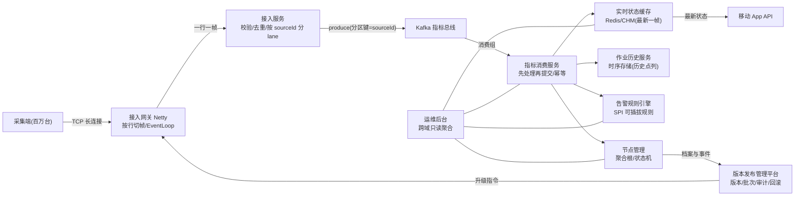

# Java 数据平台 / 数据中心后端方向阶段

> Java 学习路线的数据平台阶段：把 ph01~ph20 的全部机制汇入一条真实的「数据源 → 接入 → Kafka → 清洗/告警/存储 → 运维后台」数据平台链路，用 Java 构建任务与资源管理、通用数据接入、任务发布与调度、告警规则、实时状态缓存与运维后台，回答「Java 在企业级后台和高并发数据服务里究竟怎么用」。

## 1. 概述

**roadmap 第 21 节（即本阶段）是 Java 路线「数据平台方向」的收官；AI 平台控制面由 [ph22](../ph22-ai-platform/22-ai-platform.md) 接续。** ph01~ph08 铺完语言面、ph09/ph10 与 ph20 补透并发与 JVM 底层、ph11~ph19 走完工程化全链(构建/测试/数据库/Web/微服务/消息/缓存/部署)。本阶段不再引入新语言机制，而是把 ph20 埋下的全部预告**在真实数据平台业务上兑现**：

- ph20 3.2 的 **JMM 可见性/有序性**、3.4 的 **线程池执行链** → 本阶段「通用数据接入服务」的高吞吐与保序设计(3.2)；
- ph20 3.6 的 **ConcurrentHashMap 原子读改写** → 本阶段「实时状态缓存」的并发语义(3.5，内存态与 Redis 态同一思路)；
- ph20 3.8 的 **SPI/动态代理** → 本阶段「告警规则引擎」的可插拔规则(3.4)；
- ph20 3.9 的 **Netty 线程模型** → 本阶段「长连接接入网关」的底层形态(3.2)；
- ph20 3.11 的 **DDD 限界上下文/聚合/状态机** → 本阶段「任务与资源管理 / 任务发布与调度 / 告警」的领域建模(3.1、3.6)。

| 核心维度 | 覆盖内容 |
|----------|---------|
| 任务与资源管理平台 | DDD 限界上下文切分；节点聚合根(身份/版本/状态机)；节点注册、上下线、退役生命周期(兑现 ph20 DDD 预告) |
| 通用数据接入服务 | 接入协议形态(Netty 长连接网关)；帧校验/去重；按 sourceId 分片的高吞吐与保序(兑现 JMM/线程池/Netty 预告) |
| Kafka 指标消费 | 消费组/offset/幂等/积压的 Java 工程语义(兑现 ph17 技能) |
| 告警规则引擎 | 规则接口 + ServiceLoader 装载 + 动态代理埋点(兑现 ph20 SPI/代理预告)；活跃告警表与关闭 |
| 实时状态缓存 | 缓存键设计、CHM compute 与 Redis Lua 的同一并发思路、TTL(兑现 ph20 CHM 预告) |
| 任务发布与调度平台 | 版本库(语义版本比较)、批次编排、单节点任务状态机、审计轨迹、失败回滚(兑现 ph20 DDD/状态机) |
| 作业历史查询 | 每个数据源作业记录存储、时间窗查询、回放/最新记录(兑现 ph04 有序集合与 ph17 存储思路) |
| 运维后台 | 跨域只读聚合视图：在线率/告警/积压/发布进度一屏可查 |

这个阶段只涉及 **数据平台业务后台的组合落地与领域建模**：节点接入、任务与资源管理、任务发布与调度、告警、指标消费、实时状态缓存、作业历史查询、运维后台如何用 ph01~ph20 的 Java 机制实现。**不涉及 ph01~ph20 已讲过的语言/机制细节(语法、JMM、线程池源码、CHM 内部结构、Netty pipeline、SPI 装载原理等)——本阶段只在其之上讲「组合与业务建模」，不重复展开**；**不涉及跨路线方向：采集端嵌入式固件与现场总线协议(那是 C 路线的领域)、平台数据的大数据规模化(Spark/Flink 批流一体)、超大规模微服务治理与多机房容灾(Java 生态继续深入但超出本路线)**——AI 平台控制面由 [ph22 AI 平台阶段](../ph22-ai-platform/22-ai-platform.md) 接续，这些跨路线方向以「终点之后可深入方向」列出（见第 7 章）。

## 2. 来源与演变

**数据平台后台是「企业数据化运营」逼出来的**：数据从「报表里的历史数字」变成「在线可被调度、可被运营的资源」，后台平台从无到有经历了四代。

- **报表与数据仓库时代（约 1990s）**：企业先把业务库数据定期抽到仓库做报表（ETL + 星型模型），后台的重心是「把数据算对、按时出数」；数据源身份、任务台账、审计这些后台概念此时已经出现，只是形态是批处理脚本 + 关系库存储过程。这个形态奠定了数据平台后台的原始边界：**数据源档案、任务定义、结果归档**。
- **互联网后台时代（约 2000s）**：随着 Web 普及，后台从「出报表」进化为「**在线数据接入 + 任务调度 + 查询 API**」的互联网服务；架构上出现「接入 → 消息 → 存储 → API」的雏形。Java 凭借企业级后台的成熟生态（SSH → Spring）大量进入这一层，成为数据平台后台的主流语言。
- **云原生与实时化时代（约 2010~2020s）**：Kafka 把指标从 T+1 推进到分钟级，Redis 让「最新状态」可以毫秒读，长连接让平台能反向下发配置与指令。这带来两类新后台：**任务发布与调度平台**（版本/批次/审计/回滚，本阶段 3.6）与**实时状态平台**（节点每秒上报 CPU/内存/磁盘温度/延迟，后台要支撑「随时看到哪个节点什么状态」——本阶段 3.5）。平台从「功能服务」变为「数据产品」。
- **规模平台时代（2020s）**：节点从几百到百万级，后台演化为多服务微服务架构（ph16 的拆分在此落地）：接入网关（Netty）、指标总线（Kafka）、消费与清洗、规则引擎（告警）、任务发布、作业历史、运维后台各自成域（本阶段 project 的模块边界即此切分的教学切片）。

**设计哲学一句话加粗：数据平台后台是把「采集端不可靠、时刻变化的物理信号」翻译成「可查询、可运营、可回滚的业务事实」——可靠性与审计是整个平台的底色。**

| 里程碑 | 年份 | 主要变化 |
|--------|------|---------|
| 数据仓库 / ETL 成型 | 1990s | 数据源档案、任务定义、结果归档的后台雏形 |
| Java 进入企业后台 | 2000s | Web 化数据服务；Spring 生态成为后台主流 |
| Kafka 实时管道 | 2011 | 指标从 T+1 走向分钟级；消费/幂等/积压语义出现 |
| 长连接与实时状态 | 2012~ | Netty 长连接接入 + Redis 最新状态；配置下发成为标配 |
| 任务发布平台化 | 2015~ | 发布获得「分批灰度、审计、回滚」的硬要求 |
| 百万级节点微服务化 | 2020s | 接入/消费/告警/发布/作业历史/运维按域拆服务，与 ph16 微服务、ph21 收官衔接 |

把这条演变史折回 Java 学习路线，能看到「**产业需求 → 语言能力**」的对应：每一代平台恰好落在前面某个阶段的能力上——这也是为什么 roadmap 把数据平台放在 Java 路线最后：前面的积累正是为这一行业场景准备的。

| 平台时代 | 产业要什么 | 对应 Java 能力 | 在路线哪里学 |
|---------|-----------|---------------|-------------|
| 数据仓库时代 | 数据源档案/任务台账 | 面向对象建模、JDBC | ph02/ph13 |
| 互联网后台 | REST API + 状态查询 | Spring MVC + 数据库 + Redis | ph14/ph15/ph13 |
| 云原生实时化 | 版本/批次/审计 + 实时状态 | 状态机建模 + 语义版本 + 事务 + 并发缓存 | ph02/ph08/ph09/ph13 |
| 规模平台时代 | 百万节点接入/实时/告警 | Netty + Kafka + CHM + DDD(本阶段全部) | ph20 + 本阶段 |

本文示例以 **OpenJDK 17.0.18（Homebrew）为基线**（与 ph14~ph20 全链同工具链），生产形态以 **Spring Boot 3.3** 为准(选择理由：roadmap 第 21 节的目标是组合落地，语言面沿用前 20 阶段同一工具链；生产代码描述给 Spring Boot 3.3 + kafka-clients 3.7 + Spring Data Redis 3.3 的主流组合)。**验证纪律**：① 纯 Java 可实测的部分(节点状态机、接入 lane、状态缓存、SPI 规则引擎、发布批次、作业历史查询、运维聚合)已在本机 **javac/java 17.0.18 实测**并标注「已验证」；② Netty 网关示例用本机 netty-all 4.1.49.Final jar 实测通过，同样标注「已验证」(jar 获取方式见 examples/ex09 头部)；③ 依赖真实 Kafka/Redis 或 Maven 拉取的生产代码形态只给结论与命令，标注「未在本环境验证」。**本阶段没有新语法面**——它是纯应用层，Java 17 的稳定特性(record/switch/Stream/并发集合)正是数据平台后台最趁手的零件。

## 3. 语法与参数

### 3.1 节点管理平台：DDD 限界上下文与节点聚合

数据平台后台第一个要回答的是「**平台里有哪些数据源，各自什么状态**」。ph20 3.11 讲过 DDD，这里看它落地的第一刀——**限界上下文切分**。同一个词在不同上下文语义完全不同，这正是不能做一个全局 `Source` 对象的原因：

| 上下文 | 一个数据源在这里是什么 | 关键字段示例 | 谁写它 |
|--------|---------------------|-------------|--------|
| 节点管理(本小节) | 有身份、有生命周期状态的**节点聚合** | sourceId、数据源类型、固件、在线状态 | 接入/节点服务 |
| 版本发布管理(3.6) | 一个**升级任务的载体** | 目标版本、任务状态、失败原因 | 版本发布平台 |
| 告警(3.4) | 一个**最新状态的来源** | CPU 水位、磁盘温度等瞬态值 | 指标消费 |
| 作业历史(3.7) | 一段**历史路径的点列** | 时间、经纬度序列 | 指标消费 |

> 属于 ph20 3.11 的 DDD 理论(聚合/聚合根/领域事件)这里不再展开——**本小节只演示「节点聚合」这一个上下文怎么建**：身份不可变、状态收进聚合、非法迁移在聚合内被拦。

节点聚合的设计要点(参照 [`examples/ex01-node-management/`](./examples/ex01-node-management/))：

1. **聚合根 = sourceId + 状态机**。sourceId（数据源标识）是唯一身份，终身不变；状态(REGISTERED/ONLINE/OFFLINE/UPDATING/RETIRED)只允许经聚合方法迁移，迁移合法性由聚合自己校验，而不是散在 Service 的 if-else 里：`activate()`、`onMetrics(seq)`(收到指标即视为在线且按序号丢弃乱序旧帧)、`markOffline()`、`startRelease()/finishRelease(newFw)/failRelease()`(升级态，完成后固件版本提升并回 ONLINE)、`retire()`(RETIRED 为终态)。
2. **状态变更全部产事件**：每次迁移生成一条 `NodeEvent(id, from, to, at, reason)` 追加到事件流——这就是「数据源生命周期审计」，也是运维后台「今天哪些数据源上下线过」的数据来源。
3. **仓储只认聚合根**：`NodeRepository` 接口提供 `findById/save`；`InMemoryNodeRepository` 用 `ConcurrentHashMap` + `computeIfAbsent` 保证并发注册同 sourceId 只建一次(ph20 CHM 语义的又一次复用)。

```java
// examples/ex01-node-management/SourceNode.java —— 节点聚合：状态机收在聚合根内(已验证)
// javac -encoding UTF-8 -d /tmp/tl21-cls *.java && java -cp /tmp/tl21-cls NodeManagementDemo
public NodeEvent onMetrics(long seq, String reason) {
    if (seq <= this.lastMetricsSeq) {
        return null;                 // 乱序/重复帧：不推进状态也不产事件
    }
    this.lastMetricsSeq = seq;
    if (this.status == NodeStatus.OFFLINE) {
        return transition(NodeStatus.ONLINE, reason);   // 掉线数据源一上报就自动回在线
    }
    return null;                     // 已 ONLINE/UPDATING 则仅刷新心跳序号
}
public NodeEvent finishRelease(String newFirmware, String reason) {
    require(this.status == NodeStatus.UPDATING, "finishRelease 只允许 UPDATING 状态");
    this.firmwareVersion = newFirmware;                   // 升级成功：固件版本在此提升
    return transition(NodeStatus.ONLINE, reason);
}
```

**为什么状态机必须收在聚合里**：如果允许 Controller/Service 直接改 `status` 字段，非法迁移(如 RETIRED 后又上线)会散落各处、无法统一拦截；收进聚合后，**所有非法迁移在同一个 `require` 点爆炸**，错误信息统一，测试只需要测聚合本身。

### 3.2 通用数据接入服务：协议、校验与高吞吐

采集端上行是整个链路的第一环，也是最考验 Java 并发底子的环节。真实形态分三段(对应 ph20 3.9 Netty 与 3.4 线程池的兑现)：

```text
采集端 ──TCP 长连接──▶ 接入网关(Netty：按行切帧) ──▶ 接入服务(校验+去重+投递) ──▶ Kafka
      百万级连接              EventLoop 串行无锁          lane 分片线程池              分区保序
```

**① 接入网关用 Netty，把「字节流」还原成「行」**。长连接协议通常一行一帧或二进制长度域，Netty 的 `LineBasedFrameDecoder` 直接消化粘包/半包，业务 handler 收到的就是完整行(ph20 3.9 的 pipeline + codec)。本阶段 examples/ex09 把 ph20 的 echo 升级成带协议的数据源网关：`REG|<sourceId>` 注册、`HB|<sourceId>|<seq>` 心跳，同一连接的读写全在同一个 EventLoop 上串行执行 → handler 内无需加锁：

```java
// examples/ex09-netty-gateway/GatewayServer.java —— 长连接长连接网关(Netty，本机实测已验证)
// javac -encoding UTF-8 -cp $NETTY -d /tmp/tl21-cls *.java && java -cp "$NETTY:/tmp/tl21-cls" GatewayDemo
ch.pipeline()
  .addLast(new LineBasedFrameDecoder(4096))       // 按 \n 切帧：消化粘包/半包
  .addLast(new StringDecoder(StandardCharsets.UTF_8))
  .addLast(new StringEncoder(StandardCharsets.UTF_8))
  .addLast(new GatewayHandler());                 // 业务 handler 收到完整行
// ...GatewayHandler.channelRead0 内(同一连接的所有事件在同一个 EventLoop 线程串行执行)：
online.put(p[1], Math.max(online.getOrDefault(p[1], 0L), seq));   // 心跳推进：EventLoop 串行所以无锁
```

**② 接入服务做「单帧校验 + 按 sourceId 去重」**。网关把行交给接入服务，接入服务三件事：格式/量程校验、每个数据源 seq 单调去重、投递给下游总线。帧与校验用 record + 纯函数(ph02/ph08 技能)：

```java
// examples/ex02-fake-source-ingest/FrameCodec.java —— 帧校验(纯函数，已验证)
// 帧格式 T|<sourceId>|<seq>|<cpuPct>|<latencyMs>|<diskTempC>
public static Optional<MetricsFrame> decode(String line) {
    if (line == null || !line.startsWith("T|")) return Optional.empty();
    String[] p = line.split("\\|");
    if (p.length != 6) return Optional.empty();
    try {
        String id = p[1];
        long seq = Long.parseLong(p[2]);
        double soc = Double.parseDouble(p[3]);
        double latencyMs = Double.parseDouble(p[4]);
        double temp = Double.parseDouble(p[5]);
        if (!id.startsWith("LSV") || id.length() != 10
                || soc < 0.0 || soc > 100.0 || latencyMs < 0.0 || latencyMs > 220.0
                || temp < -40.0 || temp > 150.0) return Optional.empty();
        return Optional.of(MetricsFrame.of(id, seq, soc, latencyMs, temp));
    } catch (NumberFormatException e) {
        return Optional.empty();
    }
}
```

**③ 高吞吐的纪律：一个数据源的帧必须有序 → 按 sourceId 分片(lane)**。这是本阶段对 ph20 并发知识的**组合级应用**，也是初学者最容易写错的地方：

| 错误做法 | 问题 | 正确做法(本阶段) |
|---------|------|-----------------|
| 多个 worker 抢一条队列，谁拿到谁处理 | 同一数据源并发乱序：seq=30 的帧与 seq=31 的帧被不同线程处理 → 31 先落地、30 被判「重复」永久丢弃 | **按 sourceId 哈希分 lane：每个 lane 一条队列 + 一个消费者线程**，同 sourceId 永远同 lane → 帧内严格有序，lane 间并行 |

examples/ex02 的 `IngestService` 演示了这一模型：`submit` 先按 sourceId 哈希选 lane，每个 lane 一条有界 `ArrayBlockingQueue` + 一个消费线程，lane 内维护每个数据源 seq 基线(单线程访问，无需原子类)；队列有界且满即丢弃并计数——**背压可观测**。这与 Kafka 按 key 分区、Netty 连接绑定 EventLoop 是**同一个哲学**：用「一个 key 一个执行流」换取「无需加锁的有序」。

```text
submit("T|LSV…|…") ─▶ lane = hash(id) % L ─▶ ArrayBlockingQueue(有界，队满丢弃+计数) ─▶ lane 消费线程(单线程)
                        │                                    ▲
                        └──────── 同 sourceId 永远同一 lane ◀──────┘ 每个数据源 seq 基线只在 lane 内访问
```

> 属于 ph20 3.4 的线程池执行链与拒绝策略细节这里不重复——本小节示范的是「**为什么数据平台接入要用 lane 而不是共享队列**」，这是线程池知识在具体业务上的落地判断。

### 3.3 Kafka 指标消费：把 ph17 的技能搬到数据平台

接入层把干净帧写进 Kafka(按 sourceId 做分区键，同一数据源同分区保证有序)，指标消费服务从 Kafka 读并同步下游。ph17 讲过 Kafka 的使用，这里补**数据平台消费服务的三个工程纪律**(都在 [`examples/ex05-metric-consumer/`](./examples/ex05-metric-consumer/) 与 project 的 `MetricsConsumer` 里落地)：

1. **先处理、后提交 offset**：poll 一批 → 逐个处理 → 成功推进 nextOffset。顺序反了(先 commit 后处理)，消费者一崩溃，已 commit 未处理的消息就永久丢了。
2. **幂等兜底重复投递**：Kafka 是「至少一次」语义，重放是常态。消费侧用 `id#seq` 做幂等键(内存 `ConcurrentHashMap`，生产落 Redis 或 DB 唯一索引)，重复消息直接跳过。
3. **积压(lag)要可观测**：`lag = logEndOffset - committedOffset`，运维后台(3.8)与监控都靠它判断消费是否跟得上。

内存版 `MiniKafka` 复刻了分区日志/offset/幂等语义，让「消费逻辑」可以离线单测；生产代码形态是 kafka-clients(标「未在本环境验证」)：

```java
// examples/ex05-metric-consumer/MetricsConsumerService.java —— 幂等消费核心(已验证)
if (processed.putIfAbsent(msg.idempotencyKey(), Boolean.TRUE) == null) {
    processMsg(msg);                 // 新消息才处理：putIfAbsent 返回 null 说明首次见
}
nextOffset = batch.nextOffset();     // 处理成功整批，才把 offset 推进到批尾(先处理、后提交)
```

```java
// 生产代码形态(kafka-clients，依赖 Maven 拉取 + 真 broker)── 未在本环境验证
// 依赖：org.apache.kafka:kafka-clients:3.7.0；broker：docker run -d --name kafka-demo -p 9092:9092 apache/kafka:3.7.0
// try (KafkaConsumer<String, String> c = new KafkaConsumer<>(props)) {
//     c.subscribe(List.of("source.metrics"));          // props: bootstrap.servers + 反序列化器
//     while (running) {
//         for (ConsumerRecord<String, String> r : c.poll(Duration.ofMillis(500))) {
//             handleRecord(r);                             // r.key() = sourceId
//         }
//         c.commitSync();                                  // 处理完这一批再提交
//     }
// }
```

**为什么说这是 ph17 技能的「数据平台化」**：ph17 教你 Kafka 机制本身，本阶段告诉你数据平台里 Kafka 的分区键必须选 sourceId(保序)、幂等键必须是 `id#seq`(重放无害)、消费下游是三件套(状态缓存 + 作业历史 + 告警)——**机制不变，选键与编排是业务问题**。

### 3.4 告警规则引擎：可插拔规则(兑现 SPI/代理预告)

「电量低于 15%」「磁盘过热」……告警规则引擎要回答：**平台怎么知道哪种情况是告警，谁来定义、谁来执行**。把规则写死在 if-else 里，加一条告警就要改引擎代码、重新发布——错误的方向。本阶段的方向(兑现 ph20 3.8 的 SPI/动态代理预告)：

1. **规则是接口的实现**：`AlertRule` 定义 `name()/description()/evaluate(state)`，阈值(15%、120℃)属于**规则实现**，不属于引擎；
2. **引擎用 ServiceLoader 装载规则**：`META-INF/services/<接口名>` 文件里登记实现类，加告警 = 加一个类 + 加一行登记，**引擎零改动**(ph20 的 SPI)；
3. **动态代理给规则统一埋点**：`Proxy` 包住每个规则，在 evaluate 前后自动计时/计数，不改规则代码就有监控——ph20 代理的现场。

```java
// examples/ex04-alert-rule-engine/AlertEngine.java —— SPI 装载 + 代理计时(已验证)
// 编译：javac -encoding UTF-8 -d /tmp/tl21-cls *.java；运行：java -cp /tmp/tl21-cls:spi-resources AlertEngineDemo
// (classpath 必须带 spi-resources，ServiceLoader 才能读到 META-INF/services/AlertRule)
public AlertEngine() {
    this.rules = new ArrayList<>();
    for (AlertRule raw : ServiceLoader.load(AlertRule.class)) {
        this.rules.add(timingProxy(raw));        // 每个 SPI 规则再包一层动态代理
    }
}
private static AlertRule timingProxy(AlertRule target) {
    return (AlertRule) Proxy.newProxyInstance(AlertRule.class.getClassLoader(),
            new Class<?>[] { AlertRule.class },
            (proxy, method, args) -> {
                if (method.getName().equals("evaluate")) {
                    long start = System.nanoTime();
                    Object result = method.invoke(target, args);
                    // 这里打印耗时/命中计数——不改规则代码，规则保持「纯业务判断」
                }
                return method.invoke(target, args);
            });
}
```

引擎维护一张**活跃告警表** `Map<id#rule, ActiveAlert>`：命中进入、解决后清除、`putIfAbsent` 保证同一数据源同规则不重复刷屏——告警要「去重且可关闭」，不能每条触发帧都发一条消息。规则本身保持**无状态纯函数**(只读最新状态、返回 Optional)，跨帧规则(如「连续 N 帧急加速」)需要引擎提供状态窗口，这是引擎边界设计的进阶点(project 扩展方向)。

### 3.5 实时状态缓存：兑现 CHM/缓存预告

「App 打开看到数据源在哪、负载多少」——这要求平台随时能给出**每个数据源的最新一帧**。数据量级：几十万个数据源 × 每个数据源一条最新状态，读多写少、写来自消费服务(单行高频)。两个并发语义要点：

**① 内存态与 Redis 态是同一套并发思路**。单实例内用 `ConcurrentHashMap`，写路径用 `compute` 把「读旧 → 比 seq → 写新」做成一段原子操作(ph20 3.6 的 CHM 语义)；多实例共享时必须用 Redis，但**「比 seq 再写」的原子性**要靠 Lua 脚本(Redis 的原子执行)，两者是同一个问题的两种载体：

```java
// project/src/sourceiot/SourceStateCache.java —— CHM 实时状态缓存(已验证)
// compute 桶锁内整段原子：不存在「先 get 再 put」的竞态窗口
states.compute(incoming.id(), (id, current) -> {
    if (current == null || incoming.seq() > current.seq()) {
        return incoming;              // 首帧或更新帧：替换
    }
    return current;                   // 乱序旧帧：保留新值(不覆盖)
});
```

```java
// Redis 形态(Spring Data Redis，依赖 Redis 真件)── 未在本环境验证
// docker run -d -p 6379:6379 redis:7
// key: source:state:{id}   value: JSON {id,seq,cpuPct,...}   EXPIRE 86400(数据源持续上报自动续期)
// 写：Lua 脚本原子执行「新 seq > 旧 seq 才 SET」，等价于上面 compute 的分支：
//   local o = redis.call('GET', KEYS[1])
//   if not o or tonumber(ARGV[1]) > tonumber(cjson.decode(o).seq)
//   then redis.call('SET', KEYS[1], ARGV[2], 'EX', 86400) return 1 else return 0 end
// 读：GET source:state:{id}，cache-aside 兜底(ph18 已讲缓存策略，这里不复述)
```

**② 缓存与「最新状态查询 API」之间是 Cache-Aside**。查询接口先读缓存，miss 再回源写回；TTL 是兜底——数据源持续上报自动续期，长时间不上报(停驶/断网)的缓存自然过期，避免「查一个退役数据源还能拿到几天前的状态」。ph18 的缓存穿透/雪崩防护(热 key 保护、单飞回源)在「节点集群热榜」这类运营页仍然适用，属 ph18 已讲内容不重复。

**③ 为什么「实时状态」不直接查数据库**：状态缓存的读路径是「App 打开就看」，要亚毫秒；写路径是消费服务每秒更新几十万行。对比三种选择：

| 方案 | 读延迟 | 写放大 | 结论 |
|------|--------|--------|------|
| 每次查 MySQL | 高(索引+网络+连接池) | 高(每帧 UPDATE) | 不适合：高频读改写压垮关系库 |
| Redis/CHM 只存最新一帧 | 亚毫秒 | 每帧一次内存写 | **实时状态的正解**(本阶段) |
| 时序库存全部历史 | — | 高 | 那是作业历史/工况的历史分析(3.7)，不是「最新状态」的答案 |

「最新状态」与「历史作业历史」是两种不同读写画像，**分开存储是本阶段的明确结论**：一个管现在(快，覆盖写)，一个管过去(全量，只追加)。

### 3.6 任务发布与调度平台：版本、批次、审计与回滚

版本发布是数据平台最有「平台感」的业务：**向一群数据源安全地推送新版本**。可靠性和合规是硬要求，对应三个 Java 建模落点(兑现 ph20 DDD 状态机预告)：

**① 版本是值对象，必须语义化比较**。字符串 `"2.10"` 与 `"2.9"` 按字典序比较是错的(2.10 < 2.9)；`ReleaseVersion(2,10,0).compareTo(ReleaseVersion(2,9,0)) > 0` 才对。选版、防倒退全依赖它：

```java
// examples/ex06-release-batch/ReleaseVersion.java —— 语义化版本比较(已验证)
record ReleaseVersion(int major, int minor, int patch) implements Comparable<ReleaseVersion> {
    @Override public int compareTo(ReleaseVersion o) {   // 逐段 int 比较，绝不比字符串
        int c = Integer.compare(major, o.major);
        if (c != 0) return c;
        c = Integer.compare(minor, o.minor);
        return c != 0 ? c : Integer.compare(patch, o.patch);
    }
}
```

**② 批次内每个数据源一个任务状态机，推进必须带期望状态**。平台建「批次」(一个目标版本 + 一组 sourceId)，批内每个数据源是独立任务：`PENDING → DOWNLOADING → INSTALLING → SUCCEEDED/FAILED →(失败可)ROLLED_BACK`。`advance(id, from, to)` 校验「当前状态 == from」才推进——这一行是**防并发重复推进**的关键(两个线程同时推进同一个数据源，期望状态校验会让后到者抛异常)：

```java
// examples/ex06-release-batch/ReleaseBatch.java —— 批次 + 单节点状态机(已验证)
public void advance(String id, CarTaskStatus expect, CarTaskStatus next, String detail) {
    batchLock.lock();
    try {
        CarTask task = findById(id);
        if (task.status() != expect) {
            throw new IllegalStateException("批次 " + batchId + " 数据源 " + id
                    + " 期望状态 " + expect + " 实际 " + task.status());   // 关键：期望状态校验
        }
        CarTask updated = new CarTask(id, task.fromVersion(), next, detail);
        replace(id, updated);
        audit.add(AuditLine.of(id, expect + "->" + next, detail));      // 每个迁移一条审计
    } finally {
        batchLock.unlock();
    }
}
```

**③ 审计不可删、回滚要成批**。每条迁移写审计(谁在何时把哪个数据源从什么状态推到什么状态，ex06 实测每个迁移一行)；批次出现 FAILED 时，平台**整体回滚已成功数据源**(打回 PENDING 待刷回上一固件)——回滚是「版本级的策略动作」，比逐台手工修可靠。审计轨迹 + 回滚动作 + 版本防倒退，这三件就是 版本发布平台的合规骨架。

> 单节点侧的 UPDATING/固件提升状态机在 ex01 的节点聚合里，批次侧任务状态机在 ex06——**两个状态机分属节点管理与 版本发布两个限界上下文(3.1 的表)**，通过「批次推进成功 → 调用节点聚合 finishRelease」联动，这正是 DDD 上下文协作的落点。

### 3.7 作业历史查询：把历史记录变成可查的数据

指标消费在更新最新状态的同时，还要把带位置的帧追加进**每个数据源的作业历史序列**——App 看回放、运营查路径。工程要点：

1. **作业历史 = 每个数据源一条按时间有序的点列**，不是一张大表里随便插。Java 内存形态用 `ConcurrentHashMap<sourceId, ConcurrentSkipListMap<time, Point>>`(examples/ex07)：每个数据源一个并发有序桶，`append` 按时间点写入(同秒覆盖=去重)，`queryWindow(id, from, to)` 用 `subMap` 闭区间取点——全部并发安全、无手动锁。
2. **查询形态三种**：最新点（数据源在哪，3.5 缓存已有 → 作业历史管历史)、时间窗(某段时间路径)、回放(按序逐点)。ex07 只做时间窗 + 最新点，足够演示「有序桶 + subMap」的心智。
3. **生产落库在时序库/对象存储**：内存版的价值是保留「按 (id, time) 排序」的查询心智；百万级节点集群的历史作业历史必然落 HBase/时序库/OSS，按 `id/yyyyMMdd` 分桶(ph17 的按日分桶思路)。真实里程计算、地图逆地理编码属地图服务，超出 Java 本阶段范围。

```java
// examples/ex07-job-history/JobHistoryStore.java —— 每个数据源一个并发有序桶(已验证)
// queryWindow：subMap 闭区间取点，O(log n + k)
public List<GpsPoint> queryWindow(String id, long fromSec, long toSec) {
    NavigableMap<Long, GpsPoint> bucket = bySource.get(id);
    if (bucket == null) {
        return List.of();
    }
    return new ArrayList<>(bucket.subMap(fromSec, true, toSec, true).values());
}
```

### 3.8 运维后台：跨域只读聚合

运维后台不拥有数据，它是**各域的只读聚合器**：节点域给在线率、告警域给活跃告警、消费域给积压、版本发布域给批次进度。聚合口径要小心：

| 想回答的问题 | 正确口径 | 错误口径(常见坑) |
|-------------|---------|-----------------|
| 多少数据源在线 | **当前状态** count(节点域状态表) | 用「最近收到的消息数」猜(可能含已退役数据源) |
| 多少活跃告警 | **未关闭的告警表** count(告警域) | 用「告警事件总数」(已解决的也算=永远在涨) |
| 消费是否跟得上 | **lag = logEnd - committed**(消费域) | 用「今天处理了多少条」(吞吐不等于无积压) |
| 在线率 | 在线 / 注册总数 | 在线 / 有指标的(漏掉从从未上线过的数据源) |

Java 端实现极简：`OpsConsole` 依赖各域 store(构造注入)，`snapshot()` 汇总成一个不可变 `OpsView` record，渲染成文本/JSON 交给前端(project 的 OpsConsole 即此形态，运行输出见第 6 章)。**生产形态把各域指标推进 Prometheus/自建时序**，属 ph19 监控已讲，这里只强调口径纪律。

## 4. 底层原理

### 4.1 接入层的线程模型与背压：从 Netty EventLoop 到 lane 队列

数据源接入整条链可以总结成一张「**谁在哪个线程上跑、队列在哪儿**」的图：

```text
采集端连接 N 条 ──▶ 网关 workerGroup(每连接绑定一个 EventLoop，串行无锁)
                       │ 按行还原
                       ▼
IngestService.submit(每帧) ──▶ lane = hash(id) % L ──▶ ArrayBlockingQueue(有界, cap C)
                                                                │ lane 消费线程 × L(常驻)
                                                                ▼ 校验 + 去重 + 投递 Kafka
Kafka 分区 = hash(id) % P ──▶ 消费 worker(每分区单消费者，先处理再 commit)
```

三个「为什么」直接来自 ph20：

- **为什么同一数据源帧不能并行处理**：去重依赖「上一帧 seq」。如果同一数据源两帧在不同线程并行，「先读 lastSeq 再比大小」就有竞态；CAS 输掉的一方可能把迟到帧误判成重复而丢数据。**给每个数据源一个串行执行流(EventLoop/lane/分区)，有序性是免费的**——这是 ph20「EventLoop 串行 = 无锁」在数据链路层的翻版。
- **为什么队列必须有界**：无界队列(ph20 3.4 的 fixedThreadPool 陷阱)在消费慢于生产时让内存被帧撑爆。有界队列把「放不下」变成显式信号——**丢弃并计数(可接受丢的指标)或阻塞(不能丢的指令)**。背压不是错误，是系统在说「我消化不完了」，计数让它可观测(ex02 实测队满丢弃计数)。
- **为什么 lane 数与分区数不需要相等**：lane 是接入层内部的并发度(受 CPU/内存约束)，Kafka 分区是消息层的保序边界；接入层保证「同一数据源帧按序进同一分区」即可，两层各自的并行度独立调。**这条链上「一个 key 一个执行流」每层都在重复，是理解整套高吞吐的钥匙。**

### 4.2 规则引擎的 SPI 装载：加载的时序与代理的叠加

告警引擎用了「SPI + 代理」两个 ph20 机制，底层要弄清两件事：

1. **ServiceLoader 什么时候加载**：`ServiceLoader.load(AlertRule.class)` 是**惰性加载**——迭代时才真正读 `META-INF/services` 并实例化(类加载 + 构造)。因此规则注册必须在引擎第一次求值前完成，且**注册表的物理位置是 classpath**(`spi-resources` 目录需在 classpath 上，examples/ex04 的运行命令 `java -cp $OUT:spi-resources` 就是为此)。与 JDBC 驱动的 TCCL 反向加载(ph20 3.7/3.8)不同，这里规则与引擎在同一条 classpath 上，ServiceLoader 用调用方类加载器即可，最简单。
2. **代理包在 SPI 外面，职责不重叠**：SPI 管「找到哪个规则」，代理管「规则怎么被观测」。`Proxy.newProxyInstance` 生成一个实现 AlertRule 的合成类，把方法调用转给 InvocationHandler——handler 在调真实规则前后插计时/埋点。**为什么不用在每条规则里写计时**：那是横切逻辑，写进规则就污染了「规则 = 纯业务判断」，且新规则会忘记写。代理把「观测」从「业务」里剥出来，正是 ph20 3.8「框架三把螺丝刀」的组合用法。

```text
引擎.rules ── 列表里每个元素其实是两层 ──▶ Proxy 合成类(计时/命中计数)
                                              └── 委托 ──▶ ServiceLoader 实例(纯规则逻辑)
添加新告警：写实现类 + 在 META-INF/services/AlertRule 加一行 → 引擎重启后自动多一条，引擎代码零改动
```

### 4.3 发布状态机的一致性：期望状态推进 + 审计闭环

发布批次并发推进时的一致性靠三个层次，从易到难：

1. **锁串行化批内操作**：一批数据源（几十到上千个）的操作频率很低，直接用锁把 `advance` 串行化，正确性第一(ex06 的 batchLock)。锁内做的唯一事是「校验期望状态 → 改状态 → 写审计」，三步合成一个临界区，不存在「检查完被别人改了」的窗口。
2. **期望状态校验 = 显式的版本判断**：`advance(id, from, to)` 要求当前状态等于 from。即使并发进来两个推进请求，期望状态校验会让后到者抛异常而不是静默覆盖——这比「直接 put 新状态」安全得多，因为**状态机不允许跳变**(DOWNLOADING 的数据源不能直接变成 ROLLED_BACK)。
3. **审计是状态机的影子**：每次迁移成功必写审计(谁、何时、哪个数据源、什么迁移、什么原因)。崩溃恢复/合规追溯都靠审计：**状态表可以重建，审计日志是唯一不可删的事实**。生产中审计落 DB/WORM 存储，demo 用内存列表(ex06/ReleasePlatform 的 audit)，结构一致。

## 5. 使用场景

**先给整条链路一张图**：本阶段讲的每个模块在真实数据平台后台里都有自己的位置，数据从采集端一路流到屏幕：



读懂这张图的三个要点：① **接入网关只做协议还原**，不写业务——业务判断(去重/告警)都在后段，网关才能横向扩容；② **消费服务是「写放大点」**，一条帧要同步三处(状态/作业历史/告警)，所以它最需要先处理再提交的可靠性；③ **版本发布是唯一的下行通道**，它向上要节点档案、向下走接入网关，是平台里唯一需要「安全下发」的域。

**数据平台后台在真实工程中的分层**(本阶段 project 的模块边界就是下面的教学切片)：

| 层 | 真实组件(生产形态) | 本阶段对应 | 关键技术 |
|----|-------------------|-----------|---------|
| 接入层 | Netty 网关 + 接入服务 | examples/ex09 + ex02 | EventLoop、lane、有界队列、背压 |
| 消息层 | Kafka 集群 | examples/ex05 + MetricsBus | 分区保序、offset、幂等 |
| 领域服务 | 节点服务 / 版本发布服务 / 告警服务 | ex01/ex06/ex04 + project 各模块 | DDD 聚合、状态机、SPI 规则 |
| 存储层 | MySQL + Redis + 时序库 | SourceStateCache / JobHistoryStore | CHM compute、TTL、有序桶 |
| 展示层 | 运维后台/运营 App API | OpsConsole | 跨域聚合、只读快照 |

**什么时候该用 Java 这一套，什么时候不该**：

- **适合**：企业/运营方的企业级后台——节点档案、版本发布合规(审计/回滚)、告警规则、多服务协作。这类系统要的是**建模纪律、事务边界、审计、团队协作**，Java 的 DDD + Spring + 强类型生态正好；
- **不太适合**：采集端嵌入式(那是 C 的世界，中断/位操作/实时性)、极端单机吞吐的纯网关(Go/Rust 更省资源)、大数据批流分析(Spark/Flink 的天下，Java 能写但不该从零造)。
- **跨语言对比(为 analysis/ 与 Tenet 合成积累素材)**：
  - **Java vs Go**：同一个「数据源接入网关」，Go 用 goroutine + channel(CSP，「每个连接一个 goroutine，阻塞读自然让出」)，Java 用 Netty EventLoop(事件驱动)或 ph09 虚拟线程(阻塞式语法)。Java 后端的**生态厚度**在 Kafka/Spring/时序库客户端上体现为「组件即插即用」；Go 胜在部署形态单一、内存占用小——所以**接入网关常见 Go/Rust 重写，业务平台留在 Java**，这正是数据平台后台常见的中西合璧架构。
  - **Java vs Rust**：Rust 适合需要极致性能与内存安全的热路径(协议解析核心、网关转发)；Java 的 GC 在百万级连接 + 海量小对象场景下要谨慎控制分配速率(接入层避免每帧造大对象)。Java 用「开发效率 + 生态 + 可观测」换 Rust 的「确定性与零拷贝」。
  - **Java vs Python**：Python 路线(py/ph18 已收官)擅长数据清洗/分析/ML(Isolation Forest、SOH 估计)，Java 路线擅长高吞吐接入、强一致业务(版本发布/节点)与工程化；一条链路里 Python 做分析服务、Java 做实时与后台，各司其职。

## 6. 代码示例

> 完整可运行版在 [`examples/`](./examples/)(九个示例目录)。验证环境：OpenJDK 17.0.18(Homebrew)。ex01~ex08 为纯 Java **已验证**；ex09 依赖 netty-all 4.1.49.Final(本机实测)**已验证**。练习参考实现(sol-01~04)在 [`exercises/`](./exercises/)，收官项目在 [`project/`](./project/)。真 Kafka/Redis 生产形态标注「未在本环境验证」并附 docker 命令。

```bash
# 一条验证主链(纯 Java 示例；ex04 需带 spi-resources，完整命令见 examples/README.md)
JAVAC=/opt/homebrew/opt/openjdk@17/bin/javac
JAVA=/opt/homebrew/opt/openjdk@17/bin/java
OUT=/tmp/tl21-cls && mkdir -p $OUT
cd examples/ex01-node-management && $JAVAC -encoding UTF-8 -d $OUT *.java && $JAVA -cp $OUT NodeManagementDemo
cd ../ex02-fake-source-ingest  && $JAVAC -encoding UTF-8 -d $OUT *.java && $JAVA -cp $OUT IngestDemo
cd ../ex04-alert-rule-engine    && $JAVAC -encoding UTF-8 -d $OUT *.java && $JAVA -cp $OUT:spi-resources AlertEngineDemo
cd ../ex06-release-batch            && $JAVAC -encoding UTF-8 -d $OUT *.java && $JAVA -cp $OUT ReleaseDemo
cd ../ex09-netty-gateway        && $JAVAC -encoding UTF-8 -cp $NETTY -d $OUT *.java && $JAVA -cp "$NETTY:$OUT" GatewayDemo
```

### 示例 1：节点生命周期聚合状态机([`examples/ex01-node-management/`](./examples/ex01-node-management/))

DDD 节点聚合：REGISTERED/ONLINE/OFFLINE/UPDATING/RETIRED 状态机收在聚合根内 + 每次迁移产审计事件。**已验证**(4/4 PASS)。

### 示例 2：按 sourceId 分片的高吞吐接入([`examples/ex02-fake-source-ingest/`](./examples/ex02-fake-source-ingest/))

10 个模拟数据源并发上报 + 按 sourceId 哈希分 lane 的接入服务：坏帧拒绝、重发去重、正常负载零背压；过载压测下队满丢弃计数且「帧计数守恒」。**已验证**(6/6 PASS，含场景一正常负载与场景二过载)。

### 示例 3：CHM 实时状态缓存([`examples/ex03-source-state-cache/`](./examples/ex03-source-state-cache/))

双路网关对同一 sourceId 乱序并发上报，`compute` 原子段保证最终收敛到最大 seq、乱序旧帧被丢弃计数。**已验证**(4/4 PASS)。

### 示例 4：SPI 告警规则引擎([`examples/ex04-alert-rule-engine/`](./examples/ex04-alert-rule-engine/))

ServiceLoader 装载两条规则 + 动态代理统一计时：低电/过热各命中一个数据源、健康数据源零告警。**已验证**(4/4 PASS，运行命令带 `spi-resources`)。

### 示例 5：Kafka 指标消费语义([`examples/ex05-metric-consumer/`](./examples/ex05-metric-consumer/))

内存版分区日志复刻 offset/poll/幂等：25 条消息首轮全处理，模拟崩溃从 offset 0 重放后新增处理为 0(幂等兜底生效)。**已验证**(3/3 PASS)。

### 示例 6：发布批次状态机与回滚([`examples/ex06-release-batch/`](./examples/ex06-release-batch/))

5 个数据源批次推进 4 成功 1 失败，失败触发整体回滚；期望状态不匹配的推进被拒；审计轨迹逐迁移记录。**已验证**(6/6 PASS)。

### 示例 7：作业历史查询([`examples/ex07-job-history/`](./examples/ex07-job-history/))

ConcurrentSkipListMap 每个数据源一个并发有序桶：时间窗查询精确返回、latest 语义正确。**已验证**(4/4 PASS)。

### 示例 8：运维后台聚合([`examples/ex08-ops-console/`](./examples/ex08-ops-console/))

节点/告警/版本发布/指标四域事件喂给 OpsDashboard，聚合出运维总览文本与可断言快照。**已验证**(5/5 PASS)。

### 示例 9：Netty 长连接网关([`examples/ex09-netty-gateway/`](./examples/ex09-netty-gateway/))

Netty 主从 Reactor + line codec 的数据源网关：`REG|<sourceId>` 注册、`HB|<sourceId>|<seq>` 心跳、未注册 sourceId 心跳被拒、在线表用 ConcurrentHashMap 维护。**已验证**(6/6 PASS，本机用 netty-all 4.1.49.Final jar 实测；jar 获取命令见目录内文件头)。

## 7. 总结

### 关键要点

- **ph21 是数据平台方向的汇入收官**（AI 平台方向见 ph22）：没有任何新机制，全部内容是把 ph01~ph20 按「一条数据平台数据链路」组合——roadmap 第 21 节的示例骨架就是主文档与 project 的总纲
- **数据平台后台 = 可靠性与审计的底色**：节点状态机收在聚合、版本发布每条迁移写审计、消费先处理再 commit、回滚是版本级策略——「可查询、可运营、可回滚」是平台设计的第一原则
- **限界上下文是切分的第一刀**：一个数据源在节点管理/版本发布/告警/作业历史里是四个不同模型，不能共用一个 Source；微服务边界 ≈ 限界上下文边界(ph20 DDD 在数据平台的落地)
- **「一个 key 一个执行流」是整条高吞吐链的钥匙**：Netty 连接绑定 EventLoop、接入层按 sourceId 分 lane、Kafka 按 sourceId 分区——每层用同一数据源串行换取无需加锁的有序，换并行度就加 lane/分区数
- **有界队列 + 丢弃计数 = 可观测的背压**：无界队列会让内存被帧撑爆(ph20 陷阱)，背压不是错误而是系统的自述，计数让它进监控
- **并发正确性优先选 compute 一段式**：状态缓存的「读旧→比 seq→写新」用 CHM compute 或 Redis Lua 做成原子段，绝不拆成 get+put 两段
- **规则要可插拔、观测要横切**：SPI 管「找到哪个规则」、代理管「规则怎么被观测」，引擎保持零改动；活跃告警要按 id#rule 去重且可关闭
- **版本发布合规三件套**：语义版本比较(防倒退) + 期望状态推进(防并发重复) + 不可删审计(可追溯)
- **运维后台是只读聚合器**：口径纪律(状态表 vs 事件流、lag vs 吞吐)比渲染更重要，聚合交给各域、展示只做拼装

### 阶段验收清单

- [ ] 能说清节点管理/版本发布/告警/作业历史为什么是四个限界上下文，并画出节点聚合的状态机(ex01)
- [ ] 能解释「接入层为什么按 sourceId 分 lane 而不是共享队列」及有界队列背压的取舍(ex02)
- [ ] 能用 Netty 的 pipeline/codec 描述长连接长连接网关如何把字节流还原成行(ex09)
- [ ] 能说清 Kafka 消费的「先处理再提交」「幂等键 id#seq」「lag 可观测」三条纪律(ex05)
- [ ] 能用 SPI + 动态代理组合描述告警规则引擎的扩展方式(ex04)
- [ ] 能说明 CHM compute 与 Redis Lua 是同一并发问题的两种载体(ex03/3.5)
- [ ] 能完成一个 发布批次的状态机推进并解释期望状态校验防什么(ex06)
- [ ] 能解释运维后台「当前状态 count」「lag」等口径为什么对(ex08/project)
- [ ] 能跑通 [`examples/`](./examples/) 全部示例与 [`exercises/`](./exercises/) 全部练习，并运行收官项目 [`project/`](./project/) 通过 14/14 验收

### 跨语言对比

- **Go vs Java(数据平台后台)**：Go 的 goroutine「每连接阻塞式」与 Java 的 Netty「事件驱动」殊途同归，虚拟线程(ph09)让 Java 也能写 Go 风格；Java 的生态厚度(Spring/Kafka/时序库客户端)让它坐稳业务平台，Go/Rust 常被用于接入网关重写——数据平台后台常见「Go 收流、Java 做业务」的中西合璧(为 analysis/ 与 Tenet 合成积累素材)
- **C(嵌入式) vs Java**：采集端(CAN/位操作/实时性)属 C 路线；Java 站采集端上游消费数据——两层通过网关/文件交接，各自管好自己的一侧
- **Python vs Java**：py/ph18 已演示 Python 做清洗/分析/异常检测(Isolation Forest/SOH)的厚度；Java 本阶段演示实时接入/强一致业务/版本发布的平台面——「数据分析的 Python 化 + 业务平台的 Java 化」是数据平台数据平台的标准分工
- **模型结论**：同样是「可靠的高吞吐数据服务」，Java 交出的答卷是「JVM + 成熟中间件 + DDD」，Go 是「CSP + 少依赖」，Rust 是「所有权 + 零拷贝」——**三者的差异本质是托管安全/并发哲学/内存哲学在系统级服务上的投影**

### 动手练习

本阶段练习见 [`exercises/`](./exercises/)(题目在 [exercises/README.md](./exercises/README.md)，参考实现 sol-* 先别看)。对应 roadmap 第 21 节「练习」小节四个题目，完成 4 题后继续：

- 数据源数据上报 API(★★)：并发安全的上报核心 + 量程校验 + seq 去重(sol-01)
- 节点管理系统(★★)：节点集群批量管理 + 按状态查询 + 终态保护(sol-02)
- 版本发布升级平台(★★★)：版本库防倒退 + 批次并发推进 + 审计回滚(sol-03)
- Kafka 指标消费服务(★★★)：多分区消费组 + offset + 幂等去重 + lag(sol-04)

### 阶段项目

本阶段综合项目见 [`project/`](./project/)：**数据平台后台（dataplat，数据平台方向收官项目）**——roadmap 第 21 节推荐项目第一个。纯 Java 模块集(10 个模块对应真实服务边界)把「数据源 → 接入 → 总线 → 消费/清洗/告警/存储 → 后台 + 版本发布」整条链路在一个工程里跑通，14 项验收断言 **已在 OpenJDK 17.0.18 本机验证**。它衔接 ph01~ph20：模块边界即 ph20 DDD 的限界上下文、接入 lane 是 ph09/ph20 并发、总线与消费是 ph17、缓存是 ph18/ph20、Netty 网关在 examples/ex09、部署形态可套 ph19 模板。roadmap 第二个推荐项目「版本发布管理系统」由 examples/ex06 + sol-03 完整覆盖。建议完成练习后再动手。
- [ ] 完成 exercises/ 全部 4 题并对照参考实现复盘
- [ ] 独立运行 project/ 的 DataPlatformDemo(14/14 PASS)并通过其验收标准

### 下一阶段

**本阶段是「数据平台方向」的收官；Java 路线在 [ph22 AI 平台阶段](../ph22-ai-platform/22-ai-platform.md) 收束**——ph01~ph21 走完「语法 → OOP → 常用类/集合/泛型 → 异常/IO/Stream → 并发/JVM → 构建/测试 → 数据库/缓存 → Web/Spring → 微服务/消息/搜索 → 部署 → 高级机制 → 数据平台行业落地」的完整闭环，接下来 ph22 在**同一套 Java 机制**（状态机、SPI、CHM、灰度发布、审计）之上补上「训练任务与算力怎么被编排、模型怎么被发布」的 AI 平台控制面。此外还有几个可继续深入的**方向**（各自通向别处，而非 Java 路线的新编号阶段）：

- **采集端嵌入式与通信协议**：本阶段站在采集端数据的上游消费；现场总线、长连接控制器、现场网关的实时收发属 C/嵌入式路线；
- **数据平台大数据平台规模化**：把 Kafka 流 + 状态缓存的「实时小路」扩成批流一体的数据湖/数仓(Spark/Flink)，节点集群作业历史、工况分析在离线侧跑大规模计算；
- **大规模微服务治理与多机房容灾**：节点集群上百万级时的服务网格、全链路压测、多机房容灾，是 Java 生态继续深入的方向，通常作为独立的技术专项而非语言学习阶段。

把这句话带进下一个阶段：**语言路线的每一段终点，都是系统的起点**——本阶段那条「数据源 → 接入 → Kafka → 后台」的链路是真实数据平台最小可行的骨架，而**算力与模型**这一层正等着 ph22 把它接上。
