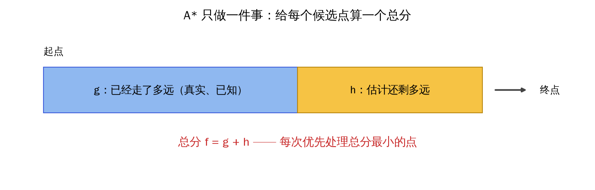
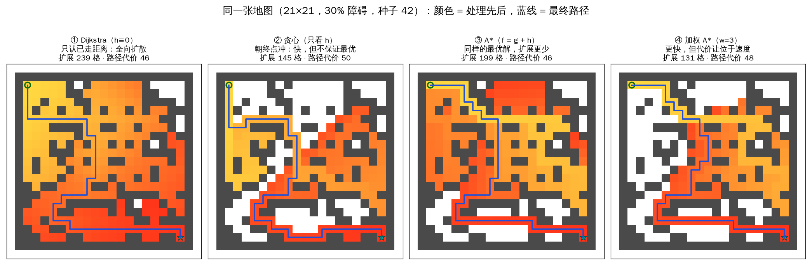
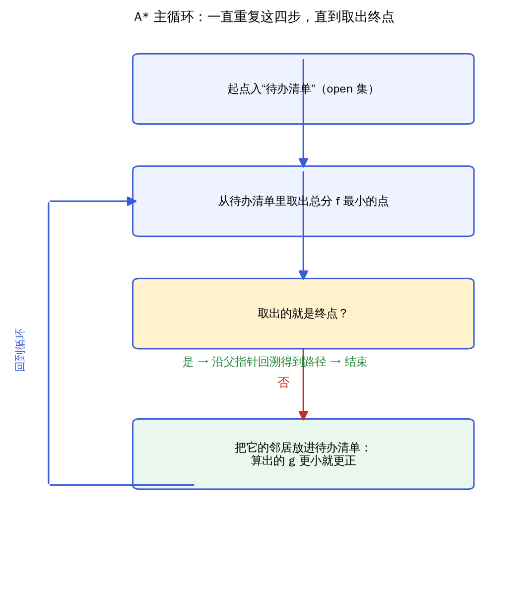
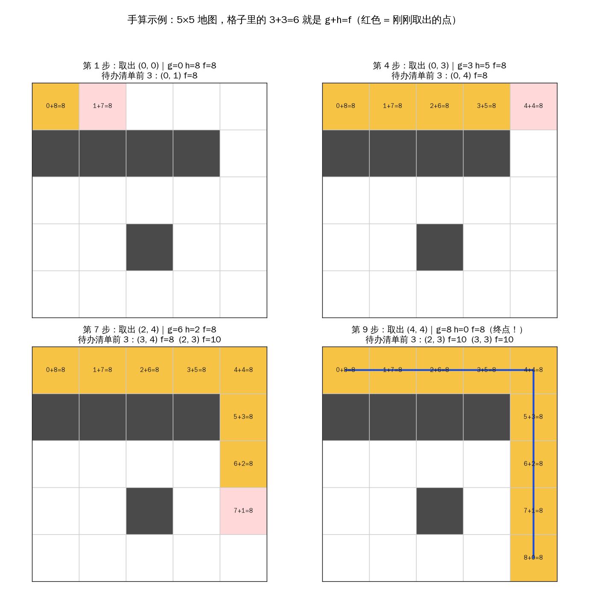

# A* 零基础图文导读

> 这份文档假设你**没学过算法、没写过代码**。目标是：读完能拿纸笔自己走完 A*，并说清它为什么保证"最短"。
> 想要推导、源码与实测数据，看进阶版 [README.md](./README.md)；两者的分工见文末「与进阶版的对照」。
> 本文所有图片、流程图、动画都由 [make_teaching_assets.py](./make_teaching_assets.py) 生成，数字与 [impl.py](./impl.py) **自动对账**（对不上就报错），可重跑复现。

---

## 1. 一句话讲清 A* 在干嘛

找最短路径时，A* 每一步都只做一件事：

**从"待办清单"里挑出当前最有希望的那个点，先处理它。**

"有希望"的算法：已经走了多远（g）+ 估计还剩多远（h）= 总分（f）。



三个字母的含义：

| 字母 | 含义 | 性质 |
|---|---|---|
| `g` | 从起点走到这个点，**实际**走了几步 | 已经发生，是确定的 |
| `h` | 从这个点**估计**还要走几步 | 只能猜，所以要用"不会高估"的猜法 |
| `f` | `f = g + h`，总分 | 越小越有希望 |

> 类比开车导航：`g` 是你已经开过的路，`h` 是导航估计的剩余路程。A* 就是在每个岔路口都先看"总分最小"的方向。

---

## 2. 为什么不能只看一个字母

三种极端做法，结果完全不同：

| 策略 | 看什么 | 特点 |
|---|---|---|
| Dijkstra | 只看 `g` | 稳（保证最短），但像水波一样四面摊开，干了很多无用功 |
| 贪心最佳优先 | 只看 `h` | 快，方向感强，但会一头撞进死胡同，**不保证最短** |
| **A\*** | `f = g + h` | 两个都看：既有方向感，又不忘记已经付出的代价 |

同一张真实地图（21×21、30% 障碍、固定种子）跑四种做法：



| 策略 | 处理了多少个点 | 找到的路径长度 |
|---|---|---|
| ① Dijkstra（h≡0） | 239 | 46（最短） |
| ② 贪心（只看 h） | 145（最少） | **50（不是最短！）** |
| ③ A*（f = g + h） | 199 | 46（最短） |
| ④ 加权 A*（w=3，放大 h） | 131 | 48（图快，放弃了一点最优性） |

两个结论：

1. 贪心看着最"省事"，但它找到的路比最短的**多了 4 步**——因为它从不回头看"已经走了多远"。
2. A* 和 Dijkstra 给出同样好的路，但少处理了 40 个点；**少做的这些功，就是 h 带来的方向感**。

---

## 3. 算法主循环：重复四步



1. 把起点放进**待办清单**（open 集），它的总分是 `f = 0 + h(起点)`。
2. 从待办清单里取出 **f 最小**的点。
3. 如果它就是终点 → 顺着"从哪来"的指针回溯，得到完整路径 → 结束。
4. 否则把它周围能走的格子放进待办清单：如果新算出的 `g` 更小，就更正并重新排队，然后回到第 2 步。

就这样循环。没有别的花招。

---

## 4. 亲手算一遍（5×5 小地图）

规则：每步只能上下左右走，不能斜走；黑色格子是墙，不能通过。

```text
S . . . .        S = 起点 (0,0)
# # # # .        G = 终点 (4,4)
. . . . .        # = 墙
. . # . .
. . . . G
```

估计方法用"横着差几格 + 竖着差几格"（曼哈顿距离）。比如格子 (2,4) 到终点 (4,4) 差 2 行 0 列，所以 `h = 2`。



完整过程（每一步：取出总分最小的点，再算它的邻居）：

| 步骤 | 取出 | g | h | f | 处理后待办清单（前 3） |
|---|---|---|---|---|---|
| 1 | (0, 0) | 0 | 8 | 8 | (0, 1) f=8 |
| 2 | (0, 1) | 1 | 7 | 8 | (0, 2) f=8 |
| 3 | (0, 2) | 2 | 6 | 8 | (0, 3) f=8 |
| 4 | (0, 3) | 3 | 5 | 8 | (0, 4) f=8 |
| 5 | (0, 4) | 4 | 4 | 8 | (1, 4) f=8 |
| 6 | (1, 4) | 5 | 3 | 8 | (2, 4) f=8 |
| 7 | (2, 4) | 6 | 2 | 8 | (3, 4) f=8、(2, 3) **f=10** |
| 8 | (3, 4) | 7 | 1 | 8 | (4, 4) f=8、(2, 3) **f=10**、(3, 3) **f=10** |
| 9 | **(4, 4) 终点！** | 8 | 0 | 8 | (2, 3) f=10、(3, 3) f=10 |

三个值得停下来看的细节：

1. **第 7 步出现了分歧**：待办清单里同时有 f=8 和 f=10 的点，A* 挑 8。这就是"挑 f 最小"的真实含义——不是随便挑，也不是按离终点远近挑。
2. **第 9 步到达终点时，待办清单里还剩 f=10 的点没处理**。它们不是被删掉了，而是"轮不到"：终点已经取出，搜索结束。**A* 少干的活，正是这些没被处理的点。**
3. **每个点只处理一次**（处理完就记入"已办"）。如果后来发现同一格有更短的走法，它会重新排队——这就是第 3 节第 4 步里"算出的 g 更小就更正"的原因。

路径是：(0,0) → (0,1) → (0,2) → (0,3) → (0,4) → (1,4) → (2,4) → (3,4) → (4,4)，共 8 步。

---

## 5. 为什么它保证"最短"（白话版）

关键只有一条：**h 永远不能高估**（术语叫"可采纳"）。

用反证法想。假设存在一条比 A* 找到的更短的路：

- 这条路走到终点前的某个点，它的 `f = g + h` 一定**小于**终点的 `f`——因为 `g` 是真实代价，而 `h` 只会低估，加起来不会超过这条路的真实总长。
- A* 每次都优先取出 `f` 最小的点，所以这个点一定会**先于终点**被取出来处理。
- 但 A* 处理完它之后会继续沿着这条路前进，最终必然先取出终点——矛盾。

所以"A* 找到的路不是最短的"这个假设不成立。

"横着差几格 + 竖着差几格"（曼哈顿距离）为什么安全？每走一步最多让这个差减少 1，所以真实剩余步数**只会比它大，不会比它小**——永远不高估。

**反过来，一旦高估会怎样？** 看第 2 节表格的第 ④ 行：把 `h` 乘以 3，处理点数从 199 降到 131（更快），但路径从 46 变成 48（不再是"保证最短"）。这就是为什么进阶版把 `h` 的条件（可采纳 / 一致性）写在最显眼的位置。

---

## 6. 动起来看


左边是 Dijkstra，右边是 A*，同一张地图、同一个起点终点。盯着看两件事：

- 左边的"水波"四面均匀扩散；右边的形状明显朝终点方向拉长——这就是 `h` 的作用。
- 最后两者找到的路径是同一条（代价都是 46），但右边少铺了很多格子。

---

## 7. 自己动手：三个小实验

命令（在 `algorithms/p01-search/a-star/` 目录下执行）：

```bash
../../../.venv/bin/python demo.py    # 跑进阶版的三个实验，直接看输出
```

| 实验 | 怎么改 | 预期观察 |
|---|---|---|
| 换平局策略 | 对比 `demo.py` 输出里的 `insertion` 与 `large_g` | 同一算法、同一代价，扩展数 214 → 199；无障碍地图上极端到 361 → 37 |
| 放大 h 的权重 | 改 `demo.py` 中加权扫描的 `w` | w=1/2/3/5 时扩展数 199/141/131/133，路径代价 46/46/48/58——w=3 起不再保证最短 |
| 换地图 | 改 `make_grid(seed=…)` 的种子 | 起点终点自动保证连通，重复上面两步看变化 |

改完代码跑一次测试确认没改坏（17 个用例）：

```bash
cd ../../..                    # 回到仓库根
.venv/bin/python -m pytest algorithms/p01-search/a-star/ -q
```

---

## 8. 自测：从"看懂"到"掌握"的 6 个关卡

能全部做到，才算真的掌握（前 4 关靠纸笔，不需要电脑）：

1. 写出 `f = g + h`，并说清每个字母"是确定的还是估计的"。
2. 不看书，把第 4 节的 5×5 例子重新走一遍，每一步都说出"我为什么挑它"。
3. 说清"h 不能高估"的原因；再举一个会高估的坏例子（比如用直线距离去估算只能横竖走的地图）。
4. 解释为什么到达终点时，待办清单里剩下的点可以永远不处理。
5. 说出 A* 和 Dijkstra 的关系（Dijkstra 就是 `h` 恒等于 0 的 A*）。
6. 预测型问题：把 `h` 的权重从 1 调到 3，路径会变长还是变短？处理点数会变多还是变少？先写答案，再跑第 7 节验证。

---

## 9. 常见误区

- **"A* 一定比 Dijkstra 快"**：准确说法是"处理更少的点"。单步开销两者差不多；当地图空旷、`h` 处处相同（第 7 节的无障碍地图），这个优势会消失甚至反转。
- **"h 越准越好"**：不是越准越好，而是**不能高估**。在不高估的前提下，越准 → 处理越少；方向搞反会直接失去"最短"的保证。
- **"平局随便处理"**：无障碍地图上仅换平局策略，处理点数从 361 掉到 37（理论下界）。平局策略是效率的一阶因素，不是细节。
- **"路径长度 = 步数"**：只有每步代价都相同时才成立。换成"上坡更费时"这类地图，最短要按代价算。
- **"A* 万能"**：它需要你能给出一个不高估的 `h`；给不出，就只能退回 Dijkstra 一类的方法。

---

## 10. 与进阶版的对照

两份文档是同一件事的两种讲法，配合使用：

| 主题 | 本文（零基础版） | 进阶版 [README.md](./README.md) |
|---|---|---|
| `f = g + h` | 色条图 + 开车导航类比 | 「设计原理」：从 BFS / Dijkstra / 贪心的演进讲起 |
| 为什么保证最短 | 白话反证 + 不高估直觉 | 「数学推导」：可采纳 vs 一致性、最优性证明、最优效率定理 |
| 算法怎么实现 | 四步流程图 | 「手写实现要点」：最小堆、延迟删除、`g` 松弛、平局策略 |
| 与 Dijkstra 的关系 | 对比图 + 表格 | 「基线对照」：Dijkstra 是 `h≡0` 的 A*，一行 lambda 落地 |
| 实测数据 | 报结论数字（239/145/199/131） | 「实验结果」：三组实验、耗时、复现命令、验证声明 |
| 失效边界 | 「常见误区」 | 「局限与延伸」：可采纳但不一致、闭集不重开、单步代价假设 |

建议阅读顺序：**先读本文建立直觉 → 自己做第 7 节实验 → 再读进阶版看推导与代码。** 反过来读容易卡在公式上。

---

## 附：本文素材怎么复现

```bash
cd algorithms/p01-search/a-star
../../../.venv/bin/python make_teaching_assets.py
```

脚本会：生成 `images/` 下全部图片与 GIF；断言素材里的扩展数、路径代价与 `impl.solve()` 完全一致（不一致直接报错）；并打印第 4 节的完整步骤表。
