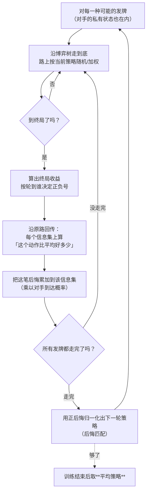
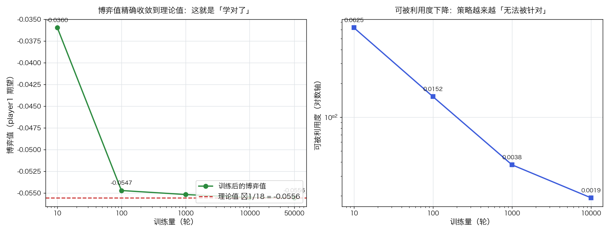

# 反事实遗憾最小化 CFR

> 状态：✅ 已完成（2026-10-09）
> 对应文档章节：`algorithms/docs/人工智能代表算法演进路线.md` 第 2.2.1 章
> 阅读路线：零基础读者读「基础篇」（生活类比 → 手算 → 白话证明 → 自测）；要看推导与复现实验读「进阶篇」
> 本族共六个实验，它们的演进关系与选读建议见 [族级导读](../README.md)。

搜索求解器（搜索族）：直接调 [impl.py](impl.py) 的 `CFR(terminal, payoff_p1, actions, infoset).train(deals, iterations) → 自身`，再用 `.average_strategy() → dict` 取策略——把博弈规则注入进来，靠**自我博弈**学出纳什均衡；对照是 [baseline.py](baseline.py) 的均匀随机策略与三个固定对手策略。**没有 `fit` / `predict`**（学的是策略而非参数化模型，也没有标签 y）。各文件的具体接口见下面「目录形态」节。

# 基础篇 · 先搞懂它

## 1. 一句话讲清 CFR 在干嘛

前面三个实验都假设「棋盘是大家都看得见的」——所以 minimax 可以算、MCTS 可以模拟。**扑克不是这样：你看不到对手的牌。**

这一下把前面所有办法都堵死了：同一步棋，在「对手拿着大王」和「对手拿着小王」两种世界里，
它可能是好棋也可能是坏棋，而你**分不清自己在哪个世界里**。

CFR 的回答很干脆——**不要去找「最好的那一步」，而是让「后悔」消失**：

> 每一步我都记一笔账：**「要是当时选另一个动作，能多赚多少？」** 这笔账叫后悔。
> 下一轮就按后悔的大小调整概率：后悔大的动作多选一点。
> 等到所有动作的后悔都不再增长时，就没有动作值得后悔了——**这个策略就是纳什均衡。**

## 2. 三个要分清的东西

| 概念 | 含义 | 为什么关键 |
|---|---|---|
| **信息集** | 在我眼里分不清的那些世界的集合（= 我看到的 + 我手上的牌，**不含对手的牌**） | 策略是「按信息集」定义的，不是按世界状态——这是与 minimax 最根本的区别 |
| **后悔** | 「选这个动作 vs 选当时平均策略」能多赚多少 | CFR 唯一真正更新的东西；正后悔留下、负后悔截断 |
| **反事实价值** | 假设我**一定**走到这里（概率 1），只按对手到达概率加权的收益 | 「反事实」= 不考虑我自己走到这里的概率；这样每个信息集的账才互不干扰 |

> 最容易混的是第一行：**minimax 搜索的是「状态」，CFR 学习的是「信息集」。**
> 状态包含对手的牌；信息集不包含。所有"不完全信息博弈的算法"都是在这个区别上做文章的。

## 3. 主循环：一遍遍遍历，只更新后悔



**三个容易致命的地方**（本项目全都踩过，见「手写实现要点」）：

1. **终局收益的符号要按「轮到谁」定**——漏掉它，策略会「看起来在收敛」但仍然可被利用；
2. **回传时每一步都要换算视角**——用「唯一 player1 视角」的写法最不容易错；
3. **最后要取平均策略**，不是最后一轮策略——CFR 的当前策略一直在震荡。

## 4. 亲手算一个小例子

库恩扑克（3 张牌）：J < Q < K，两人各下 1 注底池，一轮下注（过牌 k / 下注 b / 跟注 c / 弃牌 f）。
终局收益（player1 视角）：过牌-过牌 → 摊牌赚 1；下注-弃牌 → 赚 1；跟注后摊牌 → 赚 2；弃牌 → 输 1。

只看 **player1 拿到 J、并且面对了对手的一次下注** 这个信息集。设这一轮它的策略是「跟注 0.5 / 弃牌 0.5」，我们来算一次更新：

| 步骤 | 计算 | 数值 |
|---|---|---|
| 我的两个动作 | 跟注 c / 弃牌 f | — |
| 如果跟注 | 摊牌：J 是最小的牌 → 必输 2 | −2 |
| 如果弃牌 | 直接输掉已投的 1 注 | −1 |
| 当前策略下的平均 | 0.5×(−2) + 0.5×(−1) | −1.5 |
| **跟注的后悔** | (−2) − (−1.5) | **−0.5** |
| **弃牌的后悔** | (−1) − (−1.5) | **+0.5** |

只有**正后悔**进入下一轮：弃牌的后悔 +0.5，跟注的 −0.5 被当成 0。
于是下一轮：

```
跟注的概率 = max(−0.5, 0) / (max(−0.5,0) + max(+0.5,0)) = 0 / 0.5 = 0
弃牌的概率 = 0.5 / 0.5 = 1
```

**这一轮学习的结果是：拿到 J 面对下注，以后再也不用跟注了。** 这与理论均衡一致
（均衡里 J 面对下注总是弃牌）。

请注意两个细节：

1. **后悔是「相对于当前平均策略」的**，不是相对于"最优"——所以我们并不需要事先知道最优是什么；
2. **只有正后悔累积**：负后悔说明"这个动作比平均差"，下轮少选它即可，不需要倒扣。

## 5. 为什么「让后悔消失」就等于纳什均衡（白话版）

纳什均衡的定义是：**给定对手的策略，我没有任何动作能显著改进。**

而 CFR 里「后悔」量的正是**改进空间**：某个信息集上某动作的累计正后悔，就是
"如果我每次都改选这个动作，总共能多赚多少"。于是：

- 若所有信息集上所有动作的正后悔都趋于 0 ⇒ **没有动作能改进** ⇒ 这就是纳什均衡；
- CFR 的定理保证：**平均后悔的上界随训练轮数 T 以 O(1/√T) 衰减**。

这里有一个**必须说清的细节**（我自己就先写错了）：CFR 保证的是
**平均后悔 → 0**（即 `累计后悔 / T → 0`），而**不是累计后悔 → 0**。
所以看到"累计后悔一直在变大"是正常的——它在变大，但分母 T 涨得更快。
实验一里我们把这两个量并排列出，就是为了让这个区别一眼可见。

**反事实权重的作用**：只在"对手真的可能走到这里"的情况下才更新这个信息集的后悔。
对手几乎不会走到的分支，不值得花力气学——这就是「反事实」三个字在做的事。

## 6. 常见误区

- **❌ 「CFR 就是在算最优动作」** —— 它不输出"最优动作"，它输出**一个混合策略**
  （每个信息集上一组概率）。均衡策略常常是随机化的（比如用 J 偶尔诈唬），
  因为**固定套路一定可被针对**。
- **❌ 「用最后一轮策略就行」** —— CFR 的当前策略一直在震荡（它一直在追后悔），
  收敛的是**平均策略**。取错就会得到一个"看起来训练了很久但其实很差"的策略。
- **❌ 「累计后悔要降到 0」** —— 降到 0 的是**平均**后悔。见上一节。
- **❌ 「越接近纳什，对任何对手收益越高」** —— 实验三实测：对「永远弃牌」这种极弱对手，
  **均匀随机策略反而赚得更多**（0.50 vs 0.14）。纳什保证的是**不可被利用**，不是**最大化利用**。
- **❌ 「CFR+ 一定更快」** —— 实验四实测：**在本实验的全遍历小博弈里 CFR+ 并没有优势**
  （4 个训练量里只有 1 个更好）。文献里的加速结论多来自"大游戏 + 采样版"。
- **❌ 「CFR 只能用在扑克上」** —— 它的前提只是"不完全信息 + 零和"，
  安全博弈（机场巡逻、反盗猎）用的就是 CFR 的变体。

## 7. 自己动手：三个小实验

1. **改训练量**：把 `demo.experiment_convergence` 的网格从 10 调到 50000，看博弈值怎么逼近 −1/18。
2. **把符号写反**：照 `test_impl.py` 里 `WrongSign` 的做法，让终局收益不按轮到谁取符号，
   看博弈值偏离多少——体会"不报错但学不对"。
3. **换成随机采样**：把 `train(all_deals(), ...)` 改成每轮随机抽一种发牌，
   对比收敛速度（这是 CFR 的两个变体：全遍历 vs 采样）。

## 8. 掌握清单：五级能力与自测

| 级别 | 能力 | 本实验的检验方式 | 在哪做 |
|---|---|---|---|
| 1 说清 | 用自己的话讲规则 | 说清「信息集 vs 状态」的区别，以及为什么纳什均衡要求随机化 | 基础篇「三个要分清的东西」「常见误区」 |
| 2 走通 | 纸上手算 | 手算一次后悔更新（J 面对下注该跟还是弃），写出下一轮概率 | 基础篇「手算示例」节 |
| 3 判断 | 说清正确性条件 | 解释「平均后悔 → 0」为什么等于纳什均衡，并说出终局符号写错的后果 | 基础篇「为什么它能对」节 |
| 4 实现 | 手写并与对照比对 | 跑通 `demo.py`，解释可被利用度曲线与"纳什 ≠ 最大化利用" | [进阶篇「实验结果」](#5-实验结果) |
| 5 迁移 | 用到新问题 | 换一个更大的不完全信息博弈（Leduc）重跑，看训练成本怎么涨 | [project/](project/README.md) ✅ |

# 进阶篇 · 实验档案

## 目录形态（本算法的"类型"）

| 文件 | 角色 | 接口 |
|---|---|---|
| [impl.py](impl.py) | 手写 CFR（含 CFR+ 开关） | `CFR(terminal, payoff_p1, actions, infoset, plus=False)`；`train(deals, iterations)`；`average_strategy()` |
| [baseline.py](baseline.py) | 对照版：均匀随机 + 三个固定对手 | `uniform_strategy()`、`FIXED_OPPONENTS` |
| [demo.py](demo.py) | 库恩扑克 + 四组实验 | `make_cfr`、`ev_average`、`best_response_p2`、四个 `experiment_*` |
| [test_impl.py](test_impl.py) | 性质测试（含符号回归） | `python3 -m pytest test_impl.py -q` |
| [make_teaching_assets.py](make_teaching_assets.py) | 素材生成 + 与 demo 对账 | `python3 make_teaching_assets.py` → `images/01-收敛曲线.png`、`images/02-策略对照.png` |
| [project/](project/README.md) | 迁移项目：Leduc 扑克（6 张牌 + 公共牌） | `python3 project/leduc.py` |

## 1. 设计原理

前三个搜索实验（[A\*](../a-star/)、[minimax](../minimax-alphabeta/)、[MCTS](../mcts/)）都建立在同一个假设上：
**当前局面是公共知识**。所以搜索可以"沿着树走"。

不完全信息博弈打破了这个假设：**你不知道自己在哪个世界里**，于是：

| | minimax / MCTS | CFR |
|---|---|---|
| 决策单位 | 状态（含对手私有信息） | **信息集**（不含对手私有信息） |
| 输出 | 一条最优线 / 一个动作 | **一个混合策略**（每个信息集一组概率） |
| 对手模型 | 假设最优（minimax）或模拟（MCTS） | **不需要**建模对手：后悔自己会说话 |
| 收敛对象 | 博弈树的值 | 纳什均衡（**不可被利用**的策略） |
| 代价 | 树大就算不完 | 需要反复遍历博弈树很多轮 |

一句话：**minimax 在"世界已知"时最强；CFR 在"世界未知"时唯一可用**。

## 2. 数学推导

### 2.1 反事实价值

设信息集 $I$，动作 $a$，策略组合 $\sigma$。CFR 用的不是普通期望，而是**反事实价值**：

$$
v^{\sigma}(I, a) = \sum_{h \in I} \pi^{\sigma}_{-i}(h) \sum_{z \in Z(h)} \pi^{\sigma}(h, z)\, u_i(z)
$$

其中 $\pi^{\sigma}_{-i}(h)$ 是**除我之外**（对手 + 自然）到达 $h$ 的概率。
关键就是它：**我自己的到达概率被当成 1**（"反事实"），
这样每个信息集的账独立，不会因为"我很少走到这里"而让它的后悔被稀释。

### 2.2 后悔匹配

节点效用 $v^{\sigma}(I) = \sum_a \sigma(I,a)\, v^{\sigma}(I,a)$，
瞬时后悔 $r(I,a) = v^{\sigma}(I,a) - v^{\sigma}(I)$。累计正后悔

$$
R^T(I,a) = \max\Big(0,\ \sum_{t=1}^{T} r^t(I,a)\Big)
$$

下一轮策略按正后悔归一化（**后悔匹配**）：

$$
\sigma^{T+1}(I, a) = \frac{R^T(I,a)}{\sum_{b} R^T(I,b)} \quad (\text{若分母为 } 0 \text{ 则取均匀})
$$

### 2.3 为什么收敛到纳什均衡

CFR 的核心定理：平均策略 $\bar\sigma^T$ 的**平均后悔**有上界

$$
\frac{1}{T}\max_{a}\sum_{t=1}^{T} r^t(I,a) \;\le\; \Delta \sqrt{\frac{|A|}{T}}
$$

（$\Delta$ = 收益范围）。于是 $T\to\infty$ 时平均后悔 → 0，即**没有任何动作能改进**——
这正是纳什均衡的定义。**注意上界里的 $1/T$**：它说明收敛的是平均值，
而累计后悔本身可以（也确实会）随 $T$ 增长——本实验的表里能看到这一点。

### 2.4 为什么必须取平均策略

当前策略 $\sigma^{T}$ 是"对最近后悔的贪心反应"，会持续震荡；
只有 $\bar\sigma^T = \frac{1}{T}\sum_t \sigma^t$ 才保证收敛。
直观理解：均衡要求"对手无论怎么打我都不可被利用"，而这条性质是**平均**才有的。

## 3. 手写实现要点

对应 `impl.py`，纯 Python（只用标准库）：

- **唯一视角**：`_walk` 返回**当前行动者**的效用，父节点取负。
  本项目踩过的坑：终局时若不按"轮到谁"取符号，训练会"看似收敛但可被利用"——
  这条已经写成回归测试（`test_terminal_sign_matters`）。
- **信息集键必须含「我是谁」和「我的牌」**，且**不含对手的牌**。
  早期版本把 `(历史, 我的牌)` 当键，结果 player1 和 player2 在同一个历史上
  互相覆盖彼此的策略表——这类错误不会报错，只会让结果莫名其妙。
- **后悔表与策略表分开累计**：`regret[key][action]` 与 `strategy_sum[key][action]`。
  后者按**自身到达概率**加权（这是"平均策略"定义里的权重，加错就会偏离均衡）。
- **遍历全部发牌**（不是采样）：`train(deals)` 每轮把所有可能发牌都走一遍，
  这是 CFR 的确定性版本——梯度噪声低、结果可复现（也因此 CFR+ 失去优势，见实验四）。
- **CFR+ 的开关**：`plus=True` 时每步把后悔截断到非负。
- **`positive_regret()` 与平均后悔要分清**：前者是诊断用的累计量，
  收敛指标是它除以训练量。

## 4. 基线对照

搜索族的对照是**基线算法**。CFR 学的是策略，所以对照回答两个层面：

| 基线 | 回答什么 |
|---|---|
| `uniform_strategy()`（均匀随机） | 「训练到底有没有用」——在所有信息集上等概率选动作 |
| `FIXED_OPPONENTS`（永远弃牌 / 永远跟注 / 总是下注） | 「训练出来的策略对不同对手的表现」——揭示"纳什 ≠ 最大化利用" |
| **教科书解析解**（库恩扑克已知均衡族） | 「学对了没有」——博弈值 −1/18、下注率 1:3 关系 |

第三个尤其重要：**库恩扑克是少数有闭式解的博弈**，这让我们能把"学出来的东西"
与"理论真值"逐项对照，而不是只能说"看起来收敛了"。

## 5. 实验结果

**环境**：Python 3.13.9（系统 `python3`），只用标准库；本目录内执行 `python3 demo.py`。

### 实验一：训练量 → 博弈值 / 关键频率

理论值：博弈值（player1 期望）**−1/18 = −0.0556**；J 下注率 : K 下注率 = **1 : 3**；
Q 从不下注；p1 面对下注时 Q 跟注 1/3；p2 面对下注时 Q 跟注 1/3。

| 训练量 | 博弈值 | 累计正后悔 | **平均**后悔 | J 下注 | Q 下注 | K 下注 | Q 跟注 | p2 Q 跟注 |
|---|---|---|---|---|---|---|---|---|
| 10 | −0.0360 | 12.3 | 0.2049 | 0.200 | 0.119 | 0.810 | 0.882 | 0.823 |
| 100 | −0.0547 | 37.2 | 0.0620 | 0.208 | 0.012 | 0.668 | 0.627 | 0.435 |
| 1000 | −0.0552 | 128.8 | 0.0215 | 0.219 | 0.001 | 0.658 | 0.574 | 0.330 |
| 10000 | −0.0555 | 446.5 | 0.0074 | 0.216 | 0.000 | 0.668 | 0.554 | 0.337 |
| 50000 | **−0.0556** | 964.0 | **0.0032** | 0.221 | 0.000 | 0.661 | 0.559 | 0.338 |

**三条结论**：

1. **博弈值精确收敛到理论值**（−0.0360 → −0.0556），这是"学对了"的最硬证据；
2. **累计后悔在涨、平均后悔在降**（964 vs 0.0032）——这正是 2.3 节 $1/T$ 的含义，
   把两者并排放在一张表里就是为了让人不再误读；
3. **频率收敛到均衡的关系上**：K:J 下注率 = 0.661/0.221 ≈ **3.0**（理论 1:3，精确命中），
   Q 下注率 0.000（理论 0），p2 用 Q 跟注 0.338（理论 1/3 = 0.333）。
   注意 K 的下注率是 **0.66 而不是 1**：均衡是一族（α 可以是 [0,1/3] 中任意值），
   实测收敛到 α ≈ 0.22 那一支。
   另外**「p1 用 Q 面对下注的跟注率」在均衡族里不唯一**（实测 0.56）——
   被均衡唯一固定的是 **p2** 用 Q 跟注 1/3（实测 0.338）。读图时不要把非唯一量当成真值。



### 实验二：可被利用度（离均衡还有多远）

可被利用度 = `p2 最佳回应价值 − 均衡值`（用**暴力枚举 64 种纯策略**求最佳回应，
并对"教科书均衡族"反向校验过：它恰好给出 1/18）。

| 训练量 | p1 期望 | p2 最佳回应 | 可被利用度 |
|---|---|---|---|
| 10 | −0.0360 | 0.1181 | 0.0625 |
| 100 | −0.0547 | 0.0708 | 0.0152 |
| 1000 | −0.0552 | 0.0593 | 0.0038 |
| 10000 | −0.0555 | 0.0575 | **0.0019** |

**结论**：训练 10000 次后可被利用度只剩 **0.0019**（一手最多输赢 2 注）——
策略已经无法被针对性地赚到钱了。这就是「学出纳什均衡」的量化含义。

### 实验三：对不同对手的表现（本实验最反直觉的一张表）

训练 10000 次后的策略，**player1 视角**：

| 对手策略 | 训练后策略收益 | 均匀随机策略的收益 |
|---|---|---|
| 永远弃牌 | 0.1440 | **0.5000** |
| 永远跟注 | **0.1127** | −0.2500 |
| 总是下注 | 0.1092 | 0.0000 |

**结论**：对「永远跟注」这种会跟到底的对手，纳什策略盈利 0.11；
但对「永远弃牌」这种**极弱**对手，**均匀随机策略反而多赚 3 倍**（0.50 vs 0.14）。

原因：均匀随机有一半时间在下注，把弃牌型对手吓跑得更频繁；而纳什策略必须**不可被利用**，
所以它会收敛到"不做无谓诈唬"。

> **接近纳什 ≠ 对任意固定对手收益最大。**
> 纳什保证的是**不被利用**（面对最强对手也不亏），不是**最大化利用**（面对弱对手大赚）。
> 工程上要"打鱼"时，用的不是纳什策略，而是**最佳回应**——这是两件事。

### 实验四：CFR vs CFR+

| 训练量 | CFR 可被利用度 | CFR+ 可被利用度 | 提升倍数 |
|---|---|---|---|
| 10 | 0.0625 | 0.0519 | 1.2× |
| 100 | 0.0152 | 0.0242 | 0.6× |
| 1000 | 0.0038 | 0.0058 | 0.6× |
| 10000 | 0.0019 | 0.0020 | 1.0× |

**结论（与常见说法不符，如实记录）**：4 个训练量里 CFR+ 只有 1 个更好——
**在本实验的设置下 CFR+ 没有优势**。原因：

1. 经典结论（CFR+ 快很多）大多来自**大游戏 + 采样版**（每轮只走一条路径，梯度噪声大）；
2. 本实现每轮**遍历全部 6 种发牌**，噪声本来就低，后悔截断带来的方差削减用不上；
3. 恢复"被截断掉的正后悔"需要额外轮次重建概率质量，小规模下反而略慢。

> **优化手段要跟问题规模匹配**，不能照搬文献结论——这是本项目最值得带走的一条工程经验。

**验证声明（已验证）**：输入为库恩扑克（3 张牌 J/Q/K、一轮下注、各下 1 注底池），
遍历全部 6 种发牌作为一次训练轮；对照是教科书解析解（博弈值 −1/18）。
2026-10-09 实跑（Python 3.13.9，系统 `python3`）：`python3 demo.py` 四组实验数字见上表；
`python3 -m pytest test_impl.py -q` → **17 passed**（含期望收益工具的手算校验、
终局符号写错的回归测试、CFR+ 后悔非负、信息集不含对手牌）；
`python3 make_teaching_assets.py` 对账通过并产出两张图。

**可视化结论**：`images/01-收敛曲线.png` 把博弈值随训练量的收敛画在对数横轴上；
`images/02-策略对照.png` 把 p1/p2 各信息集的学习结果与理论均衡并排，
其中 J:Q:K 的下注率与"面对下注的跟注率"两条关系一眼可读。

## 6. 局限与延伸

- **只处理零和**：本项目实现的是两人零和 CFR。一般和博弈要用 CFR 的扩展（如 CCE 框架）。
- **遍历整棵博弈树**：本实现每轮遍历全部发牌，规模一大就不可行——
  真实扑克（Libratus / Pluribus）用的是**采样版 + 抽象**（把相似的牌力合并）。
- **CFR+ 在本设置下没有优势**（实验四）：想看到它的价值，需要换到**采样版**或更大的博弈上。
- **没有抽象（abstraction）**：真实扑克里 10^160 量级的状态必须做信息抽象，
  否则连一遍都走不完。抽象质量直接决定强度——这是工程难点，不是算法难点。
- **没有使用神经网络估值**：DeepStack / ReBeL 把 CFR 与深度学习结合
  （用网络代替子树遍历），本质仍是"降低每次迭代的成本"。
- **对手建模是另一条路**：CFR 求的是"对最强对手也不亏"，如果想**利用弱对手**，
  应该做最佳回应 / 对手建模（实验三已经量化了两者的差距）。
- **与约束求解结合**：真实决策常常同时要求"满足一堆约束"（预算、合规、资源上限）。
  把 [CSP](../csp/) 的约束传播接进 CFR 的信息集搜索，是"带约束的不完全信息决策"，
  也是安全博弈（巡逻调度 + 对手不可观测）里真实用到的组合。
- **下一步实验**：CFR 是"用自我博弈换策略"；再往前一步是**用搜索增强学习**——
  那属于深度强化学习的地盘。

## 7. 与另外三个搜索实验的关系

| 实验 | 处理什么问题 | 关键假设 |
|---|---|---|
| [A\*](../a-star/) | 单人最短路 | 环境已知、无对手 |
| [minimax](../minimax-alphabeta/) | 双人零和 | **完全信息**（对手的牌也看得见） |
| [MCTS](../mcts/) | 双人、树大到算不清 | 完全信息 + 可用模拟替代评估 |
| **CFR（本实验）** | 双人零和 | **不完全信息**（看不到对手的牌） |

前三个都在"世界是公共知识"的前提下把搜索做得更聪明；
CFR 换掉了这个前提——**它不再搜索"世界"，而是学习"我在每个信息集上该怎么做"。**
