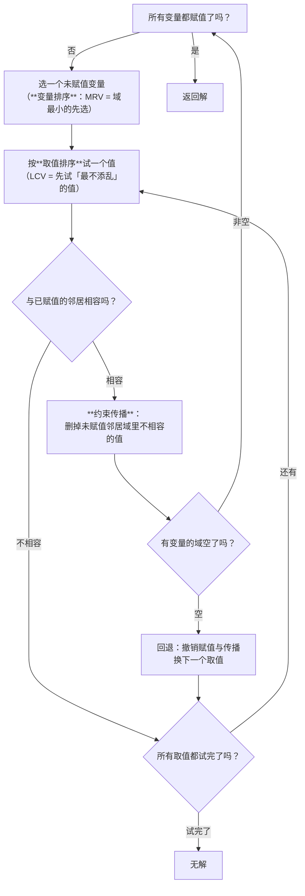
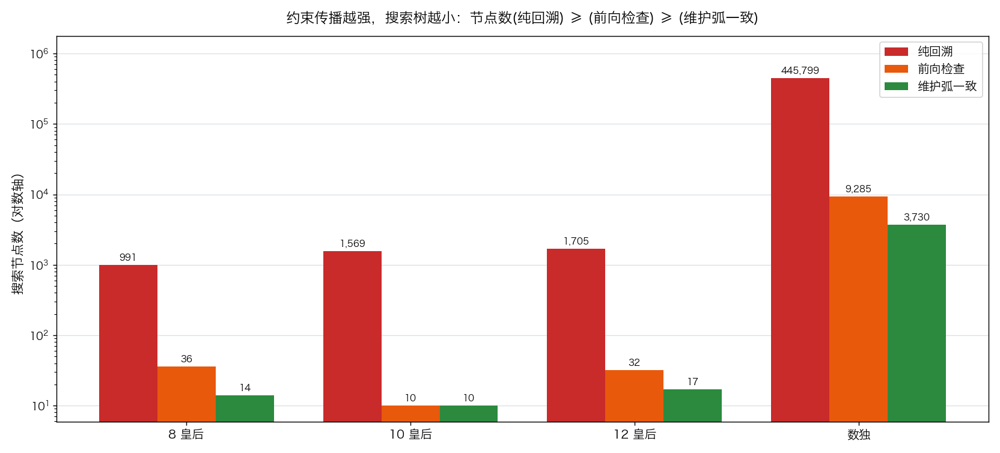
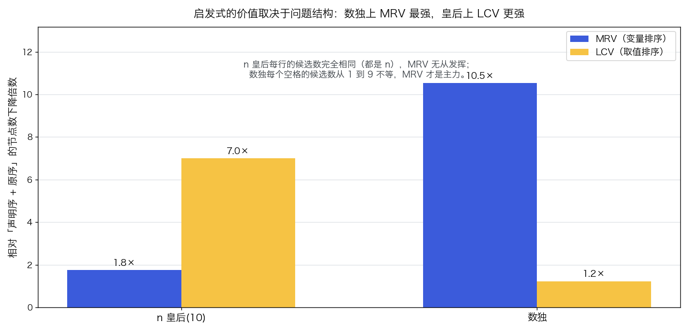

# 约束满足问题 CSP：回溯搜索与约束传播

> 状态：✅ 已完成（2026-10-09）
> 对应文档章节：`algorithms/docs/人工智能代表算法演进路线.md` 第 2.2.2 章
> 阅读路线：零基础读者读「基础篇」（生活类比 → 手算 → 白话证明 → 自测）；要看推导与复现实验读「进阶篇」

搜索求解器（搜索族）：构造 `CSP(variables, domains, constraints)` 后调 [impl.py](impl.py) 的 `solve(csp, strategy="bt"|"fc"|"ac3", var_heuristic, value_heuristic) → SolveResult`——把"变量、取值域、约束"三样东西注入进来，用**回溯 + 传播**求解；对照是 [baseline.py](baseline.py) 的穷举与随机重启。**没有 `fit` / `predict`**（没有参数可训练，也没有标签 y）。各文件的具体接口见下面「目录形态」节。

# 基础篇 · 先搞懂它

## 1. 一句话讲清 CSP 在干嘛

前面几个实验都在**一张图**上找路。但有一类问题**根本没有图**，只有**限制**：

- **八皇后**：8 个皇后放上棋盘，任意两个不能同一行、同一列、同一斜线
- **数独**：空格里填 1–9，每行、每列、每个 3×3 宫都不能重复
- **排课**：每门课挑一个时间段，同一老师的课不能撞、同一教室不能撞
- **地图着色**：每个地区挑一种颜色，相邻地区不能同色

它们的共同结构是：**给一堆变量各挑一个值，让所有约束同时满足。**

难点在于组合数：八皇后的排法是 $8^8 \approx 1.7 \times 10^7$ 种，10 皇后是 $10^{10}$，
数独的空格组合更是一个天文数字。**逐个试完是不可能的**——
CSP 的全部技巧都在回答一个问题：**怎么尽早发现"这条路走不通"，从而不用试完。**

## 2. 三个要分清的东西

| 概念 | 含义 | 为什么关键 |
|---|---|---|
| **变量 / 取值域** | 要决定的量，以及它可能的取值 | 域越小越"受限制"，越应该先决定 |
| **约束** | 变量之间"哪些取值组合是允许的" | CSP 的问题定义本体：**约束决定了搜索空间** |
| **约束传播** | 给一个变量赋值后，**立刻删掉邻居域里不可能的值** | CSP 最值钱的手段：把"将来必然失败"提前到现在发现 |

> 最重要的一点：**CSP 的搜索空间不是给定的，而是约束"定义"出来的。**
> 同样的变量与取值域，加一条约束可能让问题从"有几百个解"变成"无解"。

## 3. 主循环：回溯 + 传播



**三种策略的区别只在"传播做多少"**（上半张图的 PROP 那一步）：

| 策略 | 传播做多少 | 代价 |
|---|---|---|
| **纯回溯 `bt`** | 什么都不做，只做"赋值时与已赋值邻居的相容检查" | 最便宜，但冲突发现得最晚 |
| **前向检查 `fc`** | 赋值后，删掉**直接邻居**域里不相容的值 | 中等 |
| **维护弧一致 `ac3`** | 赋值后**连锁传播**，直到所有弧都一致 | 最贵，但搜索树最小 |

"弧一致"的意思是：变量 $X_i$ 的域里**每个值**，都能在邻居 $X_j$ 的域里找到**至少一个**相容的值。
如果找不到，那个值就是"注定失败"的，可以立刻删掉。

## 4. 亲手算一个小例子

3 皇后（3×3 棋盘放 3 个皇后，任意两个不同行、列、斜线）。用**前向检查**走一遍：

变量 $q_0, q_1, q_2$（分别代表第 0、1、2 行的皇后），取值域都是 $\{0, 1, 2\}$（列号）。

| 步骤 | 动作 | 各变量的域 | 说明 |
|---|---|---|---|
| 初始 | — | $q_0:\{0,1,2\}\ \ q_1:\{0,1,2\}\ \ q_2:\{0,1,2\}$ | |
| 1 | 试 $q_0 = 0$ | $q_1:\{2\}\ \ q_2:\{1\}$ | 删掉与 $q_0$ 同列或同斜线的值 |
| 2 | 给 $q_1$ 赋值：只能取 2 | $q_2:\{\}$ | 删掉与 $q_1=2$ 冲突的值 → **$q_2$ 域空了** |
| 3 | **回退** | $q_1:\{2\}\ \ q_2:\{1\}$ | 撤销第 1 步的传播？不——撤销的是第 2 步 |
| 4 | $q_1$ 没有别的取值 → 回退 $q_0$ | 全部恢复成 $\{0,1,2\}$ | |
| 5 | 试 $q_0 = 1$ | $q_1:\{\}\ \ \dots$ | 与 $q_0=1$ 同列/同斜线后，$q_1$ 域**空了** |
| 6 | 回退，试 $q_0 = 2$ | $q_1:\{0\}\ \ q_2:\{1,?\}$ | 继续 |
| … | … | … | 最终发现 **3 皇后无解** |

**结论：3 皇后无解**——而前向检查在**第 1 步之后**就知道"$q_0=1$ 这条路彻底不行"，
纯回溯则要等到真给 $q_1$ 赋值时才发现。这就是"提前一步"的价值。

> 手算时最容易错的地方：**回退时必须把删掉的值加回去**。
> 本实验的 `test_forward_checking_restores_domains` 就是专门守住这一点的
> （写错不会报错，只会让某些问题**莫名其妙找不到解**）。

## 5. 为什么"尽早发现冲突"能省这么多（白话版）

搜索的本质是一棵树：每给一个变量赋值就往下走一层。**冲突发现得越早，被剪掉的子树越大。**

- **纯回溯**：只在"给变量赋值的那一刻"检查相容性。于是一棵子树上可能已经走了 5 层，
  到第 6 层才发现"第 2 层那个选择就是错的"——那 5 层全白走。
- **前向检查**：赋值后立刻检查邻居，把"注定不可能"的值删掉。
  于是**在冲突真正发生之前**就能看到"某个变量的域空了"，从而提前回退。
- **维护弧一致**：连"邻居的邻居"也一起传播，把矛盾沿着约束链一路推出去。

实验一的实测（八皇后 n=8）：**991 → 36 → 14 个节点**。
每一次"把传播做强一点"，搜索树就小一个数量级——**这就是 CSP 的全部秘密**。

## 6. 常见误区

- **❌ "CSP 就是回溯搜索"** —— 回溯只是骨架。真正让它能用的是**约束传播**：
  数独上纯回溯要 **445,799** 个节点，加上弧一致只要 **3,730**（实验三）。
- **❌ "传播越强越好"** —— 传播本身也要花时间。实测：数独上 AC-3 的**节点**最少（3730），
  但因为每次传播更贵，**总耗时反而比前向检查慢 6 倍**（538 ms vs 90 ms）。
  **要按总耗时选策略，不能只看节点数。**
- **❌ "启发式是通用的"** —— 实验二实测：同一个 MRV，在数独上把节点降 **10.5×**，
  在 n 皇后上只降 **1.8×**（因为皇后每行的候选数完全一样，MRV 没什么可挑的）；
  而 LCV 恰好相反（皇后 7.0×、数独 1.2×）。**启发式的价值取决于问题结构。**
- **❌ "不用搜索，随机试就行"** —— 实验四实测：随机重启在 8 皇后上试了 20,000 次**全部失败**
  （纯随机赋值命中解的概率约 92/1670万）。**没有结构的搜索在紧约束下等于零。**
- **❌ "穷举总能兜底"** —— 10 皇后的组合数是 $10^{10}$，穷举连跑都跑不动（实验四明确报"空间过大"）。

## 7. 自己动手：三个小实验

1. **改传播强度**：把 `demo.experiment_strategies` 的策略从 `bt` 换到 `ac3`，看节点数怎么掉。
2. **关掉启发式**：把 `var_heuristic="decl"`、`value_heuristic="decl"`，看节点数涨多少。
3. **换一个 CSP**：自己写一个"4 人排班"的小 CSP（每人选一个班次，约束：每班至少一人、
   某人不能上夜班），体会"约束怎么写决定了问题有多难"。

## 8. 掌握清单：五级能力与自测

| 级别 | 能力 | 本实验的检验方式 | 在哪做 |
|---|---|---|---|
| 1 说清 | 用自己的话讲规则 | 说出"变量/域/约束"三要素，以及三种策略在"传播做多少"上的差别 | 基础篇「三个要分清的东西」「主循环」 |
| 2 走通 | 纸上手算 | 在 3 皇后上手算前向检查的过程与回退点，得出"无解" | 基础篇「手算示例」节 |
| 3 判断 | 说清正确性条件 | 解释"弧一致"的定义，以及为什么回退必须恢复域 | 基础篇「为什么它能对」节 + 测试 |
| 4 实现 | 手写并与对照比对 | 跑通 `demo.py`，解释"节点最少的策略不一定总耗时最短" | [进阶篇「实验结果」](#5-实验结果) |
| 5 迁移 | 用到新问题 | 把 CSP 用到**真实排班/排课**上（多人多班次、软硬约束） | [project/](project/README.md) ✅ |

# 进阶篇 · 实验档案

## 目录形态（本算法的"类型"）

| 文件 | 角色 | 接口 |
|---|---|---|
| [impl.py](impl.py) | 三种求解器 | `CSP(variables, domains, constraints)`；`solve(csp, strategy, var_heuristic, value_heuristic) -> SolveResult` |
| [baseline.py](baseline.py) | 对照版：穷举 + 随机重启 | `enumerate_all(csp, limit)`、`random_restart(csp, max_tries)` |
| [demo.py](demo.py) | 八皇后 + 数独，四组实验 | `n_queens(n)`、`sudoku(puzzle)`、四个 `experiment_*` |
| [test_impl.py](test_impl.py) | 性质测试（含独立合法性验证） | `python3 -m pytest test_impl.py -q` |
| [make_teaching_assets.py](make_teaching_assets.py) | 素材生成 + 与 demo 对账 | `python3 make_teaching_assets.py` → `images/01-传播的收益.png`、`images/02-启发式对比.png` |
| [project/](project/README.md) | 迁移项目：真实排班（软硬约束） | `python3 project/shift_scheduling.py` |

## 1. 设计原理

CSP 与前面四个搜索实验的根本区别：

| | A\* / minimax / MCTS / CFR | CSP |
|---|---|---|
| 要搜索什么 | 一张**给定**的图 / 博弈树 | **约束定义出来**的赋值组合空间 |
| 目标 | 一条路径 / 一个策略 | 一组满足**所有**约束的赋值 |
| 典型结构 | 状态转移 | 变量 + 域 + 约束 |
| 剪枝依据 | 启发式 / 剪枝窗口 / 后悔 | **约束传播**（域的空与不空） |
| 最像的地方 | 都是"尽早排除不可能" | 同上 |

**为什么 CSP 需要自己的算法**：它的解空间没有"局部结构"（不像网格有邻居关系），
所以不能简单地"沿边走"；但它有**约束**，而约束恰恰提供了极强的剪枝信号——
"这个值会让邻居无值可取"是比任何启发式都硬的判据。

## 2. 数学推导

### 2.1 形式化

CSP 是一个三元组 $(X, D, C)$：变量 $X = \{X_1, \dots, X_n\}$，
域 $D = \{D_1, \dots, D_n\}$，约束 $C$。
一个**赋值**是 $X_i = v_i$ 的集合，**相容**指满足所有约束。

回溯搜索的复杂度在最坏情况下是 $O(d^n)$（$d$ = 域大小）——
传播不改变最坏情况，但**极大改善实际规模**。

### 2.2 弧一致的定义与 AC-3 算法

**弧 $(X_i, X_j)$ 一致**当且仅当：

$$
\forall v \in D_i,\ \exists w \in D_j \text{ 使得 } (v, w) \text{ 满足约束}
$$

AC-3 算法维持一个**弧的队列**：

```
把所有的弧 (Xi, Xj) 放进队列
while 队列非空:
    取出 (Xi, Xj)
    if REVISE(Xi, Xj):            # 删掉了 Xi 域里没有支撑的值
        if D_i 空了: return 失败
        把 (Xk, Xi) 全部入队      # 连锁：Xi 变小可能让它的邻居也能删值
```

`REVISE(Xi, Xj)` 的复杂度是 $O(d^2)$，AC-3 整体是 $O(e \cdot d^3)$（$e$ = 约束数）——
**注意它没有指数项**：传播本身很便宜，贵的是"每次递归都要传播一遍"。

### 2.3 为什么传播能少搜索（关键论证）

**引理**：若某个变量的域在传播后变为空，则该部分赋值**一定无法扩展成完整解**。

*证明*：域 $D_i$ 为空意味着 $X_i$ 的每一个候选值都与**某个已赋值的邻居**冲突，
或被弧一致传播删掉了（而删除的依据是"在邻居域里找不到支撑"，
这同样是"无法扩展"的硬证据）。∎

于是**前向检查/AC-3 的每一次"域空"都是一次确定性的剪枝**——
它剪掉的是整棵子树，而纯回溯只能在**实际尝试到冲突**时才发现，
往往已经白走了好几层。这就是实验一里 991 → 36 → 14 的来源。

### 2.4 启发式的道理

- **MRV（Minimum Remaining Values）**：选域最小的变量先赋值。
  理由：它的分支因子最小，**死路暴露得最快**。
  数独上它把节点降 10.5×——因为空格候选数差异极大。
- **LCV（Least Constraining Value）**：先试"删掉邻居值最少"的值。
  理由：把"最不添乱"的值先试，**保留最多的后续可能性**。
  八皇后上它降 7.0×——因为皇后问题每行域相同，MRV 无从发挥，而取值的排序能显著减少冲突。

**这不是可选的技巧，而是 CSP 能否在现实规模上求解的分水岭**（实验二、三）。

## 3. 手写实现要点

对应 `impl.py`，纯 Python（只用标准库）：

- **邻居表要双向建**：约束 $(A, B, ok)$ 要同时进 $A$ 和 $B$ 的邻居表，
  且 $B$ 那一侧要用**参数翻转**后的判定函数（`lambda y, x: ok(x, y)`）。
  这一处写错会导致"约束只在一个方向生效"，结果**解出的解违反约束**。
- **三种求解器共用一套结果类型**（`assignment / nodes / backtracks / propagations / peak_depth`），
  否则数字无法并排比较。
- **前向检查必须回滚**：把删掉的值记在 `removed` 列表里，回退时加回去。
  忘掉就会漏解——这是本实验最容易犯、也最难发现的错误。
- **AC-3 的状态保存**：递归前把整个 `domains` 深拷贝一份，回退时恢复。
  代码更慢但**不容易错**（本项目选了这个取舍，并在注释里说明）。
- **穷举要显式报"没跑"**：空间超过上限时返回 `nodes < 0`，
  而不是假装"无解"——这两件事在语义上完全不同。
- **随机重启要有次数上限**，并如实报告成败。

## 4. 基线对照

搜索族的对照是**基线算法**。CSP 的对照回答两个问题：

| 基线 | 回答什么 |
|---|---|
| **穷举 `enumerate_all`**（零剪枝） | 「不剪枝会怎样」——组合数一涨就爆炸（10 皇后连跑都跑不动） |
| **随机重启 `random_restart`**（零结构） | 「不用搜索行不行」——8 皇后上 20,000 次尝试全失败 |
| **三种策略互为对照** | 「传播值多少」——`bt` / `fc` / `ac3` 在同问题上的节点数与耗时 |

第三个对照是本实验的核心：**它不是"算法 vs 框架"，而是"同一算法的三个强度档"**——
这样"多花的传播成本"与"省下的搜索成本"可以直接放在一张表里比。

## 5. 实验结果

**环境**：Python 3.13.9（系统 `python3`），只用标准库；本目录内执行 `python3 demo.py`。

### 实验一：三种策略对比（n 皇后）

| 问题 | 纯回溯 | 前向检查 | 维护弧一致 |
|---|---|---|---|
| 8 皇后 | **991** | 36 | **14** |
| 10 皇后 | 1,569 | 10 | 10 |
| 12 皇后 | 1,705 | 32 | 17 |
| 数独（21 个已知格） | **445,799** | 9,285 | **3,730** |

**结论**：每一档都满足 `节点(bt) ≥ 节点(fc) ≥ 节点(ac3)`（脚本内含断言）。
**约束传播越强，搜索树越小**——从 991 到 14，两个数量级。



### 实验二：启发式值多少（两个结构不同的问题）

| 问题 | 基线节点 | MRV 单独 | LCV 单独 |
|---|---|---|---|
| n 皇后（n=10，各行域相同） | 70 | 40（**1.8×**） | 10（**7.0×**） |
| 数独（各格候选数差别大） | 151,519 | 14,393（**10.5×**） | 123,650（1.2×） |

**结论**：**同一套启发式，在两个问题上效果完全相反。**

- n 皇后每行的候选数都是 $n$，MRV"没得挑"，而 LCV 能显著减少冲突；
- 数独每个空格的候选数从 1 到 9 不等，MRV 才是主力（10.5×），LCV 甚至略微变差。

> **启发式的价值取决于问题结构。只在一个问题上做实验，会得出错误的一般结论。**
> （这条结论是我先在 demo 里写了一句没根据的断言、再去做实验才纠正过来的。）



### 实验三：现实规模（数独，"世界最难"级别）

| 策略 | 节点 | 回退 | 传播 | 耗时（ms） |
|---|---|---|---|---|
| 纯回溯 | 445,799 | 49,498 | 0 | 1,551 |
| 前向检查 | 9,285 | 9,204 | 33,598 | **90** |
| 维护弧一致 | **3,730** | 3,649 | 32,540 | 539 |

**结论（本实验最实用的一条）**：AC-3 的**搜索节点最少**（3,730），
但因为每次传播更贵，**总耗时反而比前向检查慢 6 倍**（539 ms vs 90 ms）。

> **要按总耗时选策略，不能只看节点数。** 这也解释了工程实现里为什么常用
> 前向检查 + 好的启发式，而不是一律上完整 AC-3。

解已用**独立的合法性检查**验证（逐行、逐列、逐宫，不依赖求解器自报结果）。

### 实验四："不回溯"能走多远

| 问题 | 随机重启（20,000 次尝试） | 穷举 | 回溯 + 弧一致 |
|---|---|---|---|
| 8 皇后 | **失败** | 空间过大未跑 | 解出（14 节点） |
| 10 皇后 | **失败** | 空间过大未跑（$10^{10}$） | 解出（10 节点） |

**结论**：三条路线的分野非常清楚——

- **随机重启**（零结构）：8 皇后有 92 个解 / 约 1670 万种排列，
  纯随机命中率约 $5.5 \times 10^{-6}$，20,000 次尝试几乎不可能命中；
- **穷举**（零剪枝）：组合数一涨就爆炸；
- **回溯 + 传播**：把"部分赋值冲突"提前剪掉，才能在现实规模上求解。

**验证声明（已验证）**：输入为 n 皇后（n=8/9/10/11/12，域为 0..n-1）与一个
21 个已知格的数独；三种策略的记账口径一致（`nodes` = 尝试赋值次数、
`backtracks` = 回退次数、`propagations` = 传播删值次数）。
2026-10-09 实跑（Python 3.13.9，系统 `python3`）：`python3 demo.py` 四组实验数字见上表；
`python3 -m pytest test_impl.py -q` → **30 passed**（含八皇后与数独解的**独立合法性验证**、
三种策略的强弱断言、前向检查回滚、AC-3 弧一致、启发式在两个问题上的差异）；
`python3 make_teaching_assets.py` 对账通过并产出两张图。

**可视化结论**：`images/01-传播的收益.png` 用**对数纵轴**画三种策略的节点数——
传播每强一档、柱子矮一截，数量级差异一眼可见；
`images/02-启发式对比.png` 把 MRV 与 LCV 在两个问题上的收益并排，
直观显示"同一个启发式在不同结构上完全不同的价值"。

## 6. 局限与延伸

- **只处理二元约束**：本实现把约束都写成"两个变量的相容判定"。
  业务里大量约束是**三元及以上**（"这三个班次不能同时排给同一人"），
  需要扩展接口或先做约束编码（如把三元约束引入辅助变量）。
- **只有硬约束**：真实排班/排课几乎都带**软约束**（"尽量别给同一人连着排夜班"），
  那是 **加权 CSP / 约束优化（COP）** 的地盘：要最小化违反软约束的代价，而不是找一个可行解。
- **没有做全局约束传播**：数独的 `AllDifferent` 其实有专门的传播算法
  （Hall 区间、匹配），比逐个二元约束传播强得多——这是现代 CP 求解器的核心。
- **没有学到的启发式**：本实验用的是通用启发式（MRV/LCV）。
  现代求解器会用**冲突驱动的子句学习（CDCL）**从失败中学到新的约束，
  或者用机器学习预测"哪个变量该先定"。
- **回溯是深度优先、不重启**：工业求解器常配**重启策略**与**回跳（backjumping）**
  （冲突时直接跳到"肇事"的那一层，而不是逐层退）。
- **下一步方向**：
  - 与 [minimax](../minimax-alphabeta/) 结合 → **约束博弈**（带约束的对抗搜索）；
  - 与 [A\*](../a-star/) 结合 → **分支限界（Branch and Bound）**：
    把 CSP 加一个目标函数，用下界剪枝；
  - 与 [CFR](../cfr/) 结合 → 带约束的不完全信息决策。

## 7. 与另外五个搜索实验的关系

| 实验 | 处理什么问题 | 搜索空间从哪来 |
|---|---|---|
| [无信息搜索](../uninformed-search/) | 图上的最短路 | 给定的图 |
| [A\*](../a-star/) | 同上，但有方向感 | 给定的图 + 启发式 |
| [minimax](../minimax-alphabeta/) | 双人零和完全信息 | 博弈树 |
| [MCTS](../mcts/) | 同上，但树大到算不清 | 博弈树 + 模拟 |
| [CFR](../cfr/) | 双人零和不完全信息 | 博弈树 + 信息集 |
| **CSP（本实验）** | **一堆约束同时满足** | **约束定义出来的组合空间** |

前五个都在"图上走"，只有 CSP 是"**在约束里挑**"——
但它与前五个共享同一个灵魂：**尽早排除不可能。**
