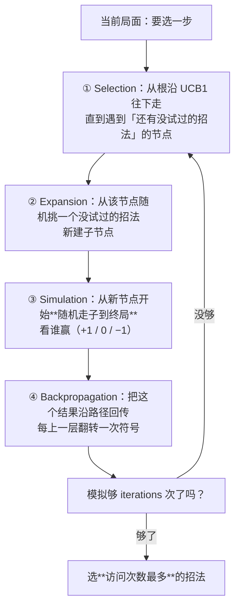
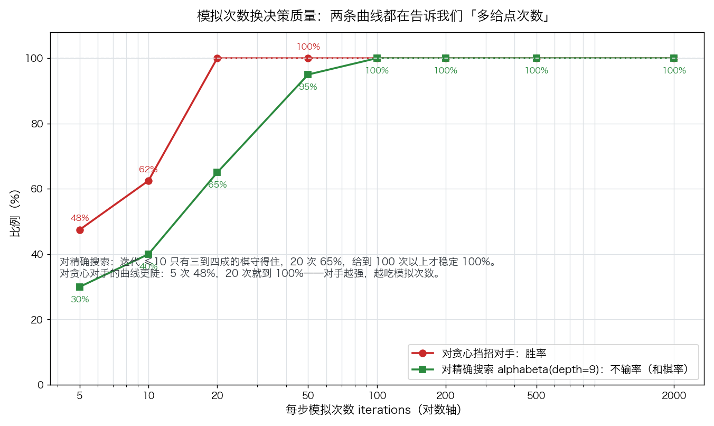
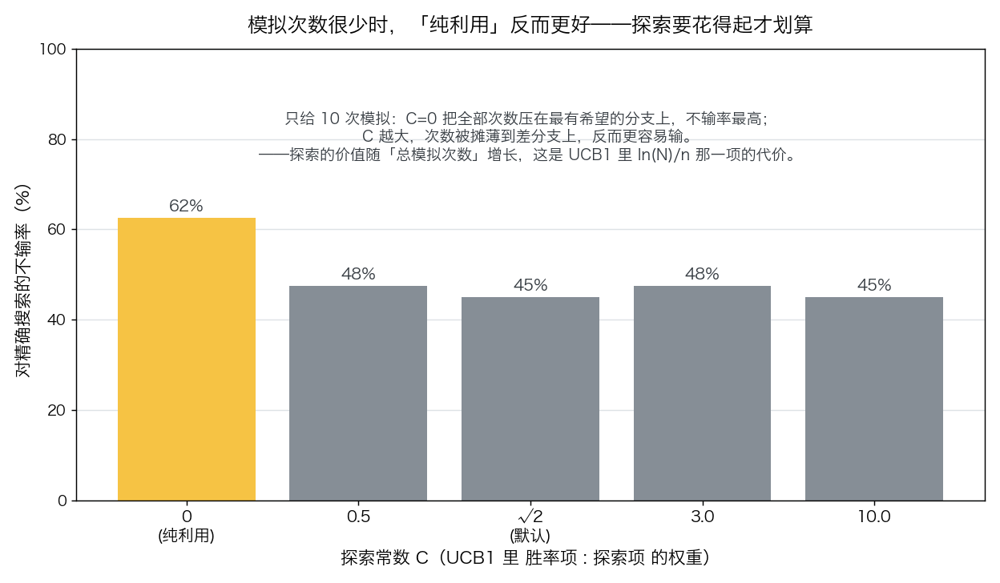

# 蒙特卡洛树搜索 MCTS

> 状态：✅ 已完成（2026-10-09）
> 对应文档章节：`../../docs/人工智能代表算法演进路线.md` 第 2.2.1 章
> 阅读路线：零基础读者读「基础篇」（生活类比 → 手算 → 白话证明 → 自测）；要看推导、实现与复现实验读「进阶篇」

搜索求解器（搜索族）：直接调 [impl.py](impl.py) 的 `MCTS(get_moves, apply, is_terminal, winner).search(state, iterations) -> action`——把棋类规则注入进来，用**随机模拟**代替穷举；对照是 [baseline.py](baseline.py) 的随机走子与"贪心挡招"策略。**没有 `fit` / `predict`**（无参数可训练，也没有标签 y）。各文件的具体接口见下面「目录形态」节。

# 基础篇 · 先搞懂它

## 1. 一句话讲清 MCTS 在干嘛

井字棋还能靠"把所有可能都算一遍"来下，围棋就完全不行了——分支太多，穷举到天荒地老。MCTS 换了条路：

> **不确定哪步好，就每步都随便试很多次（随机下到底），谁赢的次数多就信谁。**

它不需要"这个局面值多少分"这样的评估函数，只需要三件事：怎么走、怎么算赢、以及**允许它模拟很多次**。

## 2. 三个要分清的东西

| 概念 | 含义 | 关键性质 |
|---|---|---|
| **模拟次数 `iterations`** | 每走一步前，从当前局面随机试下多少次 | 唯一的质量旋钮：越多越准，也越慢 |
| **访问次数 `visits`** | 某个招法被"认真考虑"过多少次 | 选招法看它，不看胜率（见第 3 节） |
| **胜率 `value / visits`** | 从这一步出发，模拟里赢的比例 | UCB1 的"利用"项 |

## 3. 算法主循环：四个阶段反复转

**为什么按访问次数选、不按胜率选**：某个招法可能只被试过 1 次就赢了，胜率 100%——那是运气。
访问次数多说明"它被反复比较过仍然站得住"，才是可信的那一步。

## 4. 亲手算一个小例子

局面：井字棋空棋盘，轮到 X。只给 MCTS **4 次**模拟（真实实现里会给几百到几千次），假设随机数之神这样安排：

| 模拟 | 做了什么 | 结果 | 根上各招法的记录 |
|---|---|---|---|
| 1 | 试中心(4) → 随机下完 | X 赢 | 4：1 次，胜 +1 |
| 2 | 试角(0) → 随机下完 | 平 | 4：1 次；0：1 次，胜 0 |
| 3 | 试中心(4) → 随机下完 | 平 | 4：2 次，累计 +1；0：1 次 |
| 4 | 试角(8) → 随机下完 | X 输 | 4：2 次，+1；0：1 次，0；8：1 次，−1 |

4 次模拟结束后：**中心访问 2 次（最多）→ 选中心**。

三个值得停下来看的细节：

1. **中心只赢了一次、另一次是平**，但它的访问次数最多，所以被选中——MCTS 信"被反复试过的"，不信"胜率 100%"。
2. **第 1 次模拟之后，中心就成了"有希望"的分支**，后续模拟更容易被分到它头上（UCB1 的"利用"项），所以访问次数会自然向它集中。
3. **一次模拟的结果噪声极大**（随机走子），所以少给几次模拟会选出很差的招法——这正是「实验结果」里迭代 ≤10 时对精确搜索只有三四成守得住的原因。

## 5. 为什么"随机试"也能选出好招（白话版）

关键在**大数定律 + 有选择地分配模拟**：

- 若某个招法真的更好，那么从它出发随机下到底，赢的比例就会更高——试得越多，这个比例越接近真实。
- 于是问题变成"怎么把有限的模拟次数分给各个招法"。UCB1 的回答是：**没试过的先试（探索）；试过的按胜率排（利用）**，并且在两者之间按 `√(ln N / n)` 折中——试得少的招法被"补贴"一个探索奖励，避免早期运气差的招法被永远埋没。

这就是为什么 MCTS 不需要评估函数也能工作：**它用"模拟结果的平均"代替了"人为估的局面分"**，代价是需要很多次模拟。

## 6. 常见误区

- **❌ "模拟越多一定越好"** —— 大方向对，但有边界：模拟次数足够之后收益递减；而且**探索常数 C 与模拟次数要匹配**（见实验三：只给 10 次模拟时，纯利用 C=0 反而最好）。
- **❌ "按胜率最高的招法选"** —— 访问 1 次全胜的招法胜率是 100%，但它不可信。MCTS 标准做法是按**访问次数**选。
- **❌ "MCTS 不需要理解棋"** —— 它仍需要：合法的走子生成、终局判定、以及"谁赢了"的判定。规则写错，模拟越多错得越离谱。
- **❌ "MCTS 一定比 minimax 强"** —— 井字棋这种小游戏，精确搜索用几百个节点就能算清，MCTS 要几百次模拟才追上（见实验四）。

## 7. 自己动手：三个小实验

1. **改模拟次数**：把 `iterations` 从 10 调到 2000，看对精确搜索的和棋率怎么变（实验四已给曲线）。
2. **改探索常数 C**：`exploration=0`（纯利用）与 `exploration=10`（狂探索）对比，体会 UCB1 的权衡。
3. **改对手**：把 `demo.play_vs_policy` 的对手换成纯随机，看曲线怎么变得"没区分度"——对手太弱时，MCTS 迭代 10 次就能赢。

## 8. 掌握清单：五级能力与自测

| 级别 | 能力 | 本实验的检验方式 | 在哪做 |
|---|---|---|---|
| 1 说清 | 用自己的话讲规则 | 说出四阶段各做什么、为什么按访问次数选招 | 本节第 3、4 条 |
| 2 走通 | 纸上手算 | 用 4 次模拟手算一个局面，写出各招法的访问次数与结论 | 本节第 4 条 |
| 3 判断 | 说清正确性条件 | 解释 UCB1 两项各自的作用，并说出 C 太大/太小的后果 | 本节第 5 条 + 实验三 |
| 4 实现 | 手写并与对照比对 | 跑通 `demo.py`，解释三条曲线差异的来源 | 进阶篇「实验结果」 |
| 5 迁移 | 用到新问题 | 同一盘棋上与**另一种范式**对打：MCTS vs Alpha-Beta 的胜率与成本比 | [project/](project/README.md) ✅（练习第 5 题另有「换 rollout 重扫 C」的加练） |

# 进阶篇 · 给复现与审查者

## 目录形态（本算法的"类型"）

| 文件 | 角色 | 接口 |
|---|---|---|
| [impl.py](impl.py) | 手写 MCTS（UCB1 + 随机 rollout） | `MCTS(get_moves, apply, is_terminal, winner, rng, exploration)`；`search(state, iterations, root_player) -> action` |
| [baseline.py](baseline.py) | 两个对照策略 | `random_move(...)`（纯随机）、`greedy_move(...)`（能赢就赢 / 能挡就挡） |
| [demo.py](demo.py) | 井字棋 + 四组实验 | `TicTacToe`、`play_vs_policy`、四个 `experiment_*` |
| [test_impl.py](test_impl.py) | 性质测试（含回传符号与独立参考） | `python3 -m pytest test_impl.py -q` |
| [make_teaching_assets.py](make_teaching_assets.py) | 素材生成 + 与 demo 对账 | `python3 make_teaching_assets.py` → `images/01-收敛曲线.png`、`images/02-探索常数.png` |
| [exercises/](exercises/README.md) | 练习 5 题（分级、题解分离） | 参考解 `sol-01`…`sol-05`；`sol-03` / `sol-04` 可运行 |
| [project/](project/README.md) | 迁移项目：MCTS vs Alpha-Beta 同盘对打 | `python3 project/mcts_vs_alphabeta.py`（复用 minimax 项目的棋类与两个搜索器） |

> 本目录没有单独的 `framework.py`：对照就是 `baseline.py` 里的两个策略（搜索族的惯例）。

## 1. 设计原理

minimax（见 `../minimax-alphabeta/`）要求**能评估局面**，并且在深度受限时必须有人写出好的评估函数。MCTS 把这两个依赖都换掉了：

| | minimax / Alpha-Beta | MCTS |
|---|---|---|
| 需要什么 | 走子生成 + **局面评估函数** | 走子生成 + 终局判定 + **模拟次数** |
| 时间怎么花 | 沿着最有希望的路径往下算 | 把模拟次数**按 UCB1 分配**到各分支 |
| 什么时候强 | 分支可控、评估函数好写（棋类、规划） | 分支爆炸、评估难写（围棋、通用博弈） |
| 什么时候弱 | 树太大就算不动 | 需要大量模拟；单次决策的方差大 |

一句话：**minimax 用"人的知识"换搜索量，MCTS 用"机器的模拟量"换人的知识。**

## 2. 数学推导

记某个节点（对应一步棋）被访问 $n$ 次、累计收益 $w$，其父节点被访问 $N$ 次。UCB1 选子节点：

$$
\text{UCB}(n) = \underbrace{\frac{w}{n}}_{\text{利用：试出来的胜率}} + \underbrace{C\sqrt{\frac{\ln N}{n}}}_{\text{探索：试得少的补偿}}
$$

**探索项为什么长这样**（多臂老虎机的 UCB1）：设某个臂的真实均值是 $\mu$，用 $n$ 次样本均值 $\hat\mu$ 估计它，Hoeffding 不等式给出

$$
P\big(\mu > \hat\mu + \epsilon\big) \le e^{-2n\epsilon^2}
$$

要让这个"高估"的概率降到 $N^{-4}$ 量级（对所有臂做联合界），解得 $\epsilon = \sqrt{2\ln N / n}$。
于是"$\hat\mu + \epsilon$ 最大"的臂就是**真实均值最可能最高的那个臂**——这就是 UCB1 的
`胜率 + C√(ln N / n)`，其中 $C$ 吸收了常数（默认取 $\sqrt2$）。

两项的作用互为镜像：

- $n$ 小 ⇒ 探索项大 ⇒ **没被试够的分支优先**（否则早期运气差的分支永远翻不了身）；
- $n$ 大 ⇒ 探索项小 ⇒ **让位于胜率**（样本已经够多，该按成绩说话了）。

**但注意 $N$ 出现在分子**：父节点累计访问 $N$ 越大，所有子节点的探索奖励一起变大；
这在"总次数 $\lg N$ 量级就够分辨"时有意义，也解释了实验三的反直觉结果——
**总模拟次数只有 10 时，$\ln N$ 很小甚至为 0（$N=1$ 时 $\ln 1 = 0$），探索项的补贴根本不够看，
纯利用反而把次数用在了最该用的地方。**

**回传的符号约定**（实现里最容易写反的一处）：每个节点只记一个量 `value`，含义是
"**走出这一步的那一方**从这一步出发的收益"（赢 +1 / 输 −1 / 平 0）。
于是节点自己的 `value / visits` 直接就是"轮到它的父方时选这步的平均收益"，
选择阶段**不需要翻符号**；回传时每上一层翻转一次（父节点的走子方是对手）。

## 3. 手写实现要点

对应 `impl.py`，纯 Python（无 numpy）——瓶颈在模拟次数，不在数值计算：

- **节点只存必要字段**：`state / parent / action / mover / untried / children / visits / value`。
  `untried` 与 `children` 分开是有意为之：前者是"还没试过的招法"，后者是"试过后建出的子节点"，
  Expansion 从前者取、Selection 从后者走。
- **Expansion 随机挑未试招法**（而不是按顺序挑）：避免"总是先展开第 0 个招法"的系统偏置；
  随机源用注入的 `rng`，固定种子即可复现。
- **Selection 用 `while` 一路走到底**，只在"还有未试招法"或"终局"处停——不要每个节点只走一层。
- **rollout 用同一个 `rng`**：这样"固定种子 ⇒ 结果可复现"，测试才能断言具体招法。
- **`exploration=0` 要能跑**：`ln(1) = 0` 会让探索项恒为 0，此时不能出现 `log(0)` 或除零
  （`_best_child` 里对 `visits <= 1` 做了保护）。
- **按访问次数选招法**（`max(root.children, key=visits)`），不是按胜率。
- **`root_player` 必须由调用方告知**：对弈接口里没有 `current_player()`，而回传的符号依赖
  "根局面轮到谁走"。这里不做猜（不靠 `apply` 链长度推），显式传参最不容易错。

## 4. 基线对照

搜索族的对照是**基线算法**，本实验用了两个层次：

| 基线 | 强度 | 回答什么问题 |
|---|---|---|
| `random_move` 纯随机 | 最弱 | MCTS **有没有效**（迭代很少就该赢它） |
| `greedy_move` 能赢就赢 / 能挡就挡 | 中等 | 迭代次数的**边际收益**（弱对手会让曲线顶到 100% 而看不出差别） |
| minimax 目录的 `alphabeta(depth=9)` | **精确** | MCTS 要多少模拟才**追平最优决策**（井字棋必然和棋 ⇒ 和棋率就是决策质量） |

## 5. 实验结果

**环境**：Python 3.13.9（系统 `python3`），只用标准库；本目录内执行 `python3 demo.py`。

### 实验一 · 二：对两个基线，迭代次数 → 胜率（MCTS 固定执先手，各 50 局）

| iterations | 对纯随机 胜 / 平 / 负 | 胜率 | 对贪心挡招 胜 / 平 / 负 | 胜率 |
|---|---|---|---|---|
| 10 | 45 / 2 / 3 | 90% | 30 / 0 / 20 | **60%** |
| 50 | 49 / 1 / 0 | 98% | 50 / 0 / 0 | 100% |
| 100 | 49 / 1 / 0 | 98% | 50 / 0 / 0 | 100% |
| 500 | 49 / 1 / 0 | 98% | 50 / 0 / 0 | 100% |
| 1000 | 49 / 1 / 0 | 98% | 50 / 0 / 0 | 100% |
| 2000 | 50 / 0 / 0 | 100% | 50 / 0 / 0 | 100% |

**结论**：对**纯随机**，哪怕只模拟 10 次也有 90% 胜率——这条曲线证明"MCTS 有效"，但**证明不了"次数有用"**（50 次以后就顶到 98–100%）。
换成**贪心挡招**对手后才有区分度：10 次只有 60%，50 次才到 100%。**对手越强，模拟次数越吃紧。**

### 实验三：探索常数 C 的影响（对精确搜索，`iterations=10`，各 40 局）

| C | 和棋 | 负 | 不输率 |
|---|---|---|---|
| **0.00（纯利用）** | **25** | 15 | **62%** |
| 0.50 | 19 | 21 | 48% |
| 1.41（默认 √2） | 18 | 22 | 45% |
| 3.00 | 19 | 21 | 48% |
| 10.00 | 18 | 22 | 45% |

**这是本实验最反直觉的一条**：模拟次数只有 10 时，**不探索（C=0）反而最好**。
原因在 UCB1 的探索项 $\sqrt{\ln N / n}$：$N$ 是父节点总访问次数，只有 10 次时 $\ln N$ 很小，
探索补贴**根本不够看**，却把宝贵的模拟摊到了差分支上。

> **这条结论依赖"总模拟次数"**：次数给足（实验四里 100 次以上）时，默认 C=√2 也能打满。
> 所以正确的读法是：**"探索"不是免费的，它要花得起才划算**——这也解释了真实引擎里
> 为什么常用更激进的利用策略（如 PUCT、先验概率）而不是裸 UCB1。

### 实验四：与精确搜索对打的收敛曲线（各 20 局，MCTS 执先手）

| iterations | 5 | 10 | 20 | 50 | 100 | 200 | 500 | 2000 |
|---|---|---|---|---|---|---|---|---|
| 对精确搜索不输率 | 30% | 40% | 65% | 95% | 100% | 100% | 100% | **100%** |

**结论**：井字棋在双方最优下**必然和棋**，所以"不输率 = 和棋率"就是决策质量的直接度量。
迭代 5–10 次时只有三到四成的棋守得住，**给到 100 次以上就稳定打平精确搜索**——
这就是"模拟次数换决策质量"的量化结果。迭代 2000 次时 20 局全部和棋（测试里也断言了这一点）。

### 耗时

同等对局数下，模拟次数与耗时近似线性（实验一/二里 10 → 2000 次对应 0.0 → 3.0 秒）。
与实验四对照可以看出 MCTS 的代价：**对精确搜索 20 局（每步 2000 次模拟）耗时 1.7 秒，
而 minimax 算完整棵井字棋树只要 0.03 秒**（见 `../minimax-alphabeta/` 实验一 15,021 个节点 / 28 ms）。
**在搜索树能算清的问题上，精确搜索又快又准；MCTS 的价值在树算不清的时候。**

**验证声明（已验证）**：输入为 3×3 井字棋，MCTS 固定执先手；对手分别为纯随机、贪心挡招、
以及 minimax 目录的 `alphabeta(depth=9)`；全部固定随机种子（每局用不同子种子）。
2026-10-09 实跑（Python 3.13.9，系统 `python3`）：`python3 demo.py` 四组实验数字见上表；
`python3 -m pytest test_impl.py -q` → **12 passed**（含回传符号的手工小树验证、
必胜/必挡、对随机 20 局不输、对精确搜索 2000 次全和棋、C=0 边界）；
`python3 make_teaching_assets.py` 对账通过并产出两张图；`exercises/` 两个可运行参考解实跑通过——`sol-03`（回传符号 bug：正确实现 39 平 1 负、bug 实现 4 平 36 负）、`sol-04`（PUCT vs UCB1 三档合计不输率 88% vs 83%）；`project/mcts_vs_alphabeta.py` 三组实验通过——4×4 同预算 MCTS 6:2 胜 depth=4 的 AB，但同强度下 AB 快 4 倍；5×5 四连上 MCTS 要到 1000 次模拟才追平（50 次时 2:4 落败）。

**可视化结论**：`images/01-收敛曲线.png`（对数横轴上两条曲线：对贪心对手 5→20 次就从 48% 到 100%，
对精确搜索要到 100 次以上才打满）与 `images/02-探索常数.png`（C=0 在不给次数时最高）共同说明：
**MCTS 的表现由"模拟次数 × 次数怎么分配"共同决定，两者不可分开谈。**

## 6. 局限与延伸

- **什么时候该用 AB 而不是 MCTS**：见 [project/](project/README.md) 的实测——树能算动时（井字棋、4×4/5×5 四连）AB 同强度下快一个量级，且 MCTS 存在「给不够模拟次数就不如浅层精确搜索」的门槛；树算不动时（围棋、6×7 四连）MCTS 才是唯一选择。
- **单次决策方差大**：MCTS 靠采样，同一局面不同随机种子可能给出不同招法（本实验固定种子才可复现）。
  工程上会用"确定性 tie-break + 树复用（把上一手的子树接过来接着用）"来稳住。
- **裸 UCB1 不是最强的选择规则**：实验三已经暴露了它的问题（探索项与总次数强耦合）。
  现代做法是 **PUCT**（AlphaZero：用先验概率 $P(s,a)$ 替代均匀探索）与 **RAVE / AMAF**（用兄弟节点的统计加速）。
- **先验很弱就能改善**：练习第 4 题用「走完后即时威胁数」这种最弱的先验做了 PUCT，10 次模拟的不输率就从 52% 提到 68% —— 说明瓶颈在「每次模拟值多少」，不只是「模拟多少次」。
- **只处理完全信息**：本实验假设"对手的牌也看得见"。一旦对手有私有信息
  （扑克、拍卖、安全博弈），MCTS 的"一个状态一个值"就不成立了——
  **同一个局面在我眼里可能是两种世界**，需要按**信息集**学习 → [../cfr/](../cfr/)。
- **没有先验知识 / 没有策略网络**：本实现靠均匀随机 rollout；AlphaZero 用神经网络同时给出
  先验概率与局面估值，**在同样的模拟次数下强得多**（这是"用学习换模拟"）。
- **没有并行**：MCTS 天然适合并行（叶子并行 / 树并行），本实现是单线程。
- **没有时间预算控制**：本实现按固定次数停；工程上按"算到时间上限"停，并把上一层的树复用过来。
- **下一步实验**：MCTS 是"用模拟换知识"的极端；再往前一步就是**用学习换模拟**——
  神经网络 + MCTS 的路线（AlphaZero 系）。本实验之后的下一步见 [统计机器学习](../../p02-statistical-ml/)（监督估计器族）。
