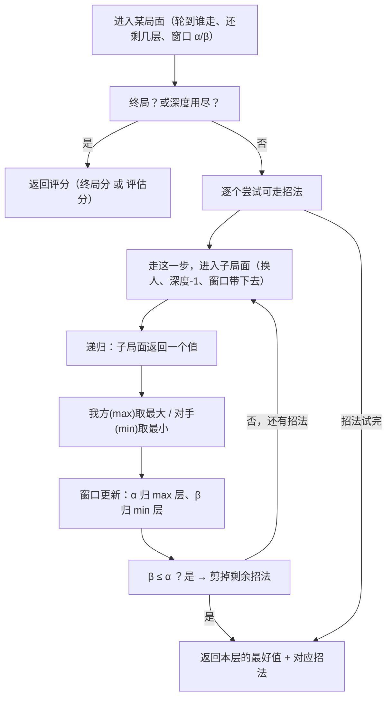
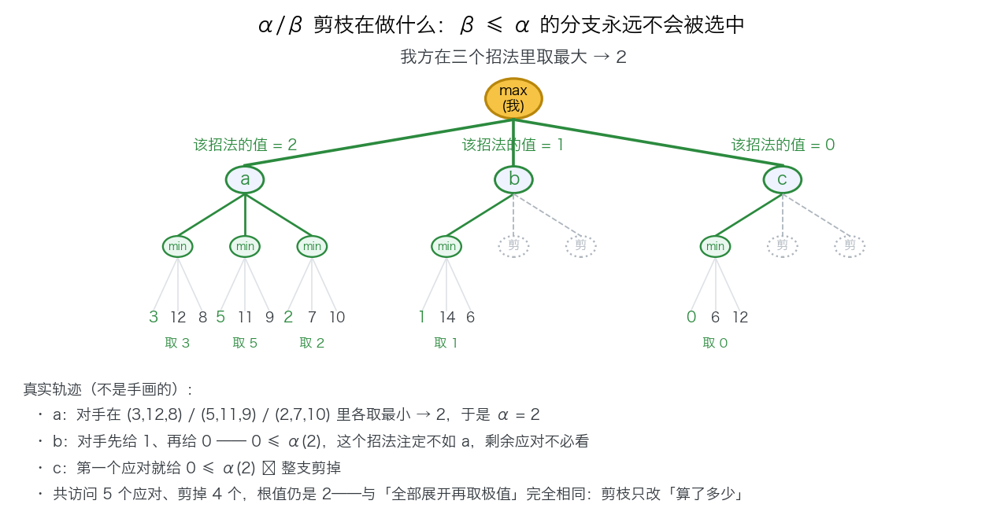
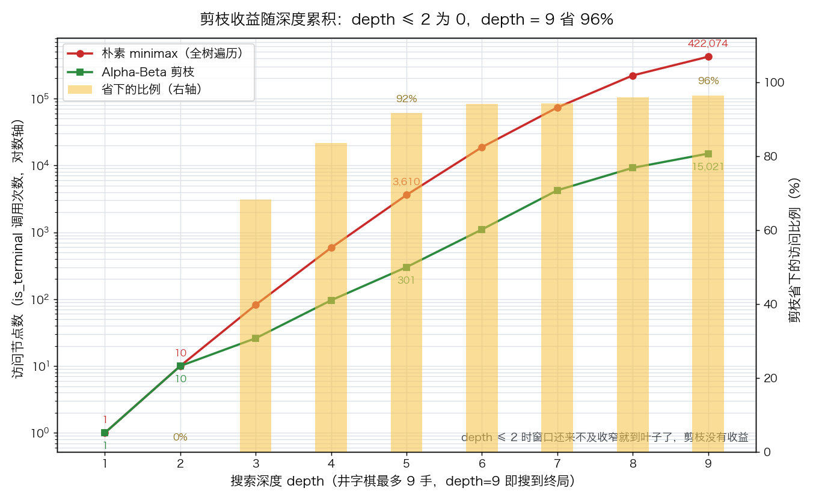

# Minimax 与 Alpha-Beta 剪枝

> 状态：✅ 已完成（2026-10-09）
> 对应文档章节：`../../docs/人工智能代表算法演进路线.md` 第 2.2.1 章
> 阅读路线：零基础读者读「基础篇」（生活类比 → 手算 → 白话证明 → 自测）；要看推导、实现与复现实验读「进阶篇」

搜索求解器（搜索族）：[impl.py](impl.py) 里是两个入口 `best_move(...) -> (move, score)`（默认走剪枝版）与 `minimax(...)` / `alphabeta(...)`——吃局面与规则函数，吐"走哪一步 + 该步的分数"。对照不另开文件：就在 impl 内部比"剪枝 vs 不剪枝"。**没有 `fit` / `predict`**（无参数可训练，也没有标签 y）。各文件的接口见下面「目录形态」节。

# 基础篇 · 先搞懂它

## 1. 一句话讲清它在干嘛

下棋时你没法"试遍所有可能"——但你可以**假设双方都下得最好**，然后倒推："如果对手每一步都挑对他最有利的，我这步下去最终会输还是赢？"

Minimax 就是这个倒推：**我走的时候挑让我分数最高的（max），对手走的时候假设他挑让我分数最低的（min）**。Alpha-Beta 剪枝则是在这个倒推里**跳过那些已经不可能影响结论的分支**。

## 2. 三个要分清的东西

| 概念 | 含义 | 关键性质 |
|---|---|---|
| **局面评分** | 终局时：赢 +10 / 输 −10 / 和棋 0 | 不是"猜的"，是确定的 |
| **深度 `depth`** | 还能往下看几层 | 井字棋最多 9 步，`depth=9` 就能搜到终局 |
| **窗口 `(α, β)`** | 当前分支"至少能拿多少 / 对手最多忍到多少" | 只有剪枝版有；它**不改变结论**，只减少计算 |

`min` / `max` 是**轮流的**：井字棋里我（X）走 max 层，对手（O）走 min 层，一层隔一层。

## 3. 算法主循环：递归地取极值

两版是**同一棵树的两种走法**：

```text
minimax(局面, 深度, 该谁走):
    若 深度=0 或 已终局 → 返回 评分
    对每个可走招法:
        子评分 = minimax(走完之后的局面, 深度-1, 换人)
    我方层取最大、对手层取最小 → 返回这个极值

alphabeta(局面, 深度, α, β, 该谁走):
    同上，但把"已经拿到的最好值"记进 α / β
    一旦 β ≤ α → 剩下的招法不可能改变祖先的选择 → 直接跳过
```

三个出口：**到达终局**（返回真实胜负）· **深度耗尽**（返回局面评估）· **窗口收窄到 `β ≤ α`**（剪掉剩余分支）。



这张图对应 `impl.py` 的两个函数：`minimax` 是「没有窗口」的那一支（去掉 WIN / CUT 两步），
`alphabeta` 是完整版。三个出口：**到达终局**（返回真实胜负）· **深度耗尽**（返回局面评估）·
**窗口收窄到 `β ≤ α`**（剪掉剩余分支）。

## 4. 亲手算一个小例子

井字棋，X 先手，假设对手 O 会挑对他最好的应对。先看一个"一眼能看出来"的局面：

```text
X X .        X 在 (0,0)、(0,1) 已连两子
. O .        轮到 X 走
O . .        → 走 (0,2) 立刻三连，赢
```

这个局面不用搜也知道该走 (0,2)。真正需要搜索的是**还没分出胜负的局面**——比如空棋盘：

| 步骤 | 要回答的问题 |
|---|---|
| 1 | 我走中心，最好的结果是？ |
| 2 | 我走角，最好的结果是？ |
| 3 | 每个招法都问一遍，取其中最大的那个 |
| 4 | 而每问一次，都要再假设对手也这样挑最好的应对（递归） |

**手算练习**：拿一张纸，从"X X . / . O . / O . ."开始，按 `minimax` 的规则把整棵树画出来，标出每个叶子是 +10 / −10 / 0，再一层层往回取 max/min。做完你会得到和电脑一样的结论。

## 5. 为什么剪枝不影响结论（白话版）

关键在于 `α` 和 `β` 的含义：

- **`α` = 我在祖先层已经拿到的最大分数**。如果对手在某个分支里能让我拿得比 `α` 更差，他一定会那么走——那我根本不会走到这个分支。
- **`β` = 对手在祖先层已经能保证的最好结果**。如果我在某个分支能拿到比 `β` 更好，对手不会让我走到这里。

于是当 **`β ≤ α`** 时，这个分支无论后面怎么走都**不可能成为双方的选择**——它只影响"算多久"，不影响"选哪个"。这就是为什么剪枝版和朴素版必须给出**完全相同的招法和分数**（本目录的测试逐点断言这件事）。



图里每一步都可以核对：a 分支让 `α = 2`；b 分支里对手先给 1、再给 0（`0 ≤ α`），说明 b 注定不如 a，剩下的应对不必看；c 分支第一个应对就给 0，整支剪掉。**根值仍是 2**，与"全部展开再取极值"完全相同。

## 6. 常见误区

- **❌ "剪枝是近似算法"** —— 不是。剪掉的都是**确定不会影响结论**的分支，结果与朴素版完全一致。
- **❌ "评分函数只用来判终局就够了"** —— 在井字棋（能搜到终局）确实够；但棋盘一大就必须"深度限制 + 评估函数"，此时评估函数的**质量**决定棋力。
- **❌ "剪枝越多说明算法越好"** —— 剪枝量取决于**招法遍历顺序**（见「实验结果」实验三：同一局面不同顺序差 32%）。所以真实引擎里一半的工程量花在"排序"上。
- **❌ "可以就地修改棋盘"** —— 搜索会同时探索几百个分支，`apply` 必须返回**新状态**，否则兄弟分支互相污染。

## 7. 自己动手：三个小实验

1. **改深度**：把 `depth` 从 9 降到 3、5、7，看节点数怎么涨（实验二已经给了曲线）。
2. **换顺序**：把 `get_moves` 返回的招法顺序倒过来，看剪枝量怎么变（实验三）。
3. **换棋类**：把 `demo.py` 里的 `TicTacToe` 换成四子棋（注意评估函数要重写）。

## 8. 掌握清单：五级能力与自测

| 级别 | 能力 | 本实验的检验方式 | 在哪做 |
|---|---|---|---|
| 1 说清 | 用自己的话讲规则 | 说清 min/max 层怎么轮换、α/β 各是谁的界限 | 见本节第 2、5 条 |
| 2 走通 | 纸上手算 | 手画一棵三层博弈树，标出每个叶子的分并回溯极值 | 本节第 4 条练习 |
| 3 判断 | 说清正确性条件 | 解释"为什么 β ≤ α 可以剪"，并举一个被剪掉的例子 | 本节第 5 条 |
| 4 实现 | 手写并与对照比对 | 把两版都跑一遍，解释节点数与耗时差异的来源 | 进阶篇「实验结果」 |
| 5 迁移 | 用到新问题 | 四子连珠上做**深度限制 + 启发式评估**，并自对弈量化「评估质量 vs 深度」 | [project/](project/README.md) ✅ |

# 进阶篇 · 给复现与审查者

## 目录形态（本算法的"类型"）

| 文件 | 角色 | 接口 |
|---|---|---|
| [impl.py](impl.py) | 手写两版：朴素 minimax + Alpha-Beta | `minimax(...) -> (move, score)`、`alphabeta(..., alpha, beta, ...) -> (move, score)`、`best_move(...)`（默认走剪枝版） |
| [demo.py](demo.py) | 井字棋规则 + 三个实验 | `TicTacToe`（`get_moves` / `apply` / `evaluate` / `is_terminal`）、`run_with_counter`、`bench` |
| [test_impl.py](test_impl.py) | 性质测试（含独立参考对拍） | `python3 -m pytest test_impl.py -q` |
| [make_teaching_assets.py](make_teaching_assets.py) | 教学素材生成 + 与 demo 数字对账 | `python3 make_teaching_assets.py` → `images/01-剪枝示意.png`、`images/02-剪枝随深度.png` |
| [project/](project/README.md) | 迁移项目：四子连珠 + 深度限制 + 自对弈评测 | `python3 project/connect4_search.py` |

> 本目录没有 `baseline.py`：对照就是 impl 里的朴素 minimax（剪枝版 vs 不剪枝版）。

## 1. 设计原理

A\* 解决的是**单人**最优搜索；一旦对手也在做最优决策，问题就变成**双人零和博弈**：我的收益是对方损失的相反数，因此不需要两个评分函数——**一个评分 + min/max 轮流取极值**就够了。

两个版本的分工：

- `minimax`：完整遍历整棵博弈树，是**正确性的基准**（也就是"定义"）。
- `alphabeta`：同结论、更少计算。剪枝的合法性来自"窗口"这一对上下界（见「数学推导」）。

本目录刻意让两版**不共用递归主体**（各自独立一份实现）：如果共用，就无法排除"两版一起错"的自证陷阱；独立实现 + 逐点对拍，才构成等价性的外部依据。此外 `test_impl.py` 另写了一份**不复用 impl 的朴素参考**，用于校验评分本身的正确性（同样的思路见 A\* 实验的 `bfs_shortest_cost`）。

## 2. 数学推导

记局面 $s$、轮到的一方 $p$、剩余深度 $d$；$V(s,d)$ 为该局面的博弈值，评分函数 $E(\cdot)$：

$$
V(s, d) =
\begin{cases}
E(s), & d = 0 \ \text{或}\ s\ \text{终局} \\[4pt]
\max_{m \in M(s)} V(\text{apply}(s,m),\, d-1), & p = \text{我方} \\[4pt]
\min_{m \in M(s)} V(\text{apply}(s,m),\, d-1), & p = \text{对手}
\end{cases}
$$

**Alpha-Beta 的正确性**（"剪掉的都是无关分支"）。设递归到局面 $s$ 时携带窗口 $(\alpha, \beta)$，含义是：

- **$\alpha$**：祖先中 **max 层已经能保证**的最好值——即"我至少有 $\alpha$"；
- **$\beta$**：祖先中 **min 层已经能保证**的最好值——即"对手最多给到 $\beta$"。

剪枝规则的推导（max 层）：

1. 逐个试招法，维护 $v = \max(\text{已试招法的值})$；
2. 每试完一个就更新 $\alpha \leftarrow \max(\alpha, v)$；
3. 若出现 $\beta \le \alpha$：说明**当前节点能拿到的值已经不小于祖先层里对手愿意给的**，祖先的 min 层必然不会选择走进这个分支，剩余招法的影响无法传播到根 ⇒ 可以停。

min 层对称（维护 $\beta \leftarrow \min(\beta, v)$，同样在 $\beta \le \alpha$ 时停）。

**推论（本实验的核心断言）**：剪枝只改变"访问了哪些节点"，不改变 $V(\text{根}, d)$，因此 `minimax` 与 `alphabeta` 返回的 `(move, score)` 必须**逐点相同**——这一点由 `test_impl.py` 在 7 个典型局面上断言，并在空棋盘上与**独立参考实现**对拍。

**效率的直觉**：完美顺序下 alpha-beta 只访问约 $O(b^{d/2})$ 个节点（$b$ 为分支因子、$d$ 为深度），而不是朴素版的 $O(b^d)$——**开平方**的量级差。这也解释了为什么"招法排序"在真实引擎里是核心工程（见「实验结果」实验三）。

## 3. 手写实现要点

对应 `impl.py` 与 `demo.py`：

- **两个版本各写一份递归体**：`alphabeta` 不是"给 `minimax` 加个开关"，而是独立实现——这样两版的一致才是真的验证。
- **`apply` 必须不可变**：`TicTacToe.apply` 返回新对象（`copy.copy` + 棋盘副本）。若就地改棋盘，兄弟分支会互相污染，结论不可信。
- **招法顺序固定**：`get_moves` 按格子编号升序返回，避免依赖集合的遍历顺序——**结果必须可复现**。
- **平手时保留先找到的招法**：用严格大于 / 小于比较（`>` / `<`），不写 `>=`，这样"选哪个"只由顺序决定，可复现。
- **评分只在终局有意义**：井字棋能搜到终局，所以 `evaluate()` 直接返回 ±10 / 0；一旦要限制深度，必须换成真正的启发式评估（本项目未做，见「局限与延伸」）。
- **一个"访问节点"的口径**：把 `is_terminal` 包成计数版——两版每次进入递归都先判终局，因此这个计数在朴素版与剪枝版之间**口径一致、可直接比较**。
- **默认入口走剪枝版**：`best_move()` 就是 `alphabeta` 的薄封装（真实工程里没人用朴素版）。

## 4. 基线对照

搜索族的对照是**基线算法**：本实验的对照对象就是"**不剪枝的朴素 minimax**"，因此不需要单独的 `baseline.py`——它就在 `impl.py` 里，两者共享同一套对弈接口。

| 对照维度 | 朴素 minimax | Alpha-Beta |
|---|---|---|
| 结论（招法 / 分数） | 基准 | **必须完全相同**（测试断言） |
| 访问节点数 | 全树 | 少得多（见实验一/二） |
| 遍历顺序敏感度 | 无关（反正全遍历） | **敏感**（见实验三） |
| 工程用途 | 正确性基准 / 教学 | 唯一会真正上线的版本 |

## 5. 实验结果

**环境**：Python 3.13.9（系统 `python3`）。实验本体（`demo.py` / `test_impl.py`）只用标准库；素材生成需要 matplotlib。复现：`python3 demo.py`（三张实验表）与 `python3 make_teaching_assets.py`（重生成 `images/`，脚本内与 `demo.bench` 逐档对账）。

### 实验一：空棋盘主对照（depth=9，搜到终局）

| 指标 | 朴素 minimax | Alpha-Beta | 结论 |
|---|---|---|---|
| 招法 `move` | 0 | 0 | **完全一致** |
| 评分 `score` | 0.0（和棋） | 0.0（和棋） | **完全一致** |
| 访问节点 | 422,074 | **15,021** | 少 **96.4%** |
| 耗时（5 次中位） | 797.8 ms | **28.2 ms** | 约 28 倍 |

耗时区间：朴素 [791.7–799.1] ms，剪枝 [28.1–28.5] ms（本机单次值，随环境波动 `[随环境/版本变化]`）。

### 实验二：剪枝收益随深度（同一空棋盘，depth = 1…9）

| depth | minimax 节点 | alphabeta 节点 | 省下 | 两版一致 |
|---|---|---|---|---|
| 1 | 1 | 1 | 0.0% | ✓ |
| 2 | 10 | 10 | 0.0% | ✓ |
| 3 | 82 | 26 | 68.3% | ✓ |
| 4 | 586 | 96 | 83.6% | ✓ |
| 5 | 3,610 | 301 | 91.7% | ✓ |
| 6 | 18,730 | 1,101 | 94.1% | ✓ |
| 7 | 73,450 | 4,244 | 94.2% | ✓ |
| 8 | 221,626 | 9,198 | 95.8% | ✓ |
| 9 | 422,074 | 15,021 | **96.4%** | ✓ |



两点观察：

1. **深度不够时剪枝没有收益**（depth ≤ 2 为 0%）：树太浅，窗口还没机会收窄就已经到叶子了。收益是随深度**累积**的。
2. **朴素版增长约 $b^d$ 量级，剪枝版明显更缓**：depth 从 5 到 9，朴素版涨 117 倍，剪枝版只涨 50 倍——这就是"开平方"量级的直观体现（井字棋分支因子小、终局早，所以还没到理论极限）。

### 实验三：招法顺序的影响（空棋盘，depth=9）

| 遍历顺序 | 招法 | 分数 | 主搜索访问 | 排序额外访问 |
|---|---|---|---|---|
| 朴素顺序（不排序） | 0 | 0.0 | 15,021 | 0 |
| 好招优先（浅层 depth=2 排序） | 0 | 0.0 | **10,150** | 165,525 |
| 坏招优先（反向） | 0 | 0.0 | 10,591 | 163,188 |

三个结论：

1. **顺序只改"算了多少"，不改"选中哪个"**：三种顺序的 `(move, score)` 完全相同——这是剪枝合法性的又一次验证。
2. **顺序确实能省**：最好与最差相差 4,871 个访问（相对最差省 32.4%）。
3. **但"浅层重算"的代价更大**：排序键是**每个节点都重算一遍浅层搜索**得来的（16 万次访问 vs 主搜索 1 万次）——**净亏**。真实引擎先用置换表 / 迭代加深把这些浅层结果**复用**掉，排序才真正划算。**这条比"顺序很重要"更值得记住**：优化的前提是复用，否则就是拿 10 倍的代价换 30% 的节省。

**验证声明（已验证）**：输入为 3×3 井字棋（空棋盘、X 先手、评分口径「赢 +10 / 输 −10 / 和 0」、`depth=9` 表示搜到终局）。

- **2026-10-09 首次完成**（Python 3.13.9 / matplotlib 3.10.6；`python3 demo.py` + `python3 -m pytest test_impl.py -q` + `python3 make_teaching_assets.py` + `python3 project/connect4_search.py` + `exercises/` 四个脚本）：
  - `demo.py` 三组实验：实验一 访问 422,074 vs 15,021、中位耗时 789 ms vs 27.9 ms、两版 `move=0`/`score=0.0` 一致；实验二 九档深度收益 0% → 96.4%；实验三 三种顺序结论一致、主搜索访问 15,021 / 10,150 / 10,591。
  - 测试 **18 passed**（含与**独立参考实现**对拍、剪枝不多访问节点、必胜/必堵局面、终局与 depth=0 边界）。
  - `make_teaching_assets.py` 对账通过（depth 1–9 计数与 `demo.bench` 逐档一致），产出 `images/01-剪枝示意.png`、`images/02-剪枝随深度.png`。
  - `project/connect4_search.py`：深度的代价 1→6 层 1 → 204,760 节点；评估质量（4×4 三连）坏/弱/好 = 0:6 / 0:6 / 3:3；深度效应（6×6 四连）深度 3 两战全败（**深度奇偶**：偶数深度看得见对手的下一个应对）。
  - `exercises/` 四个脚本实跑：`sol-02` 9→7 叶子；`sol-03` 错误写法结论未坏、剪枝全丢；`sol-04` 迭代加深累计 3,089 vs 单次 1,886、置换表预热后 1 次进入；`sol-05` 同深度镜像 18:6。
  - Mermaid 主循环图：语法用 mermaid 11 解析器实跑校验通过（`flowchart-v2`）；**成图未在本环境验证**（mermaid-cli 依赖 headless Chrome，本机渲染超时）。

**历史**：输入为 3×3 井字棋，X 先手，评分口径"赢 +10 / 输 −10 / 和 0"，`depth=9` 表示搜到终局（井字棋最多 9 手）。2026-10-09 实跑（Python 3.13.9，系统 `python3`，本目录内 `python3 demo.py`）：实验一 访问 422,074 vs 15,021、中位耗时 797.8 ms vs 28.2 ms、两版 `move=0`/`score=0.0` 一致；实验二 九档深度两版评分全部一致，省下比例 0% → 96.4%；实验三 三种顺序 `move`/`score` 全一致、主搜索访问 15,021 / 10,150 / 10,591。测试：`python3 -m pytest test_impl.py -q` → **18 passed**（含与独立参考实现对拍、剪枝不多访问节点、必胜/必堵局面、终局与 depth=0 边界）。

**可视化结论**：`images/01-剪枝示意.png`（三层小树：被剪的分支、根值的不变，全部取自真实轨迹，不是手画的示意图）与 `images/02-剪枝随深度.png`（两版访问节点数的对数曲线 + 省下比例的柱）共同说明一件事——**剪枝不动结论，只动计算量，而且收益随深度累积**。实验三的表则说明：顺序能进一步剪，但「重算浅层」的代价更大

## 6. 局限与延伸

- **评估函数**：本实验能搜到终局，所以 `evaluate()` 只判胜负；真实棋类必须"深度限制 + 启发式评估"。**这一条已由 [project/](project/README.md) 兑现**——那里做了 3 的幂连线评估，并实测出两件事：只看子力的评估等于没用（0:6），以及"深度奇偶"会暴露评估的威胁盲区（深度 3 反而输给深度 2）。
- **没有置换表（transposition table）**：同一局面会经不同顺序重复到达，本实现重复计算。实验三正暴露了这一点——补上置换表后，浅层排序的开销就能被复用掉。
- **没有迭代加深（iterative deepening）**：从 depth=1 逐步加深，可随时中断给出"当前最好招法"，也是天然的好排序来源。
- **没有杀手招法 / 历史启发**：工程上更便宜的排序手段，不需要额外搜索。
- **棋类固定为井字棋**：接口已按 `get_moves / apply / evaluate / is_terminal` 注入式设计，换四子棋只需重写这四个函数与评估。
- **下一步实验**：当博弈树大到无法全展开时（围棋），minimax 这条路走不通 → `../mcts/`（用采样替代穷举）。
