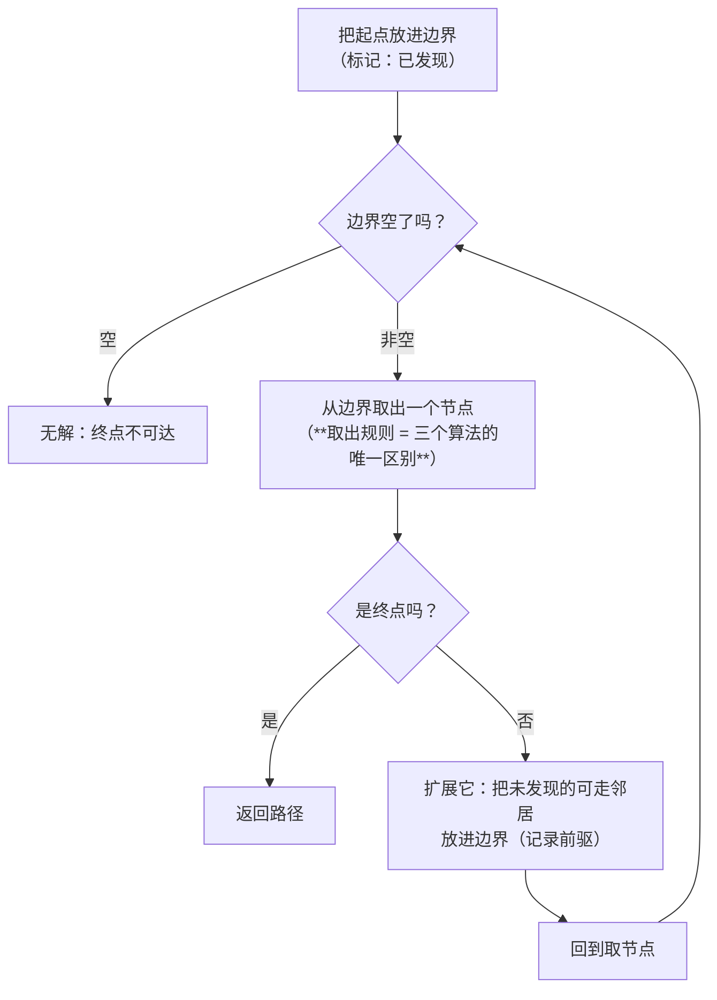
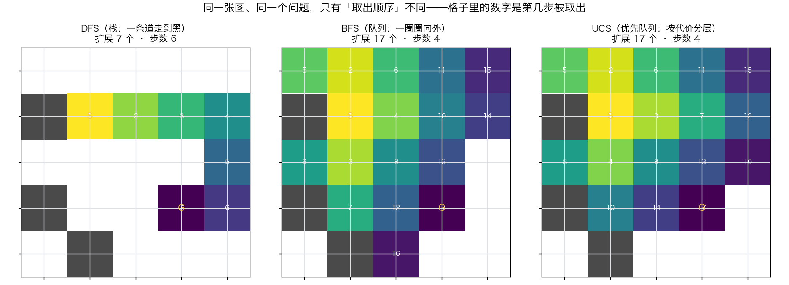
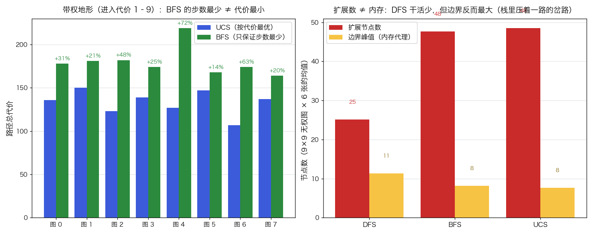

# 无信息搜索：DFS · BFS · UCS

> 状态：✅ 已完成（2026-10-09）
> 对应文档章节：`algorithms/docs/人工智能代表算法演进路线.md` 第 2.2.1 章
> 阅读路线：零基础读者读「基础篇」（生活类比 → 手算 → 白话证明 → 自测）；要看推导与复现实验读「进阶篇」

搜索求解器（搜索族）：直接调 [impl.py](impl.py) 的 `dfs(grid, start, goal) / bfs(...) / ucs(grid, start, goal, cost_of=None)`，三者都返回同一个 [SearchResult](impl.py)（`path / cost / expanded / peak_frontier`）；对照是 [baseline.py](baseline.py) 的 A\* 参考（`astar_reference(...)`）。**没有 `fit` / `predict`**（无参数可训练，也没有标签 y）。各文件的具体接口见下面「目录形态」节。

# 基础篇 · 先搞懂它

## 1. 一句话讲清这三个算法在干嘛

你在一个商场里找出口，不知道路。有三种找法：

- **DFS**：认死一个方向，走到撞墙再回头看有没有岔路——**一条道走到黑**
- **BFS**：以自己为中心，一圈一圈往外问"这圈有没有出口"——**水波式扩散**
- **UCS**：每到一个路口，看哪条岔路"到目前花的力气最小"就先去——**按代价分层扩散**

三个算法解决的是**同一个问题**：在一张图上从起点走到终点。它们甚至可以共用同一个骨架——
唯一的区别是**"下一个先看谁"**。

## 2. 三个要分清的东西

| 概念 | 含义 | 为什么重要 |
|---|---|---|
| **边界（frontier）** | 已发现、但还没去看的节点集合 | 三个算法的差别**只在这个集合用什么结构**：栈 / 队列 / 优先队列 |
| **扩展（expanded）** | 从边界里取出来"真去看"的节点数 | 工作量指标：扩得越少越省时间 |
| **边界峰值** | 边界规模的最大值 | **内存**指标：它决定这个算法能不能在真实规模上跑 |

> 注意"扩展数"和"内存"是**两件事**。后面会看到一个反直觉的结果：DFS 扩展的节点最少，
> 但它的边界峰值反而最大。

## 3. 主循环：三个算法共用一套骨架



**"取出规则"就是全部的差别**：

| 算法 | 边界用什么结构 | 取出规则 | 效果 |
|---|---|---|---|
| DFS | 栈（LIFO） | 最后放进去的先取 | 一条路插到底 |
| BFS | 队列（FIFO） | 最早放进去的先取 | 一圈圈向外 |
| UCS | 优先队列（按累计代价） | 当前累计代价最小的先取 | 按代价分层向外 |

**为什么只用换这个结构、算法性质就完全不同**？因为"先看谁"决定了：
**终点第一次被取出时，是不是已经找到了最好的路**。下一节手算一遍就能看清。

## 4. 亲手算一个小例子

5×5 小图（`S` = 起点 (1,1)，`G` = 终点 (3,3)，`#` = 障碍，`.` = 可走）：

```
. . . . .
# . . . .
. . . . .
# . . . .
. # . . .
```

**BFS 的取出过程**（队列：先放先取；放入顺序按 上/下/左/右）：

| 步骤 | 取出（去处理） | 新放进队列的邻居 | 队列（队首在左） |
|---|---|---|---|
| 1 | (1,1) = S | (0,1)、(2,1)、(1,2)（(1,0) 是障碍） | (0,1)、(2,1)、(1,2) |
| 2 | (0,1) | (0,0)、(0,2) | (2,1)、(1,2)、(0,0)、(0,2) |
| 3 | (2,1) | (3,1)、(2,0)、(2,2) | (1,2)、(0,0)、(0,2)、(3,1)、(2,0)、(2,2) |
| 4 | (1,2) | (1,3)（(0,2)、(2,2) 已在队列里） | (0,0)、(0,2)、(3,1)、(2,0)、(2,2)、(1,3) |
| … | … | … | … |
| 17 | (3,3) = G | — | 空 → 结束 |

**于是 BFS 给出的路径是**：(1,1) → (2,1) → (3,1) → (3,2) → (3,3)，**4 步**。

同一张图上换 DFS（栈：后放先取）来走：

| 步骤 | 取出 | 放进栈的邻居 | 栈（栈顶在右） |
|---|---|---|---|
| 1 | (1,1) = S | (0,1)、(2,1)、(1,2) | (0,1)、(2,1)、(1,2) |
| 2 | (1,2) ← 栈顶 | (1,3) | (0,1)、(2,1)、(1,3) |
| 3 | (1,3) | (1,4)、(2,3) | (0,1)、(2,1)、(1,4)、(2,3) |
| 4 | (2,3) | (3,3) = **G** | (0,1)、(2,1)、(1,4)、(3,3) |
| 5 | (3,3) = G | — | 结束 |

**DFS 只看了 5 个节点就撞上终点**，BFS 看了 17 个。但请注意两件事：

1. DFS 这条路**碰巧**也短（4 步），是运气——它**不保证**下次还这么短；
2. 因为是"后放先取"，DFS 会**先钻到底**，所以它有可能绕很远的路才到终点（极端情况差几十倍，
   进阶篇的实测里 DFS 走了 **82 步**，而 BFS 只要 **40 步**）。

> 这张 5×5 小图上的完整取出顺序（含 UCS）可以在 `images/01-扩展顺序.png` 里一眼看出形状差别。
> **UCS 在"每步代价都是 1"的图上与 BFS 完全等价**——它俩的顺序、扩展数、路径全都一样，
> 这也是"无处可优化"的最直观证据。它们的区别只在**带权**图上才暴露。

## 5. 为什么"先看谁"能决定对错（白话版）

关键只有一句话：**终点第一次被取出时，它是不是已经找到了最好的路？**

- **BFS**：队列保证"先放进去的先进来"。所有"走 k 步能到"的点必然比"走 k+1 步能到"的点先进队列，
  所以终点第一次被取出时，**不可能存在更短的路线还没被考虑**——因此 BFS 一定最短。
- **UCS**：同理，但把"步数"换成"累计代价"。堆保证"当前代价最小的点先出"，
  所以终点第一次被取出时，**不可能存在总代价更小的路线**——因此 UCS 一定最优。
  （前提：**单步代价非负**；有负权边时这个证明就塌了。）
- **DFS**：栈只保证"后放先取"，它跟"离终点还有多远"**毫无关系**。终点可能碰巧很早被取到，
  也可能被压在很后面——所以 DFS **只保证找得到（在有限图上），不保证最短**。

**UCS 与 BFS 的关系**：把每步代价都看成 1，UCS 的"按代价排队"就退化成"按层数排队"，
正是 BFS。**所以 BFS 是 UCS 的特例，UCS 是 BFS 的推广。**

## 6. 常见误区

- **❌ "DFS 代码短、跑得快，所以更好"** —— DFS 扩展节点常常最少（进阶篇实测平均 **143** 个，
  BFS 要 **267** 个），但它**不保证最优**：同一张图上它可能给出 82 步的路，而最优只要 40 步。
  **少干活 ≠ 干对活。**
- **❌ "BFS 一定比 DFS 好"** —— 在**无权**图上 BFS 最优，但它的边界要装下整整一层，
  内存随深度**指数增长**（进阶篇的 8 数码项目里，14 步深的局面 BFS 边界峰值 2,216，
  而迭代加深只要 15）。**BFS 的优点和缺点是同一件事的两面。**
- **❌ "DFS 不占内存"** —— 教科书说 DFS 空间复杂度 O(深度)，**实测却常常相反**：
  本实验测得 DFS 的边界峰值平均 **49**，比 BFS 的 **17** 还大。
  原因：入边界时判重之后，栈里会攒下一路的"岔路口"（兄弟节点），
  真跑起来并不比 BFS 省——**理论复杂度说的是增长趋势，不是具体常数**。
- **❌ "三个算法差在代码实现上"** —— 它们的骨架完全一样，**差别只有"边界用什么结构"**。
  实现里甚至连主循环都能共用，只换一行取节点的代码。
- **❌ "DFS 换个写法结果一样"** —— DFS 的结果**依赖邻居的尝试顺序**：进阶篇的实测里，
  同一张图、同一个算法，只是把"先看哪个方向"换一下，步数就在 **55 / 83 / 121** 之间跳。
  **凡是依赖 DFS 的算法（含迭代加深），都必须把这个不确定性交代清楚。**

## 7. 自己动手：三个小实验

1. **换地图大小**：把 `demo.make_grid(rows=9, cols=9)` 传进去，看三个算法的扩展数怎么变。
2. **造一条"长走廊"**：手写一张地图，让 DFS 必须绕一大圈才能到终点——体会"不保证最优"。
3. **把 BFS 的队列换成栈**：只改一行（`popleft()` → `pop()`），看它退化成 DFS 后结果怎么变。

## 8. 掌握清单：五级能力与自测

| 级别 | 能力 | 本实验的检验方式 | 在哪做 |
|---|---|---|---|
| 1 说清 | 用自己的话讲规则 | 说出三者"边界结构 + 取出规则"的差别，以及为什么只差这一处 | 基础篇「三个要分清的东西」「主循环」 |
| 2 走通 | 纸上手算 | 在 5×5 小图上手算 BFS 与 DFS 的取出顺序，写出各自的路径与步数 | 基础篇「手算示例」节 |
| 3 判断 | 说清正确性条件 | 解释"终点第一次被取出时是否已最优"这个判据，并说明 UCS 为什么要求代价非负 | 基础篇「为什么它能对」节 |
| 4 实现 | 手写并与对照比对 | 跑通 `demo.py`，解释三个算法的扩展数 / 内存尖峰差异来源；跑 UCS vs A* 一节 | [进阶篇「实验结果」](#5-实验结果) |
| 5 迁移 | 用到新问题 | 用迭代加深 + IDA\* 解 8 数码，量化"内存线性 + h 剪枝"的收益 | [project/](project/README.md) ✅ |

# 进阶篇 · 实验档案

## 目录形态（本算法的"类型"）

| 文件 | 角色 | 接口 |
|---|---|---|
| [impl.py](impl.py) | 三个算法的手写实现（共用一套骨架） | `dfs / bfs / ucs(grid, start, goal, [cost_of]) -> SearchResult` |
| [baseline.py](baseline.py) | 对照版：A\* 参考 | `astar_reference(grid01, start, goal, tie_break) -> AstarResult`、`to_astar_grid(grid)` |
| [demo.py](demo.py) | 同图对比入口 | `make_grid / make_terrain`、五个 `experiment_*` |
| [test_impl.py](test_impl.py) | 性质测试（含独立参考对拍） | `python3 -m pytest test_impl.py -q` |
| [make_teaching_assets.py](make_teaching_assets.py) | 素材生成 + 与 demo 对账 | `python3 make_teaching_assets.py` → `images/01-扩展顺序.png`、`images/02-代价与内存.png` |
| [project/](project/README.md) | 迁移项目：迭代加深 + IDA\* 解 8 数码 | `python3 project/eight_puzzle.py` |

> 本目录里 `baseline.py` 的角色是"**对照 A\***"——因为这个实验本身是 A\* 的基线。

## 1. 设计原理

**为什么要把三个算法放在一个实验里**：它们的骨架完全相同，差别只有一行（取节点的结构）。
拆成三个实验会让读者看不到"这条线是怎么演进的"——而这条线恰恰是：

```
DFS（能到就行） ──队列──▶ BFS（无权最优） ──代价──▶ UCS（带权最优） ──+h──▶ A*（有方向的最优）
```

- **DFS 解决的问题**：只要"走到目标"，不管路好坏（内存敏感、解质量不敏感的场景）
- **BFS 解决的问题**：无权图上的**最少步数**（社交网络的最短关系链、迷宫最少步数）
- **UCS 解决的问题**：带权图上的**最小总代价**（导航的"最短时间"、任何非均匀代价）

三者与 A\* 的关系：**A\* 只是把 UCS 的"按 g 排队"换成"按 g + h 排队"**。所以本实验是 A\* 的**前置**——
先看清"没有 h 时会怎样"，才能理解 h 值多少（见「基线对照」段的实测）。

## 2. 数学推导

### 2.1 三个算法是同一个算法

设 `priority(n)` 是取出节点 n 时用的排序键，三者只差这个函数：

| 算法 | `priority(n)` | 边界结构 |
|---|---|---|
| DFS | `−depth(n)`（越深越优先） | 栈 |
| BFS | `depth(n)`（越浅越优先） | 队列 |
| UCS | `g(n)`（累计代价） | 最小堆 |

于是"图搜索"的统一骨架是：

```
边界 ← {start}
while 边界非空:
    n ← 取出 priority 最小的节点          ← 唯一的分歧点
    if n == goal: return 路径
    for m in 邻居(n):
        if m 未发现: 记录前驱; 放入边界
```

DFS 用栈实现 `−depth` 的优先级；BFS 用 FIFO 队列实现 `depth`；UCS 用堆实现 `g`。

### 2.2 最优性证明（BFS / UCS 共用一个论证）

**引理（边界不变式）**：设 `best(n)` 是起点到 n 的最优代价。BFS/UCS 在每一步都满足：
**边界里一定含有"下一步最优代价最小的那个节点"**。

*BFS*：队列里的节点按 `depth` 单调不减排列（新节点总是接到队尾，而它的 depth 只比出队节点大 1）。
所以出队的节点 depth 单调不减。设终点最优需要 d 步，则所有 `depth < d` 的节点必然
先于终点被取出——**终点第一次出队时，不可能还有 `depth < d` 的路没被考虑**。
由"单步代价恒为 1"，`depth = 代价`，故 d 即最优代价。∎

*UCS*：堆保证出队节点的 `g` 单调不减（**这里用到代价非负**：新算出的 `g(m) = g(n) + c ≥ g(n)`）。
设终点最优代价是 C\*，反设终点第一次出队时 `g(goal) > C*`。
沿最优路径取第一个"还在边界里的节点 m"（一定存在，因为起点出发的路径未走完），
则 `best(m) ≤ C*`，而 `g(m) = best(m) ≤ C* < g(goal)`——与堆的单调性矛盾。∎

**DFS 为什么没有这个引理**：栈的取出顺序与 `depth`、`g` 都无关，
它既不保证"浅的先出"，也不保证"便宜的先出"，所以上述论证一个字都用不上。

### 2.3 复杂度与"内存才是分水岭"

设分支因子 b、最优解深度 d、状态空间大小 V、边数 E：

| 算法 | 时间 | 空间（边界峰值） | 最优？ | 完备？ |
|---|---|---|---|---|
| DFS | O(b^m)，m = 最大深度 | O(b·m) | ❌ | 有限图上 ✅（需判重防环） |
| BFS | O(b^d) | **O(b^d)** ← 瓶颈 | ✅（无权） | ✅ |
| UCS | O(b^(1+C*/ε)) | **O(b^(1+C*/ε))** ← 瓶颈 | ✅（非负权） | ✅ |

**这张表的重点在第一列之外的第三列**：BFS/UCS 的边界要装下"整整一层"，
当 d 大一点、b 大一点，内存就爆了——这正是 [project/](project/README.md) 要解决的问题。

### 2.4 迭代加深：用时间换空间

IDS（迭代加深）把 DFS 的深度上限设成 1, 2, 3, … 逐层加深：

- **空间**回到 O(b·d)（线性，与 DFS 同）
- **时间**变成"重复搜索浅层"：第 k 轮要重搜前 k−1 层，总代价
  $\sum_{i=1}^{d} b^i = O(b^d)$——**与 BFS 同阶**，因为最深的那一轮占了主导
  （几何级数：$b^d + b^{d-1} + \dots = O(b^d)$，多出来的常数因子约 $\frac{b}{b-1}$）

**IDA\*** 再进一步：把"深度上限"换成"A\* 的 f 上限"，用 `f = g + h` 剪枝。
它**不是新算法**，而是"A\* 的启发式" + "迭代加深的内存优势"的组合——
h 一致时 IDA\* 既最优又线性内存（实测收益见 [project/](project/README.md)）。

## 3. 手写实现要点

对应 `impl.py`，纯 Python（只用 `collections.deque` 与 `heapq`）：

- **统一结果类型**：`SearchResult(path, cost, expanded, peak_frontier)`。三个算法返回同一个类型，
  否则数字无法并排比较——这是本实验能做"三跑对比"的前提。
- **记账口径必须一致**：`expanded` = 从边界取出的次数（出栈 / 出队 / 出堆）；
  `peak_frontier` = 边界规模的最大值。**口径不同，比较就无意义。**
- **入边界时判重、取出时不再判**：DFS/BFS 在"放入"时检查 `seen`，
  这样每个点最多进边界一次；UCS 不同——它必须在"取出"时用 `g` 判断是否过期
  （与 A\* 实验的"closed 延迟删除"同一手法）。
- **UCS 的堆项可能过期**：`if d > dist[node]: continue` 这一行不能省，
  否则同一个节点会被重复处理，`expanded` 就虚高。
- **`record_order` 只在小图上开**：把取出顺序记下来是为了教学观察（画图与手算核对）；
  大图上这会给每个节点增加一次 append，属于测量开销，默认关闭。
- **邻接顺序会改变 DFS 的结果**：`DIRECTIONS` 是模块级常量，
  测试里通过临时替换它来验证"结果依赖顺序"这条性质（见 `test_impl.py`）。
- **起点即终点 / 无解 / 非法入参**：分别返回单点路径、`path=None, cost=inf`、
  抛 `ValueError`（口径与 A\* 实验一致）。

## 4. 基线对照

搜索族的对照是**基线算法**。本实验的位置特殊：它自己就是 A\* 的基线，
所以把对照**反过来做**——拿 A\*（带 h 的"更强版本"）当参照物，量化"少了 h 会亏多少"。

| 对照对 | 差在哪 | 量化什么 |
|---|---|---|
| UCS vs A\*(insertion) | A\* 多一个 h | 同一张图、同一个最优解，A\* 少扩展多少 |
| UCS vs A\*(large_g) | A\* 多一个 h + 更好的平局策略 | h 与平局策略的**叠加**收益 |
| BFS vs DFS | 边界结构 | 解的质量（步数）与工作量的交换 |
| UCS vs BFS | 是否按代价排队 | **只在带权图上分胜负**（无权图上两者完全等价） |

`baseline.py` 里没有重写 A\*：它按文件路径加载 `../a-star/impl.py`（绕开同名模块遮蔽），
保证对照的是**那个实验真实跑的那份实现**，而不是我抄一份可能抄错的版本。

## 5. 实验结果

**环境**：Python 3.13.9（系统 `python3`），只用标准库；本目录内执行 `python3 demo.py`。

### 实验一：5×5 小图上的取出顺序（教学示例）

| 算法 | 取出节点数 | 步数 | 路径 |
|---|---|---|---|
| DFS | **7** | 6 | (1,1) → (1,2) → (1,3) → (1,4) → (2,4) → (3,4) → (3,3) |
| BFS | 17 | **4** | (1,1) → (2,1) → (3,1) → (3,2) → (3,3) |
| UCS | 17 | **4** | (1,1) → (1,2) → (1,3) → (2,3) → (3,3) |

**结论**：DFS 干活最少（7 个 vs 17 个），但**这次**只是碰巧走对；
BFS 与 UCS 的扩展数完全相同（无权图上等价），且都给出最短的 4 步。



### 实验二：21×21 无权地图 × 5 张（30% 障碍）

| 算法 | 平均扩展 | 平均内存尖峰 | 平均代价 | 平均耗时（ms） |
|---|---|---|---|---|
| DFS | **143** | **49** | 62.4 | 0.09 |
| BFS | 267 | 17 | **38.4** | 0.17 |
| UCS | 267 | **16** | **38.4** | 0.24 |

逐图数字（节选，完整见 `python3 demo.py` 输出）：

| 地图 | 算法 | 步数 | 扩展 | 内存尖峰 |
|---|---|---|---|---|
| 0 | dfs | 82 | 95 | 58 |
| 0 | bfs | **40** | 311 | 17 |
| 0 | ucs | **40** | 311 | 17 |
| 3 | dfs | 42 | 225 | 42 |
| 3 | bfs | **36** | 224 | 13 |

**三条实质结论**：

1. **DFS 干活最少，代价却最差**：平均扩展 143 个（比 BFS 少 **46%**），
   但平均代价 62.4 vs BFS 的 38.4——**多走了 62% 的路**。
2. **DFS 的内存尖峰反而最大**（49 vs BFS 的 17）：入边界判重后，
   栈里攒着一路的兄弟节点；**"DFS 省内存"在具体常数上是假的**（趋势上才成立）。
3. **无权图上 BFS 与 UCS 完全等价**：代价逐个相同（38.4 = 38.4），
   扩展数接近（267 vs 267），符合第 5 节"BFS 是 UCS 的特例"。

### 实验三：带权地形（进入代价 1–9）——BFS 的致命伤

| 图 | BFS 步数 | BFS 代价 | UCS 代价 | BFS 相对最优 |
|---|---|---|---|---|
| 0 | 36 | 178 | 136 | +31% |
| 1 | 36 | 181 | 150 | +21% |
| 2 | 36 | 182 | 123 | +48% |
| 3 | 38 | 174 | 139 | +25% |
| 4 | 36 | 219 | 127 | **+72%** |

**结论**：BFS **没有做错任何事**——它保证的是"步数最少"，而这张图上"步数最少"
不等于"代价最小"：最坏的一张图里，BFS 的路线**贵了 72%**。
要按代价最优，就必须让边界**按 g 排队**，这就是 UCS。



### 实验四：DFS 的结果依赖邻接顺序

| 邻接顺序 | 步数 | 扩展 | 内存尖峰 |
|---|---|---|---|
| 默认（上/下/左/右） | 83 | 95 | 58 |
| 反向（右/左/下/上） | **121** | 160 | 82 |
| 先横后纵（左/右/上/下） | **55** | 86 | 37 |

**结论**：同一张图、同一个算法、同一份代码，只是**换了个遍历邻居的顺序**，
步数就在 55 / 83 / 121 之间跳（**2.2 倍差距**）。
这条性质对本实验的后续（迭代加深）与任何"在 DFS 上加东西"的算法都是必须交代的：
**结果不稳定，就不能只看一次跑出来的数字。**

### 实验五：UCS vs A\*（同一张 21×21 无权地图，最优性口径相同）

| 算法 | 扩展 | 代价 |
|---|---|---|
| UCS（无 h） | 311 | 40 |
| A\*(insertion) | 227 | 40 |
| A\*(large_g) | 182 | 40 |

**结论**：三者代价完全一致（都是最优的 40 步），但 A\*(large_g) 只扩展了 **182** 个节点，
比 UCS 少 **129 个（41.5%）**。这 41.5% 就是 **h 的全部价值**——
它不改变答案，只改变"要翻多少地方"。这也解释了为什么 A\* 值得单独做一个实验。

**验证声明（已验证）**：输入为随机生成的 21×21 网格（30% 障碍率，`seed=42..46`，
拒绝采样 + 连通性洪泛保证起点 (1,1) 与终点 (19,19) 之间必有路）、
5×5 教学小图（`seed=3`）、以及带权地形图（进入代价 1–9，`seed=200..204`）；
三个算法的记账口径一致（`expanded` = 取出次数、`peak_frontier` = 边界规模峰值）。
2026-10-09 实跑（Python 3.13.9，系统 `python3`）：`python3 demo.py` 五组实验数字见上表；
`python3 -m pytest test_impl.py -q` → **21 passed**（含 BFS 对 A\* 实验独立参考
`bfs_shortest_cost` 的差分验证、UCS 对 Bellman-Ford 式独立松弛的验证、
DFS 顺序依赖、起点即终点 / 无解 / 非法入参）；
`python3 make_teaching_assets.py` 对账通过并产出两张图。

**可视化结论**：`images/01-扩展顺序.png` 把同一张 5×5 图上三个算法的**逐步取出顺序**
画成热力图——DFS 是一条插到底的线，BFS/UCS 是一圈圈的水波（且在无权图上两者完全重合）；
`images/02-代价与内存.png` 左图显示带权图上 BFS 的代价处处高于 UCS（最差 +72%），
右图显示"扩展数与内存是两件事"：DFS 扩展最少但边界峰值最大。

## 6. 局限与延伸

- **只处理"完全可观察、确定、静态"的图**：本实验的地图不会变、没有对手、
  没有随机事件。动态环境需要 **D\* Lite / LPA\***（增量重规划），
  随机环境需要 **MDP / 期望最大化搜索**。
- **"内存才是分水岭"这条线还没走完**：本实验只指出 BFS/UCS 的边界会爆，
  真正的解法（迭代加深 / IDA\* / SMA\*）在 [project/](project/README.md) 里量化。
- **没有启发式**：所以三个算法都是"全向铺开"。加一个 h 就是 **A\***
  （见 [../a-star/](../a-star/) 与「实验五」的 41.5%）；h 的设计（可采纳 vs 一致）
  是那个实验的主题。
- **本文只做"到目标"的最短路**：如果图上有负权边，UCS 的最优性证明就塌了
  （要用 Bellman-Ford）；如果要求"访问多个点"（TSP 式），
  这是另一个问题（分支限界 / 近似算法）。
- **网格上的对称性是浪费**：[JPS（跳点搜索）](../../p01-search/a-star/README.md)
  利用网格的对称性跳过大量等价路径，是游戏寻路的标准优化。
- **搜索空间的性质决定一切**：本实验的图是显式给出的；
  真实问题（规划、定理证明）往往只有"状态生成器"而不是整张图——
  那是**启发式规划**（FF、Fast Downward）的地盘，本质仍是"在隐式图上做 A\*"。
- **下一步实验**：把"有方向感"这件事补上 → [../a-star/](../a-star/)；
  把"对手"补上 → [../minimax-alphabeta/](../minimax-alphabeta/)；
  把"树大到算不清"补上 → [../mcts/](../mcts/)。
