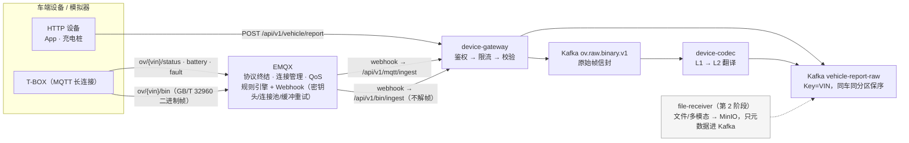

# ingest 接入层 —— OceanVerse 的数据国门

> 对应架构总览能力域①数据集成 / 架构图 Access Layer。
> **本层职责**：把"杂乱的设备流量"变成"干净、可信、有节制的标准数据流"；本层不含业务逻辑。
>
> 📚 **简称约定**：《接入层设计》= 《docs/01-接入层设计-v1.md》｜《GB32960 映射》= 《docs/02-GB32960协议规格-v1.md》｜《示例集》= 《docs/03-验收示例集-v1.md》
> 🧭 **文档纪律**（章节编号 / 跨文档引用写法 / 单一源清单）：`scripts/README.md` 的"文档结构约定"一节；改文档后跑 `bash scripts/check-docs.sh` 自检。

---

## 🚀 从哪看起（三条路径，不用全读）

| 路径 | 顺序 | 读完能回答 |
|---|---|---|
| **A 5 分钟速览** | 本文件 → 挑一个服务 README（如 `device-gateway/README.md`） | 接入层干什么、有哪几条通道、服务怎么跑 |
| **B 30 分钟理解设计** | 《接入层设计》§0~§4 → 《示例集》§1 | 为什么网关不解帧、失败怎么分级、契约怎么版本化 |
| **C 联调排障** | 《示例集》§7（现象→结论）→ `deploy/README.md` Q1~Q13 → 《示例集》§1~§4 | 跑不起来/数据不对，先查哪里 |

## 📚 文档分工（8 篇，各回答一个问题）

| 文档 | 一句话定位 | 何时看 |
|---|---|---|
| **本文件（总）** | 层速览 + 索引：链路全景 / 通道边界 / 状态 | 第一次接触 |
| `docs/01-接入层设计-v1.md` | **设计权威**：§0 端到端流程 · 契约 L2 · 可靠性 · 性能 · 安全 · 可观测 · 演进 · 成熟度 · 附录 A 策略索引 | 要改代码/做评审 |
| `docs/02-GB32960协议规格-v1.md` | **L1 字节规格**：帧结构 / 命令字 / 字段清单 / 字节映射（对固件） | 改协议/对齐固件 |
| `docs/03-验收示例集-v1.md` | **验收示例**：命令 → 期望输出 → 判定（全为实测）+ 一页判定清单 | 联调/验收 |
| `device-gateway/README.md` | 服务手册：端点 / 配置 / 治理策略 / 验证 / 压测 / Docker / 边界 | 跑网关 |
| `device-codec/README.md` | 服务手册：链路位置 / 环境变量 / 解码策略 / 可观测 / DLQ / Docker | 跑 codec |
| `device-contracts/README.md` | 服务手册：契约结构 / 字段语义 / 版本策略 / 引用方式 | 用契约 |
| `device-simulator/README.md` | 服务手册：四工具全参数表 / 造数策略 / 两身份形态 | 造数据 |

## ❓ 同一个问题查哪篇（防翻错）

| 我想知道 | 看这里 |
|---|---|
| 网关有哪些端点、什么配置、怎么复现 429 | `device-gateway/README.md` |
| 为什么网关不解析二进制帧 | 《接入层设计》§3.1 + §7 |
| topic 名与 QoS | 《接入层设计》§4.2（**唯一源**） |
| 二进制帧某字段几个字节 | 《GB32960 映射》§2/§5 |
| 401/429/400/500 长什么样 | 《示例集》§2 |
| 模拟器参数默认值 | `device-simulator/README.md` 全参数表 |
| 压测数字 | 《接入层设计》§7.3 |
| 现在走到哪一步 | 《roadmap/项目进度.md》 |
| 服务起不来 / 数据没到 | `deploy/README.md` Q1~Q13 + 《示例集》§7 |

---

## 链路全景



> 分流依据是 **topic**（`/bin` vs `/status·battery·fault`）；listener（1883 明文 / 8883 TLS+一车一密）只决定传输安全与设备认证。**完整端到端示例见《示例集》§1。**

## 两条实时通道的职责边界

| | HTTP 通道 `/api/v1/vehicle/report` | MQTT 通道(EMQX → `/api/v1/mqtt/ingest`) |
|---|---|---|
| 适用设备 | App、充电桩、轻量设备 | 车端 T-BOX(长连接/弱网/省电) |
| 协议终结 | 网关直接终结 | **EMQX 终结**(连接/会话/QoS/遗嘱) |
| 设备鉴权 | 网关(token 白名单) | **EMQX**(认证链) + 网关验 webhook 密钥 |
| 单设备限流 | 网关令牌桶 | **EMQX 协议层**(rate_limit) |
| 契约校验/Kafka 写入 | 网关 | 网关(同一个 Validate, 同一个 producer) |

**核心设计: EMQX 管"连接", 网关管"治理"。** 数据契约、校验规则、Kafka 分区策略永远只有一份(网关), MQTT 只是多了一种"进门方式"。

## 企业级四支柱（速览，细节在各服务手册与设计文档）

### 高性能
- EMQX 单节点百万级连接基线；网关→Kafka 异步攒批 200 条/50ms；EMQX→网关 webhook 连接池 16 + hash 保序
- 全链路无同步阻塞点，唯一同步等待是"消息进内存队列"

### 可扩展
- 网关无状态可横扩；codec 消费组加副本即横扩；Kafka 加分区；EMQX 集群化
- 扩展顺序：**先扩 Kafka 分区 → 再扩网关副本 → 最后扩 EMQX 节点**

### 稳定性
- 缓冲职责推给两侧专业组件（EMQX 缓冲重试 / Kafka 日志），网关内存**不**堆消息
- 重复由下游 `(vin, ts)` 幂等吸收；优雅退出冲刷缓冲
- 故障矩阵 6✅1❌→P1 已修（补投率 100%）：《接入层设计》§6

### 可配置
- 网关 15 项配置全部环境变量（见 `device-gateway/README.md`）；EMQX 全部行为声明在 `deploy/emqx/emqx.conf`

## 生产加固清单(本地模拟 → 生产差距)

| 项 | 本地(现在) | 生产(目标) |
|---|---|---|
| MQTT 传输 | 1883 明文(内网) + **8883 TLS 已演练** | 8883 TLS + 设备证书(正式 CA) |
| 设备认证 | 1883 匿名(dev) + **8883 一车一密已演练** | 对接车辆档案服务 HTTP 认证, 一车一密(强随机) |
| Topic 授权 | **ACL 已演练**(生产规则 + dev 前缀放行) | 设备只能 pub `ov/${clientid}/#`, 无 dev 例外 |
| webhook 密钥 | 默认值 | 强随机 + 密钥轮换 |
| Kafka 持久性 | RequireOne | RequireAll + min.insync.replicas=2 |
| EMQX | 单节点 | 3 节点集群 + LB |
| 审计 | metrics | + 消息抽样落审计表(第 2 阶段控制面) |

> 已演练三项的细节与自检脚本见《接入层设计》§8.3 / `deploy/README.md` Q12；**生产替换物**：正式 CA 证书 + 强随机一车一密 + 去掉 dev 放行规则。

## 目录

```
ingest/
├── README.md                    ← 本文件(总: 层速览 + 三条阅读路径 + 索引)
├── docs/                        ← 层文档 3 篇(只放跨服务内容)
│   ├── 01-接入层设计-v1.md        ← 设计权威(§0 流程 · 契约 · 可靠性 · 安全 · 演进 · 附录 A 策略索引)
│   ├── 02-GB32960协议规格-v1.md   ← L1 字节规格(对固件)
│   └── 03-验收示例集-v1.md        ← 可复制可判定的验收示例(命令→期望输出→判定)
├── device-contracts/            ← 契约 Go 绑定 + 服务手册
├── device-gateway/              ← 网关本体(HTTP + MQTT-webhook + 二进制透传) + 服务手册
├── device-codec/                ← 编解码服务(raw topic → VehicleReport → parsed topic; DLQ) + 服务手册
└── device-simulator/            ← 车端模拟器(四工具, 不进生产) + 服务手册
(file-receiver 第 2 阶段加入: 离线通道)
```

## 当前状态（第 1 阶段）

> 阶段级滚动进度见《roadmap/项目进度.md》；下方为接入层自身的细节状态。

| 项 | 状态 |
|---|---|
| 三通道链路 | ✅ HTTP + MQTT(JSON) + **二进制透传**(GB/T 32960)，构建/测试全绿 |
| 单元测试 | ✅ gateway 5 个测试包 + codec 解码器/metrics + contracts 契约 + simframe 黄金样本 |
| EMQX 声明式规则 | ✅ `deploy/emqx/emqx.conf`（含二进制 `ov_binary_ingress`），启动自动加载 |
| 压测实测数字 | ✅ 已回填（《接入层设计》§7.3，2026-09-16） |
| 二进制链路 | ✅ **端到端联调通过**（2026-09-17）：bin-simulator → EMQX → 网关透传 → `ov.raw.binary.v1` → codec → `vehicle-report-raw`，四段对账平衡，DLQ=0 |
| 公网安全基线 | ✅ **本地演练六项全过**（2026-09-17）：8883 TLS + 一车一密 + ACL，`cmd/security-check` 可重复自检（《接入层设计》§8.3） |
| 可观测 | ✅ 网关 4 指标 + codec 6 指标，Prometheus 双 target + Grafana 双面板（provisioning 即代码） |
| 自动化门禁 | ✅ CI 三作业（go 矩阵 / docker 镜像 / docs 事实与图） |
| 企业级成熟度 | 详见《接入层设计》§12（2026-09-17 快照） |
