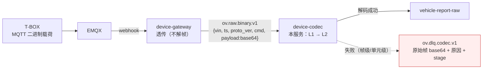
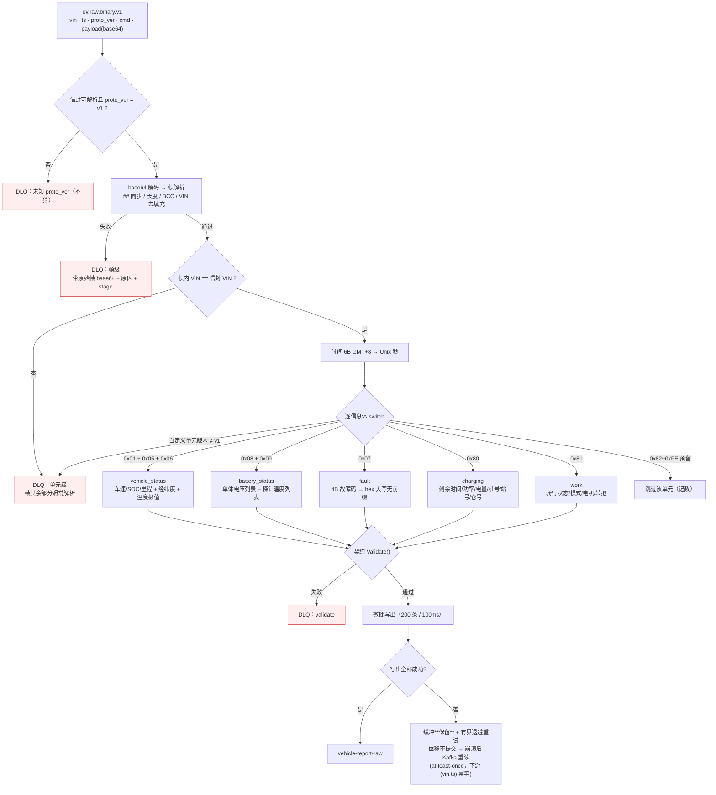
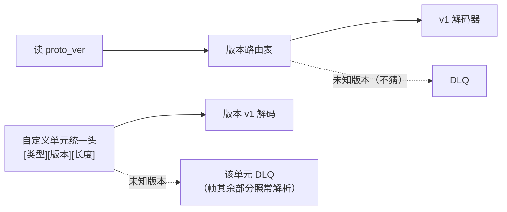

# device-codec 车端二进制编解码服务

> 📚 **简称约定**：《接入层设计》= 《../docs/01-接入层设计-v1.md》｜《GB32960 映射》= 《../docs/02-GB32960协议规格-v1.md》｜《示例集》= 《../docs/03-验收示例集-v1.md》。下文以这三个简称标注跨文档引用。

> OceanVerse 第 1 阶段收尾（提前量）——二进制链路的 L1→L2 翻译层
> 职责：消费 `ov.raw.binary.v1` → 按 `proto_ver` 选解码器 → 输出 `VehicleReport` 到 `vehicle-report-raw`（与 JSON 通道汇合，下游无感）
> 纪律：未知版本不猜、直接 DLQ；不做鉴权/限流/业务判断；无状态可横扩
> 📐 **规格**：《GB32960 映射》（已定稿 v1.4）；链路与 DLQ 见《接入层设计》§7

## 1. 链路位置



## 2. 运行

```bash
# 默认配置即可本地联调(Kafka localhost:19092)
go run ./cmd/server

# 环境变量
KAFKA_BROKERS=localhost:19092   # broker 列表(逗号分隔)
CODEC_SRC_TOPIC=ov.raw.binary.v1
CODEC_DST_TOPIC=vehicle-report-raw
CODEC_DLQ_TOPIC=ov.dlq.codec.v1
CODEC_GROUP=device-codec-v1     # 消费者组(横扩 = 同组多副本)

# 可观测端点(2026-09-18 审计整改: 与业务解耦, pprof 默认仅回环)
CODEC_METRICS_PORT=18090        # /metrics + /health(全网卡, 供容器内 Prometheus 抓取)
CODEC_PPROF_BIND=127.0.0.1      # /debug/pprof 绑定地址(能读出进程内存, 勿开公网)
CODEC_PPROF_PORT=18091          # /debug/pprof 端口
```

## 3. Docker 构建与运行

构建上下文同样是**仓库根**（依赖 `ingest/device-contracts` 的 replace）：

```bash
docker build -f ingest/device-codec/Dockerfile -t oceanverse/device-codec:dev .
docker run --rm --network oceanverse_ov-net \
  -e KAFKA_BROKERS=kafka:9092 \        # 容器内用内部监听器(host 侧是 localhost:19092)
  oceanverse/device-codec:dev
```

无端口：输入输出都是 Kafka topic；容器内验证看消费组 lag 与 `vehicle-report-raw` 是否新增。

## 4. 可观测（2026-09-18 补齐）

```bash
curl -s localhost:18090/health          # {"lag":0,"status":"up"}  ← K8s liveness/readiness 用
curl -s localhost:18090/metrics | grep ^codec_
go tool pprof http://localhost:18091/debug/pprof/profile?seconds=30   # 解码热点按需剖析(独立端口, 仅绑回环)
```

**采集与可视化**（与网关同形态，2026-09-18 打通）：Prometheus `deploy/prometheus/prometheus.yml` 内 `job_name: device-codec` 5s 抓 `host.docker.internal:18090`（`/metrics`+`/health` 走专用端口；`/debug/pprof` 另起 `CODEC_PPROF_PORT`，默认 `127.0.0.1:18091` 仅回环）；
Grafana provisioning 面板 `device-codec 编解码服务`（4 图：消费 vs 解码 / DLQ 速率按 stage / 消费 lag / 微批耗时与批大小）。
端口冲突时日志会打 `bind: address already in use`（主流程仍继续，但指标不可见）——重启前确保旧实例退净（deploy/README Q11）。

| 指标 | 含义 | 告警建议 |
|---|---|---|
| `codec_consumed_total` | 消费的原始帧数 | —— |
| `codec_decoded_total{type}` | 解码产出（按 5 类 type 分） | 与 consumed 的比值 ≈ 每帧拆出几条 |
| `codec_dlq_total{stage}` | 进 DLQ 数（envelope/parse/**vin_mismatch**/decode/validate/encode） | **>0 持续增长即告警**（唯一会丢数据的环节）；其中 `vin_mismatch` 是**安全事件**（帧内 VIN ≠ 信封 VIN，见下） |
| `codec_flush_failures_total` | 微批写出/位移提交失败次数 | **>0 即告警**：说明下游写不进去、正在退避重试（数据仍保留在缓冲） |
| `codec_pending_messages` | 缓冲区待写出的原始消息数 | 持续增长=下游长时间不可写；这是"丢数据之前"的最后一道可见信号 |
| `codec_consumer_lag` | 消费滞后条数 | 持续 >0 → 扩容或查下游写慢 |
| `codec_flush_duration_seconds` / `codec_flush_batch_size` | 微批写出耗时与批大小 | 写出变慢/批变小说明攒批失效 |
| `codec_ingest_to_decode_seconds` | EMQX 接收（信封 `ingest_ts_ms`，毫秒）→ 解码完成 | **上行延迟 SLI（毫秒精度）**：持续上涨=链路变慢（webhook/Kafka/消费）。缺该字段的存量旧信封不观测 |
| `codec_device_to_decode_seconds` | 设备 `ts`（**秒级**）→ 解码完成 | **数据陈旧度**，不是链路性能：设备时钟错、帧在重试/DLQ 滞留、离线补发都会抬高它 |

`/health` **不探测 Kafka**：codec 无状态，依赖抖动由 lag 指标与重启策略覆盖，探针探测外部依赖会引发无意义重启。

## 5. 解码策略（L1→L2 逐环）

### 5.1 定位与不变量

- 只做翻译：消费 `ov.raw.binary.v1` → 输出 `VehicleReport` 到 `vehicle-report-raw`
- **不做**：鉴权/限流（网关职责）、业务判断；**无状态**（消费组加副本即横扩）
- 不变量：**信封一份** —— 无论线协议怎么演进，输出永远是同一个 `VehicleReport`

### 5.2 处理流程与失败分支（一张图看完决策）



### 5.3 帧解析策略

| 步骤 | 规则 | 失败后果 |
|---|---|---|
| 帧同步 | 起始符必须 `##` | 整帧 DLQ |
| 长度校验 | `24 + 声明长度 + 1 == 实际长度` | 整帧 DLQ |
| BCC 校验 | 逐字节异或比对 | 整帧 DLQ |
| VIN | 去尾部 0x00 填充（《GB32960 映射》§8-①） | —— |
| 时间 | 6B GMT+8 → Unix 秒（《GB32960 映射》§8-③） | 不足 6B → 整帧 DLQ |

### 5.4 版本路由与版本纪律


新协议版本 = **新增解码器**，不改存量代码（open-closed）。

### 5.5 信息体解码与拆分/合并规则（《GB32960 映射》§8-④）

| L1 信息类型 | 内容 | → L2 `type` |
|---|---|---|
| 0x01 整车 + 0x05 位置 + 0x06 极值 | 车速/SOC/里程、经纬度、温度极值 | **合并**为 `vehicle_status` |
| 0x08 电压 + 0x09 温度 | 单体电压列表、探针温度列表 | **合并**为 `battery_status` |
| 0x07 报警 | 故障码列表（4B/个 → hex 大写无前缀） | **独立**为 `fault` |
| 0x80 charging | 剩余时间/功率/电量/桩号/站号/仓号 | `charging` |
| 0x81 工况 | 骑行状态/模式/电机/转把 | `work` |

一帧可产出多条 L2 消息（按信息体存在与否懒创建）。

### 5.6 字段转换策略

| 策略 | 例子 |
|---|---|
| 精度换算 | 车速 ×0.1、单体电压 ÷1000（**用除法**避免 1 ulp 误差）、经纬度 ×1e-6 |
| 偏移量 | 电流 −1000A、温度 −40℃ |
| 有符号 | 电机转矩/功率（负=能量回收） |
| 枚举翻译 | L1 数字码 → L2 字符串（`0x01→riding`、`0x03→sport`），翻译表硬编码在 v1 |
| 无效值丢弃 | 0xFF/0xFFFF 字段不设置（契约全可选，天然兼容） |
| 交叉校验机会 | 0x08 子系统电压/电流与整车口径可互验 |

### 5.7 失败策略（两级 DLQ）

| 级别 | 触发 | 后果 |
|---|---|---|
| 帧级 | 同步/长度/BCC/时间/未知 proto_ver | **整帧**进 DLQ（带原始帧 base64 + 原因 + stage） |
| **身份** | **帧内 VIN ≠ 信封 VIN**（信封 VIN 来自 MQTT topic，受 EMQX ACL 约束） | **整帧**进 DLQ（`stage=vin_mismatch`，安全事件，另有专门告警）—— 网关按纪律不解帧，故这道校验只能在 codec 里做 |
| 单元级 | 自定义单元未知版本、信息体长度不足 | **仅该单元**进 DLQ，帧其余部分照常解析 |
| 字段级 | 非法枚举码/无效值 | 只丢该字段，**不进 DLQ** |

### 5.8 交付语义

| 策略 | 做法 | 理由 |
|---|---|---|
| at-least-once | **写出成功 == 位移提交成功，缓冲才清空**；任一失败则保留缓冲 + 有界退避（500ms 起，上限 10s） | 崩溃 → 重读；重复由下游 `(vin, ts)` 幂等。**2026-09-18 前**失败后缓冲被无条件清空 → 下次成功 flush 提交更高位移，该批**永久静默丢失**（已修，见 §7） |
| 微批 | 攒批 200 条 / 100ms 定时冲刷 | 逐条同步写会被 RTT 拖到 ~1 条/s（实测教训） |
| 监控 | flush 耗时 >200ms 打 WARN，每 5s 打处理统计 | 让性能退化可见 |
| 实测 | 100 台/20fps 突发下 lag 归零 | 与网关同级的实时性 |

---

## 6. 设计要点与不变量

| 要点 | 说明 |
|---|---|
| 只做翻译 | 消费 `ov.raw.binary.v1` → 输出 `VehicleReport`；鉴权/限流在网关，业务判断在下游 |
| 无状态 | 消费组 `device-codec-v1` 加副本即横扩；无本地状态、无端口依赖 |
| 版本纪律 | 未知 `proto_ver` 不猜 → DLQ；新版本 = 新增解码器，不改存量 |
| 失败分级 | 帧级 / 单元级 DLQ，字段级丢弃（见《GB32960 映射》§5.2） |
| 交付语义 | 写出成功才提交位移（at-least-once），重复由下游 `(vin, ts)` 幂等吸收 |
| 设计出处 | 上行职责：《GB32960 映射》§7；链路与 L1/L2 分层：《接入层设计》§4/§7 |

## 7. 可靠性语义

- **写出全部成功才提交位移**：写失败或提交失败 → 缓冲**保留** + 有界退避重试，位移不提交 → 崩溃/重启后重读，at-least-once（下游按 `(vin,ts)` 幂等）。
  失败会同时体现在 `codec_flush_failures_total` 与 `codec_pending_messages` 上（不再是"只有一行日志"）。
- **DLQ 两级**：帧级（同步/长度/BCC/时间/未知 proto_ver）整帧进；单元级（自定义单元未知版本、信息体长度不足）只丢该单元，帧其余部分照常解析
- **单字段非法只丢字段**（无效值 0xFF/0xFFFF、非法枚举码），不进 DLQ（《GB32960 映射》§5.2 粒度纪律）

## 8. 目录

```
ingest/device-codec/
├── cmd/server/             # 主程序: 消费→解码→投递+DLQ→提交位移
├── internal/gbt32960/      # v1 解码器(帧解析 + 全部信息体; 黄金样本对拍测试)
└── README.md               # 本文件
```

## 9. 对拍关系

本解码器与模拟器模块的 `internal/simframe` 造帧器（`ingest/device-simulator/`）**独立实现同一规格**（《GB32960 映射》§5/§5.1/§5.2），
黄金样本（58B 示例帧）双端各存一份，对不上即 bug 或文档歧义——已实抓一处字节错位（0x08 子系统头偏移）。

## 10. 延伸阅读（为什么这么设计）

- （《GB32960 映射》§8-①）
- （《GB32960 映射》§8-③）
- （《GB32960 映射》§8-④）

> 本手册只讲"怎么跑/怎么验"；上面的层文档讲"为什么"。设计与规格的权威在那两篇，本手册不复制其内容。
