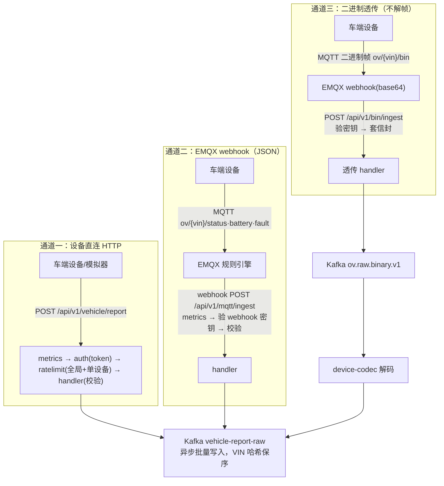

# device-gateway 车端接入网关

> 📚 **简称约定**：《接入层设计》= 《../docs/接入层与车端接入网关设计-v1.md》｜《GB32960 映射》= 《../docs/GB32960-二进制协议与字段映射-v1.md》。下文以这两个简称标注跨文档引用。

> OceanVerse 第 1 阶段第 2 步 —— 平台的数据"国门"
> 职责: 设备鉴权 → 限流 → 协议解析/校验 → 写 Kafka → 全程可观测
> 原则: 网关无业务逻辑、无状态、不直连数据库; 越"笨"越稳。
> 📐 **设计见**《接入层设计》（含 §12 成熟度评估）；二进制链路见《GB32960 映射》

## 处理链与端口



| 端点 | 说明 |
|---|---|
| `POST /api/v1/vehicle/report` | 车端上报(通道一: 设备直连 HTTP) |
| `POST /api/v1/mqtt/ingest` | 车端上报(通道二: EMQX 规则引擎 webhook, 密钥头 `X-Webhook-Token`) |
| `POST /api/v1/bin/ingest` | 二进制帧透传(通道三: **不解帧**, 套信封进 `ov.raw.binary.v1`, 解码归 device-codec) |
| `GET /health` | 健康探针 |
| `GET /metrics` | Prometheus 指标 |
| `GET /debug/pprof/*` | 性能剖析 |

> 接入层整体设计(EMQX 链路/四支柱/生产加固清单)见 `ingest/README.md`

## 配置（全部走环境变量）

| 变量 | 默认值 | 说明 |
|---|---|---|
| `GATEWAY_PORT` | `8080` | HTTP 端口 |
| `KAFKA_BROKERS` | `localhost:19092` | Kafka 地址(逗号分隔) |
| `KAFKA_TOPIC` | `vehicle-report-raw` | 车端数据 topic(JSON 通道) |
| `KAFKA_BIN_TOPIC` | `ov.raw.binary.v1` | 二进制原始帧 topic(通道三) |
| `DEVICE_TOKENS` | `demo-token-001` | 设备令牌白名单(逗号分隔) |
| `GATEWAY_WEBHOOK_TOKEN` | `dev-webhook-secret` | EMQX webhook 来源密钥, 须与 emqx.conf 一致 |
| `GATEWAY_DEV_MODE` | `false` | ⚠️ 开发模式: 放行所有 `dev-` 前缀 token, 生产必须关 |
| `RATE_PER_DEVICE` | `10` | 单设备限流(条/秒) |
| `RATE_GLOBAL` | `5000` | 全局限流(条/秒) |
| `GATEWAY_READ_TIMEOUT` / `GATEWAY_WRITE_TIMEOUT` | `5s` | HTTP 超时 |
| `GATEWAY_SHUTDOWN_GRACE` | `10s` | 优雅退出宽限 |

## 前置：Go 模块代理（国内必配）

```bash
go env -w GOPROXY=https://goproxy.cn,direct
```

## 本地运行

```bash
# 0. 基础设施已就绪(deploy/README.md), Kafka 在 localhost:19092
cd ingest/device-gateway

# 1. 下载依赖 + 编译验证
go mod tidy
go build ./...
go vet ./...

# 1.5 单元测试(5 个测试包 40+ 用例: 鉴权/限流/三通道 handler/配置/Kafka 投递; 契约与造帧器已迁独立模块)
go test ./... -count=1          # 全部通过
go test ./... -cover            # 实测(2026-09-18): auth 100% / kafka 90% / ratelimit 85.3% / config 82.4% / handler 75.2%

# 2. 开发模式启动(允许 dev- 前缀 token, 方便联调压测)
#    注意: 本机 8080~8083 被其他服务占用, 开发期固定 18080(与 emqx.conf webhook / prometheus 抓取一致)
GATEWAY_PORT=18080 GATEWAY_DEV_MODE=true go run ./cmd/server
```

启动日志应看到：`车端接入网关启动 port=8080 topic=vehicle-report-raw ...`

## 验证（另开终端）

### ① 正常上报 → Kafka 消费到

```bash
# 发一条(dev 模式)
curl -i -X POST http://localhost:18080/api/v1/vehicle/report \
  -H "Content-Type: application/json" \
  -H "X-Device-Token: dev-OV20260001" \
  -d '{"vin":"OV20260001","ts":'"$(date +%s)"',"type":"vehicle_status",
       "data":{"speed":32.5,"soc":78,"voltage":60.2,"current":-5.1,
               "temp_max":35.0,"lng":113.94,"lat":22.54}}'
# 期望: HTTP 202 {"code":0,"message":"accepted"}

# Kafka 里应消费到(Kafka 自动建 topic)
docker exec ov-kafka /opt/kafka/bin/kafka-console-consumer.sh \
  --bootstrap-server localhost:9092 --topic vehicle-report-raw \
  --from-beginning --timeout-ms 5000
```

### ② 鉴权拦截（关 dev 模式重启后）

```bash
# 不带 token → 401
curl -i -X POST http://localhost:18080/api/v1/vehicle/report -d '{}'
# 期望: {"code":"UNAUTHORIZED",...}
```

### ③ 校验拦截

```bash
# soc=300 超出范围 → 400 INVALID_DATA
curl -X POST http://localhost:18080/api/v1/vehicle/report \
  -H "X-Device-Token: dev-x" \
  -d '{"vin":"OV20260001","ts":'"$(date +%s)"',"type":"vehicle_status","data":{"soc":300}}'
```

> 完整的**五环逐环示例**（401 / 429 / 400-解析 / 400-契约 / 500-Kafka，含实测响应体与指标标签）
> 与**三条通道端到端示例**见《../docs/接入层示例集-v1.md》§1~§2。

### ④ 指标

```bash
curl -s http://localhost:18080/metrics | grep gateway_requests_total
curl -s http://localhost:18080/metrics | grep gateway_kafka_write_total
```

## 压测

```bash
# 模拟器在独立模块 ingest/device-simulator(压测工具不进生产模块)
cd ../device-simulator

# 1 万设备、每台 5 秒一条(≈2000 QPS)、跑 60 秒
go run ./cmd/http-simulator -target http://localhost:18080 -devices 10000 -interval 5s -duration 60s

# 10 万设备(≈2 万 QPS) —— 注意本机 fd 限制, 必要时 ulimit -n 1000000
go run ./cmd/http-simulator -target http://localhost:18080 -devices 100000 -interval 5s -duration 120s
```

压测时观察：

```bash
# 网关处理速率/结果分布
curl -s http://localhost:18080/metrics | grep -E 'requests_total|inflight'
# pprof 性能剖析(压测进行中抓取 30s CPU profile)
go tool pprof http://localhost:18080/debug/pprof/profile?seconds=30
```

## MQTT 通道验证（企业级链路：设备 → EMQX → 规则引擎 → 网关 → Kafka）

```bash
# 0. 确认 EMQX 已启动(deploy/README.md), Dashboard: http://localhost:18083 (admin/public)
#    规则引擎应在 集成 → 规则 中看到 "ov_vehicle_ingress" 及其 webhook 动作

# 1. 启动网关(确保 webhook token 与 deploy/emqx/emqx.conf 中一致)
GATEWAY_DEV_MODE=true go run ./cmd/server

# 2. 用 MQTT 模拟器发数据(100 台车, 每台 5s 一条状态, 1% 概率带故障)
(cd ../device-simulator && go run ./cmd/mqtt-simulator -broker tcp://localhost:1883 -devices 100 -interval 5s -duration 60s)

# 3. Kafka 应消费到 MQTT 来源的消息(与 HTTP 通道同一个 topic)
docker exec ov-kafka /opt/kafka/bin/kafka-console-consumer.sh \
  --bootstrap-server localhost:9092 --topic vehicle-report-raw \
  --from-beginning --timeout-ms 10000

# 4. 观察按通道区分的指标
curl -s http://localhost:18080/metrics | grep 'gateway_requests_total'
# 应同时看到 path="/api/v1/vehicle/report" 和 path="/api/v1/mqtt/ingest" 两个标签

# 5. EMQX 侧观测: Dashboard → 客户端(应看到 100 个 dev-OV* 连接)
#    Dashboard → 集成 → 规则 → ov_vehicle_ingress(命中率/成功率)
```

## 二进制通道验证（设备 → EMQX → 网关透传 → codec → Kafka）

```bash
# 1. 启动网关 + codec(codec 是独立模块, 另开终端)
GATEWAY_DEV_MODE=true go run ./cmd/server
cd ../device-codec && go run ./cmd/server

# 2. 用二进制模拟器发帧(100 台车, 每台 10s 一帧——《GB32960 映射》§3.1 频率基线; 1% 概率带 0x07 报警)
(cd ../device-simulator && go run ./cmd/bin-simulator -broker tcp://localhost:1883 -devices 100 -interval 10s -duration 60s)

# 3. codec 输出应进 vehicle-report-raw(与 JSON 通道汇合, 下游无感)
docker exec ov-kafka /opt/kafka/bin/kafka-console-consumer.sh \
  --bootstrap-server localhost:9092 --topic vehicle-report-raw \
  --from-beginning --timeout-ms 10000

# 4. 失败帧(版本未知/CRC 错等)落 DLQ 排查:
docker exec ov-kafka /opt/kafka/bin/kafka-console-consumer.sh \
  --bootstrap-server localhost:9092 --topic ov.dlq.codec.v1 \
  --from-beginning --timeout-ms 5000

# 5. EMQX 规则 ov_binary_ingress 命中率 vs 网关 path="/api/v1/bin/ingest" 计数对账
```

## Docker 构建与运行（第 2 阶段上编排的前置验证）

**⚠️ 构建上下文必须是仓库根**（契约模块在 `ingest/device-contracts`，`go.mod` 的 `replace` 指过去；
在模块目录内 `docker build .` 会报 `replacement directory ../device-contracts does not exist`）：

```bash
# 在仓库根执行
docker build -f ingest/device-gateway/Dockerfile -t oceanverse/device-gateway:dev .
# 国内网络如拉依赖慢, 可覆盖代理: --build-arg GOPROXY=https://goproxy.cn,direct
```

**运行必须挂 compose 网络 + 用内部 broker 地址**（Kafka 的 `EXTERNAL` 监听器对外广播 `localhost:19092`，
在容器里 `localhost` 指向容器自身 → 会 202 受理但写入失败，指标 `kafka_write_total{result="error"}` 可查）：

```bash
docker run --rm --network oceanverse_ov-net -p 18080:18080 \
  -e GATEWAY_PORT=18080 \
  -e KAFKA_BROKERS=kafka:9092 \          # 容器内走内部监听器(内部广播 kafka:9092)
  -e GATEWAY_DEV_MODE=true \
  oceanverse/device-gateway:dev
# 容器里验证: curl -s localhost:18080/health  → {"status":"up"}
#             打一条上报后看 topic offset 是否 +1(202 只代表受理, 不代表落盘)
```

## 已知边界（刻意不做）

- 鉴权是静态白名单；第 2 阶段接车辆档案服务改为动态校验
- Kafka RequiredAcks=RequireOne 性能优先；要更强持久性改 `kafka.RequireAll`
- 已实现**三通道**：HTTP / MQTT-JSON(webhook) / 二进制透传（`bin_ingest.go`，不解帧）；gRPC 内部通道第 2 阶段加；TCP 私有协议按《../docs/GB32960-二进制协议与字段映射-v1.md》§7 作为**分级 fallback**（网关新增 TCP 监听）
- 消息清洗/字段加工不做（那是 Flink 计算层的职责）
