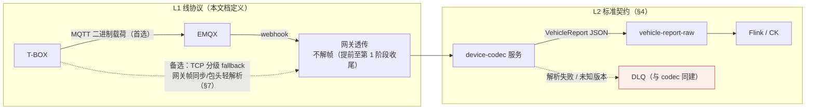
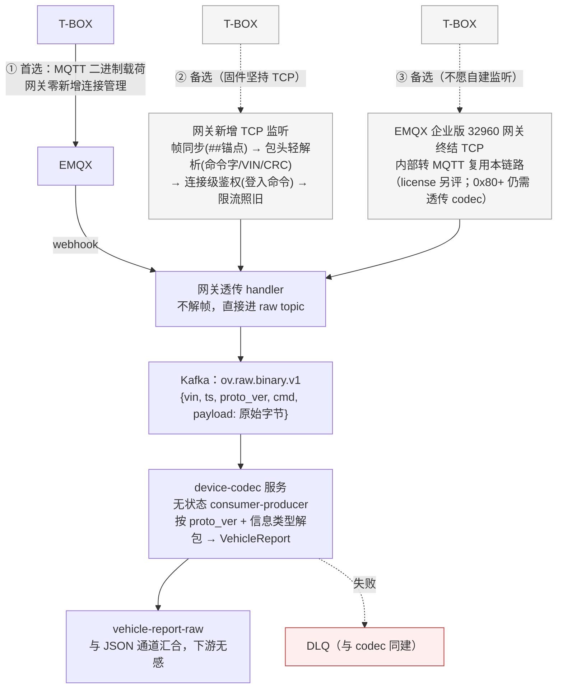

# GB/T 32960 二进制线协议与 OceanVerse 契约字段映射（v1.4 已定稿）

> 版本 v1.4 · 2026-09-17
> v1.4 增补 · 2026-09-17：**二进制链路上行排期提前至第 1 阶段收尾**（规格全定稿、无外部依赖、不引入新技术栈）：契约迁 `contracts/` → 二进制帧模拟器 → 透传 handler + EMQX 规则 → device-codec 上行 + DLQ；下行编码仍留第 2 阶段。§1/§7 口径同步。
> v1.4 修订：新增 §5.2——自定义单元 **0x80 charging（充电业务）/ 0x81 工况（work）** 字段清单与字节布局定稿（统一头 = 子类型+版本+长度，§6）；L2 契约 type 枚举新增 `work`，data 新增 charging/工况两组可选字段；§8-② 字段清单闭环；0x82~0xFE 预留后续迭代。
> v1.3 修订：新增 §5.1——0x08/0x09 单体电压/探针温度**字段清单与字节布局**（两轮车单储能子系统简化 v1 模拟稿）；L2 契约新增 `cell_voltages`/`probe_temps` 可选字段；0x80+ charging 自定义单元清单留待后续迭代。
> v1.2 修订：**9 项待协商全部定稿**（§8 由"待协商清单"改为"对齐结论"）；③时区按国标原文（GMT+8）直接执行；⑧补发新增热事件/故障回溯优先（对齐 2025 版）；新增 §3.1 上报频率基线；⑥获国标 2025 版新增"协议版本号标识"条款印证；2025 版强制安全口径（TLS 1.2+/SM4/AES-128/GB/T 40855/动态密钥）背书设计文档 §8 公网三件套。
> v1.1 修订：二进制承载口径统一为"**MQTT 载荷先行，TCP 分级 fallback**"（§1 分层模型 / §3 命令语义 / §7 链路图 / 待协商⑦⑨ 同步对齐；原"第 2 阶段先 TCP"口径作废）
> 定位：车端二进制报文格式的**既定方案**（原协商底稿，2026-09-17 按国标口径与行业通行做法定稿）。帧结构参照 GB/T 32960 框架，业务差异落在自定义数据单元。
> 关系：本文档定义 **L1 线协议**（线上字节流）；解析产物是 **L2 标准契约** `VehicleReport`（见《接入层设计》§4）。
> ⚠️ 字节级精度/偏移以 GB/T 32960 标准原文为最终依据；§8 为 9 项关键决策的对齐结论（已定稿）。

---

## 1. 分层模型



> **不变量：信封一份** —— 无论什么线协议，device-codec 输出永远是同一个 `VehicleReport`；
> `schema_version` 字段 = 线协议版本号（设计文档 §4.4 已预留，正式启用）。

## 2. 帧结构（国标固定部分）

| 顺序 | 字段 | 长度 | 说明 |
|---|---|---|---|
| 1 | 起始符 | 2 B | `##`（0x23 0x23），帧同步锚点 |
| 2 | 命令单元 | 2 B | 命令标识(1B) + 应答标志(1B) |
| 3 | VIN | 17 B | ASCII，不足右补 0x00（**已定，§8-①**：我方 SN/自编码左对齐右补 0x00，codec 去填充还原——两轮车无法定 VIN 的行业通行做法） |
| 4 | 数据加密方式 | 1 B | 0x01 不加密 / 0x02 RSA / 0x03 AES128 / 0xFE 异常 / 0xFF 无效；第 1 阶段选 0x01，公网路径开通时切换（设计文档 §8） |
| 5 | 数据单元长度 | 2 B | 大端，数据单元字节数 N |
| 6 | 数据单元 | N B | 见 §4/§5 |
| 7 | 校验码 | 1 B | BCC：命令单元第 1 字节至数据单元末字节逐字节异或 |

多字节整数一律**大端**（网络序）。

## 3. 命令单元

| 命令标识 | 方向 | 用途 | 本项目 |
|---|---|---|---|
| 0x01 | 上行 | 车辆登入（上电/上线注册） | ✅ 启用。MQTT 路线：业务帧（会话登记/校时触发），连接鉴权由 MQTT 层 token/一车一密承担；TCP fallback：恢复为网关连接级鉴权的载体 |
| 0x02 | 上行 | 实时信息上报 | ✅ 主力命令 |
| 0x03 | 上行 | 补发信息上报（弱网缓存补传） | ✅ 启用（注意与实时去重，下游 `(vin,ts)` 幂等） |
| 0x04 | 上行 | 车辆登出 | ✅ 启用。MQTT 路线：在线数以 EMQX 连接事件为准，登出帧保留业务语义；TCP fallback：在线数指标准确性依赖此帧 |
| 0x07/0x08 | 上行 | 心跳 / 终端校时 | ✅ 启用。MQTT 路线：保活由 MQTT keepalive 承担，心跳帧可降频或省略，校时仍在登入应答下发；TCP fallback：心跳承担长连接保活 |
| 0x05/0x06 | 下行 | 平台登入/登出 | ⏸️ 第 1 阶段不用（下行指令通道：设计文档 §11.1 启用时再开） |
| 0x80~0xFE | 双向 | 自定义命令 | 预留（OTA、远程诊断等） |

应答标志：按国标（命令/成功应答/错误应答/无应答）。登入、补发、登出需要应答；周期实时数据设"无应答"减少流量。

### 3.1 上报频率基线（国标口径，已定稿 2026-09-17）

| 场景 | 频率 | 说明 |
|---|---|---|
| 正常上送 | 周期 ≤30s，建议 10s | 国标要求；模拟器按 10s 造数 |
| 故障状态 | 1s 频率补报**故障发生点前后各 30s** | 国标要求；2025 版进一步明确 3~4 级报警须回溯补发 |
| 热事件/故障补发 | 优先于普通数据补发 | 对齐 2025 版热事件回溯要求（§8-⑧） |

模拟器与 Flink 窗口设计以此为输入；MQTT 路线 QoS 按 §4 启用表与 topic 契约执行（fault QoS1，周期数据 QoS0）。

## 4. 实时信息（0x02）数据单元结构

```
时间(6B: 年-月-日-时-分-秒, 各1B, HEX) + [信息类型标志(1B) + 信息体] × N  ← 串联多个信息体
```

| 信息类型标志 | 内容 | 本项目用途 | 启用 |
|---|---|---|---|
| 0x01 | 整车数据 | vehicle_status 主载体（车速/SOC/总电压/总电流/里程/充电状态） | ✅ |
| 0x05 | 车辆位置 | vehicle_status 的位置部分（经纬度） | ✅ |
| 0x06 | 极值数据 | vehicle_status 的 temp_max/temp_min | ✅（两轮车简化：单储能子系统） |
| 0x07 | 报警数据 | **fault** 类型的载体（故障码列表） | ✅ |
| 0x08 | 储能装置电压 | battery_status（单体电压列表） | ✅（第 1 阶段可先只上总电压，单体列表第 2 阶段启用；清单见 §5.1） |
| 0x09 | 储能装置温度 | battery_status（探针温度列表） | ✅（同上；清单见 §5.1） |
| 0x02/0x04 | 驱动电机/发动机 | — | ⏸️ 两轮车简化：固定 1 电机或不上报 |
| 0x80 | **自定义：charging 充电业务** | charging 类型（剩余充电时间/充电功率/桩号/站号/仓号，清单见 §5.2） | ✅ v1.4 定稿 |
| 0x81 | **自定义：工况 work** | work 类型（骑行状态/模式/电机转速转矩功率/转把，清单见 §5.2） | ✅ v1.4 定稿 |
| 0x82~0xFE | 自定义预留 | 后续迭代（OTA、远程诊断等）；统一头结构不变（§6） | ⏸️ |

## 5. 字段映射明细（L2 VehicleReport ← L1 国标字段）

| L2 契约字段 | L1 来源 | 字节 | 编码/精度 | 备注 |
|---|---|---|---|---|
| `vin` | 帧头 VIN | 17B | ASCII | device-codec 去 0x00 填充 |
| `ts` | 数据单元时间 | 6B | yy MM dd HH mm ss | 转 Unix 秒；时区**按国标 GMT+8 明文**（已定，§8-③），codec 统一转换 |
| `type` | 信息类型标志 | — | 映射规则见 §4 | 一帧多信息体的拆分粒度已定（§8-④）：整车+位置+极值合并为一条 vehicle_status；报警独立成 fault；0x08/0x09 → battery_status |
| `schema_version` | — | — | **国标帧无版本字段** → 见 §6 | |
| `data.speed` | 0x01 车速 | 2B | 0.1 km/h | 契约 [0,300] 校验照旧 |
| `data.soc` | 0x01 SOC | 1B | 1%，0~100 | |
| `data.voltage` | 0x01 总电压 | 2B | 0.1 V | |
| `data.current` | 0x01 总电流 | 2B | 0.1 A，偏移 1000A | 放电正/充电负语义与契约一致 |
| `data.odometer` | 0x01 累计里程 | 4B | 0.1 km | |
| `data.lng` / `data.lat` | 0x05 经度/纬度 | 4B×2 | 1e-6°，WGS84 | 契约经纬度范围校验照旧 |
| `data.temp_max` / `temp_min` | 0x06 最高/最低温度值 | 1B×2 | 偏移 -40℃（raw = ℃ + 40） | 附带子系统号/探针号，L2 暂不暴露 |
| `data.cell_voltages` | 0x08 单体电压列表 | 2B/个 | **0.001 V** | 清单与字节布局见 §5.1；type=battery_status 时可选 |
| `data.probe_temps` | 0x09 探针温度列表 | 1B/个 | 偏移 -40℃（raw = ℃ + 40） | 同上 |
| `data.fault_codes` | 0x07 故障代码列表 | 4B/个 | 国标为 4B 十六进制码 | 已定（§8-⑤）：hex 大写无 0x 前缀直转（如 `E1001`）；语义靠平台故障码字典表（第 2 阶段口径字典/资产清单），解析层不硬翻译 |
| charging 字段族 | 0x80 自定义单元 | 见 §5.2 | 自定义结构 | 清单已定稿（§5.2）：剩余充电时间/充电功率/桩号/站号/仓号 |
| work 工况字段族 | 0x81 自定义单元 | 见 §5.2 | 自定义结构 | 清单已定稿（§5.2）：骑行状态/模式/电机转速/转矩/功率/转把开度 |

无效值约定：未安装/不支持的字段按国标填无效值（0xFF/0xFFFF 等），device-codec 转 L2 时丢弃该字段（契约字段全可选，天然兼容）。

## 5.1 0x08/0x09 字段清单与字节布局（两轮车简化 · v1 模拟稿）

> 2026-09-17 定稿为 v1 模拟稿：**单储能子系统**（个数 N 固定 0x01、子系统号固定 0x01），一帧装下全部单体/探针（不分帧）。字节级精度以国标原文为最终依据；0x80+ charging 自定义单元清单后续迭代补充。

### 0x08 储能装置电压（→ battery_status）

| 顺序 | 字段 | 长度 | 编码/精度 | 本项目取值 |
|---|---|---|---|---|
| 1 | 储能子系统个数 N | 1 B | — | 固定 0x01（两轮车单电池包） |
| 2 | 子系统号 | 1 B | — | 固定 0x01 |
| 3 | 子系统电压 | 2 B | 0.1 V | 与 0x01 总电压一致（冗余，codec 可交叉校验） |
| 4 | 子系统电流 | 2 B | 0.1 A，偏移 1000 A | 与 0x01 总电流一致 |
| 5 | 单体电池总数 | 2 B | 个 | 按车型电池包串数（示例：48V 包 13~16 串、72V 包 20~24 串） |
| 6 | 本帧起始电池序号 | 2 B | 从 1 起 | 固定 1（一帧装下，不分帧） |
| 7 | 本帧单体个数 M | 1 B | 个 | = 单体总数 |
| 8 | 单体电压 × M | 2 B/个 | **0.001 V** | → L2 `data.cell_voltages[]`（单位 V，保留 3 位小数） |

帧长示例（M=16）：信息体 ≈ 9 + 2×16 = 41 B，远小于 MQTT 载荷上限，一帧无压力。

### 0x09 储能装置温度（→ battery_status）

| 顺序 | 字段 | 长度 | 编码/精度 | 本项目取值 |
|---|---|---|---|---|
| 1 | 储能子系统个数 N | 1 B | — | 固定 0x01 |
| 2 | 子系统号 | 1 B | — | 固定 0x01 |
| 3 | 温度探针个数 M | 2 B | 个 | 示例 4：进线 / 电芯中部 / 出线 / BMS MOS |
| 4 | 探针温度 × M | 1 B/个 | 偏移 -40℃（raw = ℃ + 40），1℃/bit | → L2 `data.probe_temps[]` |

### L2 契约增量（信封 v2 兼容）

| L2 契约字段 | 来源 | 类型 | 校验 |
|---|---|---|---|
| `data.cell_voltages` | 0x08 单体电压列表 | []float（V） | 元素 ∈ [0,5]；可选 |
| `data.probe_temps` | 0x09 探针温度列表 | []float（℃） | 元素 ∈ [-40,150]；可选 |

契约字段全可选 → 存量报文无此字段合法，新增不破坏信封 v2；无效值（0xFF/0xFFFF）按 §5 约定丢弃。

### 模拟器造数规则（对拍数据源）

- 单体电压：名义电压均值 ±50mV 随机抖动；5% 概率造一节欠压（<2.5V）供告警链路演练
- 探针温度：基线 25~35℃，充电时 +5~10℃；1% 概率造 >60℃ 高温探针（对应第 1 阶段 Flink 作业"高温电池"）
- 0x08/0x09 与 0x01 同帧串联上报（频率按 §3.1：周期 10s）

## 5.2 自定义单元字段清单（0x80 charging / 0x81 工况 · v1 定稿）

> 2026-09-17 定稿。统一头（§6）：`[单元类型 1B][协议版本 1B][长度 2B][payload]`，版本固定 v1=0x01。枚举字段 L1 走数字码、L2 转字符串（codec 吸收差异）；无效值按 §5 约定填 0xFF/0xFFFF、codec 丢弃。

### 0x80 charging 充电业务单元（→ type: charging）

| 顺序 | 字段 | 长度 | 编码/精度 | L2 契约字段 |
|---|---|---|---|---|
| 1 | 剩余充电时间 | 2 B | 1 min | `data.remain_charge_min` ∈ [0,6000] |
| 2 | 充电功率 | 2 B | 0.01 kW | `data.charge_power` ∈ [0,100] |
| 3 | 本次充电电量 | 2 B | 0.01 kWh | `data.charge_kwh` ∈ [0,100] |
| 4 | 充电桩号 | 4 B | uint32，0=无 | `data.pile_id` |
| 5 | 换电站 ID | 4 B | uint32，0=无 | `data.station_id` |
| 6 | 换电柜仓号 | 1 B | 1~254，0xFF=无 | `data.slot_no` ∈ [1,254] |

payload 定长 15 B（+统一头 4 B = 19 B）。充电状态本体（充电中/已完成等）由 0x01 整车的充电状态字段承载，本单元只装业务扩展字段。

### 0x81 工况 work 单元（→ type: work）

| 顺序 | 字段 | 长度 | 编码/精度 | L2 契约字段 |
|---|---|---|---|---|
| 1 | 骑行状态 | 1 B | 0x01 行驶 / 0x02 驻车 / 0x03 推行 / 0x04 倒车 | `data.ride_state` ∈ `riding/parked/pushing/reverse` |
| 2 | 骑行模式 | 1 B | 0x01 经济 / 0x02 标准 / 0x03 运动 | `data.ride_mode` ∈ `eco/standard/sport` |
| 3 | 电机转速 | 2 B | 1 rpm | `data.motor_rpm` ∈ [0,20000] |
| 4 | 电机转矩 | 2 B | **有符号** 0.1 N·m，负=能量回收 | `data.motor_torque` |
| 5 | 电机功率 | 2 B | **有符号** 1 W，负=能量回收 | `data.motor_power` |
| 6 | 转把开度 | 1 B | 1%，0~100 | `data.throttle` ∈ [0,100] |

payload 定长 9 B（+统一头 4 B = 13 B）。

### codec 处理要点

- 0x80/0x81 走版本路由表（§7 职责表）：按统一头版本字节选解码器，v1 即本节布局
- 枚举翻译表硬编码在 v1 解码器内（0x01→`riding` 等），非法码值 → 该字段丢弃（不进 DLQ，单元其余字段照常解析）；**整单元版本未知才进 DLQ**（版本纪律）
- 0x82~0xFE 当前一律按"未知类型"处理：跳过 payload（长度字段可信时）并计数；长度不可信 → 整帧进 DLQ

## 6. 协议版本号安放（信封 v2 衔接）

国标帧结构没有协议版本字段，但 OceanVerse 信封 v2 的 `schema_version` 必须有着落（多车型/多协议演进前提）。**方案（已定，§8-⑥）**：

```
自定义数据单元统一头: [单元类型(0x80+) 1B] [协议版本 1B] [长度 2B] [payload...]
                      ── 所有自定义单元强制带版本字节; 国标固有单元(0x01~0x09)默认 v1
```

device-codec 按版本字节选择解析器；`schema_version` 写入 VehicleReport 后，下游按版本消费。

> 印证：GB/T 32960.3-2025 新增"协议版本号标识"（6.2 条），专为新老终端混网运行而设——国标演进方向与本方案一致。

## 7. 接入链路形态（上行提前至第 1 阶段收尾，v1.4 增补）



**device-codec 职责定义**（双向翻译层，命名即契约）：

| 项 | 定义 |
|---|---|
| 上行 | 消费 `ov.raw.binary.v1` → 按 `proto_ver` 选解码器 → 输出 `VehicleReport` 到 `vehicle-report-raw` |
| 下行（第 2 阶段后段） | 消费指令 topic 的 `VehicleCommand` → 编码为二进制帧 → 经网关 TCP/MQTT 下发 |
| 失败去向 | 帧解析失败 / 未知 proto_ver / CRC 错 → DLQ（带原始字节 + 失败原因） |
| 版本纪律 | 未知版本不猜、直接 DLQ；新协议版本 = 新增解码器，不改存量 |
| 不做 | 鉴权/限流（网关职责）、业务判断（同网关纪律）；无状态可横扩 |

## 8. 对齐结论（2026-09-17 定稿，9/9）

> 决策依据：GB/T 32960 国标口径（含 2025 版演进方向）+ 车联行业通行做法。与固件团队对齐时，③为**按国标执行**项（无需谈判），其余各项以本表结论为我方立场。

| # | 议题 | 结论 | 依据 |
|---|---|---|---|
| ① | VIN 17 位固定长度 vs 我方 VIN 规则 | 我方 SN/自编码**左对齐右补 0x00**，codec 去填充还原 | 行业通行（两轮车/非道路车辆无法定 VIN，SN 映射 17B 域） |
| ② | charging/换电业务字段的自定义单元结构 | **字段清单已定稿**（v1.4 §5.2：0x80 charging / 0x81 工况）；后续新增自定义单元仍遵循"先清单后布局"；单元头 = 子类型+长度+版本（§6） | 行业通行结构；字段没列全就定布局 = 必然返工 |
| ③ | 时间字节时区 | **按国标执行：GMT+8 明文**，codec 统一转 Unix 秒 | 国标原文"时间均应采用 GMT+8 时间" |
| ④ | 一帧多信息体的 L2 拆分粒度 | 整车+位置+极值合并一条 vehicle_status；报警独立成 fault；0x08/0x09 → battery_status | 行业通行（宽表合并 + 事件独立）；国标允许按信息类型任意拼装 |
| ⑤ | 4B 故障码 ↔ 契约字符串码映射 | **hex 大写无 0x 前缀直转**；语义靠平台故障码字典表（第 2 阶段口径字典/资产清单），解析层不硬翻译 | 行业通行（字典独立演进，不动协议与代码） |
| ⑥ | 协议版本号安放位置 | 自定义单元统一头带版本字节（§6）；固有单元默认 v1 | 国标 2025 版新增协议版本号标识（6.2 条），方向一致 |
| ⑦ | TCP 还是 MQTT 承载二进制 | **MQTT 载荷先行**（网关零新增连接管理，复用 EMQX 已演练链路）。TCP 分级 fallback：① 固件坚持 TCP → 网关自建监听（帧同步/包头轻解析/连接级鉴权，设计文档 §11.4）；② 不愿自建 → 评估 EMQX 企业版 32960 网关（license 成本另计；自定义单元 0x80+ 仍需透传 codec） | 两轮车/IoT 车队 MQTT 为主流；国标传输层为 TCP（2025 版加 TLS 安全层），fallback 保留兼容 |
| ⑧ | 弱网补发（0x03）窗口与去重 | 补发窗口 ≤24h；下游 `(vin,ts)` 幂等兜底；**热事件/故障补发优先于普通数据**（故障点前后各 30s 按 1Hz 回溯补发，§3.1） | 国标补发机制（本地存储→链路恢复→0x03，时间=数据发生时间）+ 2025 版热事件回溯 |
| ⑨ | 心跳/校时间隔 | 校时在登入应答下发；MQTT 路线**省略心跳帧**（保活走 keepalive）；TCP fallback 心跳 30~60s | IoT 通行做法（连接保活归协议层，业务帧不掺和） |

**安全口径背书**：GB/T 32960.3-2025 强制升级通信安全——TLS 1.2+、SM4 或 AES-128 及以上、平台间 GB/T 40855 双端认证、动态会话密钥交换（7.6 条）。与设计文档 §8 公网路径三件套（TLS/一车一密/ACL，开通前置门槛）完全同向，国标即合规基线。

## 参考

- GB/T 32960 电动汽车远程服务与管理系统技术规范（通讯协议及数据格式）——标准原文为最终依据；2025 版新增协议版本号标识（6.2）、动态密钥交换（7.6）、热事件回溯补发、高压下电后 1h 持续监测等
- 《接入层设计》§4（L2 契约）、§11.2（topic 家族）、§6.1（DLQ）、§8（安全路径矩阵）
