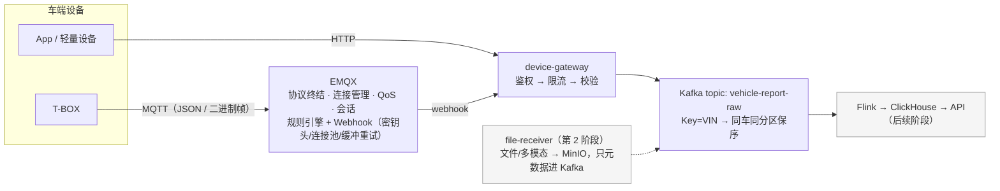
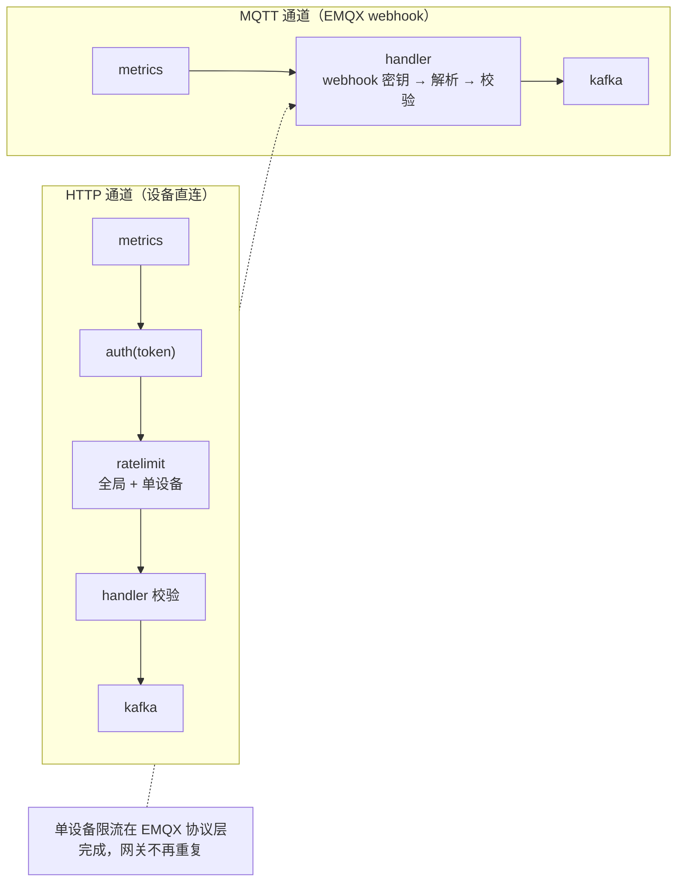
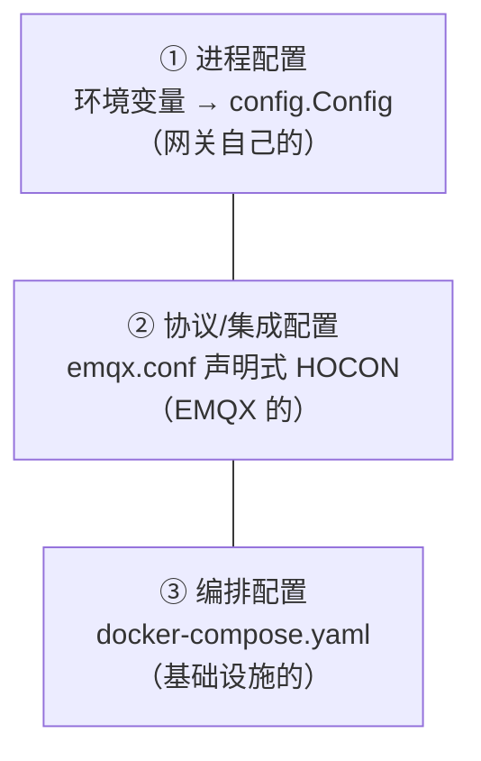
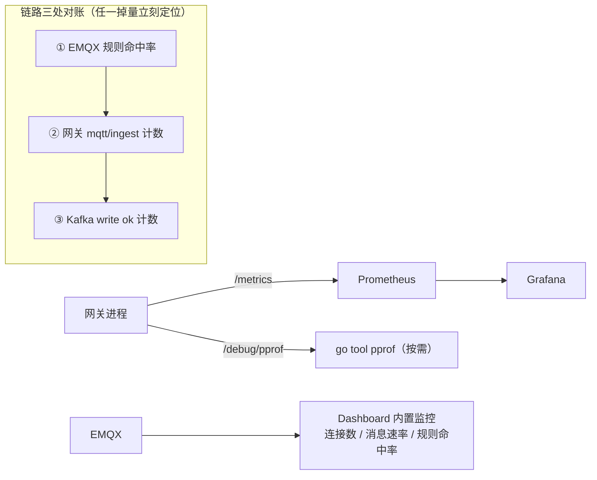

# OceanVerse 接入层与车端接入网关设计文档

> 版本 v1.1 · 2026-09-16（修订记录见文末 §13）
> 范围：`ingest/` 接入层整体设计 + `device-gateway` 车端接入网关详细设计
> 上位文档：《OceanVerse 架构总览》§1.1 接入层、能力域①数据集成
> 代码位置：`ingest/device-gateway/`（Go）、`deploy/emqx/`（EMQX 配置）

---

## 1. 背景与定位

### 1.1 解决什么问题

OceanVerse 的数据来自真实世界的车端设备：协议杂（MQTT/HTTP/未来的私有二进制）、频率不一、可能故障发疯、可能被仿冒。接入层的使命：

> **把"杂乱的设备流量"变成"干净、可信、有节制的标准数据流"。**

### 1.2 一句话定位

车端设备**不会、也不应该直接连 Kafka**。接入网关是设备进入平台的唯一入口。

### 1.3 职责边界（做什么 / 不做什么）

| ✅ 做 | ❌ 不做 |
|---|---|
| 设备鉴权（验身份） | 业务判断（"电池是否过热"是 Flink/告警服务的事） |
| 协议终结与**包头轻解析**（帧同步/VIN/版本/命令字/CRC；二进制全解析在 device-codec 服务，第 2 阶段） | 直接写 ClickHouse/MySQL（那是 Kafka 消费者的事） |
| 数据校验（第一道防线） | 存状态（网关无状态，随意扩缩容/重启） |
| 限流（保护后端） | 数据落盘持久化（Kafka 才是缓冲层） |
| 标准化转发 Kafka | 消息转换加工（清洗变换属于计算层） |
| 可观测暴露 | — |

> 设计哲学：网关 = 机场安检 + 海关。查护照（鉴权）、开箱查验（校验）、控制人流（限流）、转机托运（转发 Kafka），但不管乘客到目的地后干什么。**接入层越"笨"，系统越稳。**

---

## 2. 总体架构

### 2.1 链路全景



### 2.2 核心设计：EMQX 管"连接"，网关管"治理"

| | HTTP 通道 | MQTT 通道 |
|---|---|---|
| 适用设备 | App、充电桩、轻量设备 | 车端 T-BOX（长连接/弱网/省电） |
| 协议终结 | 网关直接终结 | **EMQX 终结**（连接/会话/QoS/遗嘱消息） |
| 设备鉴权 | 网关（token 白名单） | **EMQX**（认证链）+ 网关验 webhook 密钥 |
| 单设备限流 | 网关令牌桶 | **EMQX 协议层**（rate_limit） |
| 契约校验 / Kafka 写入 | 网关 | 网关（**同一个 Validate，同一个 producer**） |

**数据契约、校验规则、Kafka 分区策略全平台只有一份**。MQTT 只是多了一种"进门方式"，进门后走的治理流水线完全相同。

### 2.3 为什么不自研 MQTT 协议栈

MQTT 的会话管理、QoS 状态机、遗嘱消息、保活心跳极其复杂，EMQX（Erlang/OTP，单节点百万连接基线）已把坑趟完。网关以**接收 EMQX 规则引擎 Webhook** 的方式接入 MQTT 流量，治理逻辑零改动复用。

---

## 3. 网关内部设计

### 3.1 目录结构（Go 标准布局）

```
ingest/                              # 接入层 = 四兄弟模块 + 层文档(2026-09-17 结构)
├── docs/                            # 层文档: 本文件 / GB32960 映射 / 端到端流程说明
├── device-contracts/vehicle/        # ★ 平台契约 Go 绑定(VehicleReport + Validate)
│                                    #   原在 gateway internal/model, 因 internal 私有被迫搬家
├── device-gateway/                  # ← 本节主角
│   ├── cmd/server/main.go           #   主程序: 只做组装(约 105 行)
│   ├── internal/                    #   私有实现(编译器强制外部不可 import)
│   │   ├── handler/                 #     report.go(HTTP) · mqtt_ingest.go(JSON webhook)
│   │   │                            #     · bin_ingest.go(二进制透传, 不解帧)
│   │   ├── auth/middleware.go       #     设备 token 鉴权
│   │   ├── ratelimit/limiter.go     #     双层令牌桶(全局+单设备)
│   │   ├── kafka/producer.go        #     异步批量 producer(VIN 哈希保序)
│   │   ├── metrics/metrics.go       #     Prometheus 指标 + pprof
│   │   ├── config/config.go         #     配置加载(env → Config, fail-fast)
│   │   └── model/errors.go          #     统一错误码(契约已迁 device-contracts)
│   ├── Dockerfile                   #   多阶段构建(⚠️ 上下文 = 仓库根)
│   └── README.md                    #   运行/验证/压测/测试手册
├── device-codec/                    # 二进制 L1→L2 翻译(上行; 失败 → DLQ)
│   ├── cmd/server/main.go           #   消费 → 解码 → 投递; 微批 + at-least-once
│   ├── internal/gbt32960/           #   frame.go(帧解析) + decode.go(v1 解码器)
│   ├── Dockerfile
│   └── README.md
└── device-simulator/                # 测试工具(不进生产部署)
    ├── cmd/http-simulator/          #   HTTP 通道
    ├── cmd/mqtt-simulator/          #   MQTT JSON 通道
    ├── cmd/bin-simulator/           #   MQTT 二进制帧通道(GB/T 32960)
    ├── cmd/security-check/          #   公网安全基线六项自检
    └── internal/                    #   simconn(两身份形态) · simdata · simframe(造帧器)
```

### 3.2 请求处理链



每条链的最后一环是同一个 `kafka.Producer`；两条链共用同一个 `model.VehicleReport.Validate()`。

### 3.3 各组件职责与关键取舍

**handler（三个入口，治理五环共用）**

| 入口 | 路径 | 职责 |
|---|---|---|
| 通道一 HTTP | `report.go` → `POST /api/v1/vehicle/report` | 解析 → `VehicleReport.Validate()` → 投递（token 鉴权 + 双层限流在前置中间件） |
| 通道二 JSON webhook | `mqtt_ingest.go` → `POST /api/v1/mqtt/ingest` | 验 webhook 密钥 → topic 回填 VIN/type → 同一条校验漏斗 |
| 通道三 二进制透传 | `bin_ingest.go` → `POST /api/v1/bin/ingest` | **不解帧**：验密钥 → 从 topic 取 VIN → 套信封（base64 原始帧）进 `ov.raw.binary.v1`，解析归 device-codec（§7） |

**device-contracts（数据契约，独立模块）**
- `VehicleReport{vin, ts, type, data, schema_version, model}` 是平台标准契约（L2），Flink DDL、ClickHouse 表、Java DTO 全部与它对齐；L1 线协议映射见《GB32960 映射》
- 原在 `gateway/internal/model`，因 Go internal 私有无法被 device-codec import → 迁 `ingest/device-contracts`（§11.4）
- `Validate()` 范围校验：VIN 5~32 字符、时间戳容差 [-7天, +5分钟]、SOC [0,100]、速度 [0,300]、温度 [-40,150]、经纬度合法
- 校验失败**直接拒绝并返回具体原因**（DLQ 死信队列留到第 2 阶段 Flink 消费侧，那里才有隔离上下文）

**kafka（producer）**

| 参数 | 取值 | 取舍理由 |
|---|---|---|
| Balancer | Hash(VIN) | 同一辆车的消息进同一分区 → 同车数据保序 |
| Async + Completion | 开 | 发送不阻塞 HTTP 链路，失败在回调计数告警 |
| BatchSize / BatchTimeout | 200 条 / 50ms | 吞吐优先，延迟代价 ≈50ms 可接受 |
| RequiredAcks | RequireOne | 第 1 阶段性能优先；生产升级 `RequireAll` + `min.insync.replicas=2` |

**ratelimit（双层令牌桶）**
- 全局桶（默认 5000/s）：防惊群（OTA 后万车同时上线）
- 单设备桶（默认 10/s）：防单设备故障疯狂重发；按 token 分桶，闲置 5 分钟自动清理防 map 泄漏
- 触发返回 `429 + Retry-After: 1`
- ⚠️ 限流器为进程内存态：多副本横扩后单设备阈值随副本数放大，第 2 阶段 Redis 化（见 §7.4 军规②）

**auth（鉴权）**
- 第 1 阶段：静态 token 白名单（环境变量注入）
- `GATEWAY_DEV_MODE`：放行 `dev-` 前缀 token，**仅供本地压测**，启动时打醒目 WARN
- 第 2 阶段：接车辆档案服务动态校验

**metrics（可观测）**

| 指标 | 类型 | 用途 |
|---|---|---|
| `gateway_requests_total{path,result}` | Counter | 各通道收发量、拒绝原因分布（按 path 区分 HTTP/MQTT 通道） |
| `gateway_kafka_write_total{topic,result}` | Counter | Kafka 投递成功/失败 |
| `gateway_request_duration_seconds{path}` | Histogram | 处理延迟分布 |
| `gateway_inflight_requests` | Gauge | 在途请求（背压观察） |
| `/debug/pprof/*` | — | CPU/内存/协程剖析 |

---

## 4. 数据契约

> **契约分层（2026-09-16 决策）**：车端线协议定为**二进制（参照 GB/T 32960 框架）**。
> L1 线协议（二进制帧）由《GB32960-二进制协议与字段映射-v1.md》定义（已定稿 v1.4，§8 对齐结论 9/9，全部单元清单 §5.1/§5.2）；
> L2 标准契约 = 本节的 `VehicleReport`，是 device-codec 服务的解析产物。网关只解包头，全解析归 device-codec 服务（**提前至第 1 阶段收尾**，见增补⑩）。
> `schema_version`（§4.4）正式启用为**线协议版本号**。

### 4.1 消息格式（v1）

```json
{
  "vin":  "OV20260001",            // 必填, 车辆唯一标识, 5~32 字符, Kafka 分区 key
  "ts":   1758000000,              // 必填, Unix 秒, 容差 [-7天, +5分钟]
  "type": "vehicle_status",        // 必填, 枚举: vehicle_status/battery_status/fault/charging/work
  "schema_version": "v1",          // 信封 v2: 契约版本, 缺省="v1"(历史报文无此字段), 未知版本拒绝
  "model": "A100",                 // 信封 v2: 车型, 暂可缺省, 第 4 阶段 Schema Registry 落地后必填
  "data": {                        // 字段可选, 有范围校验
    "speed": 32.5,                 // [0,300] km/h
    "soc": 78,                     // [0,100] %
    "voltage": 60.2, "current": -5.1,
    "temp_max": 35.0, "temp_min": 28.0,
    "lng": 113.94, "lat": 22.54,
    "odometer": 12345.6,
    "fault_codes": [],             // type=fault 时必填非空
    "cell_voltages": [3.276],      // battery_status 可选, 单体电压 V 元素∈[0,5]（0x08 载体, 《GB32960 映射》§5.1）
    "probe_temps": [31.0],         // battery_status 可选, 探针温度 ℃ 元素∈[-40,150]（0x09 载体, 《GB32960 映射》§5.1）
    "remain_charge_min": 45,       // charging 可选（0x80 载体, 《GB32960 映射》§5.2）: 另含 charge_power/charge_kwh/pile_id/station_id/slot_no
    "ride_state": "riding",        // work 可选（0x81 载体, 《GB32960 映射》§5.2）: 另含 ride_mode/motor_rpm/motor_torque/motor_power/throttle
  }
}
```

### 4.2 MQTT Topic 契约（**唯一源**）

> 本表是全仓 topic/QoS 的**唯一真相源**；其他文档（`ingest/README.md`、端到端流程说明、模块 README）只引用本表，不复制内容。

| Topic | 类型 | QoS | 理由 |
|---|---|---|---|
| `ov/{vin}/status` | 整车状态（周期） | 0 | 周期数据可丢，网络开销最小 |
| `ov/{vin}/battery` | 电池 BMS 明细 | 0/1 | 视电池安全监控等级 |
| `ov/{vin}/fault` | 故障码（事件） | **1** | 事件必达；at-least-once 的重复由下游按 `(vin, ts)` 幂等 |
| `ov/{vin}/bin` | 二进制帧（GB/T 32960） | 0 | 帧内含 0x07 报警时业务侧按事件对待（§7 链路） |

网关对 MQTT 通道做**契约回填**：`vin`/`type` 缺失时按 topic 结构 `ov/{vin}/{type}` 推断。

### 4.3 响应与错误码

| HTTP | code | 触发条件 |
|---|---|---|
| 202 | — | 已受理（异步投递，非"已落库"） |
| 401 | `UNAUTHORIZED` | token 缺失/非法（MQTT 通道为 webhook 密钥非法） |
| 429 | `RATE_LIMITED` | 超单设备或全局速率（带 `Retry-After: 1`） |
| 400 | `INVALID_BODY` | JSON 解析失败 / 超 64KB |
| 400 | `INVALID_DATA` | 契约校验失败（消息体带具体原因） |
| 500 | `INTERNAL` | Kafka 投递失败等（MQTT 通道返回 5xx 触发 EMQX 重试） |

### 4.4 契约版本化（信封 v2 前移）

**死线：第一批真实固件冻结前。** 固件烧进车辆出厂后，契约即永久存在于野外（OTA 也无法保证全部车辆升级），因此版本化不能等到 Schema Registry 建好才做：

| 动作 | 时间 | 内容 |
|---|---|---|
| 信封 v2 | ✅ **已落地**（2026-09-16，赶在首批固件冻结死线前） | `VehicleReport` 已增加 `schema_version`（缺省回填 `v1`，未知版本拒绝）与 `model`（暂可缺省）字段；模拟器新数据显式携带 |
| Schema Registry 本体 | 第 4 阶段（不变） | 校验从硬编码迁移为声明式 schema 查表；新增 type/车型 = 注册新 schema，不改网关代码 |

原则：**信封保持稳定**（"契约一份"的不变量演进为"信封一份"），payload 允许多形态；网关永远纯查表，不含业务知识。

---

## 5. 配置架构

### 5.1 三个配置来源，各司其职



### 5.2 网关配置设计原则

| 决策 | 理由 |
|---|---|
| 只用环境变量，不引配置文件库 | 12-Factor 标准；第 2 阶段上 K8s 后 ConfigMap/Secret 天然落到 env |
| 启动时集中加载 + 校验（fail-fast） | 配置错了启动就死，而不是半夜拒掉所有流量 |
| 显式依赖注入，无全局配置对象 | main.go 组装链一目了然；组件可独立单测 |
| 危险配置启动告警 | DevMode/默认密钥打 ⚠️ WARN——配置安全内建在启动流程 |

12 项配置全表见 `device-gateway/README.md`（含 `KAFKA_BIN_TOPIC`）。

### 5.3 跨系统配置对齐点（排障锚点）

```
emqx.conf                              device-gateway
─────────                              ──────────────
x-webhook-token: dev-webhook-secret  ═══ GATEWAY_WEBHOOK_TOKEN     (密钥)
url: .../api/v1/mqtt/ingest          ═══ mux 注册路由               (路径)
body 模板 ${payload} 是契约 JSON     ═══ model.VehicleReport       (契约)
rule SQL: ov/+/status|battery|fault  ═══ topicTypeMap 后缀          (类型)
```

四条对齐线任何一条断裂 → 链路静默失败。改任何一侧时必须检查对齐线。

### 5.4 演进路线

```
第 1 阶段: env → Config 结构体(扁平 KV 够用)
第 2 阶段: + koanf 多源(env/yaml 并存)         ← 出现嵌套配置需求时
第 4 阶段: + 配置中心(Nacos/Apollo)热更新      ← 控制面接管(架构总览 §3)
     消费方只依赖 Config 结构体, 换配置源只需改 Load() 一个函数
```

---

## 6. 可靠性设计（故障矩阵）

| 故障 | 影响 | 兜底机制 | 实测（2026-09-16 演练） |
|---|---|---|---|
| 网关宕机 | HTTP 上报失败；MQTT 流量在 EMQX 缓冲重试 | EMQX webhook 异步缓冲（**内存态**，TTL 300s > 检出+重启窗口）+ 恢复后补投；网关无状态可秒级拉起 | ✅ **已修复并复测通过**（2026-09-16）：首测 ❌（TTL 60s 赛跑输给检出时间，丢 ~5100 条，见 §6.1 P1）；修复为 `request_ttl=300s + health_check_interval=5s` 后微演练复测：**补投率 100%**（944/944 打满宕机窗口全数补回） |
| Kafka 不可用 | 消息无法投递 | HTTP 通道返回 500 让设备重试；MQTT 通道返回 5xx 让 EMQX 重试；kafka-go 客户端内部缓冲 | ✅ 且优于设计：`pause` 45s（~280 qps）被客户端缓冲完全吸收，双通道**零 500/零失败**，恢复后对账平衡。500/重试路径是长中断兜底（缓冲容量内未触发，未实测） |
| EMQX 宕机 | 设备连接断开 | 设备端 AutoReconnect；生产 LB 健康检查摘除节点，集群其余节点接管 | ✅ `stop` 45s：300 设备全部自动重连并恢复满速；损失边界在设备端（91 条发布未重发 = 设备本地缓冲职责，模拟器不做）。本机无 LB/集群，摘除未实测 |
| 单设备发疯 | 疯狂重发 | 单设备令牌桶 10/s 直接削掉 | ✅ 50/s 冲击被掐在 10.1/s（79.7% 返回 429 + `Retry-After`）；并行 500 台正常流量零影响 |
| 万车惊群 | 流量尖峰 | 全局令牌桶 5000/s + Kafka 天然削峰 | ✅ 5千 MQTT + 1万 HTTP 同时冷启动：综合峰值 3009 qps、0 拒绝、在途峰值 1、p99<1ms、CPU 峰值 42%（本机 `RATE_GLOBAL` 已调至 30000） |
| QoS1 重复投递 | 同一条故障收两次 | 下游按 `(vin, ts, fault_codes)` 幂等去重（契约预留） | ✅ 452 条 fault 实测均携带完整幂等键（且已带 `schema_version=v1`，信封 v2 生效） |
| 优雅退出 | 停机丢消息 | SIGTERM → 停收流量 → producer Close 冲刷缓冲批次（10s 宽限） | ✅ 压测中 SIGTERM：4s 干净退出，受理 2438 ≈ 落盘 2434，零丢失 |

**设计要点**：每一环的缓冲策略都不同且有意识——网关内存里**不**堆消息（无状态才扩得动），缓冲职责推给两侧的专业组件（EMQX 磁盘缓冲、Kafka 日志）。

### 6.1 演练发现的问题与修复方向

**P1（演练①）**：网关宕机窗口的 MQTT 数据未按预期补投 → **✅ 已修复（2026-09-16，配置层）**。
真实机制（读 EMQX 5.8.8 源码 `emqx_resource.erl` 确认）：断连期消息**会进缓冲**（async 路径入 buffer worker），但 `request_ttl=60s` 在"检出断连 ~4~15s + 停机 45s + 恢复检出回退"的时间线上**先于恢复过期**（`dropped.expired`）——是 TTL 赛跑问题，不是不入缓冲。修复：`request_ttl=300s` + `health_check_interval=5s`（`deploy/emqx/emqx.conf`），微演练复测补投率 100%（944/944）。
**残余边界（如实记录）**：① 缓冲为内存态（5.8 开源版无磁盘缓冲，`buffer_mode` 仅 `memory_only/volatile_offload`）——EMQX 自身宕机时缓冲丢失，但该场景损失边界本就在设备端（演练③）；② 停机 > 300s 仍会丢（缓冲过期），更长窗口由第 2 阶段 DLQ 兜底；③ 缓冲超 256MB 溢出丢弃（`data_bridge_buffer_overflow`，5.8 起为 warning 日志）；④ EMQX 5.9+ 的 `action_fallback` 可作更强兜底，当前 5.8.8 不可用，升级评估列入第 2 阶段。
**文档勘误**：§6 原"256MB 磁盘缓冲"表述错误——5.8 开源版为内存缓冲，已修正。

**P2（压测期间意外实测）**：Rancher VM 整机崩溃窗口观察到 kafka-go 异步 producer 在 broker 硬故障（connection refused）下**批量丢批**：完成回调计 error 后消息被丢弃——已受理（202）但未落盘。这是 §12 持久化 🔴（RequireOne + 异步）的真实攻击路径实证，为第 2 阶段 DLQ 与事件档 RequireAll 的必要性提供了实测论据。

---

## 7. 性能与可扩展

### 7.1 性能设计

- EMQX 单节点百万级 MQTT 连接基线（Erlang/OTP 软实时调度）
- 网关→Kafka：异步 + 攒批（200 条/50ms），HTTP 链路不被 Kafka 拖慢
- EMQX→网关：webhook 连接池 16 + **hash 分配**（同车消息走同连接，保序）
- 全链路无同步阻塞点，唯一同步等待是"消息进内存队列"

### 7.2 扩展顺序（压测驱动）

```
先扩 Kafka 分区(VIN 哈希天然均匀)
  → 再扩网关副本(无状态, LB/HPA 直接加)
  → 最后扩 EMQX 节点(discovery_strategy=static + seeds 组集群)
```

### 7.3 压测基线与实测（2026-09-16 本机回填）

本机环境：Rancher Desktop VM 6GB/2CPU + 六容器基础设施；网关跑宿主机（18080）。
实测方法：吞吐以模拟器客户端计数为准（精确）；网关侧延迟/速率取自 Prometheus（increase/rate 窗口含 ±2% 外推噪声）。

| 通道 | 规模 | 期望 | 实测 |
|---|---|---|---|
| HTTP | 1 千设备 | qps≈200，0 失败 | 稳态 **199.96 qps**，p99=1ms，失败 1/9519（客户端启动瞬间），CPU 3.4%，内存 19MB |
| HTTP | 1 万设备 | qps≈2000 | 稳态 **2000.0 qps**，p99=p50=1ms，失败 0/95016，CPU 峰值 30%，goroutines 仅 12 |
| MQTT | 1 千设备 | qps≈200，0 失败 | 连接 1000/1000，稳态 **202 qps**，p99=1ms，三段对账平衡无丢量 |
| MQTT | 2 千设备 | — | 连接 2000/2000，稳态 **406 qps**，0 失败 |
| MQTT | 5 千设备 | — | 连接 5000/5000，稳态 **1010 qps**，p99=1ms，Kafka 0 error，在途峰值 0，CPU 峰值 24% |
| MQTT | 1 万设备 | qps≈2000 | ❌ **Rancher VM 整机崩溃**（6GB/2CPU 六容器 + 1 万长连接，资源见底重启） |
| 任意 | 10 万设备 | qps≈20000，err<0.1% | ⏸️ 本机不可行，需专用压测节点 / CI 大规格 Runner |

**本机两个实测上限（排障锚点）**：

1. **Rancher 端口转发层并发 ≈185 连接/端口**（macOS 宿主→VM→容器），超出即 RST。MQTT 压测必须在容器网内进行（模拟器交叉编译 linux 二进制挂卷执行，方法见 deploy/README Q9）；HTTP 通道因连接复用不受影响。
2. **Rancher VM 整机容量**：与六容器共存时 MQTT 长连接上限在 5 千~1 万之间。本机定位是联调环境，不是压测环境。

**p99=1ms 的解读**：这是"网关受理延迟"（解析+校验+异步入队），不含 Kafka 落盘——异步语义下持久性由 `kafka_write_total` 对账保证，不由延迟保证。

### 7.4 规模演进军规（千万级 = 演进性要求，非容量承诺）

平台规模目标为百万~千万级设备接入。其定义是**演进性要求**："现在不为它建，但永远不把它堵死"——任何时候扩容量都只加机器、不改代码结构。四条军规：

| # | 军规 | 现状 |
|---|---|---|
| ① | 网关无状态，可随意横扩 | ✅ 已达成 |
| ② | 进程内状态必须有外置计划 | ⚠️ 限流器为内存态，第 2 阶段 Redis 化 |
| ③ | topic/分区命名规范冻结 | 第 2 阶段落地：`域.家族.类型.版本`（如 `ov.event.fault.v1`） |
| ④ | EMQX 集群化路径显式化 | 第 2 阶段文档化：部署形态 / LB / 会话持久化 |

容量承诺另行定义：压测达标线 = 真实车队峰值 ×10（见 §12 清零清单③），不以模拟器跑分为目标。

---

## 8. 安全设计

### 8.1 排期原则：安全按"接入路径"排，不按"阶段"排

车辆接入有两条网络路径，威胁模型不同，安全基线因此不同：

| 路径 | 网络假设 | 安全基线 |
|---|---|---|
| 专网 APN / VPN | 传输安全由运营商专网承担，EMQX 不暴露公网 | 应用层安全可缓期：token 白名单 → 第 2 阶段动态鉴权，webhook 密钥 + 审计 |
| 公开互联网 | EMQX 直面伪造/攻击面 | **第一辆公网车辆接入的前置门槛**：TLS + 一车一密 + ACL，未就绪不开通 |

承载方式：EMQX 双监听器——1883（内网/APN 网段）+ 8883（TLS，公网），同一网关、两个入口。

### 8.2 措施矩阵（现状 / 路径 × 生产目标）

| 层 | 本地模拟（现状, 2026-09-17） | 生产：APN 路径 | 生产：公网路径 |
|---|---|---|---|
| MQTT 传输 | 1883 明文（内网）+ **8883 TLS 已落地**（自签 CA 演练） | 1883 明文（专网内） | 8883 TLS + 设备证书 |
| 设备认证 | 1883 匿名（dev）/ token 白名单；**8883 一车一密已落地** | 第 2 阶段接车辆档案服务动态校验 | **一车一密**（EMQX 内置库 / 档案服务 HTTP 认证） |
| Topic 授权 | **ACL 已落地**（生产规则 + dev 前缀放行，§8.3） | 可缓 | 设备只能 pub `ov/${clientid}/#`（防伪造他人数据） |
| webhook 密钥 | 默认值 + 启动告警 | 强随机 + 定期轮换 | 同左 |
| Kafka 持久性 | RequireOne | 事件类 topic RequireAll + `min.insync.replicas=2`（随 topic 家族拆分落地，§11.2） | 同左 |
| EMQX 部署 | 单节点 | 集群 + LB（第 2 阶段出路径文档，军规④） | 同左，公网入口前置 LB |
| 审计 | metrics 计数 | + 消息抽样落审计表（第 2 阶段控制面） | 同左 |

**安全红线**：`GATEWAY_DEV_MODE=true` 和默认 webhook 密钥永远不允许出现在生产配置中；网关启动时对此打 WARN，第 2 阶段接入 CI 检查。公网路径额外红线：**TLS / 一车一密 / ACL 未全部就绪前，8883 监听器不得对外开放。**

### 8.3 三件套本地演练（2026-09-17 落地，自检六项全过）

公网三件套已在本地以**演练形态**落地，证明配置路径可行、自检可复现；生产替换正式 CA 即可沿用：

| 件 | 落地方式 | 位置 |
|---|---|---|
| TLS（8883） | 自签 dev CA + 服务器证书（SAN 覆盖 localhost/emqx/host.docker.internal），EMQX `listeners.ssl.default` | `deploy/emqx/gen-certs.sh`、`emqx.conf` |
| 一车一密 | **8883 监听器级** `password_based + built_in_database`（1883 内网保持匿名，互不影响——EMQX 5.8 监听器级认证） | `emqx.conf` + `deploy/emqx/seed-users.sh`（密码规则 `pw-{VIN}`，仅 dev） |
| ACL（全局） | 文件源 `acl.conf`：`clientid=VIN` 只能 pub `ov/${clientid}/#`；dev 前缀 clientid 放行 `ov/#`（不误伤内网联调）；未命中 `deny + disconnect` | `deploy/emqx/acl.conf` |

**自检工具**（清零清单①的判据，可重复执行）：

```bash
cd ingest/device-simulator && go run ./cmd/security-check -vin OV20260001
```

六项检查：① TLS+正确凭证连通并发布 ② TLS 匿名被拒 ③ 错密码被拒 ④ 合法设备发他人 topic 被拒并断开 ⑤ 明文打 8883 失败 ⑥ 明文 1883 dev 形态回归通过。**任一不过 → 公网路径未达基线，不得开通 8883 对外。**

生产路径全链路已验证：`bin-simulator -tls`（clientid/username=VIN + TLS）→ 8883 → EMQX → 网关透传 → codec 解码，帧数与网关受理数逐一对账相等（2026-09-17 实测 191/191）。

---

## 9. 可观测体系



> Prometheus 已入 compose（`ov-prometheus`，`localhost:9090`，5s 抓取网关 `host.docker.internal:18080/metrics`，配置见 `deploy/prometheus/prometheus.yml`）；Grafana 已 provision Prometheus 数据源（uid `ov-prometheus`）与网关面板（uid `device-gateway`，4 图：请求速率/延迟分位/受理 vs Kafka 对账/在途请求，JSON 见 `deploy/grafana/provisioning/dashboards/`，面板即代码随仓版本化）。
> ⚠️ 运维备忘：已 provision 的数据源**改 uid 会导致 Grafana 启动失败**（按 uid 更新库内不存在的数据源）；改 uid 前需先从库中删除旧数据源。

**对账公式**（数据不丢的判据）：

```
EMQX 规则命中数 ≈ 网关 requests_total{path="/api/v1/mqtt/ingest", result="ok"}
              ≈ kafka_write_total{result="ok"}
（差异 = 缓冲中 + 重试中 + 校验拒绝, 均应可解释）
```

---

## 10. 模拟与验证方案

### 10.1 双通道模拟器

| 模拟器 | 通道 | 用途 |
|---|---|---|
| `ingest/device-simulator/cmd/http-simulator` | HTTP | 联调 + HTTP 通道压测 |
| `ingest/device-simulator/cmd/mqtt-simulator` | MQTT | 完整链路验证 + 长连接压测 |
| `ingest/device-simulator/cmd/bin-simulator` | MQTT(二进制帧) | 二进制链路联调/压测/对拍数据源 |

三者共享 `ingest/device-simulator/internal/` 下的 simdata 数据构造器与 simframe 造帧器，保证三条通道压测数据分布一致（可横向对比通道开销）。

### 10.2 端到端验证五步法

1. `docker compose up -d` 五容器全部 healthy
2. EMQX Dashboard → 规则 `ov_vehicle_ingress` 已启用
3. `GATEWAY_DEV_MODE=true go run ./cmd/server` 启动网关
4. `mqtt-simulator -devices 1000 -interval 5s -duration 60s`
5. Kafka 消费到数据 + metrics 三处对账一致

详细命令见 `device-gateway/README.md` 与 `deploy/README.md`。

---

## 11. 演进路线

| 阶段 | 接入层新增 |
|---|---|
| 第 1 阶段（当前） | HTTP + MQTT 双通道、双模拟器、基础治理（鉴权/限流/校验/metrics）；**信封 v2 字段**（`schema_version`/`model`，死线：首批固件冻结前，§4.4）；**二进制链路上行提前量（增补⑩）**：契约迁 `contracts/` → 二进制帧模拟器 → 透传 handler + EMQX 规则 → device-codec 上行 + DLQ（协议规格 v1.4 全定稿，无外部依赖，主线 Flink SQL 不受影响）；**公网三件套本地演练（增补⑭，§8.3）**：8883 TLS + 一车一密 + ACL + 六项自检 |
| 第 2 阶段 | device-codec **下行编码**（对接 §11.1）；**topic 家族拆分**（二进制通道上线后由"触发式"变为**必做**）；离线通道 `file-receiver`（文件/多模态 → MinIO）；鉴权接车辆档案服务（**模型需同时覆盖上行与下行**）；gRPC 内部通道；**限流器 Redis 化**（多副本前提，军规②）；**下行指令通道占位**（§11.1）；**topic 命名规范落地**（军规③）；EMQX 集群化路径文档化（军规④） |
| 第 3 阶段 | AI 多模态上行（损伤照片/录音元数据通道） |
| 第 4 阶段 | 接入任务可配置化（控制台配接入规则，不改代码）；Schema Registry 契约管理；审计入控制面 |

**不变量**：无论怎么演进，"信封一份、治理一套、网关无状态"三条不动。
（原"契约一份"演进为"信封一份"：信封稳定，payload 按 schema 多形态，§4.4。）

**不再按阶段排的事项**：TLS / 一车一密 / ACL 挂在"公网路径开通"上（§8.1），不再属于第 4 阶段。

### 11.1 下行指令通道（占位）

锁车/解锁/寻车/断电/OTA 配置下发是业务刚需。下行与上行方向相反、要应答、要审计，**不进上行 topic**，走独立指令服务 + EMQX 下行发布。第 2 阶段只做两件事：① 鉴权模型设计覆盖双向（谁有权对哪辆车下发哪类指令）；② 审计模型设计（谁、何时、对哪辆车、下了什么指令）。代码可在第 2 阶段后实现，但鉴权/审计模型必须先于任何下行实现存在——否则第 2 阶段按纯上行设计的鉴权模型将返工。

### 11.2 topic 家族拆分（触发式演进）

单 topic `vehicle-report-raw` 对第 1 阶段是正确的最小结构。拆分不由吞吐驱动（吞吐靠扩分区/broker，§7.2），由**运维特征**驱动。触发条件（任一成立即启动）：事件类要求 RequireAll / 位置类提频至 1Hz / 保留期分化（位置 7~30 天 vs 故障 1~3 年）。

- 按**运维家族**拆 3~6 个 topic（频率 × 保留 × 可靠性 × 消费者聚类），不按 type 枚举逐个拆
- 网关加**声明式路由表** `type → topic`（纯查表，无业务逻辑）；未匹配进默认 topic 并打 `route_miss` 计数
- Writer 池 + **投递档位**：遥测档（RequireOne，攒批 200/50ms）、事件档（RequireAll，小批量低延迟）——RequiredAcks 是 Writer 级配置，单 Writer 多 topic 会抹平档位差异
- 保序语义变化需周知下游：家族内按 VIN 保序，跨家族按 `ts` join
- topic 一律预创建（分区数/保留期/副本语义走 IaC），生产不依赖 broker auto-create
- 命名遵循军规③：`域.家族.类型.版本`（如 `ov.event.fault.v1`）
- 迁移走 expand-contract：建新 topic → 下游扩订阅双消费（按 `vin+ts+type` 幂等）→ 网关切路由 → 对账无差后退役旧路径

### 11.3 老通道共存策略

既有老通道继续服务在网车辆。新平台成熟后作为**新方式与老通道长期共存、各司其职**，老通道项目管理不变，之后逐步下线——不做绞杀式迁移里程碑。共存期内新平台必须通过与老通道的**数据双跑对账**（§12 清零清单⑦）证明可信度。

### 11.4 代码结构演进（原定第 2 阶段，二进制上行提前至第 1 阶段收尾——增补⑩）

二进制决策在代码结构上的投影，提前冻结以避免开工时临时拍脑袋：

```
OceanVerse/
├── contracts/                    # 平台契约库(语言无关: proto/JSON Schema, 第 2~4 阶段进入)
├── ingest/
│   ├── device-contracts/vehicle/ # 契约的 Go 绑定: VehicleReport 从 gateway internal/model 迁入
│   │                             #   (internal 编译器私有, codec 模块 import 不了 → 被迫搬家)
│   ├── device-gateway/           # 治理照旧; 二进制先走 MQTT 载荷(零新增连接管理)
│   │   └── internal/handler/     #   +二进制透传 handler(不解直接进 raw topic) ✅已落地
│   ├── device-codec/             # 编解码服务, 双向 ✅上行已落地(第 1 阶段收尾, 增补⑩)
│   │   ├── cmd/server/           #   上行: raw topic → VehicleReport → parsed topic
│   │   └── internal/gbt32960/    #   帧编解码器(按 proto_ver 分版本); 下行编码同包(第 2 阶段)
│   ├── device-simulator/         # 车端模拟器(三通道) + simdata/simframe
│   └── file-receiver/            # 第 2 阶段离线通道(原定)
└── (如固件坚持 TCP 私有协议)     # 网关才加 internal/protocol/gbt32960 + TCP listener
```

要点：① codec 承载双向协议知识（上行解析 + 下行编码）；② 契约搬家后"全平台宪法"从文档表述变成代码结构事实；③ 二进制承载已定 MQTT 载荷先行（《GB32960 映射》§8-⑦），TCP 自建监听为 fallback；④ 新模块配齐三件套：**设计文档 + README + 单测**——其中"设计文档"**可由层文档承载**（如 codec 的设计在《GB32960 映射》§7 与本文件 §7、contracts 在 §4、simulator 在 §10.1），此时模块 README 必须写明"设计见《…》"指针（2026-09-17 约定）。

---

## 12. 企业级成熟度评估（2026-09-17 实测快照）

> 本节是"设计目标 vs 当前实现"的诚实对照，**每次里程碑更新一次**。
> 评级：🟢 达标 / 🟡 部分达标 / 🔴 缺口；阶段级滚动进度见《roadmap/项目进度.md》

| 企业级要求 | 当前状态 | 评级 |
|---|---|---|
| 多协议接入 | **三通道**：HTTP ✅ + MQTT(JSON) ✅ + **二进制透传(GB/T 32960) ✅**；TCP 私有协议留位未做（第 2 阶段 fallback） | 🟢 结构完整 |
| 治理流水线 | 鉴权→限流→校验→转发→可观测 五环全有，三通道共用；二进制通道"不解帧"透传，解析归 codec | 🟢 结构完整 |
| 契约管理 | 单一 `VehicleReport` + Validate；信封 v2（`schema_version`/`model`）；契约迁 `device-contracts` 共享模块；L1↔L2 映射定稿 v1.4 | 🟢 设计正确 |
| 高性能 | 异步攒批、VIN 哈希保序、无状态、连接池；**压测已回填 §7.3**（HTTP 1万@2000qps、MQTT 5千@1010qps，p99=1ms） | 🟢 已回填实测 |
| 可扩展 | 网关无状态可横扩；codec 无状态（消费组可横扩）；EMQX 单节点（集群配置已留） | 🟡 单机运行 |
| 稳定性 | 故障矩阵全量演练（2026-09-16）：6✅1❌，❌ 转 §6.1 **P1 已修复**（补投率 100%）；**P2 遗留**（异步 producer 硬故障丢批 → DLQ 已建、RequireAll 待 topic 家族拆分）；codec 侧 at-least-once + 双级 DLQ 已实测 | 🟡 遗留 P2 |
| 安全性 | 三层：① 应用层 token 白名单 + webhook 密钥 + 危险配置告警；② **公网三件套已本地演练**（8883 TLS / 一车一密 / ACL，自检六项全过 §8.3） | 🟡 演练达标，生产待换正式 CA + 强随机一车一密（红线：自检不过不得开放 8883） |
| 可配置 | 环境变量齐全 + EMQX 声明式 HOCON（含 8883 认证/ACL） | 🟡 配置齐全，热更新第 4 阶段 |
| 可观测 | Prometheus 指标（含二进制通道路径标签）+ pprof + 三处对账公式；Grafana 面板已 provisioning | 🟢 就绪，压测后视数据调优面板 |
| 持久化语义 | Kafka RequireOne（网关与 codec 写出同档） | 🔴 开发级，生产 RequireAll（随 topic 家族拆分，§11.2） |
| 单元测试 | gateway 5 个测试包 + `device-codec` 解码器（黄金样本对拍）+ `device-contracts` 契约 + `simframe` 造帧器，全绿 | 🟢 已补齐 |

### 总评

**"按企业级图纸施工、结构已封顶"的第 1 阶段版本**：

- ✅ 架构层面已达企业级——职责边界、通道抽象、故障矩阵、扩展路线均为生产级设计
- ✅ 二进制链路（原第 2 阶段提前量）已端到端联调通过；公网安全三件套已演练并可自检
- ⏳ 工程深度仍是第 1 阶段——鉴权静态、安全为演练档、持久化 RequireOne、Flink/Java/Python 主线未走

这符合路线图纪律：**第 1 阶段要的是"结构正确的最小链路"，不是"样样 80 分但链路没通"**。下一步主线：**Flink SQL 实时作业**（《项目进度.md》）。

### "平台成熟"定义（接真实车辆前的清零清单）

"成熟"不是一个时刻，是八个勾打满的状态；允许分阶段打勾：

| # | 清零项 | 类别 | 计划时点 |
|---|---|---|---|
| ① | 安全按路径达标（§8.2 矩阵） | 设计 | 公网车辆接入前；**本地演练已通过**（§8.3 自检六项，2026-09-17）——正式开通前换正式 CA + 强随机一车一密 |
| ② | 事件类 topic RequireAll + `min.insync.replicas=2` | 配置 | 随 topic 家族拆分（§11.2） |
| ③ | 压测回填 §7.3：本机实测已回填（HTTP 1千/1万 ✅、MQTT 1/2/5千 ✅，2026-09-16）；10 万档待专用压测节点；达标线复核待真实车队峰值 | 验证 | 第 1 阶段收尾 |
| ④ | §6 故障矩阵全部演练一遍 | 验证 | ✅ 已演练（2026-09-16：6✅1❌）；❌ 项（网关宕机补投）**2026-09-17 已修复**（补投率 100%，§6.1 P1）；P2（异步 producer 丢批）待 RequireAll 收口 |
| ⑤ | 下行指令鉴权/审计模型设计完成（代码可后写，§11.1） | 设计 | 第 2 阶段 |
| ⑥ | 三处对账公式接入告警（非人肉看，§9） | 运维 | 第 2 阶段 |
| ⑦ | 与老通道双跑对账连续 N 天零差异（§11.3） | 验证 | 共存期 |
| ⑧ | runbook 至少一份（Kafka / EMQX 宕机处置） | 运维 | 第 2 阶段 |

### 短板清零路线

```
第 1 阶段收尾: 压测数字回填 §7.3(✅2026-09-16, 达标线复核待真实车队峰值) + 故障演练 §6(✅2026-09-16, 6✅1❌)
         + §6.1 P1 修复(✅2026-09-17 补投率 100%) + 信封 v2 字段(✅2026-09-16)
         + 二进制链路上行(✅2026-09-17 端到端 191/191, codec+DLQ; DV 见 §11)
         + 公网三件套演练(✅2026-09-17 自检六项全过, §8.3)
         + Grafana 面板(✅2026-09-16 provisioning, 压测后调优)
         ⏭ 主线未完: Flink SQL → Java×5 → Python → 看板 → 架构文档(《roadmap/项目进度.md》)
第 2 阶段:     动态鉴权(覆盖上行+下行) + K8s 横扩 + OTel 链路 + 限流器 Redis 化 + topic 命名规范
         + EMQX 集群化路径文档 + 对账告警 + runbook + file-receiver; P2 遗留(RequireAll)随 topic 家族拆分收口
第 4 阶段:     配置热更新 + Schema Registry + 审计入控制面
按路径:  TLS/一车一密/ACL —— 已本地演练(§8.3); 正式开通公网前换正式 CA + 强随机一车一密 + 去 dev 放行
```

---

## 13. 修订记录

| 版本 | 日期 | 修订内容 |
|---|---|---|
| v1.0 | 2026-09-15 | 初版：第 1 阶段接入层与网关设计 |
| v1.1 | 2026-09-16 | 路线评审修订：① 安全排期从"按阶段"改为"按接入路径"，§8 重写为路径×措施矩阵，公网路径 TLS/一车一密/ACL 为开通前置门槛；② 信封 v2（`schema_version`/`model`）前移至首批固件冻结前，Registry 本体维持第 4 阶段（§4.4）；③ 千万级定义为演进性要求而非容量承诺，立四条军规（§7.4）；④ 第 2 阶段新增：限流器 Redis 化、下行指令占位（鉴权双向覆盖）、topic 命名规范、EMQX 集群化路径（§11）；⑤ topic 家族拆分定为触发式演进，含 Writer 池/投递档位/expand-contract 迁移法（§11.2）；⑥ 老通道定为长期共存、各司其职、逐步下线，共存期双跑对账（§11.3）；⑦ "平台成熟"定义为八条清零清单，允许分阶段打勾（§12） |
| v1.1 增补 | 2026-09-16 | Prometheus 入 compose 并接通网关指标采集链路（§9）；本机端口避让：公司 Java 服务占用 8080~8083，网关开发期固定 `GATEWAY_PORT=18080`，`emqx.conf` webhook 与 `prometheus.yml` 抓取目标已对齐（§5.3 对齐线） |
| v1.1 增补② | 2026-09-16 | 压测回填 §7.3（HTTP 1千/1万 ✅，MQTT 1/2/5千 ✅）；实测发现两个本机上限并写入排障锚点（Rancher 转发层 185 并发/端口、VM 整机 5千~1万 MQTT 连接）；mqtt-simulator 修复两处真实缺陷（默认匿名、初次连接重试）；deploy/README 新增 Q9 |
| v1.1 增补③ | 2026-09-16 | 故障演练 §6 全量执行：6 项 ✅，1 项 ❌（网关宕机 EMQX 补投未兑现——断连期快败不入盘），转 §6.1 P1 修复项（action_fallback/DLQ/告警）；意外实测发现异步 producer 硬故障丢批路径（§6.1 P2），为 DLQ 与 RequireAll 提供实证 |
| v1.1 增补④ | 2026-09-16 | §6.1 P1 修复：读 EMQX 源码定位真因（TTL 赛跑而非不入缓冲），`request_ttl 60s→300s` + `health_check_interval→5s`，微演练复测补投率 100%（944/944）；勘误：5.8 开源版缓冲为内存态无磁盘缓冲；残余边界与 5.9 `action_fallback` 升级评估记录在案 |
| v1.1 增补⑤ | 2026-09-16 | **车端线协议决策：二进制，参照 GB/T 32960 框架**。契约分层落地（§4：L1 线协议/L2 标准契约）；§1.3 修正为"网关只解包头，全解析归 device-codec 服务"；第 2 阶段范围新增二进制通道 + device-codec 服务（§11），topic 家族拆分由触发式变为必做；`schema_version` 启用为线协议版本号。协商底稿：《GB32960-二进制协议与字段映射-v1.md》 |
| v1.1 增补⑥ | 2026-09-16 | 编解码服务定名 **device-codec**（与 device-gateway 成族；双向覆盖上行解析+下行编码，避免"parser"单向歧义）；职责定义表落《GB32960 映射》§7；第 2 阶段目标代码结构冻结（§11.4）：契约迁 `contracts/` 共享模块、新增 `ingest/device-codec/`、二进制先走 MQTT 载荷路线（TCP 自建监听为备选）；架构总览 §1.1 决策注记同步 |
| v1.1 增补⑦ | 2026-09-17 | 映射文档升 v1.2 定稿：9 项待协商按国标口径+行业通行做法全部对齐（§8 改为对齐结论）；③时区按国标 GMT+8 直接执行；⑧新增热事件/故障补发优先（对齐 2025 版）；新增上报频率基线（正常 ≤30s 建议 10s，故障 1s 回溯前后 30s）；2025 版强制安全口径（TLS1.2+/SM4/AES-128/GB/T 40855/动态密钥）背书 §8 公网三件套；接入层决策注记从架构总览下沉至 `ingest/README.md` |
| v1.1 增补⑧ | 2026-09-17 | 映射文档升 v1.3：0x08/0x09 单体电压/探针温度字段清单与字节布局定稿（§5.1，两轮车单储能子系统简化，一帧不分帧）；L2 契约 §4.1 新增 `cell_voltages`/`probe_temps` 可选字段（信封 v2 兼容，存量报文不受影响）；0x80+ charging 自定义单元清单留待后续迭代 |
| v1.1 增补⑨ | 2026-09-17 | 映射文档升 v1.4：自定义单元 **0x80 charging（充电业务）/ 0x81 工况（work）** 清单与字节布局定稿（§5.2，定长 payload 15B/9B）；L2 契约 type 枚举新增 `work`，data 新增 charging/工况两组可选字段；§8-② 字段清单闭环，0x82~0xFE 预留 |
| v1.1 增补⑩ | 2026-09-17 | **二进制链路上行提前至第 1 阶段收尾**（原第 2 阶段）：协议规格 v1.4 全部定稿、无外部依赖、不引入新技术栈，提前量 = 契约迁 `contracts/` → 二进制帧模拟器 → 透传 handler + EMQX 规则 → device-codec 上行 + DLQ；device-codec 下行编码、topic 家族拆分、file-receiver、限流器 Redis 化等其余第 2 阶段项不变；§11/§11.4 口径同步 |
| v1.1 增补⑪ | 2026-09-17 | **二进制链路上行代码落地**：① 契约迁 `contracts/vehicle`（纯搬家，git rename 91% 相似）；② `simframe` 造帧包 + `cmd/bin-simulator`（ov/{vin}/bin）；③ 网关 `POST /api/v1/bin/ingest` 透传（不解帧，套信封进 `ov.raw.binary.v1`）+ EMQX `ov_binary_ingress` 规则（base64_encode）；④ 新模块 `ingest/device-codec`（v1 全套解码器 + DLQ `ov.dlq.codec.v1` + at-least-once 位移）；契约代码补齐 v1.3/v1.4 新字段（cell_voltages/probe_temps/charging/work，type 新增 work）；黄金样本对拍抓到并修复一处 0x08 字节错位 |
| v1.1 增补⑫ | 2026-09-17 | **二进制链路端到端联调通过**：bin-simulator(100 台/20fps) → EMQX → 网关透传 → `ov.raw.binary.v1` → codec 解码 → `vehicle-report-raw`，四段对账平衡（发布=受理=投递），codec 实时跟随 lag=0，DLQ=0；黄金样本帧解码结果与 Python 原型逐字段一致。排障两则入 deploy/README：Q10（宿主 RabbitMQ MQTT 插件抢占 1883，compose 端口参数化 `EMQX_MQTT_PORT`）、Q11（`go run` 包装进程被杀留孤儿 → 消费组僵尸成员）；codec 写出改微批（200 条/100ms）+ flush 耗时监控 |
| v1.1 增补⑬ | 2026-09-17 | **接入层目录结构调整**：① 契约拆分——根 `contracts/` 只放语言无关形态（proto/JSON Schema，占位），Go 绑定定址 `ingest/device-contracts/vehicle`（随消费者）；② 层文档出模块——《接入层与车端接入网关设计》《GB32960 映射》从 `device-gateway/docs/` 移至 `ingest/docs/`（服务对象含 gateway/codec/固件团队，跨模块）；③ 模拟器独立成 `ingest/device-simulator/`（http/mqtt/bin 三产生器 + simdata/simframe，测试工具不进生产模块）；§10.1/§11.4 同步 |
| v1.1 增补⑭ | 2026-09-17 | **公网三件套本地演练落地**（§8.3 新增）：① TLS——自签 dev CA + 8883 监听器（`gen-certs.sh`，`listeners.wss` 显式关闭避让镜像默认证书路径）；② 一车一密——8883 **监听器级** `password_based+built_in_database`（1883 保持匿名，互不影响），`seed-users.sh` 批量灌凭证；③ ACL——文件源全局授权（生产 `ov/${clientid}/#` + dev 前缀放行，`no_match=deny`）；新增 `cmd/security-check` 六项自检（全过）并把生产路径全链路跑通（`-tls` 191/191 对账相等）；simconn 统一"dev/生产两身份形态" |
| v1.1 增补⑮ | 2026-09-17 | **进度与状态入文档**：新建《roadmap/项目进度.md》作为滚动进度唯一真相源（第 1 阶段 7 步勾选 / 第 2 阶段驱动力项 / 第 4 阶段与专用资源 / 红线）；架构总览 §4.4 加指针、§4.5"现状"列刷新至 2026-09-17（两处均指架构总览）；本节 §12 成熟度快照从 09-15 刷新（压测已回填、三通道、安全演练、P1 已修复、单元测试范围含 codec/契约/造帧器），清零清单④同步 |
| v1.1 增补⑯ | 2026-09-17 | **文档图表 Mermaid 化**：本文件 §1 链路全景 / §3.2 请求处理链 / §5.1 三个配置来源 / §9 可观测体系 4 处 ASCII 框图改为 Mermaid（§3.2 原纯文字链同步）；约定与校验工具见 `scripts/README.md` + `scripts/check-mermaid.sh`（Docker 渲染校验，全仓 28 张图 0 失败）；目录树/字节布局/对账公式/配置对齐线按约定保留代码块 |
| v1.1 增补⑰ | 2026-09-17 | **第 1 阶段前两步审计整改**：① **修 P0**——Dockerfile 在契约拆分后构建失败（replace 目标落在构建上下文外），改为仓库根上下文 `docker build -f ingest/device-gateway/Dockerfile .` 并内置 GOPROXY；补 `device-codec/Dockerfile`；实测两镜像构建成功、容器运行写入 Kafka 对账 +1；② 修 P1——§3.1 目录树重写为 device-* 四兄弟真实结构、§3.3 补三通道 handler 与契约模块职责；③ 修 P1——codec 补 0x01/0x05/0x06/0x07 全信息体与无效值用例（覆盖率 51.9%→76.5%），并**修出解码器真 bug**：车速/里程/经纬度/charging/work 数值字段未按 §5 丢弃 0xFFFF 无效值（会解出 6553.5km/h 垃圾数据）；④ 清 7 处数字/端口漂移（覆盖率实测值、4 个测试包、12 项配置、六组件、EMQX 行补 8883/一车一密/ACL/二进制规则、README 端口统一 18080、Docker 运行命令改内部监听器）；deploy/README 新增 Q13（Kafka 双监听器陷阱） |
| v1.1 增补⑱ | 2026-09-17 | **文档一致性整改（第二轮审计）**：① 收敛单一源——topic/QoS 表以 §4.2 为唯一真相源（含新增 `ov/{vin}/bin` 行），`ingest/README` 与端到端流程说明改为指针引用（原 4 份副本）；② 修 7 处跨文档引用歧义（流程说明 §8-①③④ 补《GB32960 映射》、映射文档 §4.4/§11.1 补“设计文档”、增补⑮ 中 §4.5 消歧），并统一“映射文档”指代为《GB32960 映射》；③ 修 2 处 stale——gateway README「已知边界」改为三通道现状 + TCP fallback 出处、`ingest/README` 状态表首行“双通道”→“三通道”；④ §11.4 三件套约定改写：设计文档**可由层文档承载**，但模块 README 必须写明“设计见《…》”（codec/contracts/simulator 三处已补）；⑤ 四份模块 README 与层/部署 README 增加“简称约定”（《接入层设计》/《GB32960 映射》），并把全部裸 §引用统一为简称形式——引用检查器复验：0 处歧义 |
| v1.1 增补⑲ | 2026-09-18 | **第三轮审计整改**：① P1 修文档——`deploy/README` §4 启动章节补"首次启动前 `bash emqx/gen-certs.sh`"前置，并写明不跑的后果（EMQX 能启动但 8883 缺证书静默不可用、自检 ① 必失败；证书目录 gitignore，克隆后必须自生成）；② P2 补验证清单——§5 ④ Grafana 增加 Prometheus 数据源(uid `ov-prometheus`)与 device-gateway 面板，⑤ EMQX 增加第二条规则 `ov_binary_ingress` 与 1883/8883 双监听器核查命令；③ P2 补投递路径单测——新增 `internal/kafka/producer_test.go`（假 broker 实现 kafka.RoundTripper：Metadata 发现 + Produce 记录读取）：验证 key/value/topic 原样透传、同 VIN 同分区(Hash 保序)、传输级与 broker 级失败均计入 `kafka_write_total{result=error}`、§3.5 投递参数固化(Balancer/BatchSize 200-50ms/RequireOne/Async/Completion)；kafka 包覆盖率 0% → **90%**，gateway 测试包 4 → 5，相关文档数字同步 |

---

## 附：术语与参考

- 数据契约源头：`ingest/device-contracts/vehicle/vehicle.go`（改动需评审；语言无关形态归根 `contracts/`）
- EMQX 配置：`deploy/emqx/emqx.conf`（声明式，HOCON）
- 运行手册：`ingest/device-gateway/README.md`
- 排障手册：`deploy/README.md` Q7~Q11
- 上位架构：《roadmap/OceanVerse架构总览.md》§1.1、能力域①
- 本文件位置：`ingest/docs/`（**层文档**——服务对象含 gateway/codec/固件团队，跨模块故居于层目录；模块级文档仍随模块，如 `device-codec/README.md`）
