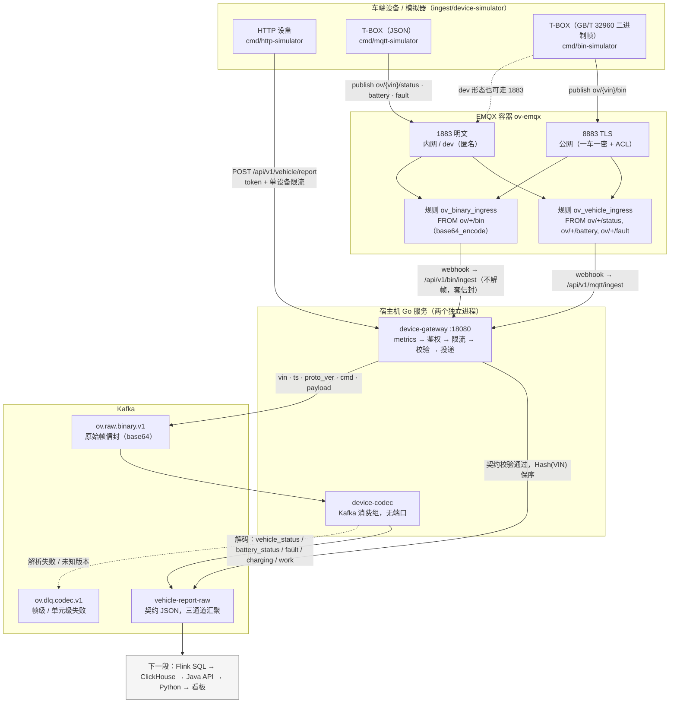
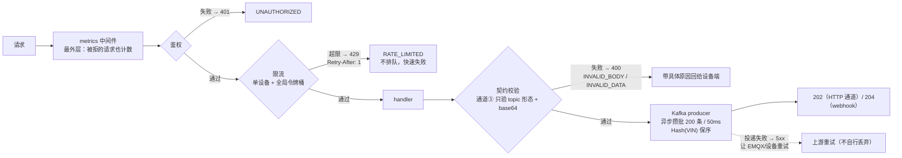
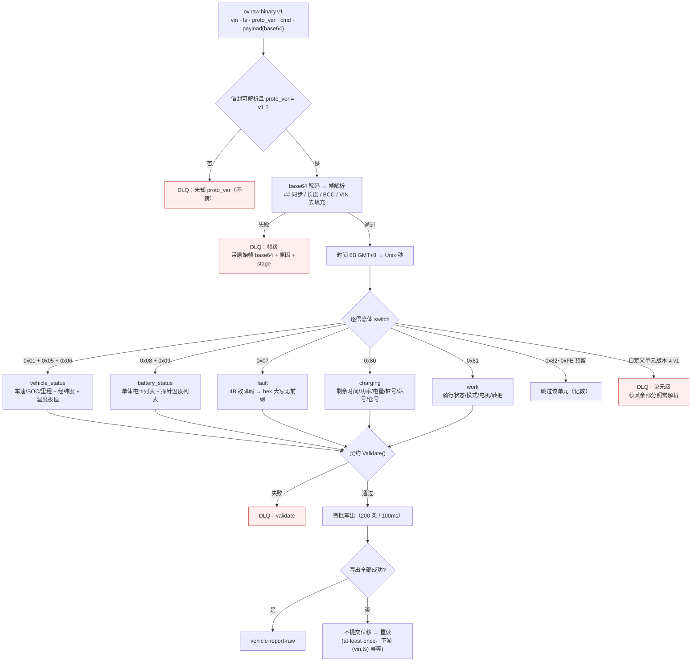
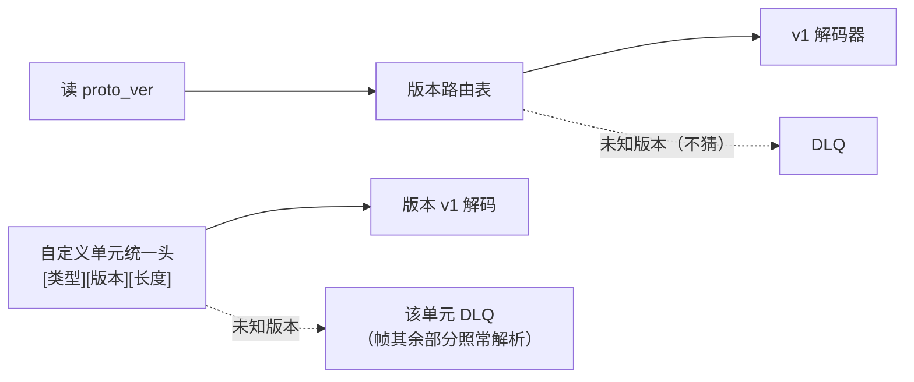

# 接入层端到端流程说明（v1 · 2026-09-17）

> **定位**：把"车端怎么造数据 → 设备怎么上报 → 网关怎么治理 → codec 怎么翻译 → contracts 怎么定"串成一条线，
> 并逐项说明**用了什么策略、为什么这么设计**。
> 设计权威版本仍在《接入层与车端接入网关设计-v1.md》与《GB32960-二进制协议与字段映射-v1.md》；本文是流程视角的综合与索引。
> 进度与状态见《roadmap/项目进度.md》。

---

## 0. 一页鸟瞰



**不变量：信封一份** —— 无论从哪条门进来，下游看到的都是同一个 `VehicleReport`。

### 0.1 分流依据（避免误读）

| 维度 | 真相 |
|---|---|
| 分流依据 | **topic**（`/bin` vs `/status·battery·fault`）决定走哪条规则与网关端点；**listener**（1883/8883）只决定传输安全与设备认证 |
| 1883 vs 8883 | 8883 = TLS + 一车一密（公网形态），1883 = 明文匿名（内网/dev）；**两者都能发任意 topic** |
| 两个 webhook | `device_gateway` → `/api/v1/mqtt/ingest`（JSON 校验）；`device_gateway_bin` → `/api/v1/bin/ingest`（透传不解析） |
| DLQ 归属 | **只有 codec 有 DLQ**；网关失败一律返回 5xx 交给 EMQX 缓冲重试（不自行丢弃） |
| 汇聚点 | `vehicle-report-raw`：三条通道 + codec 解码产物在此汇成同一份契约 JSON |

---

## 1. 车端模拟器：怎么"造"数据

### 1.1 为什么需要它 / 有哪些工具

没有真实车队时，模拟器是**唯一可控的压力与形态来源**；它同时充当 codec 的**对拍数据源**（独立实现同一份协议规格）。

| 工具 | 通道 | 用途 |
|---|---|---|
| `cmd/http-simulator` | HTTP → 网关 | 联调 + HTTP 通道压测 |
| `cmd/mqtt-simulator` | MQTT(JSON) → EMQX | 完整链路验证 + 长连接压测 |
| `cmd/bin-simulator` | MQTT(GB/T 32960 帧) → EMQX | 二进制链路联调/压测/对拍 |
| `cmd/security-check` | MQTT(TLS 8883) | 公网安全基线六项自检 |

三者共享 `internal/`：`simdata`（数据分布）+ `simframe`（造帧）+ `simconn`（连接/身份）。

### 1.2 虚拟车辆模型

| 策略 | 做法 | 理由 |
|---|---|---|
| VIN 规则 | `OV%08d`（0~N） | 与真实 VIN 规则解耦，便于按序号批量灌凭证 |
| 独立随机源 | 每车 `rand.NewPCG(id, id>>32)` | 各车数据分布独立可复现，压测可重放 |
| 随机相位 | 首次发送前随机 jitter（0~interval） | 防千车同刻齐发（惊群） |
| 分批爬坡 | 每批 256 台、批间隔 100ms | 连接风暴削峰（真实设备行为） |
| SOC 演化 | 每周期掉 0.01~0.06%，<5% 触发"换电"回满 | 模拟真实骑行/换电闭环，让充电/满电分支被覆盖 |

### 1.3 数据分布策略（造什么样的数）

| 数据 | 分布规则 | 设计意图 |
|---|---|---|
| 车速 | 0~45 km/h | 两轮车市区骑行，覆盖驻车/行驶两态 |
| 电压/电流 | 55~67V；放电 2~12A | 覆盖 48V/60V 平台；电流符号遵循契约（放电正） |
| 单体电压 | 16 串，名义 3.45V±50mV | §5.1 造数规则 |
| 欠压注入 | 5% 概率一节 <2.5V | 供"告警链路"演练（不是只造健康数据） |
| 探针温度 | 4 路，基线 25~35℃；充电 +5~10℃ | 覆盖充电温升 |
| 高温注入 | 1% 概率 >60℃ | 对应第 1 阶段 Flink 作业"高温电池"指标 |
| 充电业务 | SOC>99.9 视为充电完成窗口，附带 0x80（剩余时间/功率/电量/桩号/站号/仓号） | 让 charging 分支有真实样本 |
| 工况 work | 由车速反推转速/功率；3% 概率造能量回收（负转矩） | 覆盖 work 分支与有符号字段 |
| 故障 | 1% 概率附带 0x07 报警（E1001） | 事件类数据必达性验证（QoS1） |

### 1.4 造帧策略（`simframe`）

| 策略 | 做法 |
|---|---|
| 帧骨架 | `## (2B) + 命令单元(2B) + VIN(17B 左对齐右补 0x00) + 加密(1B) + 长度(2B 大端) + 数据单元 + BCC(1B)` |
| BCC | 命令单元首字节至数据单元末字节逐字节异或（发送端算、接收端验） |
| 时间字段 | 6B `yy MM dd HH mm ss`，**GMT+8 明文**（国标口径，《GB32960 映射》§8-③） |
| 一帧多信息体 | 0x01+0x05+0x06+0x08+0x09+0x81 常规串联，0x80/0x07 条件附带 |
| 无效值约定 | 本项目不上报的国标字段填 0xFF/0xFFFF，由 codec 丢弃 |
| 黄金样本 | 固化 58B（0x08+0x09）与 142B（全 8 类信息体）两份 hex，与 codec 双端各存一份**对拍** |

### 1.5 连接与压测策略

| 策略 | 做法 | 理由 |
|---|---|---|
| 两个身份形态（`simconn` 统一） | dev：`clientid=dev-{VIN}` + 匿名 + 明文；生产：`clientid=username=VIN` + `pw-{VIN}` + TLS | 同一套模拟器覆盖内网联调与公网演练，零代码切换 |
| QoS | 周期状态 QoS0；故障 QoS1 | 周期可丢、事件必达（at-least-once，下游幂等） |
| 发布等待语义 | 只等本地排队（`WaitTimeout`），不等端到端 ACK | 压测测吞吐，不被逐条 RTT 拖死 |
| 连接重试 | 初次连接失败继续重试并计数 | 千台开局是连接风暴，避免把瞬时拥塞误判为永久离线 |
| 压测位置 | 大并发压测在容器网内跑（Rancher 宿主转发上限 ≈185 连接/端口） | 本机限制，见 `deploy/README` Q9 |

### 1.6 安全基线自检（`security-check`）

六项可重复执行：① TLS+正确凭证连通 ② 匿名拒 ③ 错密码拒 ④ 合法设备发他人 topic 拒且断开 ⑤ 明文打 8883 失败 ⑥ 明文 1883 dev 形态回归通过。
**判据意义**：任一不过 → 公网路径未达基线，不得开放 8883。

---

## 2. 设备数据怎么上报

### 2.1 三条上报路径

| 通道 | 链路 | 适用设备 | 治理位置 |
|---|---|---|---|
| ① HTTP | `POST /api/v1/vehicle/report` | App、充电桩、轻量设备 | 网关全权（鉴权+限流+校验） |
| ② MQTT JSON | `ov/{vin}/{status,battery,fault}` → EMQX 规则 → `/api/v1/mqtt/ingest` | 车端 T-BOX（长连接/弱网/省电） | EMQX 管连接/QoS，网关管契约 |
| ③ MQTT 二进制 | `ov/{vin}/bin`（GB/T 32960 帧）→ EMQX 规则(base64) → `/api/v1/bin/ingest` | 真实固件（省流量、标准帧） | 同上；解析归 codec |

### 2.2 topic 契约与 QoS 策略

> 表见《接入层与车端接入网关设计-v1.md》**§4.2（唯一源）**。记忆要点：周期类（`status`/`bin`）QoS0 可丢；事件类（`fault`）QoS1 必达，重复由下游 `(vin, ts)` 幂等吸收。

### 2.3 频率与补发策略（国标口径，《GB32960 映射》§3.1）

| 场景 | 策略 |
|---|---|
| 正常上送 | 周期 ≤30s，**建议 10s**（模拟器默认 10s） |
| 故障 | 1s 频率补报故障点**前后各 30s** |
| 弱网补发（0x03） | 本地缓存 → 链路恢复补传，窗口 ≤24h；时间=数据发生时间；**热事件优先于普通数据** |
| 去重 | 下游按 `(vin, ts)`（fault 再加 `fault_codes`）幂等 |

### 2.4 身份与安全策略

- 内网路径：1883 明文 + 匿名（dev- 前缀 clientid）；应用层 token 白名单
- 公网路径：**8883 TLS + 一车一密**（username=clientid=VIN，EMQX 内置库）+ **ACL**（只能 pub `ov/${clientid}/#`，越权即断）
- 红线：TLS/一车一密/ACL 未就绪不得开放 8883

---

## 3. 网关怎么处理（治理五环）

### 3.1 处理链与通道差异



| 环节 | 通道① HTTP | 通道② JSON webhook | 通道③ 二进制 webhook |
|---|---|---|---|
| 鉴权 | 设备 token 白名单（支持 dev 模式） | webhook 共享密钥 | webhook 共享密钥 |
| 限流 | 单设备 + 全局令牌桶 | 仅全局（单设备在 EMQX 协议层） | 仅全局 |
| 校验 | `VehicleReport.Validate()` | 同左 + topic 回填 VIN/type | **不校验 payload**（不解帧）→ 只验 topic 形态 + base64 |
| 投递 | `vehicle-report-raw` | 同左 | `ov.raw.binary.v1`（信封含 vin/ts/proto_ver/cmd/payload） |
| 响应 | 202（受理） | 204（webhook 惯例） | 204 |

### 3.2 鉴权策略

| 策略 | 做法 | 理由 |
|---|---|---|
| 静态白名单（现） | `DEVICE_TOKENS` + `GATEWAY_DEV_MODE` 放行 `dev-` 前缀 | 第 1 阶段最小可用；动态鉴权等 Java 档案服务 |
| webhook 密钥 | `X-Webhook-Token` 共享密钥（与 `emqx.conf` 一致） | 只信任自家 EMQX；§5.3 四条对齐线之一 |
| 危险配置告警 | 启动时对 dev 模式/默认密钥打 WARN | 安全内建在启动流程，不靠人记 |

### 3.3 限流策略

| 策略 | 参数 | 理由 |
|---|---|---|
| 单设备令牌桶 | 10 条/s | 掐住"单设备发疯"（50/s 冲击实测被削到 10.1/s） |
| 全局令牌桶 | 5000 条/s（本机压测调到 30000） | 防"万车惊群"；配合 Kafka 天然削峰 |
| 拒绝语义 | 429 + `Retry-After: 1`，**不排队** | 快速失败让设备端自己退避，网关内存不堆消息 |
| 限流器状态 | 内存态（第 2 阶段 Redis 化） | 单副本够用；多副本前必须外置（军规②） |

### 3.4 校验策略（契约校验是唯一漏斗）

- 解析失败 → 400 `INVALID_BODY`（含 64KB 上限，二进制 96KB）
- 校验失败 → 400 `INVALID_DATA`（**消息体带具体原因**，便于设备端自排查）
- 缺省回填：`schema_version` 空 → `v1`（保证进 Kafka 的消息显式带版本）
- 未知版本 → 拒绝（fail-fast，防按错误格式解析未来报文）
- 通道② 契约回填：`type`/`vin` 缺失时按 topic `ov/{vin}/{type}` 推断

### 3.5 投递策略

| 策略 | 参数 | 理由 |
|---|---|---|
| 异步 + 攒批 | 200 条 / 50ms | HTTP 链路不被 Kafka 拖慢；延迟代价 ≈50ms |
| 分区 | `Hash(key=VIN)` | 同一辆车进同一分区 → 局部有序 |
| 持久性档 | `RequireOne`（第 1 阶段） | 性能优先；事件类改 RequireAll 随 topic 家族拆分 |
| 失败语义 | 返回 5xx 让上游重试（EMQX 缓冲重试 / 设备重试） | 兜底不丢；重复由下游幂等 |
| 优雅退出 | SIGTERM → 停收 → producer Close 冲刷（10s 宽限） | 压测实测受理≈落盘，零丢失 |

### 3.6 可靠性策略（故障矩阵）

| 故障 | 兜底 | 实测 |
|---|---|---|
| 网关宕机 | EMQX webhook 缓冲重试（`request_ttl=300s` + `health_check=5s`） | 补投率 100%（修复 TTL 赛跑后） |
| Kafka 不可用 | 客户端内部缓冲 + 5xx 重试 | pause 45s 被缓冲完全吸收，零失败 |
| EMQX 宕机 | 设备 AutoReconnect，生产 LB 摘除 | 300 设备全部重连 |
| 单设备发疯 | 单设备令牌桶 | 50/s 削到 10.1/s |
| QoS1 重复 | 下游 `(vin, ts)` 幂等 | 实测均带完整幂等键 |

**核心设计**：网关内存里**不**堆消息（无状态才扩得动），缓冲职责推给两侧专业组件（EMQX / Kafka）。

### 3.7 可观测策略

- 指标：`requests_total{path,result}` / `request_duration_seconds` / `kafka_write_total{topic,result}` / inflight
- pprof 按需剖析；Grafana 面板 provisioning（面板即代码）
- **三处对账公式**：EMQX 命中 ≈ 网关 ok ≈ Kafka write ok（差异必须可解释）

---

## 4. codec 怎么处理（L1→L2 翻译）

### 4.1 定位与不变量

- 只做翻译：消费 `ov.raw.binary.v1` → 输出 `VehicleReport` 到 `vehicle-report-raw`
- **不做**：鉴权/限流（网关职责）、业务判断；**无状态**（消费组加副本即横扩）
- 不变量：**信封一份** —— 无论线协议怎么演进，输出永远是同一个 `VehicleReport`

### 4.2 处理流程与失败分支（一张图看完决策）



### 4.3 帧解析策略

| 步骤 | 规则 | 失败后果 |
|---|---|---|
| 帧同步 | 起始符必须 `##` | 整帧 DLQ |
| 长度校验 | `24 + 声明长度 + 1 == 实际长度` | 整帧 DLQ |
| BCC 校验 | 逐字节异或比对 | 整帧 DLQ |
| VIN | 去尾部 0x00 填充（《GB32960 映射》§8-①） | —— |
| 时间 | 6B GMT+8 → Unix 秒（《GB32960 映射》§8-③） | 不足 6B → 整帧 DLQ |

### 4.4 版本路由与版本纪律


新协议版本 = **新增解码器**，不改存量代码（open-closed）。

### 4.5 信息体解码与拆分/合并规则（《GB32960 映射》§8-④）

| L1 信息类型 | 内容 | → L2 `type` |
|---|---|---|
| 0x01 整车 + 0x05 位置 + 0x06 极值 | 车速/SOC/里程、经纬度、温度极值 | **合并**为 `vehicle_status` |
| 0x08 电压 + 0x09 温度 | 单体电压列表、探针温度列表 | **合并**为 `battery_status` |
| 0x07 报警 | 故障码列表（4B/个 → hex 大写无前缀） | **独立**为 `fault` |
| 0x80 charging | 剩余时间/功率/电量/桩号/站号/仓号 | `charging` |
| 0x81 工况 | 骑行状态/模式/电机/转把 | `work` |

一帧可产出多条 L2 消息（按信息体存在与否懒创建）。

### 4.6 字段转换策略

| 策略 | 例子 |
|---|---|
| 精度换算 | 车速 ×0.1、单体电压 ÷1000（**用除法**避免 1 ulp 误差）、经纬度 ×1e-6 |
| 偏移量 | 电流 −1000A、温度 −40℃ |
| 有符号 | 电机转矩/功率（负=能量回收） |
| 枚举翻译 | L1 数字码 → L2 字符串（`0x01→riding`、`0x03→sport`），翻译表硬编码在 v1 |
| 无效值丢弃 | 0xFF/0xFFFF 字段不设置（契约全可选，天然兼容） |
| 交叉校验机会 | 0x08 子系统电压/电流与整车口径可互验 |

### 4.7 失败策略（两级 DLQ）

| 级别 | 触发 | 后果 |
|---|---|---|
| 帧级 | 同步/长度/BCC/时间/未知 proto_ver | **整帧**进 DLQ（带原始帧 base64 + 原因 + stage） |
| 单元级 | 自定义单元未知版本、信息体长度不足 | **仅该单元**进 DLQ，帧其余部分照常解析 |
| 字段级 | 非法枚举码/无效值 | 只丢该字段，**不进 DLQ** |

### 4.8 交付语义

| 策略 | 做法 | 理由 |
|---|---|---|
| at-least-once | **写出全部成功才提交位移** | 崩溃 → 重读；重复由下游 `(vin, ts)` 幂等 |
| 微批 | 攒批 200 条 / 100ms 定时冲刷 | 逐条同步写会被 RTT 拖到 ~1 条/s（实测教训） |
| 监控 | flush 耗时 >200ms 打 WARN，每 5s 打处理统计 | 让性能退化可见 |
| 实测 | 100 台/20fps 突发下 lag 归零 | 与网关同级的实时性 |

---

## 5. contracts 契约怎么定

### 5.1 两层契约

| 层 | 内容 | 定义处 |
|---|---|---|
| **L1 线协议** | 二进制帧（GB/T 32960 框架 + 自定义单元） | 《GB32960-二进制协议与字段映射-v1.md》 |
| **L2 标准契约** | `VehicleReport` JSON | 设计文档 §4.1 + `ingest/device-contracts/vehicle/vehicle.go` |

关系：codec 是两层之间的唯一翻译点；**L1 怎么变，L2 不变**（信封一份）。

### 5.2 结构设计

```json
{ "vin": "OV20260001", "ts": 1789619400, "type": "vehicle_status",
  "schema_version": "v1", "model": "A100",
  "data": { "...各 type 用各自子集, 全可选..." } }
```

| 字段 | 策略 | 理由 |
|---|---|---|
| `vin` | 必填，5~32 字符，Kafka 分区 key | 保序锚点 + 幂等键之一 |
| `ts` | 必填，Unix 秒，容差 [−7 天, +5 分钟] | 允许补发，拒绝明显错时 |
| `type` | 必填枚举（5 值） | 下游分发依据；L1 多类型映射到少量稳定 L2 类型 |
| `data` | **全可选**（omitempty） | 新增字段向后兼容；不同 type 用不同子集 |
| `schema_version` | 缺省回填 `v1`，未知拒绝 | 信封 v2；死线=首批固件冻结前 |
| `model` | 暂可缺省，第 4 阶段 Registry 后必填 | 多车型演进钩子 |

### 5.3 字段语义与校验（节选）

| 字段 | 范围/语义 |
|---|---|
| `speed` / `soc` | [0,300] km/h；[0,100] % |
| `current` | 放电正/充电负 |
| `temp_max/min` | [−40,150] ℃ |
| `lng` / `lat` | WGS84，[−180,180] / [−90,90] |
| `fault_codes` | `type=fault` 时必填非空；hex 大写无前缀 |
| `cell_voltages` / `probe_temps` | 元素 [0,5] V / [−40,150] ℃（0x08/0x09 载体） |
| `remain_charge_min` / `charge_power` / `charge_kwh` / `slot_no` | [0,6000] / [0,100] / [0,100] / [1,254] |
| `ride_state` / `ride_mode` | `riding/parked/pushing/reverse`；`eco/standard/sport` |
| `motor_rpm` / `throttle` | [0,20000]；[0,100] |

### 5.4 版本策略

| 策略 | 做法 |
|---|---|
| 兼容优先 | 只增字段不改语义；删/改语义 = 新版本 |
| fail-fast | 网关与 codec 都拒绝未知版本（宁可拒绝也不猜） |
| 前移的时机 | 信封 v2 字段**提前**到首批固件冻结前（固件烧进车就改不动） |
| 声明式收口 | 第 4 阶段 Schema Registry；中间态"轻量查表层"可提前 |

### 5.5 代码组织与治理

| 位置 | 内容 | 谁消费 |
|---|---|---|
| 根 `contracts/` | 语言无关形态（proto / JSON Schema，占位） | 未来各语言绑定 |
| `ingest/device-contracts/` | Go 绑定（`VehicleReport` + Validate） | gateway / codec / simulator |

纪律：契约改动走评审；Go 绑定随消费者放，语言无关形态放根（"全平台宪法"是结构事实，不只是文档表述）。

---

## 6. 端到端对账与验证结论（2026-09-17）

| 链路 | 对账结果 |
|---|---|
| 二进制：模拟器 → EMQX → 网关 → Kafka → codec | 发布 191 帧 = 网关受理 191 = codec offset 追平（lag 0），DLQ 0 |
| 生产安全形态（TLS+一车一密+ACL） | 六项自检全过；191/191 对账相等 |
| 黄金样本对拍 | 58B/142B 两份样本双端一致；对拍机制实抓 1 处 0x08 字节错位 |
| 故障演练 | 6✅1❌ → P1 已修（补投率 100%）；P2 遗留（RequireAll 收口） |

---

## 7. 设计策略索引（速查）

| 类别 | 策略 | 一句话理由 |
|---|---|---|
| 分层边界 | 网关只解包头/不解帧；解析归 codec | 换协议不动网关，协议演进不牵连治理 |
| 分层边界 | L1/L2 两层契约，信封一份 | 下游只认一个形状，线协议自由演进 |
| 契约 | 字段全可选 + fail-fast 版本 | 兼容性靠"只增不改"，安全靠"未知即拒" |
| 可靠性 | 网关无状态不堆消息，缓冲推给 EMQX/Kafka | 有状态才需要备份，无状态才能横扩 |
| 可靠性 | at-least-once + `(vin, ts)` 幂等 | 用下游幂等换掉分布式事务 |
| 可靠性 | 两级 DLQ（帧级/单元级）+ 字段级丢弃 | 失败粒度与恢复成本匹配 |
| 性能 | 异步攒批 200/50ms、Hash(VIN) 保序 | 吞吐与有序兼得，延迟代价显式 |
| 性能 | 微批写出（codec 200/100ms） | 逐条同步写被 RTT 拖死（实测） |
| 安全 | 安全按"接入路径"排，不按阶段 | 威胁模型由网络路径决定 |
| 安全 | 8883 监听器级一车一密，1883 保持匿名 | 内网联调与公网基线互不干扰 |
| 安全 | 自检作为开通前置 | 把"应该安全"变成"可重复验证的安全" |
| 可观测 | 三处对账公式 + 面板即代码 | 数据不丢是可验证命题，不是信念 |
| 演进 | 触发式演进（topic 拆分/Redis 限流/DLQ 复用） | 驱动条件没出现就不做（贪心是长线项目最大死因） |
| 演进 | 提前量三条件（规格定稿+无外部依赖+不引新技术栈） | 二进制链路提前的判据，可复用 |
