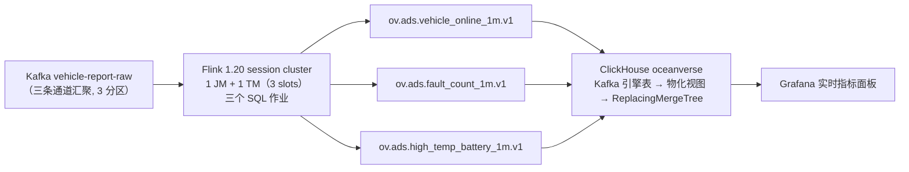

# streaming 流处理 —— Flink SQL 作业（lakehouse/warehouse 下的流处理模块）

> 上位：`../../README.md`（湖仓层：定位与边界）｜`../README.md`（数仓加工：分层规约 ODS→DWD→DWS→ADS）
> 对应《OceanVerse 架构总览》§1.1 实时计算层 / 能力域③计算引擎。
> **本模块职责**：把 `vehicle-report-raw` 里的标准信封（接入层契约）算成**可直接查询的 ADS 指标**，落到 ClickHouse serving 层。
>
> 📚 **简称约定**：《接入层设计》= 《../../../ingest/docs/01-接入层设计-v1.md》｜《GB32960 映射》= 《../../../ingest/docs/02-GB32960协议规格-v1.md》
> 🧭 上下游关系：接入层只负责"把数据干净地送进 Kafka"，**不做业务判断**；"什么算高温"这类业务口径全部在本模块。

---

## 1. 链路位置



> **为什么结果经 Kafka 再进 ClickHouse**（2026-09-20 实测决策，三条路都试过）：
> Flink 侧没有可用的 ClickHouse SQL 连接器 —— ① `flink-connector-jdbc` 的工厂列表里没有 ClickHouse；
> ② ClickHouse 官方 `flink-connector-clickhouse` 只有 DataStream sink 类、**没有 Table/SQL 工厂**
> （内省 jar 确认）；③ Maven Central 上其余构件都是 StreamX/StreamPark 等框架专用。
> 于是走 ClickHouse 原生范式：**Kafka 引擎表 + 物化视图**（全 SQL、无协议 hack，且结果留在 Kafka 可回放）。

---

## 2. 指标口径（**唯一源**）

> 改口径必须**三处同步**：本表 ／ `sql/00-common.sql`（sink 与字段）／ `clickhouse/init.sql`（表与还原）。
> `scripts/check-docs.sh` 的检查⑨ 会核对三处的表名与 topic 是否一致。

| 指标 | 结果表 | 结果 topic | 窗口 | 口径（精确表述） |
|---|---|---|---|---|
| **车辆在线数** | `ads_vehicle_online_1m` | `ov.ads.vehicle_online_1m.v1` | 1 分钟滚动 | 窗口内**上报过的去重车辆数**（`COUNT(DISTINCT vin)`）。是"活跃车辆数"的近似，**不等于** MQTT 长连接在线数 |
| **故障数** | `ads_fault_count_1m` | `ov.ads.fault_count_1m.v1` | 1 分钟滚动 | 按 `fault_code` 分组的次数与涉及车辆数；**先按 `(vin, ts, code)` 去重**（故障走 QoS1，同一条会重复投递） |
| **高温电池** | `ads_high_temp_battery_1m` | `ov.ads.high_temp_battery_1m.v1` | 1 分钟滚动 | `type=battery_status` 每车窗口内**最高** `temp_max`；`≥45℃ → warn`、`≥55℃ → alarm`（阈值 2026-09-20 定，待电池团队确认后进第 2 阶段口径字典） |

**三条全局口径**（三个作业都适用）：

1. **探针帧必须剔除**：`vin NOT LIKE 'OVPROBE%'` —— `scripts/check-pipeline-health.sh` 的探针会真实走完链路，
   不过滤就会污染在线数/故障数（第十轮已发生过一次真实污染）。
2. **时间语义**：事件时间取契约的 `ts`（Unix 秒），watermark 容忍 **10 秒**乱序/迟到；
   迟到超过 10 秒的数据不进任何窗口（第 1 阶段接受，见 §7）。
3. **时间戳过 Kafka 一律用 epoch 秒（BIGINT）**：避免时间戳类型的 JSON 表示随格式/版本变化；
   ClickHouse 侧 `toDateTime(秒)` 还原。

---

## 3. 目录

```
lakehouse/                             ← 湖仓层（手册：lakehouse/README.md）
├── README.md                          #   湖仓定位 / 与 deploy 的边界 / 目录索引
└── warehouse/                         #   数仓：建模与加工（手册：warehouse/README.md，分层规约 ODS→DWD→DWS→ADS）
    └── streaming/                     ←  本模块：流处理
        ├── sql/
        │   ├── 00-common.sql          #     源表(Kafka) + 三个 sink(Kafka) —— 连接参数与字段的**单一源**
        │   ├── 10-online-count.sql    #     作业①：在线数（只有 INSERT）
        │   ├── 20-fault-count.sql     #     作业②：故障数（含 (vin,ts,code) 去重）
        │   └── 30-high-temp.sql       #     作业③：高温电池（45/55 阈值）
        ├── clickhouse/init.sql        #     Kafka 引擎表 + 物化视图 + 目标表（幂等, 可重复执行）
        ├── conf/sql-client-flink-conf.yaml   # 提交容器的客户端配置（连远端 session cluster）
        ├── submit-jobs.sh             #     提交脚本（判据 = 集群里出现**活动状态**的该作业）
        └── README.md                  #     本文件（口径唯一源 + 运行/验证手册）
```

> 第 2 阶段的批处理分层（ODS→DWD→DWS、Iceberg 双写）会作为**兄弟模块** `../batch/` 加入，本模块内容不需要迁移。

作业与 Flink 集群的部署件在 `deploy/`：`deploy/flink/Dockerfile`（自建镜像补连接器）、
`deploy/docker-compose.yaml` 的 `flink-jobmanager` / `flink-taskmanager`（**profile `realtime`**）。

---

## 4. 跑起来（四步）

```bash
cd <repo 根>

# ① 起 Flink（基础八容器若没起, 先 docker compose -f deploy/docker-compose.yaml up -d）
docker compose -f deploy/docker-compose.yaml --profile realtime up -d
curl -s http://127.0.0.1:18088/overview    # 期望 taskmanagers=1, slots-total=3
#   注意用 127.0.0.1 不要用 localhost（本机 8081 被公司 Java 服务占着, 见 deploy/README Q18）

# ② 建 ClickHouse 对象（3 目标表 + 3 Kafka 引擎表 + 3 物化视图 = 9 个）
docker exec -i ov-clickhouse clickhouse-client --user ov_admin --password ov_pass_2026 --multiquery < lakehouse/warehouse/streaming/clickhouse/init.sql

# ③ 提交三个作业（判据 = 集群里真出现该作业名）
bash lakehouse/warehouse/streaming/submit-jobs.sh

# ④ 看结果
docker exec ov-clickhouse clickhouse-client --user ov_admin --password ov_pass_2026 \
  --query "SELECT * FROM oceanverse.ads_vehicle_online_1m ORDER BY window_start DESC LIMIT 5 FORMAT PrettyCompact"
#   Grafana: http://localhost:3000 → Dashboards → "realtime 实时指标（在线数 / 故障 / 高温电池）"
#   该看板 realtime-metrics（4 图）：最新在线数 / 在线数趋势 / 故障数按码 / 高温告警表

# ⑤ 自检（两条, 都是端到端判据, CI 里也跑）
bash scripts/check-realtime-e2e.sh        # 出数口径: 在线数/故障去重/高温分级/探针不污染（约 5 分钟）
bash scripts/check-realtime-restart.sh    # 重启不丢窗口: 取消 → 停机期间灌数 → 重提 → 数据仍进表（约 3 分钟）

# 检查点落盘（P1 的物理证据, 不是"配置写了"）
curl -s http://127.0.0.1:18088/jobs/overview | python3 -c "
import json,sys,urllib.request as u
for j in json.load(sys.stdin)['jobs']:
    if j['state']=='RUNNING':
        c=json.load(u.urlopen('http://127.0.0.1:18088/jobs/%s/checkpoints'%j['jid']))['counts']
        print(j['name'], c)"
docker exec ov-minio sh -c 'mc alias set local http://127.0.0.1:9000 ov_minio ov_minio_2026 >/dev/null; mc ls --recursive local/oceanverse-flink/checkpoints | head'
```

产生测试流量（另开终端；三条通道任选）：

```bash
cd ingest/device-simulator
go run ./cmd/mqtt-simulator -broker tcp://localhost:11883 -devices 40 -interval 5s -duration 120s -fault-pct 8
go run ./cmd/bin-simulator  -broker tcp://localhost:11883 -devices 20 -interval 10s -duration 120s
#   本机 EMQX 明文端口是 11883（deploy/.env 覆盖, 见 deploy/README Q10）
```

> 高温数据：模拟器的 `temp_max` 是 20~45℃（`simdata`），**基本触发不了 45℃ 阈值**。
> 验证作业③请显式注入，例如：
> ```bash
> curl -s -o /dev/null -X POST http://localhost:18080/api/v1/vehicle/report \
>   -H "X-Device-Token: dev-OV00000002" -H 'Content-Type: application/json' \
>   -d "{\"vin\":\"OV00000002\",\"ts\":$(date +%s),\"type\":\"battery_status\",\"data\":{\"temp_max\":58,\"soc\":65}}"
> ```

---

## 5. 验证（2026-09-20 实测，非推演）

**① 端到端三个作业都出数**（40 台 JSON + 20 台二进制模拟器 + 注入高温）：

| 结果表 | 实测 |
|---|---|
| `ads_vehicle_online_1m` | 每分钟 40 台 / 984~1002 条上报（与 40 台 × 5s 上报吻合） |
| `ads_fault_count_1m` | 5 个故障码 × 每分钟 79~116 次、涉及 30~39 台车 |
| `ads_high_temp_battery_1m` | 注入的 6 台车按 47℃→`warn` / 58℃→`alarm` 正确分级 |
| 探针污染 | `WHERE vin LIKE 'OVPROBE%'` 命中 **0 行** ✅ |

**② QoS1 去重（可判定的对照实验）** —— 这是作业②唯一的正确性前提：

```
输入（raw topic 实测 4 条）:  A=(OV…99, T,   ZTEST) ×2  ← 模拟 QoS1 重复投递
                              B=(OV…99, T+1, ZTEST)
                              C=(OV…98, T,   ZTEST)
期望:                         该窗口 ZTEST fault_cnt=3（A 只算 1 次）, vehicle_cnt=2
实测:                         fault_cnt=3, vehicle_cnt=2   ✅
```

**③ 水位线空闲超时（2026-09-20 修）**：`scan.watermark.idle-timeout = 30s` —— 3 个分区里只要有 1 个暂时没有数据，默认行为会让**整条水位线停住**，于是所有窗口都不触发、指标迟迟不更新（实测：一次重启后的重放 5 分钟只推进 2 分钟事件时间）。

**④ 消费组隔离（2026-09-20 修）**：三个作业**曾经共用** `properties.group.id` —— 那是个隐患：
共用时 Kafka 会把 3 个分区**分给三个消费者各一个**，每个指标只能看到 **1/3 的数据**且不会报错；
实测还观察到反复 rebalance 导致源算子长时间不读（`numRecordsOut` 长时间为 0）。
现改为 **一作业一消费组**（`flink-realtime-{online,fault,hightemp}-1m`）：
`00-common.sql` 里写占位符 `__JOB_GROUP_ID__`，由 `submit-jobs.sh` 按作业替换后提交
（Flink 的 SQL Client **不支持** `${VAR}` 替换 —— 已实测）。
验证：TM 日志里三个 `groupId=` 各不相同；且每个作业都能读到全量流。

**⑤ 对账**：网关 `requests_total` ≈ raw topic 消息数（含历史累计）→ 三个结果 topic 条数
→ ClickHouse 行数，逐段可解释（见 `scripts/check-pipeline-health.sh` 的受理==落盘判据）。

**⑥ 检查点真的落了 MinIO（2026-09-20 P1，物理证据）**：三个作业的 `completed` **随检查点递增**
（首次观测 1，`failed` 恒 0），Prometheus `flink_jobmanager_job_numberOfCompletedCheckpoints` 同步增长，
MinIO 侧出现实体对象 `oceanverse-flink/checkpoints/<jid>/chk-N/_metadata`（首次观测 8.6KiB / 9.5KiB）。
**判据取"对象真的在桶里"+"计数真的在涨"，不取"配置文件里写了"** —— 原因见下方那段。

```bash
# 计数（三个作业各一行, completed 应递增、failed 应为 0）
curl -s http://127.0.0.1:18088/jobs/overview | python3 -c "
import json,sys,urllib.request as u
for j in json.load(sys.stdin)['jobs']:
    if j['state']=='RUNNING':
        print(j['name'], json.load(u.urlopen('http://127.0.0.1:18088/jobs/%s/checkpoints'%j['jid']))['counts'])"
# 对象（应看到 <jid>/chk-N/_metadata）
docker exec ov-minio sh -c 'mc alias set local http://127.0.0.1:9000 ov_minio ov_minio_2026 >/dev/null; mc ls --recursive local/oceanverse-flink/checkpoints'
```
**sink 的 exactly-once 不是"配了就算"**：Kafka 事务协调者里能直接列出本层的事务 ID（形如
`<每作业前缀>-<subtask>-<检查点号>`），状态是 `CompleteCommit`/`Empty`（没有挂死的事务）：

```bash
docker exec ov-kafka /opt/kafka/bin/kafka-transactions.sh --bootstrap-server kafka:9092 list
# oceanverse-online-1m-0-1  …  oceanverse-fault-1m-1-4  …  oceanverse-hightemp-1m-0-10
```

这同时证明了三件事：① 事务写**真的开着**（没有静默降级成 at-least-once）；
② **每作业前缀互不冲突**（共用前缀会让两个作业的事务互相覆盖）；
③ 事务随检查点提交（`CompleteCommit`），没有长期挂着的半开事务。

**为什么要看对象而不是看配置**：P1 落地时 compose 上的检查点配置**根本没进 JobGraph**——
`execution.checkpointing.interval: 60s` 只写在 JM/TM 上，作业跑满 3 分钟检查点仍是 `total=0`；
只看配置文件会得出完全相反的结论（详见 §7 边界 1c 与 deploy/README Q20）。

**⑦ 位移可观测（P1）**：数据流过后，raw topic 上出现三个**一作业一组的已提交位移**：

```bash
for g in flink-realtime-online-1m flink-realtime-fault-1m flink-realtime-hightemp-1m; do
  docker exec ov-kafka /opt/kafka/bin/kafka-consumer-groups.sh \
    --bootstrap-server kafka:9092 --describe --group "$g" | tail -3
done
```

某次实测快照（列含义：已提交位移 / 末尾位移 / lag；位移数值本身随时间变化，**要看的是"三组都存在且几乎相同"**）：

```
flink-realtime-online-1m   vehicle-report-raw  0  10011/10011 (lag 0) ...  2  10362/10365 (lag 3)
flink-realtime-fault-1m    vehicle-report-raw  0  10011/10011        ...  2  10363/10365 (lag 2)
flink-realtime-hightemp-1m vehicle-report-raw  0  10011/10011        ...  2  10362/10365 (lag 3)
```

**三组的位移几乎相同**，这同时也是"消费组隔离生效"的又一证据：共用消费组时 Kafka 会把 3 个分区
**分给三个作业各一个**，三组位点会明显错开且各少 2/3 数据（判据见 `scripts/check-pipeline-health.sh`）。

**⑧ 重启不丢窗口（P1 的核心命题，`scripts/check-realtime-restart.sh` 9 项全过，约 2.5 分钟）**：
（下面是一次本机实测的输出摘要；位移数值每轮不同，判据是"停机期间那条数据最终进了表且去重后一行"）

```
阶段 A（作业在跑）: 注入 OVRST00001/RSTA1 → 落表 ✅；检查点 5 → 6 完成（位移随之提交）✅
取消三个作业          ✅（停机开始）
阶段 B（停机期间）: 注入 OVRST00002/RSTB1
  负向对照① 结果表里没有 RSTB1（确未提前进表）                       ✅
  负向对照② 末尾位移 20394 > 取消时已提交位移 20385（9 条未消费数据）  ✅ ← 恢复不可能来自 latest
重新提交三个作业      ✅ RUNNING
  停机期间的数据已进结果表（RSTB1）—— 窗口没因重启断档                ✅
  已提交位移 20385 → 20394（补读完成）                              ✅
  幂等落表: 该码去重后恰好 1 行（排序键 (window_start, code)）        ✅
```

> 故障码**每轮带 `HHMMSS` 后缀**（如 `RSTB210141`）：固定码会让第二次运行时的负向对照必然失败
> （上一轮已经把该码写进表了）—— 这是该脚本第二遍跑时**真实暴露**的自身缺陷，已修；
> 同一次修掉的还有"位移断言只读一次"（位移只在检查点完成时提交，必须轮询，否则假红）。

**⑨ 看板可用性**：`realtime-metrics` 的 4 张图逐一用 Grafana 的 `/api/ds/query` 跑过 —— 全部返回数据
（1/6/23/9 行）。做这块时**炸出两个历史遗留问题**（都已修，留档免得重踩）：

- **ClickHouse 数据源自 provision 起就是坏的**：插件（v4.21.3）只认 `jsonData.host`，而 provisioning 里
  只写了 `url` + `port` + `protocol` → 任何查询都报 `[config] invalid server host`。
  此前没有一张面板用过它（面板全是 Prometheus 的），所以这个洞躺了一周多才被第一个 CH 面板炸出来
  —— 又一个"结构上存在 ≠ 真能用"的实例。
- **数据源 provisioning 不在线热载**：改完 `datasources/*.yaml` 必须**重启 Grafana** 才生效
  （面板文件走 `updateIntervalSeconds: 10` 会热载，数据源不会）；另外新建的 JSON 文件权限要与既有面板一致
  （644），权限过窄时 Grafana 会静默跳过。

---

## 6. 运维

**停作业**（重提前必须先停，否则同一作业跑两份 = 重复计算）：

```bash
# 列出运行中的作业
curl -s http://127.0.0.1:18088/jobs/overview | python3 -c "
import json,sys
for j in json.load(sys.stdin)['jobs']:
    if j['state']=='RUNNING': print(j['jid'], j['name'])"
# 取消某个作业（mode=cancel 保留 checkpoint/mode=stop 触发 savepoint）
curl -s -X PATCH "http://127.0.0.1:18088/jobs/<jid>?mode=cancel"
```

**取消 / 重提的语义（P1 之后）**：位点是 `group-offsets`，位移在**检查点完成时**提交（默认 60s 一次），
所以「取消 → 重提」会从**已提交位移**续读，停机期间的数据不会丢（判据 = `scripts/check-realtime-restart.sh`）。
两条注意：
- 想"从头重放"必须先删消费组：`kafka-consumer-groups.sh --delete --group flink-realtime-online-1m`
  （不删就永远从位移续读；`auto.offset.reset=latest` 只在**组内没有位移**时兜底）；
- **savepoint ≠ 必需**：`mode=stop`（打 savepoint 再停）语义更强，但当前三个作业的状态只是窗口聚合，
  重启后从已提交位移重放即可收敛；跨版本升级/改算子拓扑时仍应走 savepoint（见 §7 边界 1c 的收口）。

`submit-jobs.sh` 内置两道**基于活动状态**的判据（都因为踩过同一个坑才加上）：
① **守卫**：同名作业处于活动状态时拒绝提交；
② **回查**：提交后轮询"集群里出现**活动状态**的该作业"才算成功。

> 为什么强调"活动状态"：`/jobs/overview` **会保留已取消/已完成的历史作业**。
> 第一版守卫与回查都只按名字匹配，于是①把刚取消的作业当成"在跑"而拒绝重提，②更糟 ——
> 在一次挂载路径写错、提交其实失败的情况下，被历史作业匹配成 ✅（**假成功**）。
> 两次都是"判据取不到端到端成立的事实"，与本仓 `pipeline-health` 的教训同源。

---

## 7. 已知边界（诚实记录，均为第 2 阶段收口项）

| # | 边界 | 影响 | 收口方式 |
|---|---|---|---|
| ~~1~~ | ~~**未开 checkpoint**：窗口状态在 JM/TM 重启后丢失；启动位点 `latest-offset`~~ | ✅ **已修（2026-09-20 P1）**：检查点落 MinIO（60s 间隔 / 5min 超时 / min-pause 30s）+ 位点 `group-offsets` + sink `exactly-once`；位移可观测（三组各自的已提交位移与 lag），重启不丢窗口（§5 ⑧）。~~曾试 `earliest-offset`「重放式恢复」并实测否决：重放追不上实时, 5 分钟只推进 2 分钟事件时间~~ | —— |
| 1c | **作业级配置只在提交端生效**：写在 compose 的 JM/TM 上**不会**进 JobGraph | 静默失效——"配置看着对、作业根本不检查点"（P1 落地时真正踩到, 3 分钟 0 次） | 已固化为**两处 + 门禁**：提交端 `CLIENT_FLINK_PROPERTIES` 给全、compose 侧作默认值, `scripts/check-docs.sh` ⑩ 逐键比对（含 5 个负向对照） |
| 1d | **Kafka 事务超时 vs broker 上限**：Flink sink 默认 `transaction.timeout.ms = 1h`, broker 默认上限 15 分钟 | 作业提交后**立刻 FAILED**（`InitProducerIdResponse ... larger than the maximum value allowed by the broker`） | 已修：sink 显式 `properties.transaction.timeout.ms=600000`（10 分钟 > 检查点超时 5 分钟, < broker 上限; 键名经 javap 反汇编确认, 见 deploy/README Q21） |
| 1e | **`FLINK_PROPERTIES` 里写注释会被当成配置键**（入口把该变量当 YAML 解析后写回 `conf/config.yaml`） | 实测 12 条注释全变成 `config.yaml` 里的怪键（如 `'#有checkpoint才谈得上failover'`），行内空格被吞 | 已修：注释一律写在块外；`scripts/check-docs.sh` ⑩ 禁止块内出现注释行（负向对照已验） |
| 1b | **水位线会被安静分区拖住**（3 分区里只要 1 个没数据，窗口就不触发） | ✅ 已修：`scan.watermark.idle-timeout = 30s`，空闲分区按「无水」处理 | —— |
| 2 | 结果链路是 **at-least-once**：Flink → Kafka → CH 物化视图 | CH 重启后可能重放少量消息 → 目标表可能有重复 | 目标表已是 `ReplacingMergeTree` + 业务键排序；精确查询用 `FINAL`。更强方案（幂等键/去重表）随第 2 阶段 |
| 3 | **迟到 >10s 的数据不进窗口** | 弱网重传的老数据只进 Kafka、不进指标 | 第 2 阶段：按业务容忍度调 watermark 或用 `allowedLateness` + 侧输出 |
| 4 | 并行度 = 1/作业（3 个作业恰好占满 3 个 slot） | 吞吐上限低（当前量级远未触及） | 扩 TaskManager + 把 `SET 'parallelism.default'` 提到 3（raw topic 已是 3 分区, 可直接吃满） |
| 5 | "在线数"是**活跃车辆数**近似 | 心跳稀疏的车会被算成离线 | 第 2 阶段口径字典加"最近 5 分钟有心跳即在线"，与现口径并存而非替换 |
| 6 | 高温阈值 45/55℃ 未与电池团队确认 | 可能偏离业务定义 | 确认后改进 `30-high-temp.sql` 与 §2 口径表 |
| 7 | **重启自检会推进水位线**：心跳用未来 ts（最多 +70s），把水位线推到墙钟前 ~2 分钟 | 该窗口内其它生产者的数据会被当"迟到"丢弃（本机无真实流量, CI 里排在 e2e 之后跑, 影响受控） | 若要常态化跑: 改用墙钟心跳（代价是每阶段多等 ~80s），或给自检数据单独打标后按标记断言 |
| 8 | **检查点里没有 Kafka 事务的"最终一致"证明**: sink 侧 exactly-once 只覆盖"检查点之间不重复提交" | 若 CH 侧物化视图自身重放（at-least-once）, 目标表仍可能出现重复行 | 目标表是 `ReplacingMergeTree`（按窗口+业务键排序）, 查询用 `FINAL`；`scripts/check-realtime-e2e.sh` 的 QoS1 去重断言覆盖 SQL 侧去重 |

---

## 8. 延伸阅读

- 《接入层设计》—— 上游契约、QoS、探针保留段（`OVPROBE`）的由来
- `deploy/README.md` Q18/Q19 —— 本层踩过的两个环境坑（localhost→`::1`、Flink 角色参数）
- `deploy/flink/Dockerfile` 头注 —— "为什么必须自建 Flink 镜像"与 ClickHouse 连接器的三条死路
