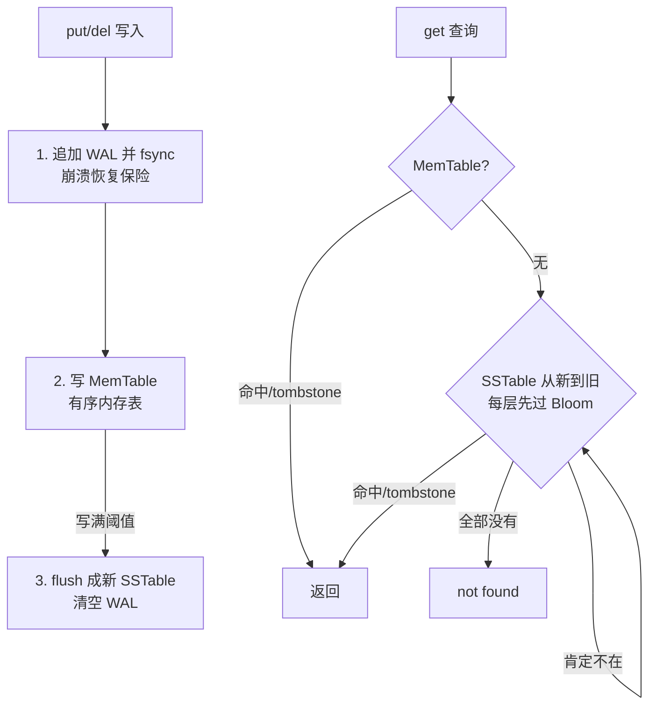

# C 语言 数据库存储引擎基础阶段

> 面向 KV 库、数据库内核与时序存储原型——本阶段把前 15 个阶段的基本功收拢成一个真实存储引擎：WAL 负责崩溃恢复、MemTable 承接写入、SSTable 固化磁盘、Bloom Filter 挡掉无效查询、Buffer Pool/LRU 缓存热页，再用 LSM 与 B+Tree 两条主线回答"读和写到底谁优先"。全部结论有本环境实测背书（WAL 吞吐、Bloom 误判率、LRU 淘汰序列、28 项引擎自测）。

## 1. 概述

数据库存储引擎基础阶段是 C 学习路线的**终点阶段**（roadmap 第 16 节，共 16 节）。目标（roadmap §16）：**面向 KV 库、数据库内核和时序存储原型，理解 WAL、MemTable、SSTable、B+Tree、LSM 和 Buffer Pool 的基础实现**。ph12 给了二进制格式与字节序纪律，ph13 给了可靠落盘与 replay 纪律（kvlog 即 WAL 原型），ph15 给了组件化方法论——本阶段把它们组装成一台能跑的小引擎：project/ 的 lsmkv 就是 ph13 kvlog 升级为完整 WAL 后，再串上 MemTable、SSTable、Bloom Filter 的产物。

| 核心维度 | 覆盖内容 |
|----------|---------|
| WAL | record 布局（magic/type/长度前缀/CRC32）；append-only 追加与 fsync 边界；replay 四道校验；残尾修复 |
| MemTable | 有序内存表（二分定位）；覆盖与 tombstone 删除；写满 flush 阈值 |
| SSTable | 不可变有序文件；数据区 + 稀疏索引 + 定长 footer；索引二分 + 块内顺扫 |
| Bloom Filter | 位数组 + 双哈希；无假阴性、可控假阳性；误判率实测 vs 理论 |
| B+Tree | 高扇出树；数据全在叶子 + 叶子链表；插入分裂（叶子上提副本、内层上提本体） |
| LSM Tree | 写入/查询/恢复三条路径；分层新赢旧；compaction 的代价（只讲原理不实现） |
| Buffer Pool / LRU | 哈希表 + 双向链表 O(1)；LRU 淘汰；脏页写回 |
| iterator | range scan：MemTable 下标区间、SSTable 块内顺扫、多层归并的方向 |

这个阶段只涉及存储引擎的核心组件语义与单机串联（WAL/MemTable/SSTable/Bloom/B+Tree/LSM/Buffer Pool/iterator），**不涉及 mmap 与刷盘语义的系统展开（ph13 mmap、Page Cache 与可靠文件 IO 阶段）、字节序与 varint 等位级编码（ph12 字节序、内存对齐与二进制格式解析阶段）、跨语言 ABI 封装（ph14 C 与 C++ / Python / Rust 互操作阶段）和宏/状态机/错误码方法论（ph15 高级 C 与代码质量阶段）** — 那些是 ph12/ph13/ph14/ph15 阶段的内容；多线程 compaction、并发控制与事务隔离属 ph08 Linux 系统编程阶段的并发专题与更上层的数据库理论（C roadmap 未规划对应阶段），SQL 解析与查询优化是存储引擎之上的查询层，同样不属于本路线。本阶段所有示例一律单线程。

## 2. 来源与演变

存储引擎的两大主线——**先写日志（WAL）**与**就地更新还是追加合并（B+Tree vs LSM）**——都来自 1970~1990 年代的数据库研究，又在 2006 年 Bigtable 之后被 KV 时代重新点燃。**设计哲学一句话：磁盘（乃至 SSD）的随机写远贵于顺序写，存储引擎的全部结构都是在"读成本"与"写成本"之间选边**。

| 版本/里程碑 | 年份 | 主要变化 |
|------|------|---------|
| Bloom Filter | 1970（Burton Bloom） | 用位数组 + 多哈希换"肯定不在/可能在"，空间换查询 |
| B+Tree | 1972（B-Tree 起源；Bayer & McCreight）；叶子链表变体其后改良（1979 Comer 综述系统化） | 高扇出平衡树；数据全在叶子、叶子链表串联——至今仍是关系库索引默认结构 |
| WAL / ARIES | 1970s 起 / 1992（Mohan 等） | "先写日志再改数据"成为崩溃恢复标准范式；ARIES 把 WAL + 回放 + undo 系统化 |
| 缓冲区管理（Buffer Pool） | 1980s（System R 等） | 页缓存 + LRU 族淘汰策略成型；脏页写回规则确立 |
| LSM Tree | 1996（O'Neil 等） | Log-Structured Merge-Tree：随机写转顺序写 + 分层归并，写吞吐优先 |
| Google Bigtable | 2006 | MemTable + SSTable 的工程化命名普及；tablet 即"MemTable + 一串 SSTable" |
| LevelDB / RocksDB | 2011（LevelDB）/ 2013（RocksDB 开源；2012 起 Facebook 内部开发） | LSM 单机库成熟：WAL + MemTable + SSTable + Bloom + compaction 成为 KV 标配 |
| C11 | 2011 | 本文基线：定宽类型（stdint.h）、对齐控制足够表达全部记录格式 |

本文示例以 **C11** 为基线（与全库 ph09~ph15 同一口径；记录格式全靠定宽类型与显式大端，C11 已全部具备），现代工具链（gcc/clang）默认支持，无需额外选项。验证工具链：**Apple clang 21.0.0（cc，macOS arm64，ProductVersion 26.6.2）**。全部代码 `cc -Wall -Wextra -std=c11` 零警告、本机真实编译运行；**WAL 吞吐比、Bloom 误判率、LRU 淘汰序列、SSTable 查询路径均为实测输出**，文档引用的输出与 examples/、exercises/、project/ 的实际运行一致。这个阶段的知识是存储领域五十年里最稳定的部分——WAL 与 B+Tree 的形制五十年未变，变的只是硬件速度比。

## 3. 语法与参数

### 3.1 WAL record 设计

WAL（Write-Ahead Log）的第一性原理：**任何状态变更，先追加一条"我打算做什么"的记录到日志并刷盘，再改内存里的数据结构**。崩溃后重放日志即可重建内存态。record 是 WAL 的原子单位，设计要点全在布局里：

```c
// examples/ex01-wal-record.c —— WAL record 布局（节选, 完整版见 examples/）
/* [magic: u32 "WAL1"][type: u8][klen: u32][vlen: u32][key][value][crc32: u32]
 *   固定头 13 字节; crc32 覆盖 type..value（即 magic 之后、crc 之前的全部字节）。 */
```

四个字段各司其职：

| 字段 | 作用 | 没有它会怎样 |
|------|------|-------------|
| magic | 识别"这是不是我们的记录" | 垃圾数据被当成合法记录解析 |
| type | 区分 PUT / DEL（删除 = tombstone 记录，不是真擦除） | 删除无法表达，日志只能增不能删 |
| klen/vlen | 长度前缀 → 回放方能逐条跳读 | 解析器必须理解 payload 内容才能找下一条 |
| crc32 | 校验完整性（崩溃残写、位衰减在此现形） | 半条记录被当成完整记录，数据悄悄错乱 |

> 多字节字段一律显式大端、长度上限校验（防恶意/损坏文件读出天文数字再分配内存）——这是 ph12 字节序、内存对齐与二进制格式解析阶段的线上格式纪律，本阶段直接沿用不展开。

实测（ex01）：PUT `name=tenet` 编码 26 字节、DEL `name` 编码 21 字节，往返解码 rc=0；翻转 payload 一字节 → rc=-5（CRC 拦截）；破坏 magic → rc=-2（格式拦截）。

### 3.2 append-only log 与 replay

WAL 的物理形态是 **append-only log**：只追加、不修改、不删除（清理靠"整个日志作废重建"，见 3.7 的 flush）。三条纪律（ph13 已立，这里换成 WAL 口径复用）：

1. **O_APPEND + write_full**：每次 write 原子落到文件末尾，短写循环写完（EINTR 重试）
2. **append 返回 ≠ 持久化**：数据只到了内核 Page Cache，`fsync` 返回后才算到达存储设备（macOS 真落盘需 `fcntl(F_FULLFSYNC)`，见 ph13 examples/ex03）
3. **replay 四道校验**：长度够 → magic 对 → 长度不越上限 → CRC 吻合，**任一失败即停在残尾**，报告偏移后 ftruncate 截掉即可继续追加

replay 的校验顺序与残尾处理（ex02 实测，先写 3 条再手工塞 6 字节残尾）：

```text
[1] 追加 3 条后回放: 结果=干净 EOF, PUT=2 DEL=1
[2] 写入 6 字节残尾后回放: 结果=残尾, PUT=2 DEL=1, 残尾偏移=76
    ftruncate 修复后回放: 结果=干净 EOF（恢复干净, 可继续追加）
```

**刷盘频率是 WAL 的核心取舍**（ex02 实测，20000 条记录）：结尾一次 fsync ≈ 48 万~80 万条/s，每条都 fsync ≈ 4.0 万~5.3 万条/s——**差约 11~18 倍**（本机多次运行实测，数值随机器与负载波动，比例结论稳定）。macOS 的 fsync 只到设备缓存，Linux 上差距更大。工程答案是 group commit：多条攒批一次 fsync。

### 3.3 MemTable

MemTable 是 LSM 的内存层：**所有写入先进它，保持 key 有序，写满后整体 flush 成 SSTable**。最小实现 = 动态数组 + 二分定位（ex03）：

```c
// examples/ex03-memtable.c —— 二分定位（节选, 完整版见 examples/）
/* 二分定位: 找到返回下标且 *found=1; 未找到返回插入点且 *found=0 */
static size_t mt_lower(const memtable_t *m, const char *key, int *found) {
    size_t lo = 0, hi = m->len;
    while (lo < hi) {
        size_t mid = lo + (hi - lo) / 2;
        if (strcmp(m->e[mid].key, key) < 0) lo = mid + 1;
        else hi = mid;
    }
    *found = (lo < m->len && strcmp(m->e[lo].key, key) == 0);
    return lo;
}
```

三条语义必须立住（ex03 实测输出对应）：

- **保序**：乱序写入 banana/apple/cherry 后内部是 apple/banana/cherry——有序是 flush 成 SSTable 与 range scan 的前提
- **覆盖**：同 key 再 put 直接换 value（apple 从 1 覆盖为 2）
- **tombstone 删除**：`del` 不挪数组，只把记录标记成 DEL——**删除也是一种写入**，与 WAL/SSTable 的删除语义一致；tombstone 要等 flush/compaction 才真正消失

数组版插入要 memmove 搬移（O(n)），工程上 LevelDB 用跳表（插入 O(log n)）；**定位成本两者同为 O(log n)**，教学版选数组是因为 30 行能讲清语义且天然支持下标区间迭代。

### 3.4 SSTable 文件格式

SSTable（Sorted String Table）= **不可变有序文件**。MemTable flush 时把有序内容整体落成一个新的 SSTable，之后只读不改——"不可变"是它一切优点的来源：并发读不用锁、崩溃不会半改、缓存随便做。本阶段的文件布局（ex04/project 同款）：

```text
[数据区]  entry*: [klen u32][type u8][vlen u32][key][value]   按 key 升序
[索引区]  稀疏索引: 每 4 条记录索引一条: [klen u32][key][off u64]
[bloom 区] bloom 位数组（project/ 版本内嵌; ex04 从简省略）
[footer]  定长: index_off u64 | index_cnt u32 | … | magic u32 "SST1"
```

查询路径三步：**读 footer（定长，从文件尾直接定位）→ 载入索引二分找"最后一个 ≤ target 的索引项" → 跳到 offset 块内顺扫至多 4 条**。稀疏索引是空间与速度的平衡：全量索引内存装不下，无索引只能全扫。实测（ex04）：10 条记录（含 1 条 tombstone）写成 209 字节文件，`get(fox)` 索引二分 2 步 + 块内顺扫命中；`get(deer)` 命中 tombstone 返回"不存在"；比最小 key 还小的查询无需读数据区。

### 3.5 Bloom Filter

SSTable 越多，点查一个**不存在**的 key 越贵——每层都可能白读一次磁盘。Bloom Filter 挂在每个 SSTable 前面：**"肯定不在"直接跳过（零数据区 IO），"可能在"才真去读**。

```c
// examples/ex05-bloom-filter.c —— 双哈希法（节选, 完整版见 examples/）
static int bloom_maybe(const bloom_t *b, const char *key) {
    uint64_t h1 = fnv1a(key, 1), h2 = fnv1a(key, 2);
    for (uint32_t i = 0; i < b->k; i++) {
        uint64_t h = h1 + (uint64_t)i * h2; /* 双哈希模拟第 i 个哈希 */
        size_t bit = (size_t)(h % b->m);
        if (!(b->bits[bit / 8] & (uint8_t)(1u << (bit % 8)))) return 0;
    }
    return 1;
}
```

性质与实测（ex05，插入 10000 个 key，每 key 10 位，k=7）：

- **无假阴性**：已插入的 10000 个 key 回查漏报 0——bloom 说"不在"就肯定不在
- **有可控假阳性**：10 万个未插入 key 探测，实测误判 460 次 = **0.46%**（理论 `(1-e^(-kn/m))^k` = 0.82%；键序列确定故每次运行结果相同，偏差来自双哈希与 FNV-1a 的非理想独立性）
- **不能删**：清一个位会误伤共享该位的其他 key——LSM 里 bloom 随 SSTable 重建，天然回避
- k 的最优点 ≈ (m/n)·ln2 ≈ 6.9：实测理论曲线 k=4 → 1.18%、k=7 → 0.82%、k=10 → 1.02%

### 3.6 B+Tree 基础

LSM 之外的另一条主线。B+Tree 是 1972 年至今的索引默认结构，三条特征：

1. **高扇出**：每节点存几十~几百个 key（阶 = 最大孩子数），树高 log 级——100 万条记录在阶 100 下只有 3 层，每层一次磁盘页读
2. **数据全在叶子**：内部节点只存路标 key；**叶子间用链表串联**——这就是 B+Tree 的 range scan 友好的原因（定位起点叶后沿链表顺序走）
3. **插入分裂保平衡**：节点塞满即分裂，中位 key 上提。**叶子分裂上提的是副本（叶子自己保留该 key，因为数据在叶子）；内部节点分裂上提的是本体（路标不重复保留）**——这一字之差是 B+Tree 实现最易错的点

exercises/sol-05（阶 4 内存版）实测：乱序插入 1..20 后树高 ≤ 3、全部可查、范围扫描 [5,12] 输出严格升序的 8 个 key。B+Tree 在**就地更新**：改一个 key 要找到所在页直接改——随机写，这正是它与 LSM 分野的地方（第 4 章对比）。

### 3.7 LSM Tree 基础

LSM（Log-Structured Merge-Tree）的思路：**把随机写转成顺序写**——写入只追加 WAL + 写内存 MemTable（全是快操作），攒够一批整体 flush 成不可变 SSTable；读则从最新到最旧逐层回退。



关键路径解读：写入快是因为**没有任何磁盘随机写**；查询慢在"可能要看多层"，Bloom Filter 把"这层肯定没有"的层零成本跳过；**tombstone 必须遮挡更旧的层**——project/ 用三态返回（命中/不存在/tombstone）实现这条语义。SSTable 越攒越多时读会退化，工程解法是 **compaction**（后台把多层归并成一层，顺带真正清掉 tombstone 与被覆盖的旧值）——本阶段 project 只增不并，compaction 的成本分析见第 4 章。

### 3.8 Buffer Pool / LRU

存储引擎不直接裸读磁盘——中间隔着 **Buffer Pool**（页缓存）：读页先查池，命中直接用，未命中载入，池满淘汰。淘汰策略的经典选择是 **LRU（最久未用）**，实现 = 哈希表（O(1) 按页号定位）+ 双向链表（O(1) 挪头部/摘尾部）：

```c
// examples/ex06-lru-buffer-pool.c —— 淘汰与脏页写回（节选, 完整版见 examples/）
    } else {                        /* 淘汰 LRU 尾部 */
        pg = p->tail;
        if (pg->dirty) {            /* 脏页先写回模拟磁盘 */
            memcpy(p->disk[pg->page_no], pg->data, 32);
            p->writebacks++;
            printf("    [淘汰写回] 页 %d 是脏页, 写回磁盘\n", pg->page_no);
        } else {
            printf("    [淘汰丢弃] 页 %d 干净, 直接覆盖\n", pg->page_no);
        }
```

**Buffer Pool 与普通 LRU Cache 的唯一本质差别是脏页**：被修改过的页淘汰前必须先写回，否则数据丢失。实测（ex06）：池容量 4 页，写脏页 2 后连读 4 个新页把它逼出——输出 `[淘汰写回] 页 2 是脏页, 写回磁盘`，再读页 2 时从"磁盘"重载、脏数据未丢；全程 12 次访问命中 2 次、写回 1 次。真实引擎里 Buffer Pool 缓存的就是 SSTable 的数据块与索引块。

### 3.9 range scan 与 iterator

点查之外，KV 引擎的另一半是 **range scan**：按序给出 [lo, hi] 区间内的全部 key。各层的迭代器形态：

| 层 | 迭代器实现 | 复杂度 |
|----|-----------|--------|
| MemTable（有序数组） | 二分找 lo 的下标，下标递增即有序遍历 | O(log n + k) |
| SSTable | 索引二分定位块，块内顺扫 + 跨块继续 | O(log b + k) |
| B+Tree | 下行到 lo 所在叶子，沿叶子链表推进 | O(log n + k) |

ex03 实测：`range scan [apple, cherry]` 输出 apple=2、cherry=5（tombstone 的 banana 被跳过）。**多层引擎的 range scan = k-way 归并**：MemTable 迭代器 + 每个 SSTable 迭代器各产一条最小 key，比较后输出并推进——与归并排序同源；遇到 tombstone 要吞掉该 key 的全部旧版本。本阶段 examples/exercises 只要求单表迭代器，多路归并是 project/ 的扩展方向。

> iterator 的一致性快照（scan 期间有新写入怎么办）涉及 MVCC 与事务，不属于本路线任何阶段——工程版做法是"迭代器钉住当前可见的 SSTable 集合"（SSTable 不可变，所以钉住即快照），本阶段只需理解这条思路。

## 4. 底层原理

### 4.1 三种放大：存储引擎的代价度量

LSM 的写快不是免费的，代价用三个"放大"度量（roadmap 必会概念）：

| 放大 | 定义 | 来源 | 本阶段的对应 |
|------|------|------|-------------|
| 读放大 | 一次点查实际要看的层数 | MemTable miss 后逐层查 SSTable | project/ get 从新到旧逐层回退；Bloom 把它压回接近 1 |
| 写放大 | 一条数据实际被写磁盘的次数 | flush + 每轮 compaction 都重写一遍 | WAL 写一次 + flush 写一次（≥2 次）；compaction 再叠加 |
| 空间放大 | 磁盘占用 / 有效数据 | 旧版本与 tombstone 滞留到 compaction | project/ 无 compaction：被覆盖的旧值与 tombstone 永久滞留 |

```text
写放大链条（一次 put 的字节旅程）:
put ──▶ WAL（第 1 次写盘）──▶ MemTable ──flush──▶ SSTable L0（第 2 次写盘）
                                              ──compact──▶ L1（第 3 次）──▶ ……
```

### 4.2 LSM vs B+Tree：一场写与读的取舍

| 维度 | B+Tree（就地更新） | LSM（追加 + 归并） |
|------|-------------------|-------------------|
| 写路径 | 定位到页 → 随机写改页 | WAL 顺序追加 + 内存写，flush 批量顺序写 |
| 读路径 | 沿树下行 log 层，路径确定 | 逐层回退，靠 Bloom 压住读放大 |
| 空间 | 页内碎片（填充因子） | 旧版本滞留，compaction 才回收 |
| 范围扫描 | 叶子链表，天然友好 | 多层归并，实现复杂但有序性相同 |
| 崩溃恢复 | 页原地改 → 需 WAL + 页级 redo/undo | WAL + 不可变文件，恢复只需 replay |
| 适合 | 读多写少、点查敏感（关系库索引） | 写多读多、时序/日志型负载（KV/时序库） |

**没有优劣，只有工作负载**：SQLite/MySQL InnoDB 选 B+Tree，LevelDB/RocksDB/Cassandra 选 LSM——同一套 WAL 纪律两边都在用（"先写日志"与"选哪种索引结构"是正交决策）。

## 5. 使用场景

| 场景 | 用什么 | 依据 |
|------|--------|------|
| 任何需要崩溃恢复的写入 | WAL（先写日志再改状态） | 崩溃最多丢最后一条残记录，replay 重建（ex01/ex02，project/） |
| 写多读多的 KV / 时序存储 | LSM：MemTable + SSTable + Bloom | 随机写转顺序写；project/ lsmkv 即最小可用版 |
| 读多写少的索引 | B+Tree | 读路径确定、页级就地更新（sol-05） |
| 点查不存在的 key 很多 | Bloom Filter | 0.46%~0.82% 误判换零数据区 IO（ex05） |
| 热数据缓存 / 页缓存 | Buffer Pool + LRU | 哈希 + 链表 O(1)；脏页写回（ex06，sol-04） |
| 按序遍历、范围导出 | 有序结构 + iterator | MemTable/SSTable/B+Tree 都天然有序（3.9） |

**不适合**的场景：

- **强事务/多语句原子性**：WAL 只管单条记录恢复，事务的 ACID 需要 undo/隔离层（超出本路线）
- **极低延迟点查且内存装得下**：直接哈希表全内存，别碰磁盘结构
- **大量更新同一批 key 且在乎空间**：LSM 的空间放大会失控，选 B+Tree 或加大 compaction 频率
- **多线程高并发写入**：本阶段全部单线程；并发 MemTable（跳表 + 无锁）与并行 compaction 属工程进阶

**跨语言对比**（为 analysis/ 与 Tenet 合成积累素材）：C 实现存储引擎，所有结构（位数组、链表、树节点、文件布局）都要手工摆内存——这换来的是对每字节去向的完全掌控，RocksDB（C++）与 LevelDB 正是靠这种掌控力成为基础设施；而 Go/Java 的同类实现（Badger、Cassandra）用 GC 换掉手工内存管理，用 interface 换掉函数指针——**C 的代价是纪律，收益是零抽象税；这正是 Tenet 设计系统层特性时的核心权衡样本**。

## 6. 代码示例

> 完整可运行文件在 [`examples/`](./examples/) 目录（编译/运行命令与验证状态见其 README）。本阶段示例均为**正常工程代码**，可任意编译运行；ex02/ex04 的演示文件写 /tmp 且退出时自删。以下所有实测输出来自 Apple clang 21.0.0（macOS arm64）；文档内嵌片段摘录自对应源文件的关键部分（节选可能省略无关行、调整缩进），完整文件以 examples/ 为准。

### 示例 1：WAL record 设计（编码/解码/CRC 拦截）

对应 roadmap 学习内容"WAL record 设计"，完整版见 [`examples/ex01-wal-record.c`](./examples/ex01-wal-record.c)。

```c
// examples/ex01-wal-record.c —— WAL record 编码（节选, 完整版见 examples/）（已验证）
// 验证环境：Apple clang 21.0.0（cc，macOS arm64）
static size_t wal_encode(uint8_t *buf, uint8_t type,
                         const char *key, const char *val) {
    uint32_t klen = (uint32_t)strlen(key);
    uint32_t vlen = (uint32_t)strlen(val);
    put_u32be(buf, WAL_MAGIC);
    buf[4] = type;
    put_u32be(buf + 5, klen);
    put_u32be(buf + 9, vlen);
    memcpy(buf + WAL_HDR_SIZE, key, klen);
    memcpy(buf + WAL_HDR_SIZE + klen, val, vlen);
    size_t total = WAL_HDR_SIZE + klen + vlen;
    /* crc 覆盖 type 字段到 value 末尾（跳过 magic 自身） */
    put_u32be(buf + total, crc32_update(0, buf + 4, total - 4));
    return total + WAL_CRC_SIZE;
}
```

```bash
# 1. 编译并运行
mkdir -p /tmp/ph16c-ex && cc -Wall -Wextra -std=c11 ex01-wal-record.c -o /tmp/ph16c-ex/ex01 && /tmp/ph16c-ex/ex01
```

实测输出关键行（本机一次运行）：

```text
[1] PUT 编码 26 字节, 解码 rc=0: type=PUT key="name" value="tenet"
[2] DEL 编码 21 字节, 解码 rc=0: type=DEL key="name" (value 空=tombstone)
[3] 头 13 字节(hex): 57 41 4c 31 02 00 00 00 04 00 00 00 00   ← DEL 记录的头, magic 即 ASCII "WAL1"
[4] 翻转 key 首字节后解码 rc=-5 (期望 -5: CRC 拦截)
[5] 破坏 magic 后解码 rc=-2 (期望 -2: magic 不符)
```

解读：magic 逐字节可读（`57 41 4c 31` = "WAL1"，大端排布的副产品）；type=02 区分 DEL；CRC 与 magic 两道拦截各归各的错误码。

### 示例 2：append-only WAL（replay 与刷盘取舍）

对应 roadmap 学习内容"append-only log 与 replay"，完整版见 [`examples/ex02-append-replay.c`](./examples/ex02-append-replay.c)。这是 ph13 kvlog 升级为带 type 的完整 WAL 的过渡形态（project/ 里的 wal.c 是它的库化版）。

```c
// examples/ex02-append-replay.c —— replay 四道校验（节选, 完整版见 examples/）（已验证）
// 验证环境：Apple clang 21.0.0（cc，macOS arm64）
        if (magic != WAL_MAGIC || klen > WAL_MAX_KV || vlen > WAL_MAX_KV) {
            *torn_at = off;          /* magic/长度上限拦截 */
            fclose(f);
            return 1;
        }
```

实测输出关键行（本机一次运行；吞吐数值随机器波动，故给出实测区间：批量 fsync ≈ 48 万~80 万条/s，每条 fsync ≈ 4.0 万~5.3 万条/s，差约 11~18 倍）：

```text
[1] 追加 3 条后回放: 结果=干净 EOF, PUT=2 DEL=1
[2] 写入 6 字节残尾后回放: 结果=残尾, PUT=2 DEL=1, 残尾偏移=76
    ftruncate 修复后回放: 结果=干净 EOF（恢复干净, 可继续追加）
[3] 结尾一次 fsync: 20000 条 / 41.7 ms ≈ 479789 条/s
[3] 每条都 fsync  : 20000 条 / 464.5 ms ≈ 43054 条/s
    每条 fsync 比批量慢约 11 倍（数值随机器与负载波动）; macOS 的 fsync
    只到设备缓存, 真落盘用 fcntl(F_FULLFSYNC) 差距更大（见 ph13 ex03）
```

解读：残尾精确停在偏移 76（三条完整记录 26+29+21 字节之后）；刷盘频率差出约一个数量级——group commit 的动机。

### 示例 3：MemTable（有序内存表 + tombstone）

对应 roadmap 学习内容"MemTable"，完整版见 [`examples/ex03-memtable.c`](./examples/ex03-memtable.c)。

```c
// examples/ex03-memtable.c —— tombstone 删除（节选, 完整版见 examples/）（已验证）
// 验证环境：Apple clang 21.0.0（cc，macOS arm64）
static int mt_del(memtable_t *m, const char *key) {
    int found;
    size_t pos = mt_lower(m, key, &found);
    if (!found) return -1;
    free(m->e[pos].val);
    m->e[pos].val = NULL;
    m->e[pos].type = MT_DEL; /* tombstone: 不挪数组, 只改标记 */
    return 0;
}
```

实测输出关键行（本机一次运行）：

```text
[1] 乱序写入 4 次后, 内部保持有序（len=3）:
    apple = 2
    banana = 3
    cherry = 5
[3] del(banana) 后 get rc=1 (tombstone: 记录在, 标记删除)
    内部仍有 3 项——tombstone 要等 flush/compact 才真正消失
[4] range scan [apple, cherry]（迭代器即下标区间）:
    apple = 2
    cherry = 5
```

解读：删除不缩小表（tombstone 占位）；range scan 跳过 tombstone——迭代器语义的雏形。

### 示例 4：SSTable（不可变有序文件 + 稀疏索引）

对应 roadmap 学习内容"SSTable 文件格式"，完整版见 [`examples/ex04-sstable.c`](./examples/ex04-sstable.c)。

```c
// examples/ex04-sstable.c —— footer 定长 + 索引二分（节选, 完整版见 examples/）（已验证）
// 验证环境：Apple clang 21.0.0（cc，macOS arm64）
    fseek(f, -(long)SST_FTR_SIZE, SEEK_END);          /* footer 定长, 文件尾直接定位 */
    uint8_t ftr[SST_FTR_SIZE];
    if (fread(ftr, 1, SST_FTR_SIZE, f) != SST_FTR_SIZE) { fclose(f); return -1; }
    if (get_u32be(ftr + 12) != SST_MAGIC) { fclose(f); return -1; }
    /* … 载入索引后二分: 找最后一个 key <= target 的索引项 */
```

实测输出关键行（本机一次运行）：

```text
[1] 写入 10 条（含 1 条 tombstone）, 文件 209 字节, 稀疏索引每 4 条 1 项
[2] get(fox) rc=0 value=6 （索引二分 2 步 + 块内顺扫）
    get(deer) rc=1 （tombstone → 不存在）
    get(aaa) rc=1 （比第一条还小, 无需读数据区）
```

解读：footer 定长是"从尾倒读元信息"的关键；稀疏索引把数据区扫描限制在 4 条以内。

### 示例 5：Bloom Filter（误判率实测 vs 理论）

对应 roadmap 学习内容"Bloom Filter"，完整版见 [`examples/ex05-bloom-filter.c`](./examples/ex05-bloom-filter.c)（需 `-lm`）。

```c
// examples/ex05-bloom-filter.c —— 双哈希（节选, 完整版见 examples/）（已验证）
// 验证环境：Apple clang 21.0.0（cc，macOS arm64）
        uint64_t h = h1 + (uint64_t)i * h2; /* 双哈希模拟第 i 个哈希 */
        size_t bit = (size_t)(h % b->m);
```

实测输出关键行（键序列确定，每次运行结果相同）：

```text
[1] 已插入 10000 个 key 回查: 漏报 0 个（必为 0, 无假阴性）
[2] 未插入 100000 个 key 探测: 误判 460 次 = 0.46%（理论 0.82%）
[3] k 对误判率的影响（同 m, 同 n, 理论值）:
    k= 4 → 理论误判 1.18%
    k= 7 → 理论误判 0.82%
    k=10 → 理论误判 1.02%
```

解读：无假阴性是 Bloom 的硬保证；实测 0.46% 低于理论 0.82%（双哈希 + FNV-1a 的非理想独立性所致，数量级一致即合格）；k=7 接近理论最优点。

### 示例 6：Buffer Pool / LRU（淘汰与脏页写回）

对应 roadmap 学习内容"Buffer Pool / LRU Cache"，完整版见 [`examples/ex06-lru-buffer-pool.c`](./examples/ex06-lru-buffer-pool.c)。

```c
// examples/ex06-lru-buffer-pool.c —— 命中挪头部（节选, 完整版见 examples/）（已验证）
// 验证环境：Apple clang 21.0.0（cc，macOS arm64）
    page_t *pg = hash_find(p, no);
    if (pg) {
        p->hits++;
        *hit = 1;
        lru_remove(p, pg);
        lru_push_front(p, pg);
        return pg;
    }
```

实测输出关键行（本机一次运行）：

```text
[3] 读页 4（池满 → 淘汰 LRU 尾部; 页 1 此时最旧）:
    [淘汰丢弃] 页 1 干净, 直接覆盖
[4] 写页 2（置脏）再连续读页 5 6 7 8（逼出脏页, 观察写回）:
    [淘汰写回] 页 2 是脏页, 写回磁盘
[5] 读页 2 验证脏数据未丢（它被淘汰过, 但已先写回磁盘）:
    read 页 2 → miss(从磁盘重载), data="page-data-2-DIRTY"
统计: 共 12 次访问, 命中 2, 未命中 10（命中率 16.7%）, 脏页写回 1 次
```

解读：干净页直接覆盖、脏页先写回——两条淘汰路径清晰可见；重载后脏数据完好。

## 7. 总结

### 关键要点

1. **先写日志（WAL）再改状态**：record = magic + type + 长度前缀 + payload + CRC32；崩溃最多丢最后一条残记录（3.1/3.2，ex01/ex02）
2. **replay 四道校验**：长度 → magic → 上限 → CRC，任一失败停在残尾，ftruncate 修复（3.2，ex02）
3. **刷盘频率决定 WAL 吞吐**：每条 fsync 比批量慢约 11~18 倍（实测，ex02 多次运行），工程解法是 group commit（3.2）
4. **MemTable = 有序内存表**：保序、覆盖、tombstone——删除也是一种写入（3.3，ex03）
5. **SSTable = 不可变有序文件**：数据区 + 稀疏索引 + 定长 footer；不可变带来免锁读与安全崩溃（3.4，ex04）
6. **Bloom Filter 挡无效查询**：无假阴性、假阳性可控（实测 0.46% vs 理论 0.82%）；不能删，随 SSTable 重建（3.5，ex05）
7. **B+Tree 高扇出 + 叶子链表**：数据全在叶子；叶子上提副本、内层上提本体（3.6，sol-05）
8. **LSM 用分层换写吞吐**：MemTable → SSTable 逐层回退；tombstone 必须遮挡旧层（三态返回）；代价是三种放大（3.7/4.1，project/）
9. **Buffer Pool = 哈希 + 双向链表 LRU**：淘汰尾部；**脏页先写回**——与普通缓存的唯一本质差别（3.8，ex06）
10. **range scan = 各层迭代器 + k-way 归并**：有序性是 LSM/B+Tree 的共同遗产（3.9）
11. **LSM vs B+Tree 没有优劣只有负载**：写多选 LSM，读多选 B+Tree，WAL 两边都要（4.2）

### 阶段验收清单

- [ ] 能写出 WAL record 布局并说清每个字段的作用（magic/type/长度前缀/CRC），含"crc 为什么放最后"（3.1，ex01）
- [ ] 能通过 WAL 恢复 put/delete 操作：replay 四道校验、残尾识别与 ftruncate 修复（3.2，练习 1）
- [ ] 能实现 MemTable 的保序写入、覆盖与 tombstone 删除，并说清 tombstone 为什么必须存在（3.3，ex03）
- [ ] 能按 key 查询 SSTable：footer → 稀疏索引二分 → 块内顺扫；说出"不可变"的三个好处（3.4，练习 2）
- [ ] 能实现 Bloom Filter 并测出误判率，解释无假阴性与"不能删"（3.5，练习 3）
- [ ] 能解释 B+Tree 与 LSM 的差异：写路径/读路径/空间/适合负载（4.2，练习 5）
- [ ] 能说明读放大、写放大、空间放大各自的来源与对症手段（4.1）
- [ ] 能实现 LRU Cache 并升级为 Buffer Pool：脏页写回、淘汰顺序可断言（3.8，练习 4，ex06）
- [ ] 能把 WAL + MemTable + SSTable + Bloom 串成 mini KV 并通过 28 项自测（project/）

### 动手练习

本阶段练习见 [`exercises/`](./exercises/)（题目在 exercises/README.md，参考实现 sol-* 先别看）。五题与 roadmap ph16「练习」一一对应：

- WAL append / replay（★★）
- Mini SSTable writer / reader（★★★）
- Bloom Filter（★★）
- LRU Cache（★★）
- 简化 B+Tree（★★★，roadmap「简化 B+Tree 或 LSM 文件层」选 B+Tree；LSM 文件层由 project/ 落地）

完成 5 题后继续。

### 阶段项目

本阶段综合项目见 [`project/`](./project/)：**lsmkv——简化 LSM KV 文件层**——对应 roadmap ph16「推荐项目」第三个「简化 LSM KV 文件层」（另三个推荐项目「Mini WAL」「Mini SSTable」「Buffer Pool toy」由 examples/ex02、ex04、ex06 与练习 1/2/4 覆盖）：WAL（承接 ph13 kvlog 升级出 type 字段）+ MemTable + SSTable（内嵌 Bloom Filter）串成完整 mini KV，`make test` 28 项断言覆盖写入/查询/恢复三条路径、自动 flush、tombstone 跨层遮挡与 Bloom 拦截计数，ASan/UBSan 零报告。建议完成练习后再动手。

- [ ] 完成 exercises/ 全部练习并对照参考实现复盘
- [ ] 独立完成 project/ 并通过其验收标准（`make test` 28 项 PASS 退出码 0、ASan/UBSan 零报告、`make clean` 零残留）

### 下一阶段

**本阶段是 C 语言路线的终点——roadmap 共 16 节，到此全部完成，没有 ph17。** 回看整条路线：ph01~ph07 打语法与工程基础，ph08~ph11 立系统编程与质量工具链，ph12~ph13 给二进制格式与可靠落盘纪律，ph14~ph15 解决跨语言与可维护性，ph16 把这一切组装成存储引擎。后续可深入的方向（超出本仓库 C 路线范围）：compaction 策略（leveled / tiered）与三种放大的定量调优、并发 MemTable 与 MVCC、B+Tree 的页管理与并发控制（B-link tree）、分布式 KV（Raft + 分片）、以及用另一门语言（Rust/Go）重写本阶段引擎对照心智差异——仓库 rust/go 路线的存储相关阶段可作参照。
