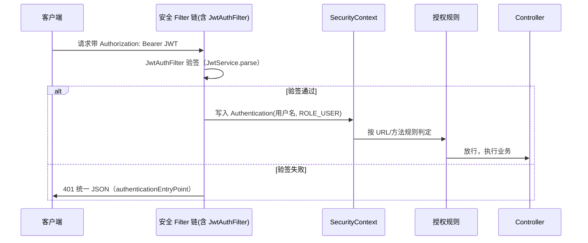

# Java Spring 全家桶阶段

> 面向企业级后端、微服务方向，本阶段回答 ph14 留下的问题：为什么 `@Autowired`/构造器注入能把 `VehicleService` 塞进 `VehicleController`？ph14 的 `@RestController` 只是 Spring 的冰山一角——本阶段把冰山水下的容器机制（IOC/DI、Bean 生命周期、AOP、事务）讲透，再沿 Boot 自动配置、profile、actuator、Spring Data、Spring Security 把「能用 Spring 写接口」升级为「掌握企业级 Java 的核心技术栈」。

## 1. 概述

本阶段是 Java 学习路线从「会用框架」到「懂框架」的分水岭。roadmap 第 15 节目标：**掌握企业级 Java 开发核心技术栈**。ph14 用了 Spring Boot 却只接触了 Web 层注解；本阶段先回到容器本身（`ApplicationContext` 怎么创建对象、管理生命周期、注入依赖），再逐个展开全家桶组件：AOP 与声明式事务（同一套代理机制）、MVC 拦截器（与 Servlet Filter 的定位差）、Boot 自动配置与 starter（追踪「为什么引一个坐标就能跑」）、profile 与配置体系（同一 jar 跑多环境）、actuator（运维端点）、Spring Data JPA（接口即实现的数据访问）、Spring Security（把 ph14 的「认证」升级为「认证 + 授权」）。整个阶段以「**机制可实测**」为原则：容器行为、代理绕行、回滚规则、条件装配全部有 examples/exercises 的真实运行数字背书。

| 核心维度 | 覆盖内容 |
|----------|---------|
| IOC/DI | 容器注册三式（`@Component`/`@Bean`/`@Configuration`+扫描）、构造器注入（推荐）vs 字段注入（反面）、`@Primary`/`@Qualifier`/按名装配、fail-fast 依赖缺失 |
| Bean 生命周期 | 初始化/销毁回调时序（实测）、singleton/prototype 作用域、懒加载、循环依赖（构造器环 fail-fast 实测 + `@Lazy` 解法） |
| AOP | 切面/切点/通知五型、`execution`/`@annotation` 切点、代理绕行（自调用陷阱实测）、AOP 适用边界 |
| 事务管理 | `@Transactional` 声明式、回滚规则（运行时/受检/`rollbackFor` 实测）、传播行为（REQUIRED/REQUIRES_NEW 实测）、事务边界在 Service |
| MVC 拦截器 | `HandlerInterceptor` 三方法时序、多拦截器顺序与短路（实测）、与 Servlet Filter 的定位对比 |
| Spring Boot | `@SpringBootApplication` 拆解、自动配置条件机制与来源追踪（实测报告数字）、starter 聚合、profile、`@ConfigurationProperties`、actuator 端点 |
| Spring Data | Repository 接口即实现、方法名派生查询、`@Query` JPQL、分页排序、事务归属 |
| Spring Security | 认证 vs 授权、Filter 链心智、URL 级/方法级授权、401/403 统一 JSON、BCrypt、JWT 无状态接入（Filter 链原生版） |

这个阶段只涉及 **单体 Spring 应用内的容器机制与官方全家桶组件**，**不涉及微服务架构、注册发现、网关、熔断与分布式事务**（ph16 微服务与分布式阶段，roadmap 第 16 节）、**不涉及消息队列与搜索中间件**（Kafka/ES，ph17 消息队列与搜索阶段）、**不涉及缓存穿透/击穿/雪崩、限流等并发架构**（ph18 缓存与高并发阶段）、**不涉及部署运维**（Docker/CI/CD，ph19 DevOps 与部署阶段）、**不涉及 Netty 与高性能网络编程**（ph20 高级 Java 阶段）、**不涉及 reactive 栈与 Quarkus/Micronaut 对比深入**（本阶段只在第 5 章一句话带过）。也不重复 ph13 已讲的 JDBC/JPA/Hibernate 基础（本阶段用简单实体聚焦 Spring Data 抽象，复杂关联映射不展开）与 ph14 已讲的 REST 注解用法、统一响应、CORS、springdoc（本阶段直接沿用其结果）。本阶段承接 [ph14 Web 后端开发阶段](../ph14-web-backend/14-web-backend.md)——那里的每个「框架替你做了 X」在本阶段都有机制答案；并为 [ph16 微服务与分布式阶段](../ph16-microservices/16-microservices.md)（roadmap 第 16 节）备好单体底座。

## 2. 来源与演变

Spring 的故事始于 Rod Johnson 2002 年的《Expert One-on-One J2EE Design and Development》：J2EE 太重（EJB 容器、部署描述符），他主张用**轻量 POJO + 容器管理**替代重量级组件模型。2004 年 Spring 1.0 发布，核心是 **IOC（Inversion of Control，控制反转）容器**：对象创建与依赖关系的控制权从「代码里 new」反转给容器，代码只声明依赖（构造器参数/属性），容器负责装配——设计哲学一句话加粗：**框架管「怎么建」，你只管「要什么」**。2007 年 Spring 2.5 引入注解（`@Component`/`@Autowired`/`@Transactional` 前身），2009 年 Spring 3.0 用 JavaConfig（`@Configuration`/`@Bean`）取代大半 XML，2014 年 Spring Boot 1.0（Pivotal，Phil Webb 主导）用自动配置 + starter 把「配 Spring 工程」压缩成「引依赖就开跑」。安全（Spring Security 源自 2003 年 Ben Alex 创立的 Acegi Security，后被 Spring 项目吸收并更名）、数据访问（Spring Data，2010 年起的 JPA/Redis/Mongo 子项目）、面向切面（AOP 模块随 Spring 1.0 即有）等子框架逐步聚合成今天的「全家桶」。

| 版本/里程碑 | 年份 | 主要变化 |
|-----------|------|---------|
| Spring 1.0 | 2004 | IOC 容器 + AOP 模块，轻量替代 EJB |
| Spring 2.0/2.5 | 2006/2007 | 切面语法完善（2.0 引入 AspectJ 支持）；注解驱动（2.5：`@Component`/`@Autowired`） |
| Spring 3.0 | 2009 | JavaConfig（`@Configuration`/`@Bean`）取代 XML 为主 |
| Spring Boot 1.0 | 2014 | 自动配置 + starter + 内嵌容器（ph14 已讲「Just Run」） |
| Spring Data | 2010~ | Repository 接口即实现，统一 JPA/Redis/Mongo 访问形态 |
| Spring Security（源自 Acegi） | 2003~ | 2003 年 Acegi Security 创立，并入 Spring 后更名 Spring Security；认证/授权的事实标准（Servlet Filter 链架构） |
| Spring Framework 6.x | 2022 | 基线 Java 17+、jakarta 命名空间（与 Boot 3.x 同步） |
| Spring Boot 3.3 | 2024 | 本阶段基线（与 ph14 同代，离线缓存可实测） |

本文示例以 **OpenJDK 17.0.18 + Maven 3.9.12 + Spring Boot 3.3.0** 为基线（选择理由：与 ph14 完全同基线、本机离线缓存可完整实测全家桶；验证工具链：`javac -version` → 17.0.18、`mvn -version` → 3.9.12）。Boot 3.3.0 父 POM 统一管理 **Spring Framework 6.1.8、Hibernate 6.5.2.Final、AspectJ 1.9.22**（全部在本地缓存）；两处「离线版本仲裁」见 examples/README：**Spring Security 用 spring-security-bom 6.3.4 import 压过**（Boot 默认管的 6.3.0 缓存缺）、**HSQLDB 钉 2.5.0**（Boot 默认管 2.7.2 缓存缺，Hibernate 6.5 会打「低于官方支持下限 2.6.1」的 WARN，本阶段全部建表/CRUD/分页/事务实测正常）。框架可用性策略：**凡依赖在本地缓存的一律实测并标注「已验证」；缓存里没有的（如 Redis 服务器运行时、其他 starter）如实标注「未在本环境验证」**——各组件状态见第 6 章表。这套核心机制（容器/AOP/事务/自动配置）十多年来稳定，本阶段学的机制在 Spring 7 时代依然成立——变的是版本号，不变的是「容器 + 代理 + 条件」三根柱子。

## 3. 语法与参数

### 3.1 IOC 与 DI：容器管对象创建和依赖

**IOC（控制反转）**把「谁创建对象」从业务代码反转给容器：业务类不写 `new`，只声明依赖（构造器参数），容器按类型找到依赖对象、递归创建并注入。**DI（依赖注入）**是 IOC 的实现手段——注入方式三选一：**构造器注入**（推荐：`final` 字段 + 唯一构造器，依赖一目了然、不可中途换、测试友好）、setter 注入（可选依赖、可变）、字段注入（`@Autowired` 字段——写起来最短但依赖被藏进私有字段、难测试，本仓库 Java 规范判为反面，见 java-coding-standards [SPRING] 节）。ph14 里「`@Autowired`/构造器注入把 `VehicleService` 塞进 `VehicleController`」的答案就是：容器启动时扫描到两个 Bean，`VehicleController` 的构造器要 `VehicleService`，容器就把容器里那个单例传进去。

```java
// examples/ex01-spring-core-ioc-lifecycle/src/main/java/com/example/WelcomeService.java —— 构造器注入（已验证，Tests run: 6）
@Service
public class WelcomeService {
    private final WelcomeRepository repository;   // final：注入后不可变

    public WelcomeService(WelcomeRepository repository) {  // 唯一构造器 = 依赖清单
        this.repository = repository;
    }
}
```

**Bean 怎么进容器（注册三式）**：① 标注类（`@Component`/`@Service`/`@Repository`/`@Controller`）+ `@ComponentScan` 包扫描；② `@Configuration` 类里的 `@Bean` 方法（返回对象，方法参数即依赖——「方法级 DI」）；③ Boot 的自动配置（第 3.6 节）按 classpath 批量注册。同类型多个 Bean 时用 `@Primary` 标默认、`@Qualifier("beanName")` 点名；Bean 名默认 = 类名小驼峰（`WelcomeService` → `welcomeService`）。

**关键概念：容器是「谁依赖谁」的单一真相**——依赖缺失在容器启动（refresh）时就 fail-fast 抛异常，而不是运行到那一行才 NPE（ex01 实测：只注册 `WelcomeService` 不注册 `WelcomeRepository` → 启动即报错）。这是「把对象图交给容器」的最大收益：装配错误早暴露。

### 3.2 Bean 生命周期与作用域

Bean 的生命周期 = **实例化 → 属性/依赖注入 → 初始化回调 → 就绪 → 销毁回调**。初始化回调有三代 API，同一 Bean 上叠满时触发顺序是 Spring 官方语义、ex01 实测背书：

```text
初始化（容器启动阶段，实测顺序）：
  constructor ──▶ @PostConstruct ──▶ afterPropertiesSet(InitializingBean) ──▶ customInit(@Bean initMethod)
销毁（context.close() 时，实测顺序，与初始化反向）：
  @PreDestroy ──▶ destroy(DisposableBean) ──▶ customDestroy(@Bean destroyMethod)
```

```java
// examples/ex01-.../LifecycleBean.java —— 三代回调叠满的观察 Bean（已验证）
@PostConstruct
public void postConstruct() { LifecycleRecorder.record("@PostConstruct"); }

@Override
public void afterPropertiesSet() { LifecycleRecorder.record("afterPropertiesSet(InitializingBean)"); }

public void customInit() { LifecycleRecorder.record("customInit(@Bean initMethod)"); }
// 注册：@Bean(initMethod = "customInit", destroyMethod = "customDestroy")
```

**为什么初始化通常放 `@PostConstruct` 而不是构造器**：构造器注入下依赖在构造器内已就绪，但字段/setter 注入时构造器执行阶段依赖还没注入（访问 `repository` 是 null）；`@PostConstruct` 由框架在「实例化 + 依赖注入完成之后」统一回调——无论注入方式，把「依赖就绪后的初始化」放这里时序都可预期（与 `@Autowired` 同属 BeanPostProcessor 阶段）。`InitializingBean`/`init-method` 是 XML 时代的遗产接口/配置，注解普及后日常只写 `@PostConstruct` + 实现 `AutoCloseable`（Boot 会把它当销毁回调）即可，其余认识即可。

**作用域**：默认 **singleton**——容器里一个 Bean 名一个实例，所有注入点共享（ex01 实测两次 `getBean` 同一实例；无状态 Service 就该是单例）。**prototype** 每次获取/注入都新建实例（ex01 实测两次 `getBean` 不同实例），且**容器不管理它的销毁**（不回调 `@PreDestroy`/`destroy`，实测）；有状态的短命对象（会话上下文、一次任务的工作区）才用 prototype，用完自己清理。Web 作用域（request/session/application）挂在 HTTP 生命周期上，Boot Web 应用可用但日常 REST 无状态化后极少用。非懒加载单例在容器 refresh 时就创建——所以生命周期日志出现在启动期而不是第一次 `getBean`。

**循环依赖**：A 的构造器要 B、B 的构造器要 A——「谁都没建完，谁都没法先建」，纯构造器循环**启动即抛 `BeanCurrentlyInCreationException`**（exercises/sol-02 实测，错误信息含 `currently in creation`）。字段/setter 注入的循环 Spring 能靠「提前暴露早期引用」解开，构造器循环解不开——修法按优先级：重构拆环 → 一方改字段/setter → `@Lazy` 参数注入延迟代理（sol-02 解法，实测容器可启动）。依赖环本身是设计味道，别把 `@Lazy` 当常规武器。

> 本阶段只涉及容器管得到的生命周期（IOC 容器内 Bean），**并发下的线程安全与锁的生命周期属 ph09 多线程与并发阶段**；「JVM 里 Bean 与 GC 的关系」属 ph10——这里只需理解「容器负责创建与销毁的时机」。

### 3.3 AOP：横切逻辑的收拢

**AOP（Aspect-Oriented Programming，面向切面编程）**解决「与业务无关却散落各处」的逻辑——日志、审计、计时、事务、缓存。roadmap 必会概念：**AOP 适合横切逻辑**——把「每个业务方法前后都要做的事」收拢进一个**切面（Aspect）**，业务方法保持纯净。术语：**切点（Pointcut）** 声明「哪些方法」被织入（`execution(* com.example.AccountService.*(..))` 匹配该类的所有方法；`@annotation(注解)` 匹配打了某注解的方法），**通知（Advice）** 声明「什么时候做什么」。

| 通知类型 | 触发时机 | 典型用途 |
|---------|---------|---------|
| `@Before` | 方法执行前 | 参数检查、埋点 |
| `@AfterReturning` | 正常返回后 | 结果审计（能拿返回值） |
| `@AfterThrowing` | 抛异常后 | 异常监控（能拿异常） |
| `@After` | 无论成败（finally） | 清理 |
| `@Around` | 全权接管 | 计时、重试、事务——最强也最该谨慎 |

```java
// examples/ex04-spring-aop-transaction/.../ServiceAuditAspect.java —— @Around 审计（已验证，Tests run: 6）
@Aspect
@Component
public class ServiceAuditAspect {
    @Around("execution(* com.example.AccountService.*(..))")
    public Object audit(ProceedingJoinPoint pjp) throws Throwable {
        proxyCalls.incrementAndGet();               // 只有「经过代理」的调用会到这儿
        try {
            Object result = pjp.proceed();          // 放行业务方法
            return result;
        } catch (Throwable t) {
            throw t;                                 // 切面只观察，不吞异常
        }
    }
}
```

**适用边界（实测约束）**：Spring AOP 基于代理（见 4.2），所以**类内部 `this.xxx()` 自调用、私有方法、静态方法都织不进切面**——ex04 用切面调用计数实测了自调用陷阱：`callInsideClassBypassesProxy()` 里 `this.doubleDebitThenThrowRuntime(...)` 计数不增长（只有外层调用 +1），事务同样失效。同类的跨方法调用想走代理，要么拆类、要么用 `proxiedSelf()`（注入自己的 ObjectProvider，ex04/exercises/sol-04 的写法）。切面只织「进过代理的公共方法」，横切也优先服务层（Service）而非 Controller——Controller 的横切（登录态、请求日志）用第 3.5 节拦截器/Filter 更顺手。

### 3.4 事务管理：@Transactional 声明式事务

事务的本质（ph13 已讲 ACID 与手动 `setAutoCommit(false)/commit/rollback`）在 Spring 里声明化：方法上标 `@Transactional`，事务的开启/提交/回滚交给**事务拦截器**（本质是个 AOP 通知，见 4.2）——roadmap 必会概念：**事务要注意传播和回滚规则**。

**回滚规则（ex04 用真实 HSQLDB 断言余额实测）**：

| 场景 | 默认行为 | 实测结果（ex04） |
|------|---------|-----------------|
| 抛运行时异常（`RuntimeException`/`Error`） | **回滚** | 两条扣款全撤，余额不变 |
| 抛受检异常（`IOException` 等） | **不回滚** | 扣款已提交 |
| 受检异常 + `@Transactional(rollbackFor = IOException.class)` | 回滚 | 余额不变 |
| 业务异常（自定义继承 `RuntimeException`） | 回滚 | 无副作用（exercises/sol-04：余额不变、审计 0 条） |

```java
// examples/ex04-.../AccountService.java —— 规则骨架（已验证）
@Transactional
public void doubleDebitThenThrowRuntime(String from, String to, int amount) {
    jdbc.update("UPDATE accounts SET balance = balance - ? WHERE name = ?", amount, from);
    jdbc.update("UPDATE accounts SET balance = balance - ? WHERE name = ?", amount, to);
    throw new IllegalStateException("运行时异常默认回滚");
}

@Transactional(rollbackFor = IOException.class)   // 受检异常要显式声明才回滚
public void doubleDebitCheckedWithRollbackFor(...) throws IOException { ... }
```

**为什么默认不回滚受检异常**：受检异常常被用于「可预期的业务分支」（如 `IOException` 重试后可能成功），Spring 保守起见只对运行时异常回滚——**工程实践把业务失败建模为运行时异常**（自定义 `XxxException extends RuntimeException`），受检异常留给 IO 边界并显式 `rollbackFor`。

**传播行为（Propagation）**决定「调用方已有事务时，本方法怎么参与」：

| 传播 | 语义 | 使用场景 |
|------|------|---------|
| `REQUIRED`（默认） | 有事务则加入，没有则新建 | 绝大多数业务方法 |
| `REQUIRES_NEW` | 挂起外层事务，开新事务独立提交 | 审计/流水/通知——主事务回滚也要留痕 |
| `SUPPORTS` | 有则加入，没有就算了 | 只读查询可选 |
| `NESTED` | 嵌套保存点，可部分回滚 | 批次里单条失败不影响整体（少见） |

ex04 实测 `REQUIRES_NEW`：外层 `outerDebitThenFailWithMarker` 扣款后调 `proxiedSelf().markerRequiresNew(...)` 再抛异常——外层回滚余额不变，但 REQUIRES_NEW 写的 events 记录已独立提交（计数 = 1）。`readOnly = true` 给只读查询（优化 + 语义声明）。

**事务边界放哪**：roadmap 必会概念落到代码——**Service 方法**（一个业务用例 = 一个事务），Repository 方法各自原子但不管多步业务；Controller 开事务是反面（HTTP 语义层不该管一致性）。自调用陷阱同样作用于事务（ex04：绕过代理 = 没有事务，扣款各自自动提交、无人回滚）。

### 3.5 MVC 拦截器：请求链上的横切

ph14 已用 `HandlerInterceptor` 验 JWT；本阶段把它当「MVC 层的横切机制」讲全：`preHandle`（进 Controller 前，返回 false 短路）→ Controller → `postHandle`（返回后、渲染前）→ `afterCompletion`（请求完成后，无论成败——`finally` 语义）。多拦截器按注册顺序执行 pre，post/after **倒序收尾（栈式）**；ex03 实测完整时序：

```text
filter.before → first.pre → second.pre → controller.hello
             → second.post → first.post → second.after → first.after → filter.after
```

```java
// examples/ex03-spring-mvc-interceptor/.../WebMvcConfig.java —— 注册即顺序（已验证，Tests run: 3）
registry.addInterceptor(new FirstInterceptor()).addPathPatterns("/api/**");
registry.addInterceptor(new SecondInterceptor()).addPathPatterns("/api/**");
```

**短路语义（ex03 实测 `?block=true`）**：`second.pre` 返回 false → Controller 不执行、`postHandle` 一律不执行、只有已放行的 `first` 收到 `afterCompletion`——所以「鉴权拦截器」的放行/拒绝就写在 preHandle 里。ex03 还实测了拦截器能看到 `HandlerMethod`（日志 `first.pre -> 目标方法 HelloController#hello`），这是它与 Servlet Filter 的**本质差异**：

| 维度 | Servlet Filter | HandlerInterceptor |
|------|---------------|-------------------|
| 包的位置 | 包在 DispatcherServlet 外层（Servlet 容器层） | DispatcherServlet 内、Controller 外（MVC 层） |
| 能拿到什么 | 只有 `ServletRequest`/URL，看不见目标方法 | 看得见 `HandlerMethod`（哪个 Controller 方法） |
| 依赖 Spring 吗 | 不依赖（Servlet 规范） | 依赖 Spring MVC |
| 典型用途 | 字符编码、跨域、压缩、通用安全（日志/限流） | 登录态、权限、计时、改 ModelAndView |

同一条请求上两者都会执行（Filter 先于一切拦截器，ex03 实测 `filter.before` 在最外层）。日常分工：容器级通用逻辑用 Filter，**需要知道「在调哪个业务方法」的逻辑用拦截器**；登录/权限这类「安全横切」在现代 Spring 里进一步上收到 Spring Security 的 Filter 链（3.10），自己写拦截器做鉴权已经过时——ph14 的手写拦截器版是理解链路的好教材，生产交给框架。

### 3.6 Spring Boot 自动配置与 starter：追踪「为什么能跑」

`@SpringBootApplication` = `@Configuration` + `@EnableAutoConfiguration` + `@ComponentScan` 三合一。自动配置的机制一句话：**启动时读取 `META-INF/spring/org.springframework.boot.autoconfigure.AutoConfiguration.imports` 里的自动配置类清单，逐个按条件注解求值，命中就注册对应 Bean**。条件注解是 ex01 那个 `@Conditional`（Core 原语）的 Boot 内置实现：`@ConditionalOnClass`（classpath 有某类才配——web 应用有 `spring-webmvc` 就配 `DispatcherServlet`）、`@ConditionalOnMissingBean`（你没自定义才配默认）、`@ConditionalOnProperty`（属性开关）、`@ConditionalOnWebApplication` 等。

**「自动配置要能追踪来源」的两种实测姿势**：

```text
姿势一（启动参数）：mvn spring-boot:run -Dspring-boot.run.arguments=--debug
  → 日志打印 CONDITIONS EVALUATION REPORT：
    Positive matches: 146 条   （例：AopAutoConfiguration matched: - @ConditionalOnProperty (spring.aop.auto=true) matched）
    Negative matches: 295 条   （例：ActiveMQAutoConfiguration: Did not match:
        - @ConditionalOnClass did not find required class 'jakarta.jms.ConnectionFactory'）
  → 没引的中间件因缺 class 全被条件挡掉——这就是「为什么没配 Redis 却不出错」
姿势二（代码/测试）：@Autowired ConditionEvaluationReport 把它当 Bean 拿出来数
  → examples/ex02 实测：positive-match 自动配置类 145 个（WebMvc/DispatcherServlet/Health 全部 isFullMatch）
```

**starter 是什么**：一个「依赖聚合 + 默认配置约定」的空壳坐标——`spring-boot-starter-web` 一个坐标带齐 `spring-webmvc`（MVC）+ `tomcat-embed-*`（内嵌容器）+ `jackson`（JSON）+ `logback`（日志）+ `validation` 关联件；starter 只是把「该引哪几个 jar、什么版本搭什么版本」固化成 BOM 管理（对比 ph11 的依赖管理心智：BOM 管版本、starter 管组合）。引 starter-actuator 后 `/actuator/*` 自动出现、引 starter-data-jpa 后 `EntityManagerFactory` 与仓库实现自动生成——每个「自动」都可在上面的报告里查到出处。

### 3.7 profile 与配置体系：同一 jar 跑多环境

**profile** 是一组命名配置（`application-{profile}.properties`），解决「dev/prod 环境差异」（端口、日志级别、功能开关、数据源地址）不能进代码的问题。激活方式：`spring.profiles.active=dev`（文件里）、命令行 `--spring.profiles.active=prod`（优先级最高）、环境变量 `SPRING_PROFILES_ACTIVE`。同名属性 profile 文件**覆盖**基础 `application.properties`；两者是合并关系（基础文件放公共项）。示例（examples/ex02 实测，同一 jar 两种启动）：

```text
dev：  server.port=18092  app.greeting.message=dev-profile-greeting  app.greeting.feature-enabled=true
prod： server.port=18093  app.greeting.message=prod-profile-greeting  app.greeting.feature-enabled=false

curl /api/greeting（dev） → {"featureBeanPresent":true,"message":"dev-profile-greeting","profile":"[dev]","featureEnabled":true}
curl /api/greeting（prod）→ {"featureBeanPresent":false,"message":"prod-profile-greeting","profile":"[prod]","featureEnabled":false}
```

与配置联动的两件事：① **条件装配**——`@ConditionalOnProperty(name="app.greeting.feature-enabled", havingValue="true")` 让「实验功能 Bean」dev 在位、prod 摘掉（实测 JSON 里 `featureBeanPresent` 翻转）；② **类型安全配置**——`@ConfigurationProperties(prefix = "app.greeting")` 把散落的 `@Value("${...}")` 收成强类型对象（record + 构造器绑定，IDE 补全 + 编译期校验，ex02/exercises/sol-03 实测）。**注意 .properties 文件按 ISO-8859-1 读取（Java 特性）**，值里的中文要 `\uXXXX` 转义或用 yml——ex02 在代码注释里如实记录了这个坑。

### 3.8 actuator：运维端点开箱即用

`spring-boot-starter-actuator` 一个坐标，应用就长出可观测端点（生产默认只暴露 `health`，用 `management.endpoints.web.exposure.include=health,info,metrics,...` 放行）。ex02 实测（dev 运行实录）：

```text
curl /actuator/health → {"status":"UP","components":{"diskSpace":{...},"ping":{"status":"UP"}}}
curl /actuator/info   → {"app":{"env":"dev","name":"ph15-ex02-profile-actuator"}}   ← info.* 属性自动聚合
```

常用端点：`health`（含各组件的健康：DB 在不在、磁盘够不够——有 DataSource 时自动出现 db 组件）、`info`（`info.*` 自定义应用信息）、`metrics`（JVM/内存/HTTP 计数，Micrometer 体系）、`beans`（容器里所有 Bean——「谁在容器里」的活字典，可与 3.6 报告交叉验证）、`env`（当前生效的全部配置与来源）、`loggers`（运行时改日志级别）。**健康检查是部署与监控的地基**：K8s/负载均衡探活、ph19 DevOps 阶段的监控告警都读它——actuator 是 Boot 应用「运维友好」的默认姿势。

> ⚠️ actuator 端点暴露的是生产内部信息（`env` 含配置值、`beans` 暴露架构），**生产只放行 health/info 等必需端点并加认证**（Security 里给 `/actuator/**` 配角色即可，见 3.10 授权规则）——ph14 练习的「统一响应结构」不覆盖 actuator（它有自己的 JSON 契约，运维工具按它的契约解析）。

### 3.9 Spring Data JPA：接口即实现

Spring Data 把「数据访问」抽象成一句话：**你只写接口，实现由框架在启动时生成**。ph13 手写过 DAO 实现类（`UserDao`/`TaskDao` 等：`findById` 返回 `Optional`、按字段查），ph14 又手写过 `VehicleStore`，Spring Data 让实现类消失——接口方法名即查询声明，JpaRepository 自带 CRUD/分页/批量。

```java
// examples/ex05-spring-data-jpa/.../BookRepository.java —— 接口即实现（已验证，Tests run: 5）
public interface BookRepository extends JpaRepository<Book, Long> {
    List<Book> findByTitleContainingIgnoreCase(String keyword);  // 标题包含（不区分大小写）
    boolean existsByAuthor(String author);                        // 是否存在
    long countByYearAfter(int year);                              // 统计
    @Query("select b from Book b where b.year >= :minYear order by b.year desc")
    List<Book> findRecentBooks(@Param("minYear") int minYear);    // 方法名表达不动的显式 JPQL
}
```

**方法名派生查询的命名规则**：`find/read/get/exists/count/delete` + 实体属性路径 + 连接词（`And/Or`）+ 限制词（`Containing`/`GreaterThan`/`Between`/`OrderByXxxDesc`…）——Spring Data 启动时按前缀分词、解析属性、生成 JPQL（ex05 `show-sql=true` 实录：`findByTitleContainingIgnoreCase("java")` → `select ... where upper(b1_0.title) like upper(?) escape '\'`；`existsByAuthor` → `select b1_0.id ... fetch first ? rows only`）。**方法名表达不了的查询用 `@Query` 写 JPQL**（不是原生 SQL——JPQL 针对实体，可移植性好；极端场景可 `nativeQuery = true`）。分页排序开箱：`findAll(PageRequest.of(0, 2, Sort.by(DESC, "year")))` 返回 `Page`（含总数 COUNT 查询，不整表拉回内存；ex05 实测两页各 2 本、totalElements=4）。

**事务归属**：`JpaRepository` 自带默认事务（find 只读、写操作为原子事务），**多步业务的事务边界仍在 Service 的 `@Transactional`**（ex05 实测：Service 方法两条 save 后抛异常 → 一条不留）。与 ph13 的对照：底层还是 JPA/Hibernate（ph13 讲过实体映射与方言），Spring Data 换掉的是**访问层的实现方式**——「接口形状保持不变、实现由框架生成」在 ph14 的 `VehicleStore` 之后又进一步。HSQLDB 2.5.0 低于 Hibernate 官方下限的 WARN 及仲裁说明见第 2 章与 examples/README（实测无碍）。

### 3.10 Spring Security：认证与授权的事实标准

ph14 用 jjwt + 手写拦截器完成了「认证」（你是谁），把「授权」（你能干什么）留给了本阶段。Spring Security 把两者做成了**一条 Filter 链 + 声明式规则**：

```java
// examples/ex06-spring-security-authz/.../WebSecurityConfig.java —— 配置三件套骨架（已验证，Tests run: 8）
http.authorizeHttpRequests(auth -> auth
        .requestMatchers("/public/**").permitAll()
        .requestMatchers("/api/admin/**").hasRole("ADMIN")   // URL 级授权
        .anyRequest().authenticated())
    .exceptionHandling(e -> e
        .authenticationEntryPoint((req, res, ex) -> JsonErrors.write(res, mapper, 401, 40100, "未认证：请携带有效凭证"))
        .accessDeniedHandler((req, res, ex) -> JsonErrors.write(res, mapper, 403, 40300, "无权限：需要 ADMIN 角色")));
// 另两个 Bean：UserDetailsService（用户从哪来）+ PasswordEncoder（密码怎么验）
```

**四个必懂部件**：① `SecurityFilterChain`——整条安全 Filter 链的声明（认证入口、会话策略、URL 授权、异常出口）；② `UserDetailsService`——按用户名取用户（内存版/ex06、JPA 数据库版/project 的 `DbUserDetailsService`——**「用户从哪来」从配置换成数据，认证逻辑零改动**，这就是抽象的价值）；③ `PasswordEncoder`——BCrypt 单向哈希 + 随机盐（ex06 实测库里密码以 `$2a$` 开头且不含明文；对比 ph14 jjwt 的 HMAC：一个验「谁签的」、一个存「谁的密码」）；④ `AuthenticationManager`——认证编排（Provider 调 `UserDetailsService` + `PasswordEncoder.matches`，见 4.4）。

**授权两级**：URL 级（`requestMatchers(...).hasRole("ADMIN")`，Filter 链里按路径拦）适合粗粒度分区（`/api/admin/**`）；**方法级**（`@EnableMethodSecurity` + `@PreAuthorize("hasRole('ADMIN')")`）适合「同一控制器里 GET 人人可读、DELETE 只要 ADMIN」这类 URL 表达不了的细粒度——授权跟着业务走，放 Service 方法上（ex06 实测：USER 读书 200、删书 403）。角色注意 `hasRole('ADMIN')` 隐含 `ROLE_` 前缀（存的是 `ROLE_ADMIN`）。

**401/403 出口分两层**（实测）：Filter 层拒绝（未认证、URL 级授权不过）走 `authenticationEntryPoint`/`accessDeniedHandler` 写统一 JSON——不写的话默认 HTML 错误页会破坏接口契约（ex06 匿名 401、project 的 USER 访问 `/api/users` 被 403 都实测走这条，code 40100/40300）。方法级 `@PreAuthorize` 拦下时抛 `AccessDeniedException`，其出口取决于应用有没有 `@RestControllerAdvice`：ex06 没有 advice，异常一路传回 Security 的 Filter 链、由 `accessDeniedHandler` 收尾写 403 JSON（实测 code 40300）；若应用有 advice（project 的 `GlobalExceptionHandler` 为 `AccessDeniedException` 预留了分支），方法级授权失败会在 MVC 层被 advice 接住转 403——本项目未使用方法级授权，分工以 ex06/project 代码为准。统一响应壳 `{code,message,data}` 沿用 ph14 契约；业务码在本阶段按语义重排为 **40100 未认证、40101 登录失败、40300 无权限**（ph14 project/ex06 的码义不同——40100 指密码错/登录失败、40101 指未登录——跨阶段对照代码时勿混用）。

**JWT 无状态接入（exercises/sol-05 与 project 实测，Tests run: 7 / 10）**：Basic 认证每次请求带明文密码，只适合内部调试；生产 REST 用 JWT——自定义 `OncePerRequestFilter` 插进 Filter 链：`Authorization: Bearer <jwt>` → `JwtService.parse` 验签 → 按 role 构造 `Authentication` 写进 `SecurityContextHolder` → 后续授权照常读它。这就是「ph14 的 Controller 拦截器版升级为 Filter 链原生版」的接缝：**认证方式（Basic/JWT/OAuth2）只是 Filter 链里的一段，授权规则完全不变**。REST 无状态（不发 cookie）所以可以 `csrf.disable()`——CSRF 防的是「浏览器自动带上 cookie 的伪造请求」，Bearer token 在 Header 里不会自动携带。

### 3.11 生态地图：全家桶之外还有什么

| 组件/方向 | 一句话定位 | 去向 |
|----------|-----------|------|
| Spring WebFlux | 响应式 Web 栈（R2DBC/Netty），高吞吐低线程 | 不展开（ph20 高级 Java 涉及 reactive/Netty 心智） |
| Spring Cache / Data Redis | 方法级缓存注解、Redis 存取 | Redis 用法与缓存策略属 ph13/ph18 |
| Spring Cloud 家族 | 注册发现/配置中心/网关/熔断 | ph16 微服务与分布式阶段 |
| springdoc-openapi / Validation | API 文档、参数校验 | ph14 已实测，本阶段沿用 |
| actuator + Micrometer | 可观测性 | ph19 DevOps 阶段做监控告警时深用 |

> 本阶段先掌握「单体里容器与组件怎么协作」——全家桶的每件工具在微服务里依然是底座，ph16 是在这个底座上做「多进程拆分与治理」。

## 4. 底层原理

### 4.1 容器启动管线：从 @ComponentScan 到单例池

```text
@ComponentScan ──▶ 扫描类路径，筛出候选类 ──▶ 转成 BeanDefinition（类信息 + 作用域 + 初始化回调名）
   │
   ▼
BeanFactory ──▶ 按依赖图实例化（constructor 注入递归解析）──▶ BeanPostProcessor 前后置处理
   │                                                              （@PostConstruct/@Autowired 的底层执行者）
   ▼
单例池（singletonObjects，ConcurrentHashMap）◀── 非懒加载单例在 refresh() 阶段全部建好
   │
   ▼
容器就绪 ──▶ 业务代码 getBean/注入命中缓存；context.close() ──▶ 按注册逆序跑销毁回调
```

三个认知：① `@Component`/`@Bean` 扫到的不是对象而是 **BeanDefinition**（配方），对象在 refresh 时才按配方造——所以「配置写错」与「依赖缺」都在启动期暴露；② `@PostConstruct`/`@Autowired` 本身不是魔法，而是框架注册的 **BeanPostProcessor**（`CommonAnnotationBeanPostProcessor`/`AutowiredAnnotationBeanPostProcessor`）在实例化后回调你——生命周期时序表（3.2）就是这些后置处理器的执行顺序；③ 单例池就是容器的心脏，`getBean` 大多数时候是查表，所以单例 Bean 的注入开销近似为零。

### 4.2 代理机制：AOP 与事务为什么「同源」

```text
容器发现 Bean 上有切面匹配 / @Transactional
   │
   ▼
代理工厂（ProxyFactory）给 Bean 生成代理对象（不是原对象）
   ├─ 实现了接口 → JDK 动态代理（java.lang.reflect.Proxy，只能代理接口方法）
   └─ 无接口/目标类代理 → CGLIB 子类代理（生成子类覆写方法）
   │
   ▼
注入给别人的、getBean 拿到的都是「代理」；代理方法调用 = 依次跑方法拦截器链
   （MethodInterceptor 链：ExposeInvocation → 你的 @Around → TransactionInterceptor → 真正的方法）
```

`@Transactional` 的 `TransactionInterceptor` 只是拦截器链里的一环：方法进入时 `begin`（按传播行为决定开新事务还是加入），方法正常返回 `commit`，抛异常按回滚规则决定 `rollback` 还是 `commit`——**它自己就是个 AOP 通知**。这解释了两个实测现象：① 自调用（`this.xxx()`）绕过代理 → 事务与切面同时失效（ex04）；② 代理上的注解要能被拦截器读到——`@Transactional` 标在实现类上时 CGLIB 代理可见，标在接口方法上时 JDK 代理才可见（工程实践：标在实现类/Service 方法上）。

### 4.3 自动配置的条件求值管线

```text
@EnableAutoConfiguration（@SpringBootApplication 里）
   │
   ▼
AutoConfigurationImportSelector 读取 classpath 所有
   META-INF/spring/...AutoConfiguration.imports（Boot 3 起；Boot 2 是 spring.factories）
   │
   ▼
每个自动配置类逐条件求值（@ConditionalOnClass/OnMissingBean/OnProperty...，结果按类缓存）
   │
   ▼
命中 → 该自动配置类的 @Bean 方法注册进容器（条件注解保证「你没配才配默认、缺依赖就不配」）
   未命中 → 记入 ConditionEvaluationReport（--debug 的 Positive/Negative matches 来源）
```

**为什么条件注解能做到「缺 class 就不配」**：`@ConditionalOnClass` 的求值发生在类加载前——用 `ASM` 读字节码看注解与 classpath，而不是真的加载类（加载了缺的类反而会 ClassNotFound）。这就是「引了 starter-web 就配 MVC、没引 ActiveMQ 的类就不配 ActiveMQ」的机制答案，也是 ex02 报告里 146 条 Positive / 295 条 Negative 的来源（Negative 里全是没引的中间件自动配置）。

### 4.4 Security 的 Filter 链与认证流程（JWT 版）



登录路径（`POST /api/auth/login`）走另一段：`AuthenticationManager.authenticate()` → 遍历 `AuthenticationProvider`（默认 `DaoAuthenticationProvider`）→ 调 `UserDetailsService.loadUserByUsername` 取哈希 → `PasswordEncoder.matches(明文, 哈希)` 比对 → 成功组装 `Authentication` 返回、由调用方（project 的 AuthController）签发 JWT。**认证结果只活在 SecurityContext（ThreadLocal 实现），一次请求一个线程一个上下文**——所以 Filter 验完签写进去，同线程的 Controller/Service 才能读到当前用户（`Authentication` 参数注入，project 的 `/api/me` 实测）。

## 5. 使用场景

- **企业单体后端的事实标准**：管理后台、业务中台、车联网平台后端等「一套业务 + 多角色 + 需要运维」的系统，Spring 全家桶（Boot + Data + Security + actuator）是 Java 生态覆盖最全、招人最多的组合——本阶段 project 的权限管理系统就是最小样板。ph16 微服务也建立在这一底座上（每个服务仍是 Spring Boot）。
- **什么时候不用/少用全家桶**：纯内部工具或极简演示用 ph14 ex01 的裸 `HttpServer` 就够；对启动体积/延迟极敏感、或要云原生构建期优化（native image）时，Quarkus/Micronaut 更合适（它们 CDI 规范 + 构建期处理，见 java-coding-standards [QUARKUS] 节）——本阶段学的容器/AOP/事务心智在那里直接平移（同一批概念、不同方言）。
- **各组件怎么选**（roadmap 必会概念的工程落点）：横切逻辑先问「哪一层」——Servlet 容器级用 Filter、需要知道目标方法用拦截器、安全用 Security、日志/计时/审计/事务用 AOP；事务边界永远在 Service；「用户从哪来」抽象成 `UserDetailsService`，换数据库只换实现；可观测性默认 actuator。
- **与其他语言的对比**（为 analysis/ 与 Tenet 合成积累素材）：Java 的 Spring 是**注解声明式 + 运行时容器**的极致——框架替你管对象图、横切、安全，代价是「魔法感」与学习曲线；Go 的主流（标准库 + 显式中间件）反着来——依赖用手工构造器传入（`func NewService(repo Repo)`），横切用显式 middleware 链，无反射、可读性优先，代价是样板代码；Python FastAPI 用装饰器 + 类型注解做依赖注入（函数级、按需解析），介于两者之间；Quarkus 的 CDI 与 Spring 是同一套概念的两个实现（注释与作用域关键词不同）。三种语言对「谁来管依赖」给出三种答案：Java 容器托管、Go 手工人传、Python 请求级注入——这是 Tenet 语言设计时「依赖管理正交化」的绝佳素材。

## 6. 代码示例

> 完整可运行版在 [`examples/`](./examples/)（每个示例带验证命令与实测数字）。本阶段**框架可用性策略**：本地离线缓存完整覆盖 Boot 3.3.0 全链路（starter-web/test/actuator/aop/data-jpa/jdbc、AspectJ 1.9.22、Hibernate 6.5.2、HSQLDB 2.5.0、Spring Security 6.3.4、jjwt 0.12.5），**六组示例全部本机实测**；`spring-boot-starter-data-redis` 的 jar 虽在缓存，但 Redis 服务器运行时本机没有，**Redis 相关不做实测**（标注「未在本环境验证」，用法属 ph13 的 Redis 缓存主题）；Spring Cloud 等家族成员不在本阶段（ph16）。缓存状态明细与版本仲裁见 [`examples/README.md`](./examples/README.md)。

```java
// examples/ex01-.../LifecycleTest.java —— 生命周期顺序实测（已验证）
// 验证环境：OpenJDK 17.0.18 + Spring Framework 6.1.8，测试命令：mvn -o -Dmaven.repo.local=/tmp/m2clone test
// 实测：Tests run: 6；初始化顺序 constructor → @PostConstruct → afterPropertiesSet → customInit
assertThat(LifecycleRecorder.EVENTS).containsExactly(
        "constructor", "@PostConstruct", "afterPropertiesSet(InitializingBean)", "customInit(@Bean initMethod)");
```

### 示例 1：Spring Core IOC/DI 容器与 Bean 生命周期（[`examples/ex01-spring-core-ioc-lifecycle/`](./examples/ex01-spring-core-ioc-lifecycle/)）

纯核心容器（无 Web）：`@ComponentScan`/`@Configuration`+`@Bean`、构造器注入、`@Primary`/`@Qualifier`、生命周期回调时序（三代初始化 + 三代销毁，断言精确顺序）、singleton/prototype 作用域（含 prototype 不收销毁管理）、Core 版 `@Conditional` 条件装配。**实测**：`mvn test` → Tests run: 6。

### 示例 2：自动配置追踪 + profile + actuator（[`examples/ex02-spring-boot-autoconfig-profile-actuator/`](./examples/ex02-spring-boot-autoconfig-profile-actuator/)）

starter-actuator 开箱端点 + `ConditionEvaluationReport` 数条件报告（**positive-match 145 个**）+ `--debug` 运行实录（**Positive 146 / Negative 295**）+ dev/prod 双 profile 切换（同一 jar、条件 Bean 随 profile 摘挂）+ `@ConfigurationProperties` record。**实测**：`mvn test` → Tests run: 4；curl dev/prod 全过。

### 示例 3：MVC 拦截器与 Filter 对比（[`examples/ex03-spring-mvc-interceptor/`](./examples/ex03-spring-mvc-interceptor/)）

双拦截器栈式时序（`pre 顺序 / post·after 倒序`）、`preHandle` 短路（403 + 谁收 afterCompletion）、Filter vs Interceptor 包层关系、`HandlerMethod` 可见性。**实测**：`mvn test` → Tests run: 3；curl 200/403；日志实录 `first.pre -> 目标方法 HelloController#hello`。

### 示例 4：AOP 切面 + 事务回滚规则（[`examples/ex04-spring-aop-transaction/`](./examples/ex04-spring-aop-transaction/)）

`@Aspect` 审计切面（代理调用计数）+ `@Transactional` 全规则实测（运行时异常回滚、受检异常默认不回滚、`rollbackFor`、`REQUIRES_NEW` 独立提交、自调用绕过代理连切面都不计数）。**实测**：`mvn test` → Tests run: 6（真实 HSQLDB 断言余额）。

### 示例 5：Spring Data JPA（[`examples/ex05-spring-data-jpa/`](./examples/ex05-spring-data-jpa/)）

Repository 接口即实现：开箱 CRUD、方法名派生查询（`findByTitleContainingIgnoreCase`/`existsByAuthor`/`countByYearAfter`，show-sql 实录编译出的 SQL）、`@Query` JPQL、分页排序（`Page`/`Sort`）、Service 层事务回滚。**实测**：`mvn test` → Tests run: 5。

### 示例 6：Spring Security 认证 + 授权（[`examples/ex06-spring-security-authz/`](./examples/ex06-spring-security-authz/)）

`SecurityFilterChain` 声明式规则、内存用户 + BCrypt、URL 级 `hasRole` 与方法级 `@PreAuthorize` 两层授权、401/403 统一 JSON（entryPoint/deniedHandler）。**实测**：`mvn test` → Tests run: 8；curl 匿名 401、USER 删书 403、ADMIN 放行。

## 7. 总结

### 关键要点

- **IOC 管对象创建与依赖**：容器按「构造器参数类型」递归装配，依赖缺失启动即 fail-fast；构造器注入是默认姿势（final + 可见 + 可测）
- **生命周期**：`构造 → @PostConstruct → afterPropertiesSet → initMethod`（销毁反向）；singleton 默认共享、prototype 每次新建且不收容器销毁管理；纯构造器循环启动即报错，拆环优先、`@Lazy` 兜底
- **AOP 与事务同源**：都是「代理 + 方法拦截器」——`@Around` 是切面、`TransactionInterceptor` 是事务；自调用 `this.xxx()` 绕过代理两者一起失效（`proxiedSelf()` 解法）
- **回滚规则要记死**：运行时异常默认回滚、受检异常默认不回滚（要 `rollbackFor`）、业务失败建模为运行时异常；`REQUIRES_NEW` 让审计/流水独立提交；事务边界在 Service
- **拦截器 vs Filter**：Filter 包在 DispatcherServlet 外看不见目标方法，拦截器看得见 `HandlerMethod`；安全横切交给 Security 的 Filter 链
- **自动配置要能追踪来源**：`--debug` 报告 Positive/Negative matches（实测 146/295）；每个「引个 starter 就能用」都能在报告里找到出处
- **profile + 条件装配 + 类型安全配置**三件套解决「多环境差异」：profile 文件覆盖 base、`@ConditionalOnProperty` 按开关装配、`@ConfigurationProperties` 强类型绑定
- **Spring Data：接口即实现**——方法名即查询、`@Query` 兜底、分页开箱、事务边界仍在 Service
- **Security：认证与授权分清**——UserDetailsService 抽象「用户从哪来」、BCrypt 存哈希、URL 粗粒度 + 方法细粒度授权、JWT 只是 Filter 链里的一段认证方式

### 阶段验收清单

- [ ] 能说清 `@Component`/`@Bean`/自动配置三种注册方式，以及为什么构造器注入优于字段注入
- [ ] 能画出 Bean 初始化/销毁回调的完整顺序并解释 `@PostConstruct` 为什么在构造器之后、注入完成之后
- [ ] 能解释 Spring AOP 为什么织不进「自调用」并给出修复；能说出 `@Transactional` 本质是 AOP 通知
- [ ] 能说出回滚规则（运行时/受检/`rollbackFor`）与三种常用传播行为，能把事务边界画在 Service 层
- [ ] 能区分 Filter 与 HandlerInterceptor（包的位置、能看到什么），能说出拦截器短路时谁收到 afterCompletion
- [ ] 能用 `--debug` 或 `ConditionEvaluationReport` 追踪任意一个自动配置为什么生效/不生效
- [ ] 能用 profile + `@ConfigurationProperties` 搭 dev/prod 两套环境，并解释配置覆盖顺序
- [ ] 能用 Spring Data 接口写出派生查询 + `@Query` + 分页，能说出事务边界归属
- [ ] 能说清 Security 的认证（你是谁：UserDetailsService + PasswordEncoder）与授权（你能干什么：URL/方法级）分层，能接出 JWT 无状态认证并保持 401/403 统一 JSON

### 动手练习

本阶段练习见 [`exercises/`](./exercises/)（题目在 exercises/README.md，参考实现 sol-* 先别看）：手写微型 DI 容器（练习 1）→ 构造器循环依赖实测（练习 2）→ profile 条件装配通知服务（练习 3）→ 支付服务 AOP + 事务（练习 4）→ Security + JWT 登录认证（练习 5）。完成 5 题后继续。

### 阶段项目

本阶段综合项目见 [`project/`](./project/)：**权限管理系统**（roadmap 推荐项目）——Spring Data JPA 用户表 + Security JWT 无状态认证与 URL 级授权 + 校验/全局异常/统一响应，`mvn test` 实测 **10 用例全过**，curl 验收流（登录/列用户/创建/409/401）见 project/README。建议完成练习后再动手。
- [ ] 完成 exercises/ 全部练习并对照参考实现复盘
- [ ] 独立完成 project/ 并通过其验收标准（`mvn test` 10 用例 + curl 验收流）

### 下一阶段

[微服务与分布式阶段](../ph16-microservices/16-microservices.md) — 本阶段攒下的单体底座（Spring Boot + Data + Security）会被拆成多个服务：Spring Cloud 的服务注册发现（Nacos/Eureka）、网关（Gateway）、远程调用（OpenFeign）、熔断限流（Sentinel/Resilience4j）、分布式事务与分布式锁、链路追踪与监控。本阶段学会的「容器/事务/AOP/自动配置」每个概念在微服务里依然成立——ph16 是在同一套 Spring 上做多进程拆分与治理。
