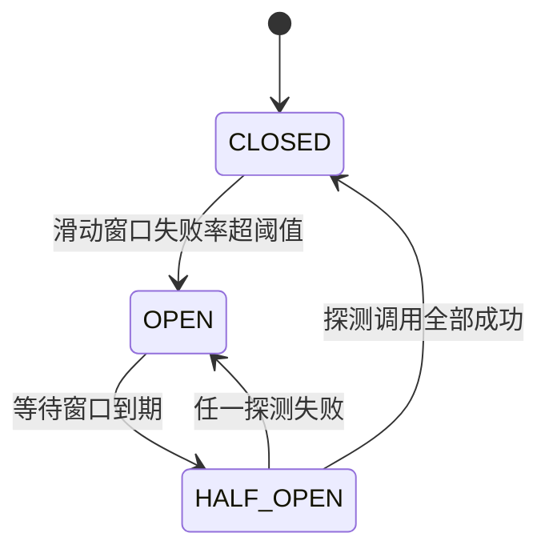

# Java 微服务与分布式阶段

> 面向中大型后端系统，本阶段把 ph15 的单体底座拆成多个服务：服务怎么拆、跨进程怎么调、失败了怎么活、数据不一致怎么收场、全链路怎么观测。

## 1. 概述

本阶段是 Java 学习路线从「单体应用」到「分布式系统」的跨越。roadmap 第 16 节目标：**能开发中大型后端系统**。ph15 攒下的单体底座（Spring Boot + Data + Security + actuator）在本阶段被拆成多个独立进程的服务：拆分带来弹性（独立部署、独立扩缩容、故障隔离），也带来全新的一类问题——网络不可靠、调用会超时、重试会重复、事务跨不了库、问题定位跨进程。本阶段的五条主线（服务拆分 → 服务治理 → 韧性设计 → 分布式一致性 → 可观测性）就是逐一回答这些问题。整个阶段延续「**机制可实测**」原则：凡离线缓存内的构件（Spring Boot 全栈、spring-data-redis + lettuce、jjwt）全部本机实测；真实中间件——Nacos/Sentinel 完全不在缓存，Resilience4j/Micrometer Tracing 缓存仅有 BOM、核心 jar 不在缓存，Spring Cloud Gateway/OpenFeign 仅有 2021.0.8（Boot 2.x/javax，与本阶段 Boot 3.3.0 基线二进制不兼容，缓存快照口径见 §2）——全部只在文中讲机制并如实标注「未在本环境验证」，同构实现（手写熔断器、手写 mini 网关、X-Trace-Id 透传）全部实测背书——各构件缓存状态与处理方式见 [`examples/README.md`](./examples/README.md)。

| 核心维度 | 覆盖内容 |
|----------|---------|
| 服务拆分 | 单体 vs 微服务对比、拆分维度（业务边界/数据所有权/团队）、拆分时机、分布式单体反模式 |
| 服务治理 | 注册发现（Nacos/Eureka 机制）、网关（Spring Cloud Gateway 机制 + 手写 mini 网关实测）、远程调用（OpenFeign 机制 + RestClient 实测） |
| 韧性设计 | 超时（实测）、重试与幂等的关系（实测）、熔断器状态机（实测）、限流算法（令牌桶实测）、降级（实测） |
| 分布式一致性 | CAP/BASE、Saga 补偿（实测）、TCC/本地消息表（机制）、Redis 分布式锁 SET NX PX + Lua 释放（真实 Redis 实测） |
| 可观测性 | 链路追踪（traceId 透传实测，Micrometer Tracing/OTel 机制）、服务监控（actuator/Micrometer 实测）、幂等键设计（并发实测） |

这个阶段只涉及 **微服务架构与分布式系统的设计原则和 Spring 生态落法**，**不涉及消息队列与搜索中间件**（Kafka/RocketMQ/Elasticsearch — 那是 ph17 消息队列与搜索阶段的内容，Saga 补偿的异步化、本地消息表的生产实现都在那里落地）、**不涉及缓存穿透/击穿/雪崩与秒杀等并发架构**（ph18 缓存与高并发阶段；本阶段只用 Redis 做分布式锁，缓存策略不展开）、**不涉及部署运维**（Docker/Kubernetes/CI/CD — ph19 DevOps 与部署阶段）、**不涉及 Netty 与 JVM 并发底层**（ph20 高级 Java 阶段）。也不重复 ph15 已讲的容器/AOP/事务/Security 单体机制（本阶段每个服务内部仍是那套单体），以及 ph14 已讲的 REST 注解与统一响应契约（本阶段沿用其 `{code,message,data}` 壳与「HTTP 状态 = 业务码 / 100」约定）。**业务码谱系（跨阶段演进，对照代码时勿混用）**：ph14 时代的 40100/40101 码义与 ph15 相反（ph15 已如实标注）；ph15 码表为 40001=参数校验、40002=非法角色、40100=未认证、40101=登录失败、40300=无权限、40901=用户名冲突、50000=兜底；ph16 在其上演进——参数校验让位 **40000**（exercises/sol-03 的「sn 为空」校验也判 40000，见其文件头）、**40001 改义为缺幂等键**（Idempotency-Key）、**40002 在 ph16 已不使用**（project 与 exercises 均不引用，仅留在 ph15 码表里供跨阶段对照）、沿用 40100/40101/40300/40901/50000、新增 40400=资源不存在、50200=下游服务异常、50400=下游超时。本阶段承接 [ph15 Spring 全家桶阶段](../ph15-spring-family/15-spring-family.md)——那里讲的每个「框架替你做了 X」在多进程环境下依然成立，只是对象从「容器里的 Bean」变成「网络上的服务」。

## 2. 来源与演变

微服务不是发明出来的新东西，而是 **SOA（面向服务架构）的轻量化重生**。2000 年代初的 SOA 用 ESB（企业服务总线）做集中编排：重协议（SOAP/WS-*）、重治理（中心总线管一切）、重流程——理念超前但落地笨重，ESB 本身成了单点和瓶颈。2011 年 5 月威尼斯软件架构师研讨会上，「microservices」一词被正式提出；2014 年 Martin Fowler 与 James Lewis 发表《Microservices》定义了今天的共识：**小服务、独立部署、去中心化治理、轻量通信（HTTP/消息）、按业务能力组织**。同一时期 Netflix 把这套理念做成了开源事实标准——Netflix OSS（Eureka 注册发现、Ribbon 负载均衡、Hystrix 熔断、Zuul 网关），设计哲学一句话加粗：**面向失败设计——网络不可靠是前提，韧性不是可选项**。2015 年 Spring Cloud Netflix 把这批组件接进 Spring 生态，Java 微服务进入「引 starter 就用」的时代。2018 年风向再变：Hystrix/Ribbon 进入维护模式，Spring Cloud 官方扶正 **Resilience4j**（熔断）、**Spring Cloud LoadBalancer**、**Spring Cloud Gateway**（基于 WebFlux/Netty，取代 Zuul）；国内则以 Spring Cloud Alibaba（**Nacos** 注册发现+配置中心、**Sentinel** 熔断限流、**Seata** 分布式事务）落地。可观测性一侧，Spring Cloud Sleuth 在 2022 年随 Boot 3 退役，由 **Micrometer Tracing + OpenTelemetry** 接棒。

**Spring Cloud 版本列车（Release Train）与 Spring Boot 的对应关系**——Spring Cloud 用「地名列车」做整体版本（一辆车拉全部子项目），选错车厢是新手最常见的坑：

| Spring Cloud 列车 | 配套 Spring Boot | 关键变化 |
|------------------|-----------------|---------|
| Hoxton | 2.2.x / 2.3.x | Netflix 组件最后的高光期 |
| 2020.0（Ilford） | 2.4.x / 2.5.x | 移除 Ribbon/Hystrix/Zuul 等 Netflix 组件，扶正 LoadBalancer/Gateway/Resilience4j |
| 2021.0（Jubilee） | 2.6.x / 2.7.x | Boot 2 最后一代（javax 命名空间） |
| 2022.0（Kilburn） | 3.0.x / 3.1.x | Boot 3 首代：Java 17+、jakarta、Sleuth 退役换 Micrometer Tracing |
| 2023.0（Leyton） | 3.2.x / 3.3.x | **与本阶段 Boot 3.3.0 基线配套**（缓存里只有 2021.0.8 列车，无此代 jar，见下） |
| 2024.0（Moorgate） | 3.4.x | 2024 年末随 Boot 3.4.0 同期发布；架构延续 2023.0，各子项目随 Boot 3.4 对齐升级（本阶段同样未缓存此代 jar） |
| 2025.0（Northfields） | 3.5.x | 截至 2026-09 快照时的当前最新列车 |

> ⚠️ 本机离线缓存里只有 Spring Cloud **2021.0.8** 一列列车（spring-cloud-dependencies 目录仅此版本；**jar 齐全**——starter-gateway/starter-openfeign、gateway-server、openfeign-core 为 3.1.8，commons 为 3.1.7，同列车组件版本不统一、均属 3.1.x，2021.0.8.pom 钉 commons 3.1.7，2026-09-02 复核）——但 2021.x 对应 Boot 2.x（javax），与本阶段 Boot 3.3.0 基线二进制不兼容，且缓存没有配套 Boot 3.3 的 Spring Cloud 2023.x。所以 Spring Cloud 组件本阶段**全部不实测**，只讲机制；同构模式（RestClient 远程调用、手写熔断器、手写 mini 网关）用缓存内构件实现并实测。

本文示例以 **Spring Boot 3.3.0 / Java 17** 为基线（选择理由：与 ph14/ph15 完全同基线，离线缓存可实测 Boot 全栈；微服务的拆分原则与失败语义与框架版本无关），验证工具链 **OpenJDK 17.0.18 + Maven 3.9.12**（`javac -version` → 17.0.18、`mvn -version` → 3.9.12）。Boot 3.3.0 父 POM 统一管理 **Spring Framework 6.1.8、lettuce 6.3.2.RELEASE、spring-data-redis 3.3.0**（全部在本地缓存）。微服务治理的概念（注册发现、熔断、Saga、CAP）十年未变——变的是组件名（Hystrix→Resilience4j→Sentinel），不变的是「超时/重试/幂等/降级」这套失败语义。

**Spring Cloud Netflix 退役路线**（2018 年起官方逐步下架，2020.0 列车一次性移除——看懂这条线，就知道今天的组件该用谁、文档里为什么全是「替代品」的名字）：

| 旧组件（Netflix OSS） | 退役状态 | 官方接替者 | 本阶段对应小节 |
|----------------------|---------|-----------|--------------|
| Hystrix（熔断） | 2018 进入维护，2020.0 移除 | Resilience4j | 3.3 |
| Ribbon（客户端负载均衡） | 2020.0 移除 | Spring Cloud LoadBalancer | 3.2 |
| Zuul 1（网关） | 2019 弃用 | Spring Cloud Gateway（WebFlux/Netty） | 3.2 |
| Sleuth（链路追踪） | Boot 3 起退役 | Micrometer Tracing + OpenTelemetry | 3.5 |

顺着这张表读 3.2/3.3/3.5 的机制：**组件可以换，语义不换**——本阶段同构实现演示的正是这些不换的语义（RestClient 调用、手写熔断器、X-Trace-Id 透传）。

## 3. 语法与参数

### 3.1 微服务架构与拆分原则

**微服务架构**把单体应用拆成一组小服务：每个服务独立进程、独立部署、**独立拥有自己的数据**，服务间用轻量协议（HTTP/gRPC/消息）通信。拆分不是目的，**独立演进能力**才是——订单服务发版不需要用户服务陪着重启。

| 维度 | 单体（ph15 的形态） | 微服务（本阶段） |
|------|---------------------|-----------------|
| 部署 | 一个进程，全量发版 | 每服务独立发版、独立扩缩容 |
| 数据 | 共享一个库，事务本地 ACID | 每服务私有数据，跨服务最终一致 |
| 调用 | 进程内方法调用（不可能超时） | 网络调用（会超时、会丢、会重复） |
| 故障 | 一崩全崩 | 故障隔离（但可能级联，要熔断） |
| 复杂度 | 代码复杂度内聚 | **治理复杂度外移**（注册发现/网关/追踪/一致性） |
| 团队 | 大团队改一个代码库 | 小团队 owning 服务（康威定律） |

roadmap 必会概念第一条就是「**微服务增加治理复杂度**」——拆分把「代码复杂度」换成了「运维与一致性复杂度」，这是取舍不是升级。

拆分前后的结构变化（一张图记住「多了什么」）：

```text
拆分前（ph15 单体）：                       拆分后（本阶段）：
client ──▶ 单体应用 ──▶ 共享数据库          client ──▶ gateway ──▶ order-service ──▶ user-service
            （order+user+device 逻辑模块）                       └─▶ device-service
                                                                  每服务：独立进程 + 独立端口 + 私有数据
                                                                  （示例见 examples/ex01 的双服务最小拆分）
```

**拆分原则（怎么切）**：

- **按业务边界切**（DDD 限界上下文）：用户、订单、设备各自成服务——roadmap 练习的「用户服务/订单服务/设备管理服务」就是按这个维度。判断标准：一个需求变更通常只改一个服务，就说明边界切对了
- **数据跟着服务走**：订单服务不直连用户库，要用户数据走用户服务的 API（examples/ex01 的 order-service 远程取用户名就是这个纪律）。共享数据库是微服务最常见的反模式——表面拆了进程，数据还耦合，改个表结构全站发版
- **别拆太早**：新系统先单体跑清业务边界，痛点（发版互相阻塞、局部需要独立扩容）出现再拆——「微服务优先」害死过很多小团队；ph15 的单体底座先跑通，本阶段才拆
- **分布式单体是谷底**：服务拆了但每个请求都要同步串调四五个服务、发版还得按顺序——比单体更差。拆完检查：单个服务挂掉，系统核心链路是否还能降级运转

**DDD 限界上下文怎么找**（写给不熟悉 DDD 的读者）：限界上下文（Bounded Context）是「一套业务语言 + 一套数据模型」的边界——用户、订单、设备各自有独立的词汇表（订单上下文里的「客户」是一串 id 引用，用户上下文里才是完整档案）和数据表，跨边界只靠「显式接口 + 事件」交流。识别信号：两个概念各自独立变化（改 A 的模型不用动 B）、各自有独立的生命周期管理需求，就该分到两个上下文。roadmap 的「用户服务/订单服务/设备管理服务」三个练习就是三个最典型的限界上下文。

**拆分时机：什么时候才值得拆**。拆分的收益（独立部署/独立扩缩容/故障隔离）只在规模痛点出现后才兑现，判断信号按出现顺序：

| 信号 | 现象 | 对应拆法 |
|------|------|---------|
| 发版互相阻塞 | 一个模块的小改要全站回归发布 | 按业务边界切出独立服务 |
| 局部需要独立扩缩容 | 某模块流量是别的模块的几十倍 | 该模块单独成服务独立扩容 |
| 团队规模变大 | 一个代码库多个团队互相踩 | 按团队 ownership 切（康威定律） |
| 独立技术栈诉求 | 某模块要用不同语言/存储 | 用服务边界隔离技术选型 |

没有这些信号就拆，等于用治理复杂度换不存在的弹性——ph15 的单体先跑清边界，痛点出现再动手。

**反模式自查表**（拆完对照，命中即重构信号）：

| 反模式 | 症状 | 正确姿势 |
|--------|------|---------|
| 共享数据库 | 服务 A/B 直连同一张表，改表结构全站发版 | 数据跟着服务走，跨服务数据走 API |
| 分布式单体 | 请求同步串调 4-5 个服务、发版要按顺序 | 链路拉直或异步化（异步走 MQ，属 ph17） |
| 一个功能一个服务 | 服务数比团队人数还多，运维爆炸 | 按业务能力聚合——服务是业务的边界不是代码的边界 |
| 裸 IP 互相调用 | 服务地址写死在配置里，扩容/迁移靠改配置 | 接注册发现（3.2） |
| 同步调用链过长 | A→B→C→D 串四跳，任何一环慢拖死整链 | 并行化/异步事件化（MQ 属 ph17）；每跳配超时熔断（3.3） |

**ph15 单体 → ph16 分布式：机制迁移总表**（把 ph15 攒下的「进程内一套」逐项搬到「网络上的多套」——右列每一行都是本阶段后续小节的主角；不会对照这张表，就会把单体的心智错带到微服务）：

| ph15 单体机制（进程内，ph15 已实测） | 分布式对应物 + 新语义（本阶段逐项展开） |
|------|------|
| 方法调用（不可能超时） | RPC + 显式超时/重试/降级——「不确定」成为第三种结局（3.3、4.1 / ex02） |
| `synchronized` / `ReentrantLock`（进程内互斥） | Redis 分布式锁（跨进程互斥：原子占位 + token + Lua 释放，3.4 / ex05） |
| `@Transactional`（本地 ACID） | Saga 补偿 / 最终一致（3.4 / ex06、4.3）——跨库回滚没人保证 |
| 单机日志（grep 一个文件就能定位） | traceId 全链路透传 + 各服务日志按 traceId 串成一条链（3.5 / ex01） |
| `application.properties`（改配置要重启） | 配置中心 + 长轮询热刷新（3.2）——配置也集中治理 |
| 健康检查（actuator 单机探活） | 注册中心心跳续约 + 实例摘除——「健康」升级为服务间契约（3.2、4.4） |

对照读法：左列每一条在单体里是「免费的」，右列每一条在微服务里要「花钱买」——买的都是治理机制。这正是 roadmap 必会概念「微服务增加治理复杂度」的具体账单：下面的 3.2～3.5 与 4.x 全部围绕这张表展开。

examples/ex01 演示了最小拆分：user-service（18211）与 order-service（18212）两个进程，订单详情页需要用户名 → order-service 用 RestClient 远程调 user-service 聚合返回（实测 Tests run: 6）。

### 3.2 服务注册发现、网关与远程调用（Spring Cloud / Nacos / Gateway / OpenFeign）

拆分之后三个问题立刻出现：**服务怎么找到彼此**（注册发现）、**流量从哪进**（网关）、**调用怎么写**（远程客户端）。

**注册发现**：服务实例启动时把自己的地址注册到注册中心，调用方查询健康实例列表并做客户端负载均衡。**Nacos**（阿里开源，注册中心 + 配置中心二合一，AP/CP 可切换，国内事实标准）与 Eureka（Netflix，纯 AP）是最常见实现。机制模型：

```text
服务实例 ──启动──▶ 注册中心（Nacos/Eureka）：登记 ip:port，心跳续约
   ▲                  │ 实例列表推送/拉取
   └──调用方 LoadBalancer 从列表挑一个健康实例直连（客户端负载均衡）
```

**实例生命周期（心跳与摘除）**：实例启动后登记地址并开始**周期性心跳续约**；长时间没有心跳的实例被注册中心**摘除**并通知调用方（调用方的本地缓存列表也会失效剔除）；实例优雅下线时主动发注销。Eureka 客户端默认每 30s 续约一次、服务端 90s 没收到心跳判死（可配）；它还有一个常被误解的**自我保护模式**——短时间内丢失大量心跳时，Eureka 宁可保留「可能已死」的实例也不清空注册表，防止网络抖动把整张注册表洗掉（这是 AP 取舍的典型体现，4.2 展开）。两个主流实现的差异要能说出来：

| 维度 | Eureka（Netflix） | Nacos（Alibaba，国内事实标准） |
|------|-------------------|-------------------------------|
| 一致性 | 纯 AP | 注册默认 AP，可切 CP 模式 |
| 健康检查 | 客户端心跳（30s 续约 / 90s 判死） | 临时实例心跳续约；持久实例由服务端主动探测 |
| 配置中心 | 无 | 内置（dataId/group + 长轮询动态刷新，见本小节末） |
| 自我保护 | 有（自我保护模式） | 有（保护阈值） |
| 生态 | Netflix 已维护模式 | Spring Cloud Alibaba，国内主流 |

**客户端负载均衡**：调用方拿到实例列表后由 LoadBalancer 挑一个直连——默认**轮询**，可配**权重**（实例性能不均）、最小连接数等策略；Ribbon 是这套的鼻祖（2 节退役表里已见），2020.0 起官方实现是 Spring Cloud LoadBalancer。

**Spring Cloud Gateway**：基于 WebFlux/Netty 的响应式网关，核心抽象三件套——**Route**（路由：ID + 目标 URI + 谓词 + 过滤器）、**Predicate**（按路径/方法/头匹配：`Path=/api/orders/**`）、**Filter**（改写请求/响应、限流、鉴权）。典型配置：

```yaml
# Spring Cloud Gateway 配置示意（未在本环境验证——缓存只有 Boot 2.x 的 2021.0.8，与 Boot 3.3.0 基线不兼容；机制与同构实测见 exercises/sol-04）
spring:
  cloud:
    gateway:
      routes:
        - id: order-route
          uri: lb://order-service          # lb:// 走注册发现 + 负载均衡
          predicates: [ "Path=/api/orders/**" ]
          filters:
            - name: RequestRateLimiter     # 带参过滤器必须写成 name + args 的映射形式（如 StripPrefix 短路写法见下）
              args:
                redis-rate-limiter.replenishRate: 10   # 每秒补充 10 个令牌（长稳速率）
                redis-rate-limiter.burstCapacity: 20   # 桶容量：允许 ≤20 的突发
                redis-rate-limiter.requestedTokens: 1  # 每次请求取 1 个令牌
```

> ⚠️ 上面的 `RequestRateLimiter` 是 **RedisRateLimiter** 过滤器工厂（令牌桶计数存在 Redis 里，网关多实例才共享同一个桶）：需要 **`spring-boot-starter-data-redis-reactive`**（响应式 Redis 客户端——Gateway 跑在 WebFlux 上，不能用阻塞版 `spring-boot-starter-data-redis`）依赖，并注册一个 `KeyResolver` Bean 提供限流键（按 IP/用户/接口各限各的桶）。同为令牌桶，3.3 的 ex03 手写版讲的是算法本身，这里讲的是它在网关上的配置形态。

**过滤器链的语义**：Gateway 的 Filter 分**全局过滤器**（对所有路由生效——鉴权、traceId 注入、日志这类横切职责都在这层）与**路由过滤器**（只作用于本路由——`StripPrefix` 改路径、`RequestRateLimiter` 限流）。请求走「路由匹配 → 预过滤器（改写请求）→ 转发下游 → 后置过滤器（改写响应）」的管线。手写 mini 网关（exercises/sol-04 与 project/）用「JWT 过滤器 + 按路径分发的转发控制器」实现了同一条管线：过滤器 ≈ 全局过滤器，控制器里的路径分发 ≈ 路由表。把路由表换成 `spring.cloud.gateway.routes` 配置、把转发换成 WebFlux 的转发 handler，就是真实 Gateway——见 project README「扩展方向」的对照清单。

**谓词速查表**（Predicate 工厂名即匹配维度，最常见四种——`Path` 按路径、`Method` 按方法、`Header` 按请求头、`Query` 按查询参数；多个谓词叠加是 AND，全部满足才路由）：

| 谓词工厂 | 匹配什么 | 示例 |
|---------|---------|------|
| `Path` | 请求路径（Ant 风格，`**` 多段通配） | `Path=/api/orders/**,/api/users/**` |
| `Method` | HTTP 方法 | `Method=GET,POST` |
| `Header` | 请求头存在，且值可配正则 | `Header=X-Auth-User,\d+` |
| `Query` | 查询参数存在，且值可配正则 | `Query=debug,true` |

**Route / Predicate / Filter 最小样例**——把上面完整路由「逐件点名」（同样未在本环境验证，手写同构见 exercises/sol-04 与 project/ 的路径分发控制器；谓词匹配不上任何 Route 的请求直接 404，根本进不了过滤器链）：

```yaml
spring:
  cloud:
    gateway:
      routes:                       # ① Route：一条路由 = id + uri + predicates + filters
        - id: device-route
          uri: lb://device-service  #    uri：lb:// 走注册发现
          predicates:               # ② Predicate：匹配条件（AND 叠加）
            - Path=/api/devices/**
          filters:                  # ③ Filter：改写请求/响应（短路写法「工厂名=参数」）
            - StripPrefix=0
```

**OpenFeign**：声明式远程客户端——只写接口和注解，实现由框架生成（与 Spring Data「接口即实现」同一心智）：

```java
// OpenFeign 声明式客户端（未在本环境验证——缓存只有 Boot 2.x 的 2021.0.8，与 Boot 3.3.0 基线不兼容；同构实测见 examples/ex01 的 RestClient 版）
@FeignClient(name = "user-service", fallback = UserClientFallback.class)
public interface UserClient {
    @GetMapping("/users/{id}")
    UserDto getUser(@PathVariable("id") long id);
}
```

**OpenFeign 的实现机制**：`@FeignClient` 接口在启动时被扫描，框架用 **JDK 动态代理**为接口生成实现——每个方法按 `@GetMapping` 等注解解析出 URL 与参数，调用时走「负载均衡（服务名 → 实例）→ HTTP 客户端 → 响应解码」管线；`fallback` 指定降级实现（3.3），`RequestInterceptor` 可以给每次调用注入头（3.5 的 traceId 透传就挂在这）。它与本阶段实测的 RestClient 版（examples/ex01 的 UserClient、ex02 的 ResilientCaller）是**同一语义的两种写法**：Feign 把「接口 + 注解」当契约（实现由代理生成），RestClient 把调用显式写出来。教学先用显式版把语义讲透，换 Feign 时样板变注解、语义不动。

**OpenFeign 的超时/重试配置 vs RestClient 同构写法**——同一套失败语义，两种声明位置（Feign 侧未在本环境验证：缓存无 Boot 3 兼容版，配置项名以 Spring Cloud OpenFeign 2021.0+ 官方文档口径为准；RestClient 侧为 ex01/ex02 实测值）：

| 关注点 | OpenFeign（声明式，配置项） | RestClient 同构（显式，实测） |
|--------|---------------------------|------------------------------|
| 连接超时 | `feign.client.config.<服务名>.connectTimeout`（ms，`default` 段对所有服务生效） | `ClientHttpRequestFactory.setConnectTimeout`（ex01：500ms） |
| 读超时 | `feign.client.config.<服务名>.readTimeout` | 同上 `setReadTimeout`（ex01：800ms） |
| 重试次数 / 退避 | `Retryer` Bean（如 `Retryer.Default(period, maxPeriod, maxAttempts)`；2021.0+ 官方更推荐交给 circuitbreaker/spring-retry——组件会换、语义不变，见 4.1） | ex02 `ResilientCaller` 的 `maxAttempts`/`backoffMs` 手写循环 |
| 熔断 / 降级 | `@FeignClient(fallback=…)` + `spring-cloud-circuitbreaker` | ex02 catch → `CallOutcome.fallback(...)` |

**本环境的同构实测**：这三件套没有与本阶段 Boot 3.3.0 基线兼容的可运行构件（缓存里 Spring Cloud 只有 Boot 2.x 的 2021.0.8），但它们的**语义**被拆成可实测的同构实现——RestClient + 显式 base-url 演示远程调用与超时（ex01/ex02，相当于 Feign 的手写版）；手写路由转发 + JWT 过滤器演示网关与鉴权收敛（exercises/sol-04 与 project/，相当于 Gateway 的手写版）；注册发现在文档讲机制（实例列表本质是一张「服务名 → 健康地址」的动态表）。学完机制换到真实 Spring Cloud 时，注解和配置只是这些语义的声明式封装。

**Nacos 的另外一半：配置中心**。Nacos 同时做注册中心与配置中心：配置按 `dataId`（形如 `<服务名>-<环境>.yaml`）+ `group` 分组，服务端把配置变更**长轮询**推给客户端，客户端配合 `@RefreshScope` 让 Bean 按新配置重建——改配置不用重启服务。**长轮询的机制一句话**：客户端不是定时拉取，而是挂一个「慢 HTTP 请求」在服务端等变更——有变更立即返回 diff、无变更挂到超时再续挂，变更到生效从秒~分钟级降到亚秒级，代价是每个客户端常年占一条挂起连接；收到变更后客户端比对本地版本、增量拉取，再触发 `@RefreshScope` 的 Bean 重建（重建窗口内新旧配置短暂混用，由配置可重入性兜底）。注册发现（AP 合适）与配置（CP 合适）对一致性的要求不同，正是 4.2 的 CAP 教材；project README「身份与安全」扩展里「JWT 密钥走配置中心注入」指的就是它。

### 3.3 熔断限流与降级（Sentinel / Resilience4j）

roadmap 必会概念「**远程调用必须有超时和降级**」是本阶段最重要的一行字。韧性四件套的顺序：**超时是底线 → 重试治瞬时抖动 → 熔断防级联 → 降级保底体验**。

链路上一处慢为什么能拖死整条链？看这条级联：

```text
服务 A（线程池 100）                服务 B（线程池 100）             服务 C
   │ 调 B 的线程全部挂等等待           │ 调 C 的线程全部挂等等待
   ▼                                 ▼
B 变慢且调用方没设读超时 ──▶ A 的线程被占满 ──▶ 新请求无线程可用，A 也表现为“挂”
   └─▶ 调 A 的上游同样把线程挂等 A ──▶ 雪崩沿调用链向入口反向扩散，整条链全挂
```

超时截断「无限等待」、熔断快速拒绝「持续失败」、降级兜底保核心——下面四件套逐一上场。

**超时**：任何跨进程调用必须显式设连接/读超时——不设置时线程挂死在 socket 上，下游慢会拖死上游全部线程池（线程池打满 → 上游也挂 → 级联雪崩）。ex01 实测：读超时 800ms vs 下游 sleep 1500ms，调用方 1.4s 内拿到 504，没有被拖死。超时不是一个值，要分清三档：

| 超时类型 | 含义 | 经验取值 |
|---------|------|---------|
| 连接超时（connectTimeout） | 建立 TCP 连接的最长等待 | 内网数百 ms，连不上说明下游没起/地址错 |
| 读超时（readTimeout） | 请求发出后等响应的最长等待 | 数秒以内，按下游 P99 定（ex01 用 800ms） |
| 写超时 | 发送请求体耗时 | 通常很小，大 body 才需要单独看 |

超时不是越大越好——它要小于「你能接受的最长等待」，否则快速失败失去意义。

**重试**：只对**瞬时故障**（5xx、超时）重试，4xx 是请求本身有问题，重试一万次还是 4xx；且**只有幂等操作才敢重试**（见 3.5 与 4.1）。ex02 实测六种场景：瞬时失败重试到成功（下游实测被打 3 次）、持续 5xx 重试耗尽降级、404 不重试、超时重试、非幂等 POST 不重试、幂等 POST 重试成功。

**熔断器（Circuit Breaker）**：下游持续失败时「跳闸」——短时间内直接拒绝调用（快速失败），给下游喘息也保住自己。状态机：



ex03 用纯 Java 手写实现实测了完整状态机（窗口 4、失败率 ≥50% 熔断）：OPEN 期下游调用计数为 0（真的没打）、HALF_OPEN 探测 2 次全成回 CLOSED、探测失败立即回 OPEN 并重计时。**Resilience4j**（Spring Cloud 官方熔断组件，轻量、函数式 API：`@CircuitBreaker`/`@Retry`/`@RateLimiter` 注解）与 **Sentinel**（阿里，流量治理平台：熔断 + 限流 + 系统自适应保护 + 控制台）是生产实现——两者 jar 均不在离线缓存（未在本环境验证），但 ex03 手写版的状态机与 Resilience4j 语义一一对应。

熔断器的四个参数决定「跳闸的敏感度和恢复速度」（ex03 手写版对应的是窗口 4、失败率阈值 50%、等待窗口可注入）：

| 参数 | 语义 | Resilience4j 默认值 |
|------|------|-------------------|
| 滑动窗口 | 统计多近的调用（按次数或时间） | 最近 100 次调用 |
| 失败率阈值 | 窗口内失败占比超过即跳闸 | 50% |
| 等待窗口（OPEN 时长） | 跳闸多久后放探测请求 | 60s |
| HALF_OPEN 探测请求数 | 试探期最多放几个请求 | 10 个 |

> ⚠️ HALF_OPEN 只放少量探测请求是有原因的：试探请求要真是「探」——下游刚缓过来，一下放回全量流量又会被打趴。探测全部成功才回 CLOSED，任一失败立即回 OPEN 并**重新计时**（ex03 实测这条路径）。

**Resilience4j vs Sentinel 怎么选**：

| 维度 | Resilience4j（Spring Cloud 官方） | Sentinel（Alibaba） |
|------|-----------------------------------|--------------------|
| 形态 | 轻量库：函数式装饰器/注解，无外部依赖 | 流量治理平台：客户端 SDK + 独立控制台 |
| 熔断统计 | 滑动窗口失败率 / 慢调用率 | 异常比例 / 异常数 / 慢调用 RT |
| 限流 | 漏桶 / 令牌桶 | 滑动窗口 / 令牌桶 / 热点参数 / 集群限流 |
| 特色 | 与 Hystrix 语义最接近，易内嵌单体 | 系统自适应保护、控制台实时监控与规则热更新 |
| 集成 | spring-cloud-circuitbreaker | Spring Cloud Alibaba Sentinel starter |

（上表默认参数与能力为官方文档口径，两者 jar 不在离线缓存，本环境未实测——本阶段用 ex03 手写版把状态机语义实测背书。）口诀：只要「熔断 + 限流」且想轻，Resilience4j；要控制台、规则可视化、热点/集群限流，Sentinel。

**舱壁隔离（Bulkhead）**：熔断管「下游失败」，舱壁管「别让一个慢下游独占上游线程」——把线程池或信号量**按下游分组**（「用户服务专用池」「订单服务专用池」），某个下游占满自己的舱壁就拒绝，不影响别的下游的舱。Hystrix 的线程池隔离是代表作（代价是线程切换开销），轻量替代是信号量舱壁（不换线程只计数）。project/order-service 的 UserClient「一个下游一个客户端」就是分组思想的雏形；ex03 的令牌桶则是舱壁「限量准入」的另一种形态。

**限流**：保护服务不被突发流量打垮，在网关或服务入口执行。两种经典算法（ex03 实测令牌桶）：

| 算法 | 机制 | 特点 |
|------|------|------|
| 令牌桶 | 固定速率产令牌，请求取令牌，无令牌拒绝 | 允许不超容量的突发（ex03 实测：桶 3 容量突发取 3 全过、第 4 拒） |
| 漏桶 | 请求进桶，匀速流出 | 严格匀速削峰，突发被排队/拒绝 |

**降级（Fallback）**：重试/熔断都救不回来时的保底返回——缓存旧值、默认值、静态页。降级不是错误处理，是**有损服务的设计**：订单详情页的用户名可以显示「（用户服务暂不可用，降级展示）」，但订单本身不能丢（exercises/sol-02 实测 degraded=true 降级路径）。

**「超时/重试/熔断/限流/降级」易混定位表**——名字像、管的事不同，一句话分工：**超时定「等多久」、重试定「再打几次」、熔断定「还打不打」、限流定「放多少进来」、降级定「打不了给什么」**：

| 机制 | 防什么 | 失败后行为 | 典型参数（教学实测值） |
|------|--------|-----------|----------------------|
| 超时 | 防无限等待拖死自己（下游慢/挂死时不陪着等） | 抛超时异常，交给重试/降级 | 读超时 800ms（ex01，< 下游 P99 留余量） |
| 重试 | 防瞬时抖动白死一次（只治瞬时故障） | 重发请求；**只对幂等操作**重试 | 最多 3 次 + 退避（ex02） |
| 熔断 | 防级联拖垮整条链（下游持续病态） | OPEN 快速失败，不再打下游 | 窗口 4、失败率 50%（ex03） |
| 限流 | 防突发流量打爆服务自己（入口层） | 直接拒绝超量请求 | 令牌桶容量 3、10/s（ex03） |
| 降级 | 防核心功能跟着一起死（用户体验） | 返回有损结果（缓存旧值/默认/占位） | degraded=true 占位（sol-02） |

### 3.4 分布式事务与分布式锁

**分布式事务**：单体里一个 `@Transactional` 搞定的事（ph15），拆服务后跨了库，本地事务管不到远程。四种主流方案按一致性从强到弱：

| 方案 | 机制 | 一致性 | 适用 |
|------|------|--------|------|
| 2PC/XA | 协调者两阶段提交（准备→提交），全程持锁 | 强一致 | 短事务、低并发；吞吐差，生产少用 |
| TCC | Try（预留资源）→ Confirm/Cancel，业务代码三段式 | 最终一致（近实时） | 资金类强诉求；侵入大 |
| Saga | 一串本地事务 + 每步配补偿动作，失败反向补偿 | 最终一致 | 长流程（下单→扣款→物流），本阶段实测 |
| 本地消息表 | 本地事务里写消息表，异步投递到 MQ | 最终一致（异步） | 可异步场景；依赖 MQ（ph17 落地） |

把「两阶段提交」画成时序就明白它为什么吞吐差、生产少用：

```text
协调者(TM)            参与者 A（库 1）               参与者 B（库 2）
   │── prepare ──────▶│ 锁资源、写 undo/redo           │
   │── prepare ──────▶│                                │ 锁资源
   │◀── 就绪/放弃 ────│                                │
   │◀── 就绪/放弃 ─────────────────────────────────────│
   │── commit ───────▶│ 提交并释放锁                    │
   │── commit ───────▶│                                │ 提交并释放锁
   （任一参与者「放弃」→ 全体回滚；全程持锁 → 并发与吞吐双低。这里的协调者即事务管理器
    TM（transaction manager，XA 术语），不是 Seata 的 TC——TC 是 Seata 服务端角色，见下段）
```

TCC 用业务代码把「数据库锁」换成「预留资源 + 确认/取消」换回并发（代价是侵入最大——每段业务都要手写 Try/Confirm/Cancel 三段）；**Seata**（Alibaba 分布式事务框架）把 TCC 的样板又推进了一步做成 **AT 模式**：业务只写普通 SQL，框架靠 undo_log 自动生成反向 SQL、失败时自动回滚——接入成本远低于手写 TCC，是资金类项目的事实标准（Seata 的角色术语：**TM** 业务端发起全局事务、**TC** 服务端协调器统一指挥、**RM** 资源端执行分支——所以「TC」只在 Seata 语境使用，通用 2PC 图里的协调者叫事务管理器 TM，见上；本阶段缓存无 Seata jar，AT/TCC 机制不实测；ex06 用 Saga 实测的是「补偿」这条路径的语义）。

**本地消息表**把「跨库强一致」降级成「本地事务 + 异步对账」：

```text
业务服务：本地事务 ──写业务数据──────▶ 返回成功（同一本地事务，原子）
                 └──写消息表（同事务）──▶ 定时任务扫未投递记录 ──▶ 投递到 MQ
                                                          └─▶ 消费方幂等消费（ph17 详述）
```

它把「一次跨库提交」拆成「本地一定成 + 异步一定达」，但依赖 MQ 可靠性、消费幂等与对账兜底——正是 ph17 消息队列阶段的内容，这里先建立心智：**用「最终一致 + 对账」换掉持锁的强一致**。

ex06 实测了 **Saga 编排式**：下单（PENDING）→ 扣款 → 预约物流；余额不足（业务失败）→ CANCELLED 不补偿；物流失败（钱已扣）→ 补偿退款 → FAILED。关键设计点全部实测：**补偿动作必须幂等**（debit/refund 按 txId 去重，重放不产生二次效果）、**sagaId 幂等**（同一 sagaId 重复提交返回同一终态，余额只扣一次）、业务失败（4xx 语义）与技术故障分开（前者取消、后者补偿）。补偿本身失败的兜底（重投/死信）依赖消息队列——**属于 ph17 的内容**。

ex06 是**编排式（orchestration）**——一个 Saga 协调器（ordersaga 应用）知道全部步骤并依次驱动。Saga 还有另一种组织方式——**编舞式（choreography）**：没有集中协调器，每步服务完成后发领域事件，下一步服务订阅事件自行继续，失败也靠事件链反向补偿。两者对比：

| 维度 | 编排式（ex06 实测） | 编舞式 |
|------|---------------------|--------|
| 控制权 | 一个协调器串起全部步骤，流程逻辑集中 | 无协调器，各服务订阅事件自续 |
| 耦合 | 协调器要知道所有步骤与补偿 | 各服务只依赖前后一步的事件（解耦强） |
| 可观测 | 流程集中，sagaId 一条日志链好排查 | 链路散在各服务事件里，端到端排查难 |
| 落地成本 | 同步调用即可（本阶段同构实现） | 依赖消息队列做事件投递（属 ph17） |

步骤多、要人工干预重放时编排式更好控；追求服务解耦、步骤天然事件化时编舞式更顺——订单类系统通常从编排式起步。

**Saga 补偿 vs Outbox 重放：边界对照表**——两者都叫「最终一致」，但一个**失败驱动**、一个**成功驱动**，别混用：

| 维度 | Saga 补偿（ex06 实测） | Outbox 重放（本地消息表的现代形态，MQ 投递属 ph17） |
|------|------------------------|-----------------------------------------------------|
| 触发者 | 业务失败/步骤异常 → 反序执行已成功步骤的补偿动作 | 本地事务**提交成功** → relay 把 outbox 表里的事件投给下游（成功驱动） |
| 失败处理 | 补偿动作按 sagaId/txId 幂等重放；补偿自身失败靠重投/死信（ph17） | 投递失败定时重扫 outbox 表重发；消费端幂等消费去重 |
| 一致性形态 | 最终一致，窗口 = 补偿链执行时长 | 最终一致，窗口 = 本地提交到 MQ 确认 |
| 典型适用 | 同步跨服务长流程、失败要有「撤销」语义（下单→扣款→物流） | 把「已提交的事实」可靠通知下游（发事件/建索引/跨服务订阅），下游异步跟进 |

一句话边界：**Saga 回答「失败了怎么撤销」，Outbox 回答「成功了怎么可靠地让下游知道」**——前者失败驱动、后者成功驱动；两者都靠「幂等重放」兜底（补偿可重放、消息可重投），这是 4.1 的「不确定」在两类方案里的统一解法。编舞式 Saga 的领域事件投递，正是 Outbox 的典型落点（ex06 的编排式是同步版；换成「本地事务写 outbox + relay 投 MQ」就是它的异步版，ph17 展开）。

**分布式锁**：单体里的 `synchronized`/ReentrantLock 锁不住别的进程；跨进程互斥需要第三方仲裁者，Redis 是最常用的。正确姿势三要素（ex05 在真实 redis-server 8.6.2 上实测）：

```java
// examples/ex05-redis-distributed-lock/.../RedisDistributedLock.java —— 三要素实测（Tests run: 5）
// ① 原子占位：SET key token NX PX ttl ——「占位 + 过期时间」一条命令完成（分两条会留「占位后宕机」的死锁窗口）
Boolean acquired = redis.opsForValue().setIfAbsent(key, token, ttl);
// ② token 标识持有者：只能解自己的锁
// ③ Lua 原子释放：比对 token 再删（先 GET 后 DEL 两条命令之间有窗口，会误删他人锁）
//    if redis.call('get', KEYS[1]) == ARGV[1] then return redis.call('del', KEYS[1]) else return 0 end
```

ex05 实测：互斥（持锁期间第二持有者被拒）、token 校验（错误 token 解不开）、TTL 兜底（持有者宕机 300ms 后锁自动释放，防死锁）、12 线程并发抢锁恰好 1 个赢家。生产用 **Redisson**（在上述语义上加了看门狗自动续期、可重入、RedLock 多实例方案——未在本环境验证，机制：后台线程定期把快到期的锁续期，解决「业务没跑完锁先过期」）。

**看门狗解决的赛跑**：锁的 TTL 与业务执行时长在赛跑——TTL 太短，业务没跑完锁先过期，第二个持有者进来，临界区被并发执行；TTL 太长，持有者宕机后锁迟迟不释放。Redisson 的看门狗在持有期间**周期续期**（默认锁 30s、每 10s 续一次），业务结束主动释放；手写版（ex05）没有续期，靠「TTL 设得比最长业务时间长 + 业务结束立即释放」规避——ex05 实测的 300ms TTL 防死锁（`lockExpiresAfterTtlWhenHolderCrashes`）就是这个取舍的最简形态。

> ⚠️ 分布式锁是「互斥」工具不是「一致性」工具——Redis 主从切换时锁可能双持（RedLock 缓解但争议很大，Martin Kleppmann 与 antirez 的著名论战）。资金/库存类强一致场景优先数据库唯一约束/乐观锁，锁只用于「最好互斥、偶尔双持可兜底」的场景。

### 3.5 链路追踪、服务监控与幂等

**链路追踪**：一个请求穿过网关→订单→用户→……，出问题时要知道它死在哪一跳。机制模型：入口生成 **traceId**，每跳生成 **spanId**，调用下游时把头（`traceparent`/`X-Trace-Id`）透传下去，各服务把 span 上报到收集器（Zipkin/Tempo）拼成调用树。Spring 生态的实现演进：Spring Cloud Sleuth（Boot 2 时代）→ **Micrometer Tracing + OpenTelemetry**（Boot 3 起，bridge jar 不在离线缓存，未在本环境验证）。一次「下单详情」请求的调用树长这样：

```text
traceId = 8a2f...（一次业务请求一个，全链路不变；spanId 每跳新生成、parent 指向上游）
[gateway span g-01] ──调 order──▶ [order span o-01] ──调 user──▶ [user span u-01]
   ├─ 聚合等待                                      ├─ 聚合等待
   ▼                                                ▼
（响应沿原路返回；各服务把 span 上报收集器，按 traceId 拼成上面这棵树）
```

ex01 实测了同构最小版：`TraceIdFilter`（入口生成/接力 X-Trace-Id 并写入 MDC）+ `TraceIdClientInterceptor`（RestClient 调用时把 MDC 里的 traceId 写进下游请求头）——实测带 `trace-test-0001` 的请求，order-service 聚合结果里 user-service 见到的 traceId 一字不差。有了它，日志里按 traceId 一 grep 就能串起整条链路——roadmap 必会概念「链路追踪帮助定位跨服务问题」落地。

HTTP 层的标准透传头是 W3C **`traceparent`**：`版本-trace-id-parent-id-flags` 四段十六进制——trace-id 32 位十六进制字符（16 字节）、parent-id 16 位十六进制字符（8 字节）、flags 2 位十六进制字符（1 字节）（形如 `00-4bf92f3577b34da6a3ce929d0e0e4736-00f067aa0ba902b7-01`，`-01` 末位表示采样标记）；ex01 用的 `X-Trace-Id` 是它的简化同构（只透 traceId 一段）。**采样**要防「全量上报把监控系统打爆」：头部采样（请求进来时按比例决定整条链报不报，简单但慢请求容易漏）或尾部采样（收集端按结果决定，能保证错误与慢调用必采）；生产惯例是错误请求 100% 采样、正常请求 10% 上下。

**服务监控**：每个服务暴露 actuator 端点（`/actuator/health` 给探活，`/actuator/metrics` 给指标，Micrometer 体系，ph15 已实测）；微服务下新增两条纪律：**健康检查决定流量**（注册中心/K8s 探活不健康的实例会被摘掉——ex01 实测双服务 health 均 UP）与**指标要聚合**（单服务指标没意义，Prometheus 抓全部实例 + Grafana 看板，部署侧属 ph19）。报警盯住黄金信号：延迟、流量、错误率、饱和度。

**actuator 端点速查**（微服务必开的最小集；Boot 3 默认只暴露 `health`，`metrics`/`loggers` 等要在配置里显式放行——`management.endpoints.web.exposure.include`，ph15 已讲；ex01 的 application.properties 就是只放行 `health,info` 的最小示范）：

| 端点 | 返回什么 | 微服务下的用途 |
|------|---------|---------------|
| `/actuator/health` | UP/DOWN + 各组件明细 | 注册中心/负载均衡探活依据——不健康实例被摘（3.2） |
| `/actuator/metrics` | 指标树（jvm.*/http.*/…） | Prometheus 抓取对象（ph19），黄金信号的数据源 |
| `/actuator/loggers` | 各级 Logger 当前级别（可 POST 临时改） | 线上调 debug 排查，不用发版 |

**黄金信号怎么选阈值**——阈值与前面的失败语义参数联动，不是拍脑袋：

- **延迟**：盯 P99；**读超时定在 P99 之上留余量**（P99 500ms 的服务配 800ms 读超时，ex01 就是这个配法）；P99 持续爬升是下游恶化的第一信号
- **错误率**：5xx 占比（常见告警线 1% 上下）；**熔断失败率阈值按它反推**——ex03 教学值 50% 是极端演示，生产 5~10% 就该考虑跳闸
- **饱和度**：线程池/连接池/内存水位——到 70~80% 就扩缩容或前置限流，别等 100% 打满再救（阈值先宽后严，发版后按上周同时段环比回看）

**结构化日志 / MDC 惯例**（让上面 traceId 透传真正可用的最后一公里）：生产日志用 JSON/键值结构化（时间/级别/服务名/实例/traceId 固定字段），MDC 里常驻 `traceId` + `userId`；错误日志带上业务键（orderId/sagaId/sn）。排查两步走：先按 traceId 串出整条链，再按业务键对账局部状态——这正是 ex01 `TraceIdFilter` 写入 MDC 在生产环境里的完整形态。

**幂等**：分布式环境「请求可能到达任意多次」（超时重试、用户双击、MQ 重投），写接口必须幂等——同一操作执行 N 次的效果 = 执行 1 次。三层防法（按防线从外到内）：

| 层 | 机制 | 防什么 | 实测 |
|----|------|--------|------|
| 请求级 | `Idempotency-Key` 头，服务端按 key 去重重放首个结果 | 网络重试/用户重复提交 | ex04：16 线程撞同 key 业务只执行 1 次；缺 key 400 |
| 业务级 | 唯一约束/业务键（如设备 sn）`putIfAbsent` | 换 key 重发同一业务对象 | exercises/sol-03：12 并发同 sn 只建 1 条 |
| 状态机级 | 状态迁移校验（只有 PENDING 能转 CONFIRMED） | 重复推进流程 | ex06 sagaId 终态重放 |

ex04 还实测了两条容易漏的语义：**失败不缓存**（业务失败清除占位，客户端可重试——缓存失败会把暂时性故障变成永久拒绝）与 **TTL 窗口**（幂等不是永久的，窗口外同 key 视为新请求）。

幂等键落地还有三个工程问题（ex04 的 ConcurrentHashMap 是教学最简版）：

- **键从哪来**：客户端每次写操作生成 UUID 即可（服务端不猜键）；要保证「同一业务对象只建一次」时，用业务键（设备 sn/订单号）做键——sol-03 的双层幂等就是「请求键管网络重试、业务键管换键重发」各管一层
- **存哪**：生产落 Redis（键带 TTL，天然过期）或数据库唯一约束表；ex04 用内存 Map + 过期清理演示语义，换 Redis/DB 只换存储不换语义
- **TTL 留多久**：覆盖「网络重试的最长窗口」即可（秒~分钟级），ex04 的 TTL 单测用 150ms 教学值（`expiredEntryCanBeReprocessed`）；窗口外同 key 视为新请求

## 4. 底层原理

### 4.1 远程调用的失败语义：超时、重试、幂等的三角关系

单体方法调用的失败是「全或无」（异常抛出，状态可预期）；网络调用多出第三种结局——**不确定**：请求发出去了，响应没回来。下游到底处理没有？不知道。这个「不确定」是分布式失败语义的核心，三件套各自对应它的一面：

```text
请求 ──▶ 网络 ──▶ 下游处理 ──▶ 响应
           │          │            │
           ▼          ▼            ▼
        连接超时    处理中挂死    读超时（响应丢失）
        （下游没收到） （不确定！）  （下游可能已处理）
```

- **超时**把「无限等待的不确定」变成「有限时间后失败」——但注意：**超时只救调用方，不取消下游**。ex01 的实测日志里能看到下游在客户端超时断开后仍在处理（`ClosedChannelException`：下游写响应时发现连接已关）——下游的工作已经做了，这就是「不确定」的实体化
- **重试**在「不确定」时重发请求——所以「下游可能已处理」意味着重试可能让操作发生两次。**幂等是重试的前置条件**：GET 天然幂等可放心重试；POST 必须带幂等键才敢重试（ex02 实测：非幂等 POST 不重试、幂等 POST 重试成功）。整条链路上**每一跳都要幂等**——网关重试一次、服务重试一次、MQ 重投一次，次数相乘（重试风暴：下游已经过载，重试把流量放大数倍加速其死亡——所以重试要配熔断，且退避 + 抖动）
- **熔断**切断「不确定」的级联：下游病了，继续打只是浪费自己的线程和下游的最后一口气。熔断器统计的是**自己看到的失败率**（窗口内），所以它是调用方的自保装置，不是对下游健康度的全局判断

重试不能「立刻再打一次」——要给下游喘息，**退避（backoff）**三档：

| 策略 | 行为 | 适用 |
|------|------|------|
| 固定退避 | 每次重试前等固定时长 | 最简单；ex02 教学用 5ms 固定退避（只验证语义） |
| 指数退避 | 等待随次数翻倍（500ms→1s→2s…） | 默认选择，贴合下游恢复节奏 |
| 指数退避 + 抖动 | 指数基础上加随机 ± | 大规模集群必用——同秒重试会形成「同步重试风暴」再打垮下游 |

把「每一跳都可能重试」乘起来看放大效应：网关重试 3 次 × 服务重试 3 次 × MQ 重投 3 次 = **最多 27 倍流量**——生产要「指数退避 + 抖动 + 熔断闸门」一起上，而不是只调大重试次数。

### 4.2 CAP 与一致性取舍

**CAP**：分布式系统在网络分区（P）发生时，只能在一致性（C，所有节点看到同一份最新数据）与可用性（A，每个请求都有响应）之间二选一——P 不可避免（网络就是会断），所以真实的选择题是「分区时要 C 还是 A」。

| 组合 | 语义 | 代表 |
|------|------|------|
| CP | 分区时宁可拒绝服务也要数据一致 | Nacos（CP 模式）、Zookeeper、etcd |
| AP | 分区时宁可返回旧数据也要可用 | Eureka、Nacos（默认 AP）、Redis 主从 |

注册中心的选型是最好的 CAP 教材：Eureka 选 AP——实例列表短暂不一致没关系（调用方拿到一个还能用的地址就行），注册中心本身挂了不能拖垮全部服务发现；而配置/选主类场景选 CP（配置错了比读不到更可怕）。Nacos 两者可切换，正因为它同时做注册中心（AP 合适）和配置中心（CP 合适）。

从 CAP 往外走是 **BASE**（Basically Available 基本可用、Soft state 软状态、Eventually consistent 最终一致）——微服务的默认哲学：**放弃跨服务强一致，换取可用性，用补偿/Saga/对账把系统最终拉回一致**。3.4 的方案表就是一致性光谱：2PC（要 C，牺牲 A 与吞吐）→ TCC → Saga → 本地消息表（要 A，接受更长的最终一致窗口）。选型口诀：钱的事尽量短链路强一致（单库事务，或 Seata AT/TCC 自动回滚），流程的事 Saga 补偿，能异步的事消息表——**一致性越弱，系统越能活，业务兜底代码越多**，这就是取舍。

把 3.4 方案表落成「遇到场景怎么选」的**决策树**：

```text
能接受异步吗？
├─ 能 → 本地消息表 / 领域事件（MQ 投递，属 ph17）
└─ 不能 → 流程跨几个服务？
    ├─ 单库/单服务 → 本地事务（ph15 的 @Transactional 就够）
    ├─ 跨 2-3 步的中长流程 → Saga 补偿（本阶段 ex06 实测）
    └─ 跨服务但资金强一致 → Seata AT / TCC（AT 自动回滚优先）
```

一句话总结：**能异步就异步，不能异步就 Saga，钱的事上强一致手段**——与 3.4 方案表、4.2 CAP 表三处互相对照着记。

### 4.3 从单体 @Transactional 到「最终一致」：事务语义是怎么一步步丢的

ph15 的 `@Transactional` 能保证 ACID，前提是**所有读写都在同一个数据库连接里**。拆服务后三个前提同时被打破：

| 单体 @Transactional 的保证 | 拆服务后发生了什么 |
|---------------------------|-------------------|
| 原子性：要么全成要么全没 | 跨库回滚没有协调者——2PC 太重、Saga 只能补偿到「最终一致」 |
| 隔离性：行锁防止并发覆盖 | 锁是进程内的，跨服务锁不住（3.4 分布式锁只解决互斥，不解决一致性） |
| 一致性：约束就在库上 | 各服务私有库，约束跨不过服务边界——只能靠幂等 + 对账把系统拉回一致 |

所以微服务把「事务保证」降级成三条应用层纪律：**写接口幂等**（重试安全，3.5）、**补偿动作幂等**（Saga 可重放，ex06）、**对账兜底**（定期扫不一致数据自动/人工修正，本地消息表的生产形态在 ph17）。事务语义没有消失，只是从「数据库保证」变成了「应用层设计」——这也是 4.1「不确定」在数据面上的投影：**一旦跨了进程，你就再也无法用一次本地事务把状态钉死**。

### 4.4 注册中心选主与 2PC 恢复

3.2 的心跳模型讲的是「客户端 ⇄ 单个中心」的契约；生产里的注册中心自己是集群，于是多出一个问题：**中心内部多节点怎么保持一致、节点挂了怎么不中断**。答案就是 4.2 的 CAP 表落在「中心自己」身上——Eureka 与 Nacos CP 给出两种相反的解法：

```text
Eureka 集群（AP，无主）                      Nacos CP 模式（有主，Raft）
server1 ◀──异步复制──▶ server2               follower ◀──投票──▶ leader（唯一写入口）
   ▲            ▲          ▲                   ▲                       │ 日志复制到多数派
client 读任一节点都拿到全量列表             client 只写 leader，读任一节点
```

**Eureka：无主 + 异步复制（AP）**。所有 server 节点地位平等、没有 leader：每个节点保有全量注册表，实例变更**异步复制**到各 peer，客户端连任何一个节点都能拿到完整列表——单节点宕机不影响服务发现（AP 的「分区可用」落在中心自己身上）；代价是复制窗口内各节点列表短暂不一致，所以才有 3.2 的**自我保护模式**兜底：短时间内丢失大量心跳时宁可保留可疑实例、不清空注册表，防止网络抖动把整张注册表洗掉。**Nacos 默认 AP 同类，但可切 CP 模式**：写入只能走 **leader**，leader 把变更复制到**多数派**节点才提交，其余节点只读——多数派确认保证不会出现「两个节点各写各的」的分裂。

**Raft 选主的最小原理**（Nacos CP 内部即 Raft 家族）：leader 心跳超时后，其余节点各自发起选举——靠**任期号 + 多数派投票**，拿到多数票的节点成为新 leader（任期递增，防止旧 leader 复活后两头写）；选主窗口（秒级）内写不可用、读仍可用。这就是 CAP 的实感：**CP 用「选主窗口的写不可用」换「多数派确认的不会错」**——注册中心要 AP（列表旧一点没关系）、配置要 CP（错了比读不到更可怕），Nacos 两种都做正是为此（回看 4.2 的 CAP 表）。

**2PC 的恢复：协调者 prepare 后宕机怎么办**。4.1 的「不确定」在事务协调者身上最极端——参与者 A/B 已锁资源、处于就绪，等协调者一句话定生死：

```text
协调者(TM)                   参与者 A（库 1）                    参与者 B（库 2）
   │── ① 先落盘：写事务日志 ─▶│ 锁资源、写 undo/redo
   │── ② prepare ───────────▶│                                  │ 锁资源
   │◀── ③ 就绪 ──────────────│
   │◀── ④ 就绪 ─────────────────────────────────────────────────│
   │   ✗ ⑤ 此刻宕机（commit/abort 还没发出）
   │── ⑥ 重启读日志：有「决定 commit」→ 补发 commit，否则全体回滚
```

恢复的纪律一句话：**先落盘、后发消息**——协调者必须在发出 prepare/commit 之前把阶段状态写进事务日志；宕机重启后第一件事是读日志续跑：日志里没有 commit 决定就回滚全体（没人得到确定答复，回滚最安全），已有 commit 决定就重发 commit 直到所有参与者确认（重发幂等）。参与者侧则无解：收到 prepare 后**不能单方面提交或回滚**——协调者永久不可达时只能挂着等，这就是 2PC 的**阻塞问题**，也是 3.4 说它吞吐差、生产少用的底层原因（改良思路有 3PC/超时放弃，但更常见的出路是换 Saga——ex06 的 sagaId 幂等重放，本质就是「恢复即重放、重放必须幂等」的应用版，与 4.1/4.3 同一条原则）。

## 5. 使用场景

- **中大型业务后端**：用户/订单/设备/支付各自成服务，网关统一入口 + 鉴权，Nacos 注册发现，OpenFeign 互调，Sentinel 流控——国内 Java 微服务标准栈。本阶段 project 的「微服务订单系统」就是最小骨架。车联网场景（roadmap 第 21 节的铺垫）：设备管理服务、车辆数据接入服务天然是独立服务（接入层要独立扩容抗设备洪峰）
- **什么时候不要微服务**：团队 < 10 人、业务边界没跑清、没有 DevOps 基建（没有自动化部署和监控，微服务是灾难——部署运维属 ph19）——先单体（ph15 形态），把模块边界划干净，需要再拆
- **组件怎么选**：注册发现/配置中心国内选 Nacos（AP/CP 可切 + 中文社区），网关选 Spring Cloud Gateway（阻塞栈别用——它是 WebFlux 的），熔断限流轻量选 Resilience4j、要控制台和体系化流量治理选 Sentinel，分布式事务长流程选 Saga、资金强一致选 Seata（**AT 模式自动回滚是事实标准**，TCC 用于强定制场景），链路追踪选 Micrometer Tracing + OTel 上报 Zipkin/Tempo
- **与其他语言的对比**（为 analysis/ 与 Tenet 合成积累素材）：Java 微服务是「框架重装备」——注册发现/熔断/追踪全部声明式注解搞定，代价是依赖体系和版本列车的复杂度；Go 微服务走「标准库 + 显式中间件」（go-kit/Kratos 也只是薄封装），治理逻辑显式可见但样板多；Rust 的 Tower 把「重试/超时/限流」抽象成 `Service` 套娃层——三种语言对「韧性逻辑放哪」的答案：Java 注解挂方法、Go 中间件包 handler、Rust 类型层叠层——这是 Tenet「横切关注点正交化」的核心素材

把上面的选型收成一张速查表（与 3.2/3.3/3.4 各小节互相对照）：

| 需求 | 首选 | 说明 |
|------|------|------|
| 注册发现 + 配置中心 | Nacos | Eureka 只做注册且已维护模式 |
| API 网关 | Spring Cloud Gateway | 响应式（WebFlux），阻塞栈应用别直接依赖它转发 |
| 服务互调 | OpenFeign（声明式） | RestClient（显式）语义等价，本阶段实测同构 |
| 熔断 / 限流 | Resilience4j（轻） / Sentinel（要控制台、热点与集群限流） | 3.3 对比表 |
| 分布式事务 | Seata AT（资金，自动回滚）/ Saga（长流程） | 3.4 方案表与 4.2 决策树 |
| 链路追踪 | Micrometer Tracing + OpenTelemetry | 3.5 机制；本项目 X-Trace-Id 同构 |
| 分布式锁 | Redisson | 自研三要素见 3.4/ex05 |

## 6. 代码示例

> 完整可运行版在 [`examples/`](./examples/)（六个示例 + 缓存状态表 + 实测记录）。验证环境：OpenJDK 17.0.18 + Maven 3.9.12 + Spring Boot 3.3.0，命令统一 `mvn -o -Dmaven.repo.local=/tmp/m2clone test`（离线实测）。Nacos/Sentinel 不在离线缓存；Resilience4j/Micrometer Tracing 核心 jar 不在离线缓存（仅 BOM）；Spring Cloud Gateway/OpenFeign 只有 2021.0.8（Boot 2.x/javax）与 Boot 3.3.0 基线不兼容——这些真实中间件**未在本环境验证**，仅在文中讲机制；对应语义由下列同构实现实测背书。

```java
// examples/ex02-timeout-retry-fallback/.../ResilientCaller.java —— 失败语义三件套（已验证，Tests run: 6）
} catch (Downstream5xxException | ResourceAccessException e) {
    // 非幂等请求不敢重试（下游可能已处理只是响应丢了）；幂等请求重试到 maxAttempts 为止
    if (!idempotent || attempt >= maxAttempts) {
        return CallOutcome.fallback(fallbackBody, attempt, e.getMessage());   // 耗尽 → 降级
    }
    sleepQuietly(backoffMs);
}
```

分布式锁的「Lua 原子释放」是 3.4 三要素里最容易抄错的一段，关键就在**比对与删除必须一条脚本原子完成**（源文件逐字）：

```java
// examples/ex05-redis-distributed-lock/.../RedisDistributedLock.java —— Lua 原子释放（已验证，Tests run: 5）
private static final DefaultRedisScript<Long> UNLOCK_SCRIPT = new DefaultRedisScript<>(
        "if redis.call('get', KEYS[1]) == ARGV[1] then return redis.call('del', KEYS[1]) else return 0 end",
        Long.class);

/** 解锁：仅当锁是自己的才删（Lua 原子比对+删除） */
public boolean unlock(String key, String token) {
    Long result = redis.execute(UNLOCK_SCRIPT, List.of(key), token);
    return Long.valueOf(1L).equals(result);
}
```

traceId 的「透传」在代码里就三行——从 MDC 取出来写进下游请求头（源文件逐字；它与 Micrometer Tracing 的 header 注入是同一件事）：

```java
// examples/ex01-service-split-restcall/.../TraceIdClientInterceptor.java —— traceId 透传（已验证，Tests run: 6）
@Override
public ClientHttpResponse intercept(HttpRequest request, byte[] body, ClientHttpRequestExecution execution)
        throws IOException {
    String traceId = MDC.get("traceId");
    if (traceId != null && !traceId.isBlank()) {
        request.getHeaders().set(TraceIdFilter.HEADER, traceId);
    }
    return execution.execute(request, body);
}
```

### 示例 1：服务拆分与远程调用（[`examples/ex01-service-split-restcall/`](./examples/ex01-service-split-restcall/)）

user-service + order-service 两个进程，RestClient 显式超时（连接 500ms/读 800ms）聚合订单详情，X-Trace-Id 全链路透传（入口生成/接力），双服务 actuator 健康端点。**实测**：Tests run: 6（含慢下游 504 快速失败 < 1400ms、traceId 透传到下游一致）。

### 示例 2：超时/重试/降级（[`examples/ex02-timeout-retry-fallback/`](./examples/ex02-timeout-retry-fallback/)）

故障注入服务端（可控 500/404/慢端点 + 命中计数）+ 韧性调用器。**实测**：Tests run: 6——瞬时失败重试到成功（下游实测命中 3 次）、4xx 不重试、非幂等不重试、耗尽降级。

### 示例 3：熔断器与令牌桶（[`examples/ex03-circuit-breaker/`](./examples/ex03-circuit-breaker/)）

纯 Java 手写熔断器（滑动窗口失败率 + 三态机，Clock 注入确定性测试）+ 令牌桶限流。**实测**：Tests run: 7——OPEN 期下游调用计数为 0、HALF_OPEN 探测 2 次全成回 CLOSED、探测失败回 OPEN；令牌桶突发取空后拒绝、按时补发。

### 示例 4：幂等键（[`examples/ex04-idempotency/`](./examples/ex04-idempotency/)）

`Idempotency-Key` + ConcurrentHashMap/CompletableFuture 占位去重。**实测**：Tests run: 6——16 线程并发撞同 key 业务只执行 1 次、失败不缓存可重试、TTL 窗口过期重处理、缺 key 400。

### 示例 5：Redis 分布式锁（[`examples/ex05-redis-distributed-lock/`](./examples/ex05-redis-distributed-lock/)）

SET NX PX 原子占位 + token 持有者校验 + Lua 原子释放；测试用 ProcessBuilder 拉起真实 redis-server 8.6.2（随机端口，无该二进制时整组跳过）。**实测**：Tests run: 5——互斥、错 token 解不开、TTL 防死锁、12 线程抢锁恰好 1 个赢家。

### 示例 6：Saga 分布式事务（[`examples/ex06-saga-distributed-transaction/`](./examples/ex06-saga-distributed-transaction/)）

下单 → 扣款 → 预约物流的编排式 Saga，失败反向补偿。**实测**：Tests run: 4——成功路径无补偿、余额不足 CANCELLED 不补偿、物流失败补偿退款余额复原、sagaId 重放不二次扣款。

## 7. 总结

### 关键要点

- **拆分换的是独立演进能力，代价是治理复杂度**——按业务边界切、数据跟着服务走、别拆太早、警惕分布式单体
- **远程调用三件套顺序记死**：超时是底线（不设置会被下游拖死）→ 重试只治瞬时故障且**幂等是前置条件** → 熔断防级联 → 降级保底
- **网络调用的第三种结局是「不确定」**——超时只救调用方不取消下游；重试 + 不幂等 = 重复执行；所以幂等要三层防（请求级幂等键、业务级唯一约束、状态机级迁移校验）
- **分布式事务是取舍**：2PC 强一致低吞吐、TCC 侵入大、Saga 长流程标配（补偿必须幂等；编排式集中控、编舞式靠事件）、本地消息表依赖 MQ（ph17）；资金强一致场景 Seata AT（undo_log 自动回滚）是事实标准
- **分布式锁三要素**：原子占位（SET NX PX）、token 持有者校验、Lua 原子释放；Redisson 看门狗解决续期；锁是互斥工具不是一致性工具
- **CAP 是分区下的二选一**：注册中心选 AP（Eureka/Nacos 默认）、配置中心选 CP；BASE 最终一致是微服务默认哲学
- **可观测性是微服务的入场券**：traceId 全链路透传 + 每服务 actuator 健康/指标 + 黄金信号告警——没有追踪的微服务等于盲人摸象

### 阶段验收清单

- [ ] 能说清单体与微服务的取舍（独立部署/故障隔离 vs 治理复杂度/一致性），能按业务边界给一个单体画出拆分方案
- [ ] 能解释注册发现（实例列表 + 心跳 + 客户端负载均衡）、网关（路由/谓词/过滤器）、OpenFeign（接口即实现）三者的机制分工
- [ ] 能写出带显式超时 + 幂等重试 + 降级的远程调用代码，并解释为什么 4xx 不重试、非幂等不重试
- [ ] 能画出熔断器三态机并说出 OPEN 期「快速失败」保护的是调用方
- [ ] 能说出 Eureka 与 Nacos 的取舍（AP/健康检查/配置中心）与 Gateway 全局/路由过滤器分工、客户端负载均衡策略
- [ ] 能对比编排式与编舞式 Saga，说出 Seata AT 与手写 TCC 的差异（undo_log 自动回滚）
- [ ] 能说出四种分布式事务方案的一致性/侵入性取舍，能手写一个带补偿的 Saga（补偿幂等）
- [ ] 能写出正确的 Redis 分布式锁（原子占位 + token + Lua 释放），能说出 TTL 防死锁与看门狗续期
- [ ] 能给写接口设计三层幂等（幂等键/唯一约束/状态机），并解释失败不缓存与 TTL 窗口
- [ ] 能实现 traceId 的全链路透传（入口生成 → MDC → 下游请求头），说出 Micrometer Tracing/OTel 的生产对应物

### 动手练习

本阶段练习见 [`exercises/`](./exercises/)（题目在 exercises/README.md，参考实现 sol-* 先别看）：用户服务（练习 1）→ 订单服务调用户服务含超时/重试/降级（练习 2）→ 设备管理服务幂等注册（练习 3）→ 网关鉴权 JWT + 转发（练习 4）。完成 4 题后继续。

### 阶段项目

本阶段综合项目见 [`project/`](./project/)：**微服务订单系统**（roadmap 推荐项目）——把 ph15 的单体拆成 user-service / order-service / gateway 三模块：网关 JWT 鉴权 + 路由转发、order-service 聚合订单详情（RestClient 调 user-service 取用户名，带超时/降级/身份头与 traceId 透传）、统一响应契约（项目目前是「最小骨架」——幂等下单等留作扩展方向，见 project README）。建议完成练习后再动手。
- [ ] 完成 exercises/ 全部练习并对照参考实现复盘
- [ ] 独立完成 project/ 并通过其验收标准

### 下一阶段

[消息队列与搜索阶段](../ph17-mq-search/17-mq-search.md) — 本阶段埋的三条线索都在那里收口：Saga 补偿失败的异步重投（MQ 重试与死信）、本地消息表（RocketMQ 事务消息 / Kafka 事务 + Outbox）、削峰解耦（生产消费链路）；日志与业务检索交给 Elasticsearch（倒排索引）。届时以 roadmap 第 17 节与该展开版为准。
