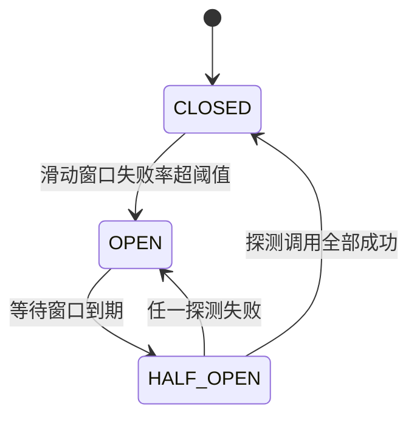

# Java 微服务与分布式阶段

> 面向中大型后端系统，本阶段把 ph15 的单体底座拆成多个服务：服务怎么拆、跨进程怎么调、失败了怎么活、数据不一致怎么收场、全链路怎么观测。

## 1. 概述

本阶段是 Java 学习路线从「单体应用」到「分布式系统」的跨越。roadmap 第 16 节目标：**能开发中大型后端系统**。ph15 攒下的单体底座（Spring Boot + Data + Security + actuator）在本阶段被拆成多个独立进程的服务：拆分带来弹性（独立部署、独立扩缩容、故障隔离），也带来全新的一类问题——网络不可靠、调用会超时、重试会重复、事务跨不了库、问题定位跨进程。本阶段的五条主线（服务拆分 → 服务治理 → 韧性设计 → 分布式一致性 → 可观测性）就是逐一回答这些问题。整个阶段延续「**机制可实测**」原则：凡离线缓存内的构件（Spring Boot 全栈、spring-data-redis + lettuce、jjwt）全部本机实测；真实中间件（Nacos/Sentinel/Spring Cloud Gateway/OpenFeign/Resilience4j/Micrometer Tracing）不在缓存，只在文中讲机制并如实标注「未在本环境验证」，同构实现（手写熔断器、手写 mini 网关、X-Trace-Id 透传）全部实测背书——各构件缓存状态与处理方式见 [`examples/README.md`](./examples/README.md)。

| 核心维度 | 覆盖内容 |
|----------|---------|
| 服务拆分 | 单体 vs 微服务对比、拆分维度（业务边界/数据所有权/团队）、拆分时机、分布式单体反模式 |
| 服务治理 | 注册发现（Nacos/Eureka 机制）、网关（Spring Cloud Gateway 机制 + 手写 mini 网关实测）、远程调用（OpenFeign 机制 + RestClient 实测） |
| 韧性设计 | 超时（实测）、重试与幂等的关系（实测）、熔断器状态机（实测）、限流算法（令牌桶实测）、降级（实测） |
| 分布式一致性 | CAP/BASE、Saga 补偿（实测）、TCC/本地消息表（机制）、Redis 分布式锁 SET NX PX + Lua 释放（真实 Redis 实测） |
| 可观测性 | 链路追踪（traceId 透传实测，Micrometer Tracing/OTel 机制）、服务监控（actuator/Micrometer 实测）、幂等键设计（并发实测） |

这个阶段只涉及 **微服务架构与分布式系统的设计原则和 Spring 生态落法**，**不涉及消息队列与搜索中间件**（Kafka/RocketMQ/Elasticsearch — 那是 ph17 消息队列与搜索阶段的内容，Saga 补偿的异步化、本地消息表的生产实现都在那里落地）、**不涉及缓存穿透/击穿/雪崩与秒杀等并发架构**（ph18 缓存与高并发阶段；本阶段只用 Redis 做分布式锁，缓存策略不展开）、**不涉及部署运维**（Docker/Kubernetes/CI/CD — ph19 DevOps 与部署阶段）、**不涉及 Netty 与 JVM 并发底层**（ph20 高级 Java 阶段）。也不重复 ph15 已讲的容器/AOP/事务/Security 单体机制（本阶段每个服务内部仍是那套单体），以及 ph14 已讲的 REST 注解与统一响应契约（本阶段沿用其 `{code,message,data}` 壳，业务码沿用 ph15 语义：40100 未认证、40101 登录失败、40300 无权限——与 ph14 相反，ph15 已如实标注，跨阶段对照代码时勿混用；本阶段新增 50200 下游异常、50400 下游超时、40001 缺幂等键）。本阶段承接 [ph15 Spring 全家桶阶段](../ph15-spring-family/15-spring-family.md)——那里讲的每个「框架替你做了 X」在多进程环境下依然成立，只是对象从「容器里的 Bean」变成「网络上的服务」。

## 2. 来源与演变

微服务不是发明出来的新东西，而是 **SOA（面向服务架构）的轻量化重生**。2000 年代初的 SOA 用 ESB（企业服务总线）做集中编排：重协议（SOAP/WS-*）、重治理（中心总线管一切）、重流程——理念超前但落地笨重，ESB 本身成了单点和瓶颈。2011 年 5 月威尼斯软件架构师研讨会上，「microservices」一词被正式提出；2014 年 Martin Fowler 与 James Lewis 发表《Microservices》定义了今天的共识：**小服务、独立部署、去中心化治理、轻量通信（HTTP/消息）、按业务能力组织**。同一时期 Netflix 把这套理念做成了开源事实标准——Netflix OSS（Eureka 注册发现、Ribbon 负载均衡、Hystrix 熔断、Zuul 网关），设计哲学一句话加粗：**面向失败设计——网络不可靠是前提，韧性不是可选项**。2015 年 Spring Cloud Netflix 把这批组件接进 Spring 生态，Java 微服务进入「引 starter 就用」的时代。2018 年风向再变：Hystrix/Ribbon 进入维护模式，Spring Cloud 官方扶正 **Resilience4j**（熔断）、**Spring Cloud LoadBalancer**、**Spring Cloud Gateway**（基于 WebFlux/Netty，取代 Zuul）；国内则以 Spring Cloud Alibaba（**Nacos** 注册发现+配置中心、**Sentinel** 熔断限流、**Seata** 分布式事务）落地。可观测性一侧，Spring Cloud Sleuth 在 2022 年随 Boot 3 退役，由 **Micrometer Tracing + OpenTelemetry** 接棒。

**Spring Cloud 版本列车（Release Train）与 Spring Boot 的对应关系**——Spring Cloud 用「地名列车」做整体版本（一辆车拉全部子项目），选错车厢是新手最常见的坑：

| Spring Cloud 列车 | 配套 Spring Boot | 关键变化 |
|------------------|-----------------|---------|
| Hoxton | 2.2.x / 2.3.x | Netflix 组件最后的高光期 |
| 2020.0（Ilford） | 2.4.x / 2.5.x | 移除 Ribbon/Hystrix/Zuul 等 Netflix 组件，扶正 LoadBalancer/Gateway/Resilience4j |
| 2021.0（Jubilee） | 2.6.x / 2.7.x | Boot 2 最后一代（javax 命名空间） |
| 2022.0（Kilburn） | 3.0.x / 3.1.x | Boot 3 首代：Java 17+、jakarta、Sleuth 退役换 Micrometer Tracing |
| 2023.0（Leyton） | 3.2.x / 3.3.x | **与本阶段 Boot 3.3.0 基线配套**（离线缓存无其 jar，见下） |
| 2025.0（Northfields） | 3.5.x | 当前最新列车 |

> ⚠️ 本机离线缓存里只有 Spring Cloud **2021.0.8**（spring-cloud-gateway/openfeign 3.1.8）的 **pom 没有 jar**，且 2021.x 对应 Boot 2.x（javax），与本阶段 Boot 3.3.0 基线二进制不兼容——所以 Spring Cloud 组件本阶段**全部不实测**，只讲机制；同构模式（RestClient 远程调用、手写熔断器、手写 mini 网关）用缓存内构件实现并实测。

本文示例以 **Spring Boot 3.3.0 / Java 17** 为基线（选择理由：与 ph14/ph15 完全同基线，离线缓存可实测 Boot 全栈；微服务的拆分原则与失败语义与框架版本无关），验证工具链 **OpenJDK 17.0.18 + Maven 3.9.12**（`javac -version` → 17.0.18、`mvn -version` → 3.9.12）。Boot 3.3.0 父 POM 统一管理 **Spring Framework 6.1.8、lettuce 6.3.2.RELEASE、spring-data-redis 3.3.0**（全部在本地缓存）。微服务治理的概念（注册发现、熔断、Saga、CAP）十年未变——变的是组件名（Hystrix→Resilience4j→Sentinel），不变的是「超时/重试/幂等/降级」这套失败语义。

## 3. 语法与参数

### 3.1 微服务架构与拆分原则

**微服务架构**把单体应用拆成一组小服务：每个服务独立进程、独立部署、**独立拥有自己的数据**，服务间用轻量协议（HTTP/gRPC/消息）通信。拆分不是目的，**独立演进能力**才是——订单服务发版不需要用户服务陪着重启。

| 维度 | 单体（ph15 的形态） | 微服务（本阶段） |
|------|---------------------|-----------------|
| 部署 | 一个进程，全量发版 | 每服务独立发版、独立扩缩容 |
| 数据 | 共享一个库，事务本地 ACID | 每服务私有数据，跨服务最终一致 |
| 调用 | 进程内方法调用（不可能超时） | 网络调用（会超时、会丢、会重复） |
| 故障 | 一崩全崩 | 故障隔离（但可能级联，要熔断） |
| 复杂度 | 代码复杂度内聚 | **治理复杂度外移**（注册发现/网关/追踪/一致性） |
| 团队 | 大团队改一个代码库 | 小团队 owning 服务（康威定律） |

roadmap 必会概念第一条就是「**微服务增加治理复杂度**」——拆分把「代码复杂度」换成了「运维与一致性复杂度」，这是取舍不是升级。

**拆分原则（怎么切）**：

- **按业务边界切**（DDD 限界上下文）：用户、订单、设备各自成服务——roadmap 练习的「用户服务/订单服务/设备管理服务」就是按这个维度。判断标准：一个需求变更通常只改一个服务，就说明边界切对了
- **数据跟着服务走**：订单服务不直连用户库，要用户数据走用户服务的 API（examples/ex01 的 order-service 远程取用户名就是这个纪律）。共享数据库是微服务最常见的反模式——表面拆了进程，数据还耦合，改个表结构全站发版
- **别拆太早**：新系统先单体跑清业务边界，痛点（发版互相阻塞、局部需要独立扩容）出现再拆——「微服务优先」害死过很多小团队；ph15 的单体底座先跑通，本阶段才拆
- **分布式单体是谷底**：服务拆了但每个请求都要同步串调四五个服务、发版还得按顺序——比单体更差。拆完检查：单个服务挂掉，系统核心链路是否还能降级运转

examples/ex01 演示了最小拆分：user-service（18211）与 order-service（18212）两个进程，订单详情页需要用户名 → order-service 用 RestClient 远程调 user-service 聚合返回（实测 Tests run: 6）。

### 3.2 服务注册发现、网关与远程调用（Spring Cloud / Nacos / Gateway / OpenFeign）

拆分之后三个问题立刻出现：**服务怎么找到彼此**（注册发现）、**流量从哪进**（网关）、**调用怎么写**（远程客户端）。

**注册发现**：服务实例启动时把自己的地址注册到注册中心，调用方查询健康实例列表并做客户端负载均衡。**Nacos**（阿里开源，注册中心 + 配置中心二合一，AP/CP 可切换，国内事实标准）与 Eureka（Netflix，纯 AP）是最常见实现。机制模型：

```text
服务实例 ──启动──▶ 注册中心（Nacos/Eureka）：登记 ip:port，心跳续约
   ▲                  │ 实例列表推送/拉取
   └──调用方 LoadBalancer 从列表挑一个健康实例直连（客户端负载均衡）
```

**Spring Cloud Gateway**：基于 WebFlux/Netty 的响应式网关，核心抽象三件套——**Route**（路由：ID + 目标 URI + 谓词 + 过滤器）、**Predicate**（按路径/方法/头匹配：`Path=/api/orders/**`）、**Filter**（改写请求/响应、限流、鉴权）。典型配置：

```yaml
# Spring Cloud Gateway 配置示意（未在本环境验证——gateway jar 不在离线缓存，机制与同构实测见 exercises/sol-04）
spring:
  cloud:
    gateway:
      routes:
        - id: order-route
          uri: lb://order-service          # lb:// 走注册发现 + 负载均衡
          predicates: [ "Path=/api/orders/**" ]
          filters: [ "StripPrefix=0", "name=RequestRateLimiter" ]
```

**OpenFeign**：声明式远程客户端——只写接口和注解，实现由框架生成（与 Spring Data「接口即实现」同一心智）：

```java
// OpenFeign 声明式客户端（未在本环境验证——openfeign jar 不在离线缓存；同构实测见 examples/ex01 的 RestClient 版）
@FeignClient(name = "user-service", fallback = UserClientFallback.class)
public interface UserClient {
    @GetMapping("/users/{id}")
    UserDto getUser(@PathVariable("id") long id);
}
```

**本环境的同构实测**：这三件套的机制在缓存里没有可运行构件，但它们的**语义**被拆成可实测的同构实现——RestClient + 显式 base-url 演示远程调用与超时（ex01/ex02，相当于 Feign 的手写版）；手写路由转发 + JWT 过滤器演示网关与鉴权收敛（exercises/sol-04 与 project/，相当于 Gateway 的手写版）；注册发现在文档讲机制（实例列表本质是一张「服务名 → 健康地址」的动态表）。学完机制换到真实 Spring Cloud 时，注解和配置只是这些语义的声明式封装。

### 3.3 熔断限流与降级（Sentinel / Resilience4j）

roadmap 必会概念「**远程调用必须有超时和降级**」是本阶段最重要的一行字。韧性四件套的顺序：**超时是底线 → 重试治瞬时抖动 → 熔断防级联 → 降级保底体验**。

**超时**：任何跨进程调用必须显式设连接/读超时——不设置时线程挂死在 socket 上，下游慢会拖死上游全部线程池（线程池打满 → 上游也挂 → 级联雪崩）。ex01 实测：读超时 800ms vs 下游 sleep 1500ms，调用方 1.4s 内拿到 504，没有被拖死。

**重试**：只对**瞬时故障**（5xx、超时）重试，4xx 是请求本身有问题，重试一万次还是 4xx；且**只有幂等操作才敢重试**（见 3.5 与 4.1）。ex02 实测六种场景：瞬时失败重试到成功（下游实测被打 3 次）、持续 5xx 重试耗尽降级、404 不重试、超时重试、非幂等 POST 不重试、幂等 POST 重试成功。

**熔断器（Circuit Breaker）**：下游持续失败时「跳闸」——短时间内直接拒绝调用（快速失败），给下游喘息也保住自己。状态机：



ex03 用纯 Java 手写实现实测了完整状态机（窗口 4、失败率 ≥50% 熔断）：OPEN 期下游调用计数为 0（真的没打）、HALF_OPEN 探测 2 次全成回 CLOSED、探测失败立即回 OPEN 并重计时。**Resilience4j**（Spring Cloud 官方熔断组件，轻量、函数式 API：`@CircuitBreaker`/`@Retry`/`@RateLimiter` 注解）与 **Sentinel**（阿里，流量治理平台：熔断 + 限流 + 系统自适应保护 + 控制台）是生产实现——两者 jar 均不在离线缓存（未在本环境验证），但 ex03 手写版的状态机与 Resilience4j 语义一一对应。

**限流**：保护服务不被突发流量打垮，在网关或服务入口执行。两种经典算法（ex03 实测令牌桶）：

| 算法 | 机制 | 特点 |
|------|------|------|
| 令牌桶 | 固定速率产令牌，请求取令牌，无令牌拒绝 | 允许不超容量的突发（ex03 实测：桶 3 容量突发取 3 全过、第 4 拒） |
| 漏桶 | 请求进桶，匀速流出 | 严格匀速削峰，突发被排队/拒绝 |

**降级（Fallback）**：重试/熔断都救不回来时的保底返回——缓存旧值、默认值、静态页。降级不是错误处理，是**有损服务的设计**：订单详情页的用户名可以显示「（用户服务暂不可用，降级展示）」，但订单本身不能丢（exercises/sol-02 实测 degraded=true 降级路径）。

### 3.4 分布式事务与分布式锁

**分布式事务**：单体里一个 `@Transactional` 搞定的事（ph15），拆服务后跨了库，本地事务管不到远程。四种主流方案按一致性从强到弱：

| 方案 | 机制 | 一致性 | 适用 |
|------|------|--------|------|
| 2PC/XA | 协调者两阶段提交（准备→提交），全程持锁 | 强一致 | 短事务、低并发；吞吐差，生产少用 |
| TCC | Try（预留资源）→ Confirm/Cancel，业务代码三段式 | 最终一致（近实时） | 资金类强诉求；侵入大 |
| Saga | 一串本地事务 + 每步配补偿动作，失败反向补偿 | 最终一致 | 长流程（下单→扣款→物流），本阶段实测 |
| 本地消息表 | 本地事务里写消息表，异步投递到 MQ | 最终一致（异步） | 可异步场景；依赖 MQ（ph17 落地） |

ex06 实测了 **Saga 编排式**：下单（PENDING）→ 扣款 → 预约物流；余额不足（业务失败）→ CANCELLED 不补偿；物流失败（钱已扣）→ 补偿退款 → FAILED。关键设计点全部实测：**补偿动作必须幂等**（debit/refund 按 txId 去重，重放不产生二次效果）、**sagaId 幂等**（同一 sagaId 重复提交返回同一终态，余额只扣一次）、业务失败（4xx 语义）与技术故障分开（前者取消、后者补偿）。补偿本身失败的兜底（重投/死信）依赖消息队列——**属于 ph17 的内容**。

**分布式锁**：单体里的 `synchronized`/ReentrantLock 锁不住别的进程；跨进程互斥需要第三方仲裁者，Redis 是最常用的。正确姿势三要素（ex05 在真实 redis-server 8.6.2 上实测）：

```java
// examples/ex05-redis-distributed-lock/.../RedisDistributedLock.java —— 三要素实测（Tests run: 5）
// ① 原子占位：SET key token NX PX ttl ——「占位 + 过期时间」一条命令完成（分两条会留「占位后宕机」的死锁窗口）
Boolean acquired = redis.opsForValue().setIfAbsent(key, token, ttl);
// ② token 标识持有者：只能解自己的锁
// ③ Lua 原子释放：比对 token 再删（先 GET 后 DEL 两条命令之间有窗口，会误删他人锁）
//    if redis.call('get', KEYS[1]) == ARGV[1] then return redis.call('del', KEYS[1]) else return 0 end
```

ex05 实测：互斥（持锁期间第二持有者被拒）、token 校验（错误 token 解不开）、TTL 兜底（持有者宕机 300ms 后锁自动释放，防死锁）、12 线程并发抢锁恰好 1 个赢家。生产用 **Redisson**（在上述语义上加了看门狗自动续期、可重入、RedLock 多实例方案——未在本环境验证，机制：后台线程定期把快到期的锁续期，解决「业务没跑完锁先过期」）。

> ⚠️ 分布式锁是「互斥」工具不是「一致性」工具——Redis 主从切换时锁可能双持（RedLock 缓解但争议很大，Martin Kleppmann 与 antirez 的著名论战）。资金/库存类强一致场景优先数据库唯一约束/乐观锁，锁只用于「最好互斥、偶尔双持可兜底」的场景。

### 3.5 链路追踪、服务监控与幂等

**链路追踪**：一个请求穿过网关→订单→用户→……，出问题时要知道它死在哪一跳。机制模型：入口生成 **traceId**，每跳生成 **spanId**，调用下游时把头（`traceparent`/`X-Trace-Id`）透传下去，各服务把 span 上报到收集器（Zipkin/Tempo）拼成调用树。Spring 生态的实现演进：Spring Cloud Sleuth（Boot 2 时代）→ **Micrometer Tracing + OpenTelemetry**（Boot 3 起，bridge jar 不在离线缓存，未在本环境验证）。ex01 实测了同构最小版：`TraceIdFilter`（入口生成/接力 X-Trace-Id 并写入 MDC）+ `TraceIdClientInterceptor`（RestClient 调用时把 MDC 里的 traceId 写进下游请求头）——实测带 `trace-test-0001` 的请求，order-service 聚合结果里 user-service 见到的 traceId 一字不差。有了它，日志里按 traceId 一 grep 就能串起整条链路——roadmap 必会概念「链路追踪帮助定位跨服务问题」落地。

**服务监控**：每个服务暴露 actuator 端点（`/actuator/health` 给探活，`/actuator/metrics` 给指标，Micrometer 体系，ph15 已实测）；微服务下新增两条纪律：**健康检查决定流量**（注册中心/K8s 探活不健康的实例会被摘掉——ex01 实测双服务 health 均 UP）与**指标要聚合**（单服务指标没意义，Prometheus 抓全部实例 + Grafana 看板，部署侧属 ph19）。报警盯住黄金信号：延迟、流量、错误率、饱和度。

**幂等**：分布式环境「请求可能到达任意多次」（超时重试、用户双击、MQ 重投），写接口必须幂等——同一操作执行 N 次的效果 = 执行 1 次。三层防法（按防线从外到内）：

| 层 | 机制 | 防什么 | 实测 |
|----|------|--------|------|
| 请求级 | `Idempotency-Key` 头，服务端按 key 去重重放首个结果 | 网络重试/用户重复提交 | ex04：16 线程撞同 key 业务只执行 1 次；缺 key 400 |
| 业务级 | 唯一约束/业务键（如设备 sn）`putIfAbsent` | 换 key 重发同一业务对象 | exercises/sol-03：12 并发同 sn 只建 1 条 |
| 状态机级 | 状态迁移校验（只有 PENDING 能转 CONFIRMED） | 重复推进流程 | ex06 sagaId 终态重放 |

ex04 还实测了两条容易漏的语义：**失败不缓存**（业务失败清除占位，客户端可重试——缓存失败会把暂时性故障变成永久拒绝）与 **TTL 窗口**（幂等不是永久的，窗口外同 key 视为新请求）。

## 4. 底层原理

### 4.1 远程调用的失败语义：超时、重试、幂等的三角关系

单体方法调用的失败是「全或无」（异常抛出，状态可预期）；网络调用多出第三种结局——**不确定**：请求发出去了，响应没回来。下游到底处理没有？不知道。这个「不确定」是分布式失败语义的核心，三件套各自对应它的一面：

```text
请求 ──▶ 网络 ──▶ 下游处理 ──▶ 响应
           │          │            │
           ▼          ▼            ▼
        连接超时    处理中挂死    读超时（响应丢失）
        （下游没收到） （不确定！）  （下游可能已处理）
```

- **超时**把「无限等待的不确定」变成「有限时间后失败」——但注意：**超时只救调用方，不取消下游**。ex01 的实测日志里能看到下游在客户端超时断开后仍在处理（`ClosedChannelException`：下游写响应时发现连接已关）——下游的工作已经做了，这就是「不确定」的实体化
- **重试**在「不确定」时重发请求——所以「下游可能已处理」意味着重试可能让操作发生两次。**幂等是重试的前置条件**：GET 天然幂等可放心重试；POST 必须带幂等键才敢重试（ex02 实测：非幂等 POST 不重试、幂等 POST 重试成功）。整条链路上**每一跳都要幂等**——网关重试一次、服务重试一次、MQ 重投一次，次数相乘（重试风暴：下游已经过载，重试把流量放大数倍加速其死亡——所以重试要配熔断，且退避 + 抖动）
- **熔断**切断「不确定」的级联：下游病了，继续打只是浪费自己的线程和下游的最后一口气。熔断器统计的是**自己看到的失败率**（窗口内），所以它是调用方的自保装置，不是对下游健康度的全局判断

### 4.2 CAP 与一致性取舍

**CAP**：分布式系统在网络分区（P）发生时，只能在一致性（C，所有节点看到同一份最新数据）与可用性（A，每个请求都有响应）之间二选一——P 不可避免（网络就是会断），所以真实的选择题是「分区时要 C 还是 A」。

| 组合 | 语义 | 代表 |
|------|------|------|
| CP | 分区时宁可拒绝服务也要数据一致 | Nacos（CP 模式）、Zookeeper、etcd |
| AP | 分区时宁可返回旧数据也要可用 | Eureka、Nacos（默认 AP）、Redis 主从 |

注册中心的选型是最好的 CAP 教材：Eureka 选 AP——实例列表短暂不一致没关系（调用方拿到一个还能用的地址就行），注册中心本身挂了不能拖垮全部服务发现；而配置/选主类场景选 CP（配置错了比读不到更可怕）。Nacos 两者可切换，正因为它同时做注册中心（AP 合适）和配置中心（CP 合适）。

从 CAP 往外走是 **BASE**（Basically Available 基本可用、Soft state 软状态、Eventually consistent 最终一致）——微服务的默认哲学：**放弃跨服务强一致，换取可用性，用补偿/Saga/对账把系统最终拉回一致**。3.4 的方案表就是一致性光谱：2PC（要 C，牺牲 A 与吞吐）→ TCC → Saga → 本地消息表（要 A，接受更长的最终一致窗口）。选型口诀：钱的事尽量短链路强一致（TCC/单库事务），流程的事 Saga 补偿，能异步的事消息表——**一致性越弱，系统越能活，业务兜底代码越多**，这就是取舍。

## 5. 使用场景

- **中大型业务后端**：用户/订单/设备/支付各自成服务，网关统一入口 + 鉴权，Nacos 注册发现，OpenFeign 互调，Sentinel 流控——国内 Java 微服务标准栈。本阶段 project 的「微服务订单系统」就是最小骨架。车联网场景（roadmap 第 21 节的铺垫）：设备管理服务、车辆数据接入服务天然是独立服务（接入层要独立扩容抗设备洪峰）
- **什么时候不要微服务**：团队 < 10 人、业务边界没跑清、没有 DevOps 基建（没有自动化部署和监控，微服务是灾难——部署运维属 ph19）——先单体（ph15 形态），把模块边界划干净，需要再拆
- **组件怎么选**：注册发现/配置中心国内选 Nacos（AP/CP 可切 + 中文社区），网关选 Spring Cloud Gateway（阻塞栈别用——它是 WebFlux 的），熔断限流轻量选 Resilience4j、要控制台和体系化流量治理选 Sentinel，分布式事务长流程选 Saga、资金类选 Seata TCC
- **与其他语言的对比**（为 analysis/ 与 Tenet 合成积累素材）：Java 微服务是「框架重装备」——注册发现/熔断/追踪全部声明式注解搞定，代价是依赖体系和版本列车的复杂度；Go 微服务走「标准库 + 显式中间件」（go-kit/Kratos 也只是薄封装），治理逻辑显式可见但样板多；Rust 的 Tower 把「重试/超时/限流」抽象成 `Service` 套娃层——三种语言对「韧性逻辑放哪」的答案：Java 注解挂方法、Go 中间件包 handler、Rust 类型层叠层——这是 Tenet「横切关注点正交化」的核心素材

## 6. 代码示例

> 完整可运行版在 [`examples/`](./examples/)（六个示例 + 缓存状态表 + 实测记录）。验证环境：OpenJDK 17.0.18 + Maven 3.9.12 + Spring Boot 3.3.0，命令统一 `mvn -o -Dmaven.repo.local=/tmp/m2clone test`（离线实测）。Spring Cloud Gateway/OpenFeign/Nacos/Sentinel/Resilience4j/Micrometer Tracing 不在离线缓存，**未在本环境验证**，仅在文中讲机制；对应语义由下列同构实现实测背书。

```java
// examples/ex02-timeout-retry-fallback/.../ResilientCaller.java —— 失败语义三件套（已验证，Tests run: 6）
} catch (Downstream5xxException | ResourceAccessException e) {
    // 非幂等请求不敢重试（下游可能已处理只是响应丢了）；幂等请求重试到 maxAttempts 为止
    if (!idempotent || attempt >= maxAttempts) {
        return CallOutcome.fallback(fallbackBody, attempt, e.getMessage());   // 耗尽 → 降级
    }
    sleepQuietly(backoffMs);
}
```

### 示例 1：服务拆分与远程调用（[`examples/ex01-service-split-restcall/`](./examples/ex01-service-split-restcall/)）

user-service + order-service 两个进程，RestClient 显式超时（连接 500ms/读 800ms）聚合订单详情，X-Trace-Id 全链路透传（入口生成/接力），双服务 actuator 健康端点。**实测**：Tests run: 6（含慢下游 504 快速失败 < 1400ms、traceId 透传到下游一致）。

### 示例 2：超时/重试/降级（[`examples/ex02-timeout-retry-fallback/`](./examples/ex02-timeout-retry-fallback/)）

故障注入服务端（可控 500/404/慢端点 + 命中计数）+ 韧性调用器。**实测**：Tests run: 6——瞬时失败重试到成功（下游实测命中 3 次）、4xx 不重试、非幂等不重试、耗尽降级。

### 示例 3：熔断器与令牌桶（[`examples/ex03-circuit-breaker/`](./examples/ex03-circuit-breaker/)）

纯 Java 手写熔断器（滑动窗口失败率 + 三态机，Clock 注入确定性测试）+ 令牌桶限流。**实测**：Tests run: 7——OPEN 期下游调用计数为 0、HALF_OPEN 探测 2 次全成回 CLOSED、探测失败回 OPEN；令牌桶突发取空后拒绝、按时补发。

### 示例 4：幂等键（[`examples/ex04-idempotency/`](./examples/ex04-idempotency/)）

`Idempotency-Key` + ConcurrentHashMap/CompletableFuture 占位去重。**实测**：Tests run: 6——16 线程并发撞同 key 业务只执行 1 次、失败不缓存可重试、TTL 窗口过期重处理、缺 key 400。

### 示例 5：Redis 分布式锁（[`examples/ex05-redis-distributed-lock/`](./examples/ex05-redis-distributed-lock/)）

SET NX PX 原子占位 + token 持有者校验 + Lua 原子释放；测试用 ProcessBuilder 拉起真实 redis-server 8.6.2（随机端口，无该二进制时整组跳过）。**实测**：Tests run: 5——互斥、错 token 解不开、TTL 防死锁、12 线程抢锁恰好 1 个赢家。

### 示例 6：Saga 分布式事务（[`examples/ex06-saga-distributed-transaction/`](./examples/ex06-saga-distributed-transaction/)）

下单 → 扣款 → 预约物流的编排式 Saga，失败反向补偿。**实测**：Tests run: 4——成功路径无补偿、余额不足 CANCELLED 不补偿、物流失败补偿退款余额复原、sagaId 重放不二次扣款。

## 7. 总结

### 关键要点

- **拆分换的是独立演进能力，代价是治理复杂度**——按业务边界切、数据跟着服务走、别拆太早、警惕分布式单体
- **远程调用三件套顺序记死**：超时是底线（不设置会被下游拖死）→ 重试只治瞬时故障且**幂等是前置条件** → 熔断防级联 → 降级保底
- **网络调用的第三种结局是「不确定」**——超时只救调用方不取消下游；重试 + 不幂等 = 重复执行；所以幂等要三层防（请求级幂等键、业务级唯一约束、状态机级迁移校验）
- **分布式事务是取舍**：2PC 强一致低吞吐、TCC 侵入大、Saga 长流程标配（补偿必须幂等）、本地消息表依赖 MQ（ph17）
- **分布式锁三要素**：原子占位（SET NX PX）、token 持有者校验、Lua 原子释放；Redisson 看门狗解决续期；锁是互斥工具不是一致性工具
- **CAP 是分区下的二选一**：注册中心选 AP（Eureka/Nacos 默认）、配置中心选 CP；BASE 最终一致是微服务默认哲学
- **可观测性是微服务的入场券**：traceId 全链路透传 + 每服务 actuator 健康/指标 + 黄金信号告警——没有追踪的微服务等于盲人摸象

### 阶段验收清单

- [ ] 能说清单体与微服务的取舍（独立部署/故障隔离 vs 治理复杂度/一致性），能按业务边界给一个单体画出拆分方案
- [ ] 能解释注册发现（实例列表 + 心跳 + 客户端负载均衡）、网关（路由/谓词/过滤器）、OpenFeign（接口即实现）三者的机制分工
- [ ] 能写出带显式超时 + 幂等重试 + 降级的远程调用代码，并解释为什么 4xx 不重试、非幂等不重试
- [ ] 能画出熔断器三态机并说出 OPEN 期「快速失败」保护的是调用方
- [ ] 能说出四种分布式事务方案的一致性/侵入性取舍，能手写一个带补偿的 Saga（补偿幂等）
- [ ] 能写出正确的 Redis 分布式锁（原子占位 + token + Lua 释放），能说出 TTL 防死锁与看门狗续期
- [ ] 能给写接口设计三层幂等（幂等键/唯一约束/状态机），并解释失败不缓存与 TTL 窗口
- [ ] 能实现 traceId 的全链路透传（入口生成 → MDC → 下游请求头），说出 Micrometer Tracing/OTel 的生产对应物

### 动手练习

本阶段练习见 [`exercises/`](./exercises/)（题目在 exercises/README.md，参考实现 sol-* 先别看）：用户服务（练习 1）→ 订单服务调用户服务含超时/重试/降级（练习 2）→ 设备管理服务幂等注册（练习 3）→ 网关鉴权 JWT + 转发（练习 4）。完成 4 题后继续。

### 阶段项目

本阶段综合项目见 [`project/`](./project/)：**微服务订单系统**（roadmap 推荐项目）——把 ph15 的单体拆成 user-service / order-service / gateway 三模块：网关 JWT 鉴权 + 路由转发、订单服务幂等下单 + 调用户服务校验（超时/重试/降级）、全链路 TraceId、统一响应契约。建议完成练习后再动手。
- [ ] 完成 exercises/ 全部练习并对照参考实现复盘
- [ ] 独立完成 project/ 并通过其验收标准

### 下一阶段

**ph17+（roadmap 第 17 节，目录待建）——消息队列与搜索阶段**：本阶段埋了三条线索都指向那里——Saga 补偿失败的异步重投、本地消息表、削峰解耦都依赖 Kafka/RocketMQ/RabbitMQ；日志与业务检索交给 Elasticsearch（倒排索引）。届时以 roadmap 第 17 节为准，本阶段不再向前引用不存在的文件。
