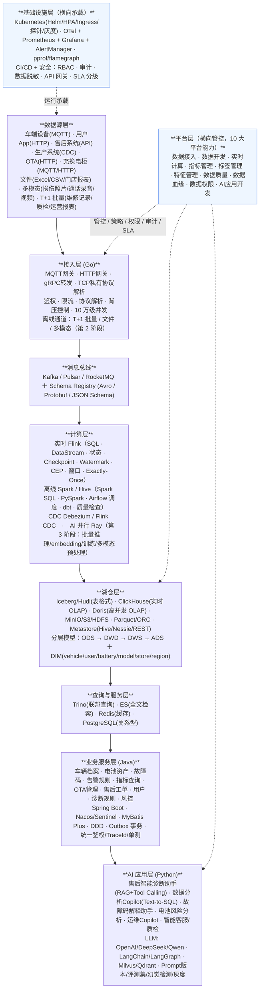
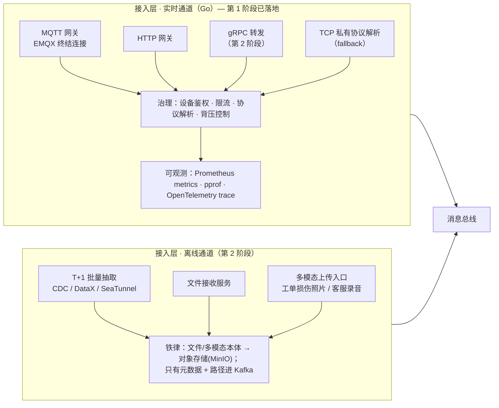
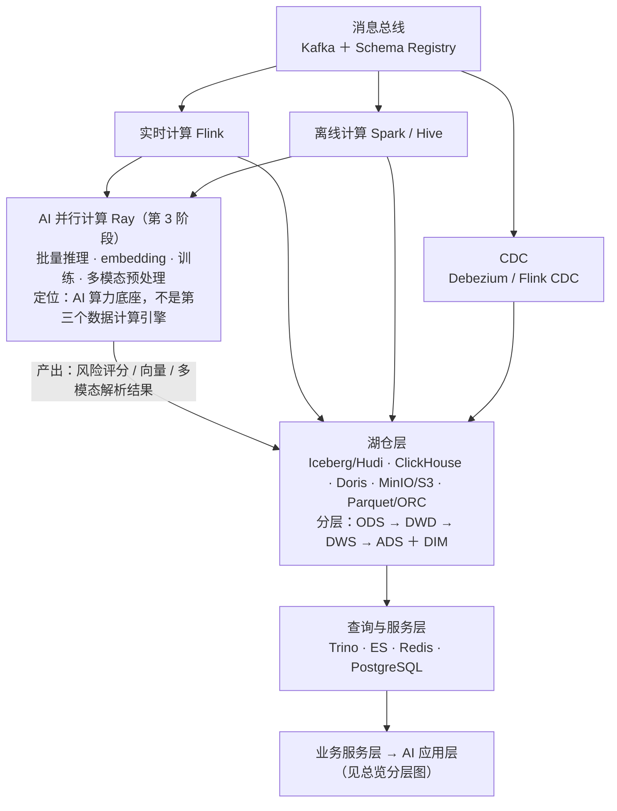
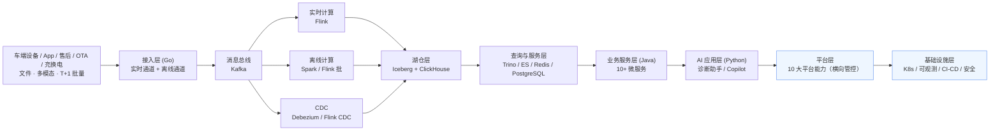
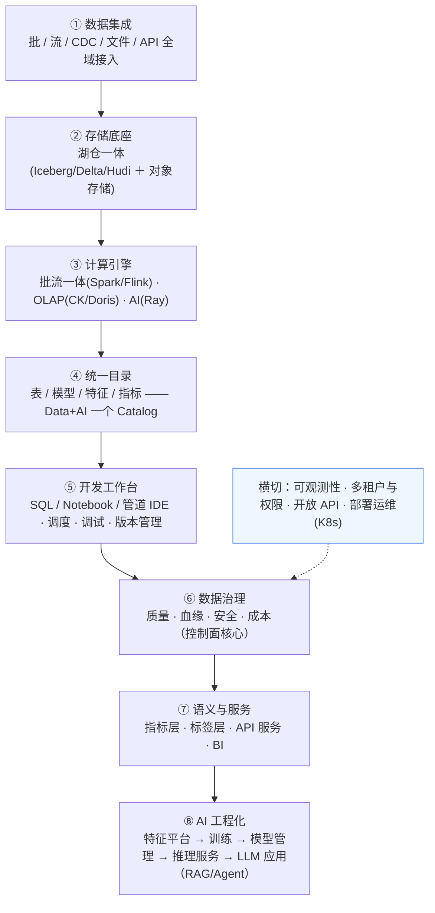
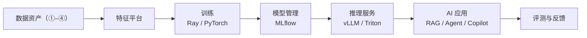
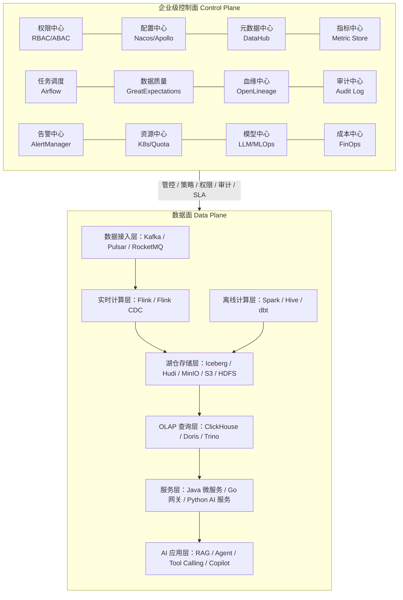
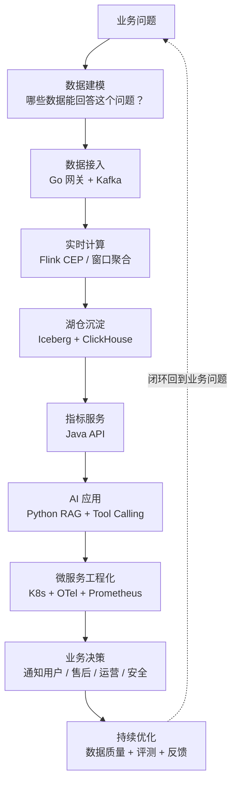
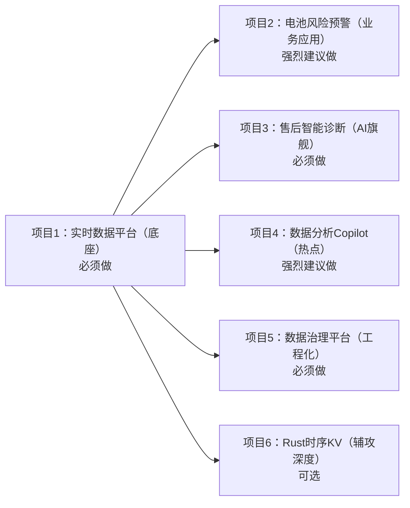
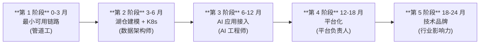

# OceanVerse 架构总览

> 本文档由《企业级 Data+AI 平台参考架构》(标尺) 与《智能电动车数据智能平台项目架构》(落地) 合并而成。
> 一份文档回答两个问题:**好平台长什么样(第二部分的八大能力域标尺)**、**OceanVerse 具体怎么建(其余部分)**。
> 版本 v1.0 · 2026-09-14

---

# 第一部分 总览

## 1.1 总览架构图（分层版）

> 原 154 行 ASCII 巨图拆为三张：**总览分层**（下图）· **接入层细节** · **湖仓与计算细节**。
> 每层只画"谁流向谁"，组件清单在该层小节内维护。







> 辅攻深度层(Rust/C++ 存储引擎、Mini LSM/Raft KV 等动手项目)属于个人能力路线,
> 详见《智能大数据平台工程师》,不在本平台架构内维护。

## 1.2 数据流向简化版



---

# 第二部分 八大能力域标尺

> 一个通用的、企业级的 Data+AI 平台应该具备的八大能力域——OceanVerse 的设计、选型、差距分析均以此为尺。
> 每节末尾的 **OceanVerse 落点** 是该能力域在本项目的具体建设决策。

## 0. 总览：八大能力域



**判断一个平台好坏的四条标准**(超越功能清单):

1. **统一目录是不是单一真相源**——还是又一个元数据孤岛
2. **治理是内建在流水线里**——还是事后外挂的补丁
3. **Data 和 AI 是否真正共栈**——特征、权限、血缘是否打通,还是两套系统各玩各的
4. **开放性**——开放表格式 + 开放 API,不被单一厂商锁定

## ① 数据集成(Data Integration)

**职责**:把所有形态的数据接进来——这是平台的"进口",决定了平台能吃多大的世界。

| 接入形态 | 说明 | 代表实现 |
|---|---|---|
| 流式 | 消息队列/设备上报,秒级 | Kafka、Pulsar;Flink CDC |
| 批量 T+1 | 业务库定时抽取 | DataX、SeaTunnel、Sqoop(淘汰) |
| CDC | 数据库变更捕获,分钟级 | Debezium、Flink CDC、Canal |
| 文件 | Excel/CSV/日志/报表 | 自研文件服务 + 对象存储 |
| 多模态 | 图片/音频/视频 | 对象存储 + 元数据管道 |
| API/SaaS | 第三方系统拉取 | Airbyte(300+ 连接器) |

**业界实践**:Airbyte(开源连接器生态)、Apache SeaTunnel(国内开源,批流一体集成)、Apache InLong(腾讯开源,万亿级接入)、Flink CDC(阿里开源)。

**企业级要求**:接入任务可配置化(非硬编码)、断点续传、脏数据隔离(DLQ)、接入审计、Schema 契约管理。

**OceanVerse 落点**:实时通道(Go 网关)+ 离线通道(文件服务/CDC/MinIO),第 1 阶段建设;连接器生态不自建,需要时引入 SeaTunnel。

## ② 存储底座(Storage Foundation)

**职责**:一份数据、多处可用——湖仓一体是企业级的共识答案。

| 要素 | 说明 | 代表实现 |
|---|---|---|
| 开放表格式 | ACID、Schema 演进、时间旅行、隐藏分区 | **Iceberg**(生态最中立)、Delta Lake(Databricks)、Hudi(upsert 强) |
| 对象存储 | 廉价、弹性、近乎无限 | S3 / MinIO / OSS / HDFS |
| 数据分层 | ODS→DWD→DWS→ADS + DIM | 行业通用数仓方法论 |
| 加速层 | 面向查询的 MPP 引擎 | ClickHouse、Doris、StarRocks |

**企业级要求**:开放表格式(不锁定)、存储计算分离、分层生命周期(热温冷)、小文件治理、表级 owner/SLA 元数据。

**关键认知**:湖(Iceberg)是**底座与真相源**,OLAP 引擎(ClickHouse)是 **serving 加速层**——两者不是竞品,是分工。平台成熟度的标志之一是"任何一张服务层的表都能从湖仓重建"。

**OceanVerse 落点**:Iceberg + MinIO(第 1 阶段底座)+ ClickHouse(serving 层);数据分层规约见 1.1 总览架构图的湖仓层。

## ③ 计算引擎(Compute Engines)

**职责**:三类负载,三类引擎,各司其职。

| 负载 | 引擎类型 | 代表实现 |
|---|---|---|
| 流处理 | 状态化流计算 | **Flink**(事实标准) |
| 批处理 | 离线 ETL/分层转换 | Spark(生态最全)、Flink 批模式 |
| 交互式分析 | MPP OLAP | ClickHouse、Doris、StarRocks、Trino(联邦) |
| AI 计算 | Python 原生分布式 | **Ray**(训练/批量推理/embedding/多模态) |
| ML 训练 | GPU 框架 | PyTorch、TensorFlow |

**企业级要求**:批流一体(同一 SQL 语义)、资源隔离与弹性(K8s/Yarn)、作业全生命周期管理(提交/监控/savepoint/版本)、计算成本可归因。

**关键认知**:Ray 与 Flink/Spark **不是并列的第三数据引擎**——Flink/Spark 算数据,Ray 算模型。Ray 服务 AI 层:批量推理、embedding 生成、超参搜索、多模态预处理。

**OceanVerse 落点**:Flink(实时主力)+ Flink 批模式(分层转换,暂缓 Spark)+ ClickHouse(OLAP)+ Ray(第 3 阶段,AI 负载出现时启用)。

## ④ 统一目录(Unified Catalog)

**职责**:Data+AI 一个 Catalog——表、文件、模型、特征、指标,一处注册、处处可见。**这是平台的心脏,也是"项目"与"平台"的分水岭。**

| 能力 | 说明 |
|---|---|
| 技术元数据 | 表/字段/分区/文件/模型/特征的定义与统计 |
| 业务元数据 | 口径、负责人、标签、密级 |
| 运行时元数据 | 任务、血缘、质量结果、用量 |
| 统一授权 | 基于 Catalog 的行列级权限,一处授权处处生效 |
| 开放接口 | REST/JDBC/HCatalog 兼容,引擎与工具自由接入 |

**业界实践**:Unity Catalog(Databricks)、DataHub、OpenMetadata、**Apache Gravitino**(面向 Data+AI 统一目录,含模型/文件,最年轻也最有方向感)、Hive Metastore(上一代事实标准)。

**OceanVerse 落点**:第 1–2 阶段 用"指标口径字典 + 数据资产清单"(Markdown+表)做最小真相源;第 4 阶段(平台化)评估引入 **Gravitino/DataHub**,不自研。

## ⑤ 开发工作台(Development Workbench)

**职责**:数据开发与 AI 开发的"IDE"——让生产者自助,是平台被用起来的关键。

| 能力 | 说明 | 代表实现 |
|---|---|---|
| SQL IDE | 多引擎 SQL 编辑/执行/结果预览 | DataGrip、Hue、DBeaver |
| Notebook | Python/Scala 交互开发 | Jupyter、Zeppelin |
| 管道开发 | DAG 编排、任务依赖、回填 | DolphinScheduler、Airflow |
| 调试与诊断 | 日志、执行计划、数据探查 | 引擎 UI + 平台封装 |
| 版本管理 | 脚本/DAG Git 化、评审流 | Git + CI |
| 发布管理 | 开发/测试/生产环境隔离与一键发布 | 平台能力 |

**业界实践**:**WeDataSphere(微众银行开源套件:Linkis 计算中间件 + DataSphere Studio 工作台 + Qualitis 质量 + Exchangis 交换)**——国内最完整的开源参照;商业对标 DataWorks/DataLeap 的开发空间。

**OceanVerse 落点**:DolphinScheduler(调度)+ Git(脚本资产化)起步;工作台不自研,第 4 阶段研究 WeDataSphere 复用。

## ⑥ 数据治理(Governance,控制面核心)

**职责**:让数据可信、可控、可追责——管控不出活,但让出活的东西值得信任。

| 域 | 内容 | 开源实现 |
|---|---|---|
| 数据质量 | 空值/唯一/完整/时效/波动检测,质量分 | Great Expectations、Qualitis |
| 血缘 | 表/字段/任务/指标血缘,影响分析 | OpenLineage、DataHub |
| 安全合规 | 行列级权限、脱敏、审计、密级 | Ranger、Catalog 内建 |
| 成本治理 | 存储/计算/查询/Token 成本归因与优化 | 自研 + 账单分析 |

**企业级要求**:质量规则**内建于流水线**(不通过即阻断/告警),而非事后扫描;血缘自动采集(非人工登记);权限一点配置全栈生效。

**OceanVerse 落点**:第 2 阶段起交付最小控制面(质量日检 + 资产清单 + 审计);血缘与安全随统一目录(④)在第 4 阶段系统化。

## ⑦ 语义与服务(Semantic & Serving)

**职责**:把数据翻译成业务语言,并以服务的形式交付——消费方不碰表,只碰语义。

| 层 | 内容 | 代表实现 |
|---|---|---|
| 指标层 | 口径一处定义,BI/API/AI 处处复用 | Cube、Headless BI |
| 标签层 | 实体画像(用户/车辆标签) | 自研 + Doris/CK |
| API 服务 | 指标/数据 REST 化 | Java 微服务、Kyuubi |
| BI 可视化 | 看板、自助分析 | Superset、Grafana、FineBI |

**企业级要求**:指标口径字典是强约束(新指标先登记后开发);所有出口(报表/API/AI)引用同一口径——**"昨天故障率"在任何出口答案一致**。

**OceanVerse 落点**:指标口径字典(第 2 阶段)+ Java 指标服务(第 2 阶段)+ Grafana/Superset 看板;AI 问数(第 3 阶段)只消费字典登记的指标。

## ⑧ AI 工程化(AI Engineering)

**职责**:AI 从 Demo 到生产的全生命周期——与数据共栈是新一代平台的分水岭。



| 能力 | 说明 | 代表实现 |
|---|---|---|
| 特征平台 | 特征定义/离线在线一致/复用 | Feast |
| 模型管理 | 版本/登记/灰度/回滚 | MLflow |
| 推理服务 | 在线推理、批推理 | vLLM、Triton、Ray Serve |
| LLM 应用 | RAG/Agent/Tool Calling | LangChain/LangGraph、Dify |
| 评测体系 | 评测集、幻觉检测、质量分 | RAGAS、自研 |
| AI 治理 | Prompt 版本、调用审计、Token 成本、权限边界 | 与⑥打通 |

**企业级铁律**:AI 的权限边界 = 数据权限边界(AI 经 API 取数,不直连库);AI 输出可追溯(血缘到源数据);AI 成本可计价。

**OceanVerse 落点**:第 3 阶段 诊断助手 + 问数 Copilot(Tool Calling 调 API,RAG 后置);Ray 提供算力底座;评测集与调用审计内建。

---

# 第三部分 企业级控制面

## 3.1 控制面架构图



## 3.2 控制面职责说明

| 模块 | 职责 |
|---|---|
| 权限中心 | 用户、角色、组织、租户、行列级权限、AI 工具调用权限 |
| 配置中心 | 服务配置、规则配置、灰度配置、告警阈值配置 |
| 元数据中心 | 表、字段、任务、接口、指标、模型、知识库元数据 |
| 指标中心 | 指标口径、指标版本、指标审批、实时/离线一致性 |
| 任务调度 | 离线任务、数据同步、质量检查、模型评测任务 |
| 数据质量 | 空值率、唯一性、完整性、时效性、波动检测、Schema Drift |
| 血缘中心 | 表血缘、字段血缘、任务血缘、指标血缘、AI 数据来源追踪 |
| 审计中心 | 数据访问审计、接口调用审计、AI 问答审计、权限变更审计 |
| 告警中心 | 任务失败、数据延迟、Kafka 积压、Flink 异常、模型异常 |
| 资源中心 | K8s 资源、队列资源、存储配额、计算资源、租户隔离 |
| 模型中心 | Prompt 版本、模型路由、RAG 评测、Embedding 管理、LLM Gateway |
| 成本中心 | 存储成本、计算成本、查询成本、模型调用成本、Token 成本 |

## 3.3 核心设计原则

企业级平台要区分：

```text
控制面负责“管控”
数据面负责“执行”
```

也就是：

* 控制面决定谁能用、怎么用、用多少、是否合规、是否稳定。
* 数据面负责真正的数据接入、计算、存储、查询和 AI 服务执行。

这样架构才从“项目系统”升级为“平台系统”。

---

# 第四部分 工程落地

## 4.1 语言职责边界

| 层次 | 语言 | 职责 | 核心产出 |
|------|------|------|----------|
| 接入层 | **Go** | 把数据"接进来" | 高并发网关、协议解析、设备鉴权 |
| 服务层 | **Java** | 把数据"管起来" | 业务微服务、事务、权限、指标 API |
| 智能层 | **Python** | 把数据"用起来" | RAG 诊断、Copilot、风险分析 |
| 深度层 | **Rust/C++** | 理解"底下是什么" | 存储引擎、分布式共识、执行模型 |

> 核心思想：不是一个人用五种语言，而是一个平台分五层，每层用最合适的语言。

## 4.2 业务能力闭环



### 闭环示例：电池安全风险预警

| 环节 | 具体动作 |
|------|----------|
| 业务问题 | 电池热失控如何提前发现？ |
| 数据接入 | 采集 BMS 电压、电流、温度、故障码 |
| 实时计算 | Flink 计算异常温升、过充、过放 |
| 数据沉淀 | Iceberg 存储历史，ClickHouse 支撑实时分析 |
| 指标服务 | Java 提供风险查询 API |
| AI 应用 | Python + 大模型解释风险原因和处理建议 |
| 工程化 | K8s 部署、OTel 追踪、Prometheus 告警 |
| 业务闭环 | 通知用户、售后、运营、安全团队 |

## 4.3 六大核心项目依赖关系



## 4.4 24 个月架构演进节奏

### 总览



每个阶段都是上一阶段产物的自然生长，不是推倒重来。
**每个阶段的技术栈只在该阶段才引入——这是刻意的：第 1 阶段不碰 K8s，第 2 阶段不碰 RAG，第 3 阶段不碰平台。贪心是长线项目最大的死因。**

> 为什么是"链路先行"而不是"平台先行"：平台是对重复劳动的抽象，必须先亲手跑通业务链路、踩过三次重复的坑，第 4 阶段的平台化抽象才有真实需求撑腰；且平台能力一律向开源借力(Gravitino/WeDataSphere 等),稀缺的是车联网场景能力,先做后者。

> 📍 **滚动进度**见《项目进度.md》（阶段步骤勾选 / 驱动力项 / 下一步）；本节的阶段与步骤定义是稳定计划，进度不在此处维护。

| 阶段 | 时间 | 架构重点 | 新增能力 |
|------|------|----------|----------|
| 第 1 阶段 | 0-3 月 | 最小可用链路 | Go 网关 → Kafka → Flink → ClickHouse → Java API |
| 第 2 阶段 | 3-6 月 | 湖仓建模 + K8s | Iceberg 湖仓、数据分层 ODS→DWD→DWS→ADS、离线接入(T+1 批量/文件/多模态 + 对象存储 MinIO)、可观测性 |
| 第 3 阶段 | 6-12 月 | AI 应用接入 | RAG 管道、Vector DB、Tool Calling、评测体系、Ray 并行计算(批量推理/训练/多模态处理) |
| 第 4 阶段 | 12-18 月 | 平台化 | 10 大平台能力、数据资产地图、SLA 分级 |
| 第 5 阶段 | 18-24 月 | 技术品牌 | 辅攻深度项目、核心文章、代表项目输出 |

### 第 1 阶段（0-3 月）：最小可用链路 —— 让数据流起来

**技术栈**

| 层 | 技术 |
|---|---|
| 接入 | **Go**（net/http、MQTT 客户端、gRPC、Prometheus client、pprof） |
| 消息 | **Kafka** |
| 实时计算 | **Flink**（Flink SQL 为主） |
| 存储/查询 | **ClickHouse**、PostgreSQL/MySQL、Redis |
| 服务 | **Java**（Spring Boot、MyBatis Plus）、**Python**（FastAPI、Pandas） |
| 可视化/运维 | Grafana、Docker Compose、Git |

**怎么一步步做**：

1. `docker-compose` 拉起 Kafka + ClickHouse + MinIO + Grafana
2. **Go 网关**：HTTP 上报接口 → 协议解析 → 写 Kafka；再加设备鉴权、限流、metrics、pprof；最后写模拟设备产生器压测
3. **Flink SQL**：消费 Kafka → 窗口聚合 → 写 ClickHouse（先 3 个作业：在线数、故障数、高温电池）
4. **Java 微服务 ×5**：车辆档案 / 电池资产 / 故障码 / 告警规则 / 指标查询——每个都带 REST + MySQL 表 + Redis 缓存 + Kafka 收发 + 鉴权 + 统一异常 + 单测 + Dockerfile
5. **Python 分析服务**：FastAPI 提供健康评分 / 故障码解释 / 电池风险 API（查 ClickHouse）
6. **Grafana 看板**：车辆在线数、故障数、电池风险、OTA 版本分布
7. 写文档《实时数据平台 v1 架构设计》

### 第 2 阶段（3-6 月）：湖仓建模 + K8s —— 从"链路"到"平台雏形"

**技术栈**

| 层 | 技术 |
|---|---|
| 湖仓 | **Iceberg**（表格式）+ **MinIO**（对象存储）+ Parquet |
| 离线 | Flink 批模式 / Spark（暂缓）、**Flink CDC/Debezium**、DataX、调度 **DolphinScheduler** |
| 建模 | ODS→DWD→DWS→ADS + DIM 分层方法论 |
| 部署 | **Kubernetes**、Helm、Ingress、HPA、ConfigMap/Secret |
| 可观测 | **OpenTelemetry** + Prometheus + Grafana + AlertManager |
| 治理 | 指标口径字典 + 数据资产清单（Markdown/表）+ 质量日检脚本 |

**怎么一步步做**：

1. **MinIO + Iceberg 入链路**：Flink 双写（ClickHouse 做 serving，Iceberg 做底座真相源）
2. **数据分层**：把第 1 阶段的原始流整理成 ODS；建 14 张核心表——`dwd_vehicle_status_event`、`dwd_battery_status_event`、`dwd_trip_event`、`dwd_fault_event`、`dwd_ota_event`、`dwd_work_order`、`dim_vehicle/user/battery/model/store`、`dws_vehicle_health_day`、`dws_battery_risk_day`、`ads_after_sales_diagnosis` 等
3. **离线通道**：CDC 接业务库 + 文件接收服务（铁律：文件本体→MinIO，只元数据进 Kafka）
4. **实时指标扩到 7 个**：在线数、故障数、高温电池、离线车辆、OTA 失败率、区域风险、异常骑行
5. **K8s 化**：所有服务 Helm Chart 化 → 探针/HPA/Ingress → 灰度发布 → OTel 链路追踪 → 告警规则
6. **最小控制面**：指标口径字典（新指标先登记后开发）+ 资产清单 + 质量日检
7. 写文档《数据中台 v1.0 设计》《车辆实时故障告警系统设计与实现》

### 第 3 阶段（6-12 月）：AI 应用接入 —— 把数据"用起来"

**技术栈**

| 层 | 技术 |
|---|---|
| LLM | OpenAI / DeepSeek / Qwen API |
| 框架 | **LangChain / LangGraph**（Tool Calling、多轮对话） |
| RAG | **Milvus/Qdrant**（向量库）、混合检索 + 重排序、文档切分 |
| AI 算力 | **Ray**（批量推理、embedding、多模态预处理） |
| 工程化 | Prompt 版本管理、评测集、幻觉检测、调用审计、Token 成本统计 |
| 模型管理 | MLflow（后期）、vLLM（推理服务，可选） |

**怎么一步步做**：

1. **先做 Tool Calling 后做 RAG**：诊断助手 v1 = LLM + 工具调用（查车辆状态/故障历史/电池风险/OTA 版本，全部走第 2 阶段的 Java API——AI 权限边界 = 数据权限边界）
2. **知识库建设**：故障码库 + 维修手册 + 历史工单 → 切分 → 向量化 → Milvus → 混合检索 + 重排序 → RAG v2
3. **4 个应用逐个落地**：售后诊断助手（旗舰）→ 故障码解释助手 → 数据分析 Copilot（只消费口径字典登记的指标）→ 运维 Copilot
4. **工程化补齐**：引用来源、置信度评估、兜底策略、人工审核、灰度发布、评测集（召回率/幻觉）、调用日志与费用统计
5. **Ray 上线**：工单照片/客服录音的批量解析、embedding 批量生成
6. 写文档《大模型诊断助手设计》《企业级 RAG 在车联网的落地实践》

### 第 4 阶段（12-18 月）：平台化 —— 从"项目系统"到"平台系统"

**技术栈**

| 能力域 | 借力对象 |
|---|---|
| 统一目录 | **Gravitino / DataHub**（不自研） |
| 开发工作台 | **WeDataSphere**（Linkis + DSS + Qualitis）研究复用 |
| 质量/血缘 | Qualitis / Great Expectations、**OpenLineage** |
| 安全 | Ranger / Catalog 内建行列级权限 |
| 调度 | DolphinScheduler（已有，平台化封装） |

**怎么一步步做**：

1. **统一目录落地**：表/模型/特征/指标一处注册（替代第 2 阶段的 Markdown 字典），血缘自动采集
2. **10 大平台能力**：接入/开发/实时计算/指标/标签/特征/质量/血缘/权限/API 服务平台——优先把第 1~3 阶段里重复三次以上的手工操作产品化
3. **治理系统化**：质量规则内建流水线（不通过即阻断）、权限一点配置全栈生效、成本归因
4. **资产化**：数据资产地图、指标体系地图、AI 应用地图、SLA 分级、成本治理方案
5. 输出平台 Roadmap + 团队技术规范（即使团队只有你，规范也是作品）

### 第 5 阶段（18-24 月）：技术品牌 —— 辅攻深度兑现

**技术栈**

| 方向 | 技术 |
|---|---|
| 辅攻语言 | **Rust**（主力）、C++（读源码用） |
| 内核学习 | RocksDB/LevelDB 存储引擎、ClickHouse/DuckDB 执行器源码 |
| 分布式 | Raft、一致性哈希、Quorum、CAP、Exactly-Once |
| 动手项目 | Rust KV Store → Mini LSM → Mini Raft KV → Mini SQL Engine → **车联网时序 KV 原型** |

**怎么做**：

1. 按 5 级动手项目逐级实现（每个都是独立可展示的小项目）
2. 形成 **5 篇核心文章**：总体架构 / 千万级实时接入 / Flink+Iceberg+CK 湖仓 / 大模型诊断落地 / 数据基础设施演进
3. 凝练 **3 个代表项目**：车联网实时数据平台、售后诊断大模型应用、车辆健康与电池风险预测系统
4. 形成完整技术叙事："我能从 0 到 1 建数据平台，同时懂数据库内核与分布式底层"

## 4.5 差距与路线对照

> "现状"列随里程碑更新（当前快照：2026-09-17，与《项目进度.md》一致）。

| 能力域 | OceanVerse 现状（2026-09-17） | 落点 |
|---|---|---|
| ① 数据集成 | **实时三通道已通**：HTTP + MQTT(JSON) + 二进制透传(GB/T 32960)；治理五环（鉴权/限流/校验/转发/可观测）齐全；codec 编解码 + DLQ 已建；离线通道无 | **第 1 阶段**（离线通道第 2 阶段） |
| ② 存储底座 | CK/MinIO 容器在跑但未入链路（CK 无分层）；Iceberg 未建 | **第 1 阶段** |
| ③ 计算引擎 | **Flink 未部署**（第 1 阶段第 3 步待开工）；无状态管理 | **第 1 阶段**(Ray 第 3 阶段) |
| ④ 统一目录 | 无；契约已立（`contracts/` + Go 绑定）但无字典/清单 | 第 2 阶段字典/清单起步,第 4 阶段引 Gravitino/DataHub |
| ⑤ 开发工作台 | 无；DolphinScheduler 未引入 | 第 2 阶段起步,工作台不自研 |
| ⑥ 数据治理 | 无（接入层有指标/告警雏形，控制面未建） | 第 2 阶段最小控制面 |
| ⑦ 语义与服务 | 无（契约 `VehicleReport` 已定稿，口径字典未建） | 第 2 阶段 |
| ⑧ AI 工程化 | 无 | 第 3 阶段 |

> 原则:**平台能力向开源借力(④⑤⑥),场景能力(车联网领域模型、告警→工单闭环、售后诊断 AI)自己深耕。**

## 附：业界平台速查

| 类别 | 平台 | 一句话 |
|---|---|---|
| 国际标杆 | Databricks | Data+AI 融合天花板(Lakehouse + Unity Catalog + Mosaic AI) |
| 国际标杆 | Snowflake | 易用性标杆(Cortex AI),封闭 |
| 国际标杆 | Palantir Foundry | 本体(Ontology)思想标杆 |
| 国内商业 | 阿里 DataWorks / 字节 DataLeap / 腾讯 WeData / 华为 DataArts / 网易数帆 / 袋鼠云数栈 / 星环 | 一站式开发治理平台 |
| 国内开源 | **WeDataSphere**(微众) | 最完整的开源数据平台套件 |
| 开源生态 | Gravitino / DataHub / SeaTunnel / InLong / Dinky / StreamPark / Kyuubi / Qualitis | 各能力域的可复用轮子 |
