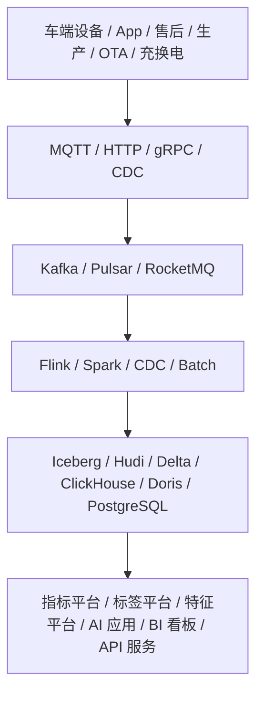
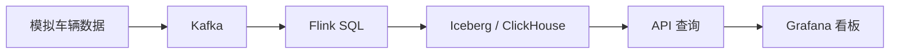
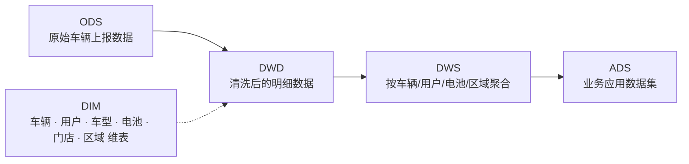
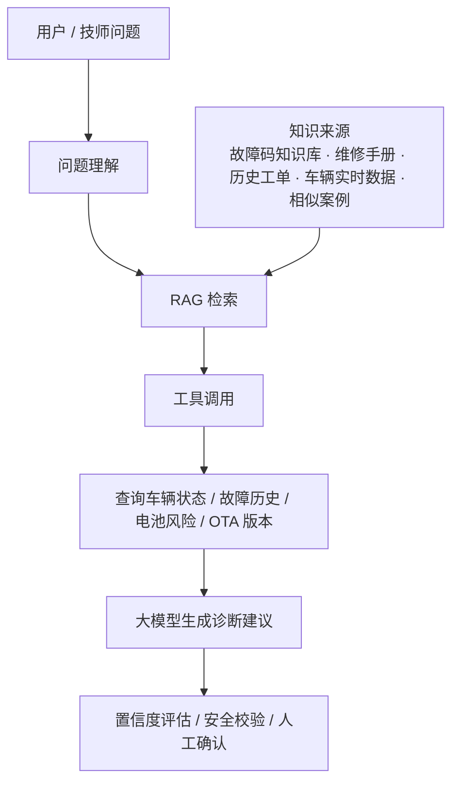
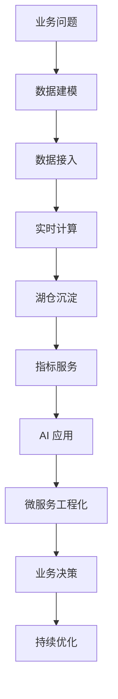

# 智能大数据与平台工程师

# 一、核心定位

你不是单纯做“高级数据开发”，而是要往这个方向升级：

> **主攻：智能电动车数据智能负责人**  
> 用 Java / Go / Python 构建“车端数据接入 → 实时数据平台 → 数据资产 → AI 大模型应用 → 业务决策闭环”的完整体系。
> 
> **辅攻：智能出行数据基础设施专家**  
> 用 Rust / C++ 深入数据库内核、存储引擎、分布式系统、计算引擎，作为你的技术深度护城河，而不是短期主战场。

## 目标岗位画像

**智能电动车数据智能负责人 / 数据平台负责人 / AI 数据应用负责人**

核心能力不是只会写 ETL，而是能负责：

1. **车联网数据平台**
    
    - 车辆状态数据
    - 电池数据
    - GPS 轨迹数据
    - 故障码数据
    - OTA 数据
    - 骑行行为数据
    - 售后工单数据
    - 用户 App 行为数据
2. **实时数据能力**
    
    - 实时告警
    - 实时风控
    - 实时车辆健康评分
    - 实时电池安全监控
    - 实时运营看板
    - 实时异常检测
3. **数据资产建设**
    
    - 车辆主题域
    - 电池主题域
    - 用户主题域
    - 骑行主题域
    - 售后主题域
    - 充换电主题域
    - OTA 主题域
    - 零部件质量主题域
4. **AI 大模型应用**
    
    - 售后智能诊断助手
    - 车辆故障解释助手
    - 电池风险分析助手
    - 运维 Copilot
    - 数据分析 Copilot
    - 智能客服 / 智能质检
    - 经营分析 Agent
5. **微服务工程化**
    
    - 设备接入服务
    - 数据 API 服务
    - 指标服务
    - 诊断服务
    - 风控服务
    - AI 应用服务
    - 权限、审计、监控、灰度、限流、SLA

---

# 二、路线总原则：主线 80%，辅线 20%

你现在最合理的路线不是“全栈全干”，而是：

|方向|权重|目标|
|---|--:|---|
|Java / Go / Python 微服务与数据平台|35%|做平台、做服务、做工程化|
|数据平台 / 实时计算 / 湖仓 / 指标体系|25%|做智能电动车数据底座|
|AI 大模型应用 / RAG / Agent / 工具调用|20%|做业务智能化应用|
|电动车业务理解|10%|把技术变成业务结果|
|Rust / C++ / 数据库内核 / 分布式系统|10%|建立底层深度和长期护城河|

短期目标不是变成 Rust/C++ 内核专家，而是先成为：

> **懂业务、懂数据、懂后端、懂 AI、懂工程化的数据智能负责人。**

Rust/C++ 是你的长期加分项，用来让你在同级别数据平台负责人里显得更“底层、更硬、更稀缺”。

---

# 三、你的完整技术栈地图

## 1. 主攻语言定位

### Java：企业级核心服务

Java 负责你体系里的“稳定业务中台”。

重点掌握：

- Spring Boot
- Spring Cloud / Spring Cloud Alibaba
- MyBatis / MyBatis Plus
- JPA 基础即可，不要过度投入
- Redis
- Kafka / RocketMQ
- Seata / 本地消息表 / Outbox
- XXL-JOB / ElasticJob
- Sentinel / Resilience4j
- Nacos / Apollo
- Dubbo / gRPC
- ShardingSphere
- JVM 调优
- 线程池调优
- 分布式事务
- DDD 领域建模
- 微服务治理
- API 网关
- 权限系统
- 审计系统

Java 在你的路线中应该用于：

- 车辆档案服务
- 用户服务
- 电池资产服务
- 售后工单服务
- OTA 管理服务
- 指标查询服务
- 诊断规则服务
- 告警配置服务
- 运营分析服务

---

### Go：高并发接入与基础服务

Go 更适合你做“车端数据接入、高并发网关、轻量基础设施”。

重点掌握：

- goroutine / channel
- context
- net/http
- gRPC
- Gin / Fiber / Echo
- Kratos / Go-Zero
- zap / zerolog
- Prometheus client
- pprof
- Go memory profiling
- TCP / UDP / MQTT 接入
- WebSocket
- 高并发限流
- 背压控制
- 服务发现
- 配置热更新
- graceful shutdown

Go 在你的路线中应该用于：

- 设备接入网关
- MQTT 消息转发服务
- 车端协议解析服务
- 高并发数据采集服务
- 轨迹数据接收服务
- 边缘网关模拟器
- 内部工具链
- 数据质量巡检 CLI
- 平台运维工具

---

### Python：数据智能与 AI 应用

Python 是你构建“AI + 数据应用”的主要生产力语言。

重点掌握：

- FastAPI
- Pydantic
- SQLAlchemy
- Pandas
- Polars
- PySpark
- Airflow
- Prefect
- Great Expectations / Soda
- scikit-learn
- PyTorch 基础
- LangChain / LangGraph
- LlamaIndex
- OpenAI / Anthropic / Qwen / DeepSeek API 调用
- RAG
- Agent
- Tool Calling
- Prompt Engineering
- Evaluation
- Embedding
- Vector DB
- MLOps 基础
- vLLM / Ollama / SGLang 基础

大模型应用里，RAG 是把模型接入企业私有知识的常见模式；LangChain 文档也把 RAG 描述为围绕特定来源信息进行问答的重要方式。工具调用则让模型可以访问应用提供的数据和动作，比如查车辆状态、查故障码、查工单、触发诊断流程等。

Python 在你的路线中应该用于：

- 售后诊断助手
- 故障码解释助手
- 车辆数据分析助手
- 电池风险预测模型
- 骑行行为聚类
- 用户生命周期模型
- 经营分析 Copilot
- 数据血缘分析助手
- 指标口径问答助手

---

## 2. 数据平台核心技术栈

你的数据平台主线应该围绕这套架构展开：

你需要重点掌握：

### 数据采集层

- MQTT
- HTTP
- gRPC
- TCP 私有协议
- Kafka
- Pulsar
- RocketMQ
- Debezium CDC
- Flink CDC
- Schema Registry
- Avro / Protobuf / JSON Schema

### 实时计算层

- Flink SQL
- Flink DataStream
- Flink 状态管理
- Checkpoint
- Savepoint
- Watermark
- Event Time
- Exactly-once 语义
- 窗口计算
- CEP
- 实时维表 Join
- 实时告警

Flink 官方定位就是同时支持有界批数据和无界实时流上的分析查询，也适合 ETL 和实时数据管道，这和电动车实时数据平台高度匹配。

### 离线计算层

- Spark SQL
- PySpark
- Hive SQL
- Airflow
- dbt
- 数据分层
- 数据调度
- 数据质量
- 任务治理

### 湖仓层

- Iceberg
- Hudi
- Delta Lake
- Parquet
- ORC
- MinIO / S3 / OSS / HDFS
- Hive Metastore
- Nessie / REST Catalog
- Trino
- Doris
- ClickHouse

Iceberg 是面向大型分析数据集的开放表格式，并且可以对接 Spark、Trino、Flink、Hive、Impala 等计算引擎；这类表格式非常适合你做车联网湖仓和多引擎分析。

### 查询与服务层

- ClickHouse
- Apache Doris
- Trino
- Elasticsearch
- PostgreSQL
- Redis
- Milvus / Qdrant / Weaviate
- Graph DB 可选
- REST API
- GraphQL 可选
- 指标服务
- 标签服务
- 特征服务

---

# 四、智能电动车业务知识体系

你要重点理解的不是泛泛的“电动车”，而是数据如何驱动业务。

## 1. 核心业务对象

你至少要建立这些核心对象模型：

|对象|关键字段|
|---|---|
|用户 User|user_id、手机号、App 行为、购买渠道、会员状态|
|车辆 Vehicle|vin、vehicle_id、车型、车架号、绑定用户、出厂时间|
|电池 Battery|battery_id、BMS 编号、容量、电压、温度、SOH、循环次数|
|电机 Motor|motor_id、转速、电流、温度、故障状态|
|控制器 Controller|controller_id、固件版本、控制参数、故障码|
|GPS 设备 Device|imei、sim、信号、定位状态、在线状态|
|骑行 Trip|起点、终点、速度、里程、时长、急加速、急刹车|
|故障 Fault|fault_code、fault_level、触发时间、持续时间、恢复时间|
|OTA|firmware_version、升级状态、失败原因、覆盖率|
|售后 WorkOrder|工单类型、门店、维修项、备件、更换电池、电机、控制器|
|充电 Charging|充电开始、结束、电流、电压、温度、异常中断|
|换电 Swap|换电柜、换入电池、换出电池、站点、异常状态|

---

## 2. 重点业务场景

你要围绕这些场景做项目和能力沉淀：

### 车辆健康评分

输入：

- 故障码
- 电池温度
- 电压波动
- 电机温度
- 控制器异常
- 最近骑行强度
- OTA 版本
- 售后历史

输出：

- 车辆健康分
- 风险等级
- 建议检查项
- 是否触发售后提醒

---

### 电池安全风险预警

输入：

- 单体电压
- 总电压
- 电流
- 温度
- 充电行为
- 循环次数
- SOH
- 异常断电
- BMS 故障码

输出：

- 热失控风险
- 过充风险
- 过放风险
- 老化风险
- 异常充电风险

---

### 售后智能诊断助手

输入：

- 用户描述
- 故障码
- 车辆日志
- 工单历史
- 维修手册
- 配件知识库
- 相似案例

输出：

- 可能原因 Top N
- 推荐排查步骤
- 推荐配件
- 是否需要进店
- 给技师的解释
- 给用户的解释

这是你 AI 大模型应用最值得做的方向之一，因为它能把数据平台、业务知识、RAG、工具调用、微服务全部串起来。

---

### OTA 升级效果分析

输入：

- 升级前后故障率
- 版本覆盖率
- 升级失败率
- 车辆活跃度
- 不同车型版本差异
- 用户投诉
- 售后工单

输出：

- 版本质量评估
- 灰度策略
- 回滚建议
- 高风险车型
- 高风险区域

---

### 骑行行为与用户分层

输入：

- 日均里程
- 夜间骑行
- 急加速
- 急刹车
- 充电频率
- 停放区域
- 使用频次
- App 活跃

输出：

- 通勤用户
- 外卖 / 即时配送用户
- 低频家庭用户
- 高风险骑行用户
- 高价值用户
- 流失风险用户

---

# 五、24 个月可实施路线

## 第 0 阶段：先确定你的主线项目

你需要有一个贯穿 24 个月的“代表作”：

> **智能电动车数据智能平台**

它至少包括：

1. 车端数据接入
2. 实时数据处理
3. 湖仓数据建模
4. 指标体系
5. 微服务 API
6. AI 诊断助手
7. 实时告警
8. 可观测性
9. 权限与审计
10. 部署与工程化

你之后所有学习都围绕这个项目展开。

---

## 第 1 阶段：0 到 3 个月

目标：补齐“高级数据开发 → 数据平台工程负责人”的工程底座。

### Java 任务

你要能独立设计一个微服务：

- 车辆档案服务
- 电池资产服务
- 故障码服务
- 告警规则服务
- 指标查询服务

每个服务必须具备：

- REST API
- MySQL 表设计
- Redis 缓存
- Kafka 消费 / 生产
- 统一异常处理
- 参数校验
- 接口鉴权
- 日志追踪
- 单元测试
- Dockerfile
- CI/CD
- Prometheus 指标
- OpenTelemetry trace

OpenTelemetry 是厂商中立的可观测性框架，用于生成、采集和导出 traces、metrics、logs；这正好是你做微服务平台治理时必须掌握的工程能力。

### Go 任务

做一个：

> **车端数据接入网关**

功能要求：

- 支持 HTTP 上报
- 支持 MQTT 模拟
- 支持 gRPC 内部转发
- 支持 10 万级模拟设备压测
- 支持限流
- 支持设备鉴权
- 支持协议解析
- 支持写 Kafka
- 支持 Prometheus metrics
- 支持 pprof 性能分析

### Python 任务

做一个：

> **车辆数据分析服务**

功能要求：

- FastAPI
- Pandas / Polars
- PostgreSQL / ClickHouse 查询
- 车辆健康评分 API
- 故障码解释 API
- 电池风险计算 API
- 简单规则引擎
- 单元测试
- Docker 部署

### 数据平台任务

搭建最小数据链路：

### 阶段产出

3 个月后你必须有这些成果：

- 一个 Go 设备接入服务
- 一个 Java 车辆 / 电池 / 故障微服务
- 一个 Python 数据分析服务
- 一套 Kafka + Flink + ClickHouse / Iceberg 链路
- 一篇技术文档：《智能电动车实时数据平台 v1 架构设计》
- 一个演示看板：车辆在线数、故障数、电池风险、OTA 版本分布

---

## 第 2 阶段：3 到 6 个月

目标：从“能搭链路”升级为“能设计数据平台”。

### 数据建模

围绕电动车建设主题域：

重点建这些表：

- dwd_vehicle_status_event
- dwd_battery_status_event
- dwd_trip_event
- dwd_fault_event
- dwd_ota_event
- dwd_work_order
- dim_vehicle
- dim_user
- dim_battery
- dim_model
- dim_store
- dws_vehicle_health_day
- dws_battery_risk_day
- dws_user_riding_behavior_day
- ads_after_sales_diagnosis
- ads_vehicle_risk_warning

### 实时指标

你要实现：

- 实时在线车辆数
- 实时故障车辆数
- 实时高温电池数
- 实时离线车辆数
- 实时 OTA 失败率
- 实时区域风险车辆数
- 实时异常骑行事件数

### 微服务工程化

Kubernetes 是用于自动化部署、扩缩容和管理容器化应用的开源容器编排系统，因此你要把自己的服务部署到 K8s，而不是只停留在本地 Docker Compose。

你需要完成：

- K8s 部署
- Helm Chart
- ConfigMap
- Secret
- HPA
- Ingress
- 服务探针
- 灰度发布
- 日志采集
- Trace 链路追踪
- Prometheus + Grafana
- 告警规则

### 阶段产出

6 个月后你应该有：

- 一套完整数据分层模型
- 一套实时指标平台雏形
- 一套 K8s 部署方案
- 一套服务监控方案
- 一篇文档：《智能电动车数据中台 v1.0 设计》
- 一篇文档：《车辆实时故障告警系统设计与实现》

---

## 第 3 阶段：6 到 12 个月

目标：把 AI 大模型应用接进业务闭环。

### 重点项目：售后智能诊断助手

架构：

MCP 提供了一种标准化方式，让应用向大模型共享上下文、暴露工具和能力、构建可组合集成；你可以把它作为“AI 应用接入企业系统”的长期方向了解，但生产上要特别重视权限、审计、隔离和安全。

### AI 应用必须具备的工程能力

不要只做 Demo，要做成可上线系统：

- 知识库管理
- 文档切分
- 向量化
- 混合检索
- 重排序
- 引用来源
- 工具调用
- 多轮对话
- 用户权限
- 数据脱敏
- Prompt 版本管理
- 模型调用日志
- 费用统计
- 质量评测
- 召回率评估
- 幻觉检测
- 兜底策略
- 人工审核
- 灰度发布

### 推荐做 4 个 AI 应用

|应用|业务价值|
|---|---|
|售后诊断助手|降低技师排查成本|
|故障码解释助手|提高客服和售后效率|
|数据分析 Copilot|帮运营、产品、管理层问数|
|运维 Copilot|帮研发定位链路、任务、数据质量问题|

### 阶段产出

12 个月后你应该有：

- 一个可演示的售后诊断助手
- 一个车辆数据问答 Copilot
- 一个指标问答系统
- 一套 AI 应用评测集
- 一套 Prompt / RAG / Tool Calling 工程规范
- 一篇文档：《智能电动车大模型诊断助手设计》
- 一篇文档：《企业级 RAG 系统在车联网场景中的落地实践》

---

## 第 4 阶段：12 到 18 个月

目标：从项目负责人升级为平台负责人。

你要开始做“平台化”：

### 数据平台产品化

做出这些能力：

- 数据接入平台
- 数据开发平台
- 实时计算平台
- 指标管理平台
- 标签管理平台
- 特征管理平台
- 数据质量平台
- 数据血缘平台
- 数据权限平台
- 数据服务 API 平台
- AI 应用开发平台

### 组织能力

你要能回答这些问题：

- 哪些数据是核心资产？
- 哪些指标是公司级指标？
- 哪些数据链路影响安全？
- 哪些任务 SLA 最高？
- 哪些模型值得上线？
- 哪些 AI 应用有 ROI？
- 哪些数据需要治理？
- 哪些服务需要重构？
- 哪些能力应该平台化？
- 哪些需求应该拒绝？

### 阶段产出

18 个月后你应该具备：

- 数据平台 Roadmap
- 团队技术规范
- 数据资产地图
- 指标体系地图
- AI 应用地图
- 成本治理方案
- SLA 分级方案
- 数据治理方案
- 平台化建设方案

---

## 第 5 阶段：18 到 24 个月

目标：形成你的技术品牌。

你要有一个完整的个人技术叙事：

> 我能从 0 到 1 建设智能电动车数据平台，打通车端数据、实时计算、湖仓建模、微服务、AI 大模型应用和业务决策闭环；同时我具备数据库内核与分布式系统的底层理解，能处理高并发、高可靠、高可观测、高成本敏感的数据基础设施问题。

### 你需要形成 5 篇核心文章 / 汇报

1. 《智能电动车数据平台总体架构设计》
2. 《千万级车端事件实时接入与处理实践》
3. 《基于 Flink + Iceberg / ClickHouse 的车联网湖仓架构》
4. 《大模型在电动车售后诊断中的工程化落地》
5. 《面向智能出行的数据基础设施演进路线》

### 你需要形成 3 个代表项目

1. **车联网实时数据平台**
2. **智能售后诊断大模型应用**
3. **车辆健康与电池风险预测系统**

这 3 个项目足够支撑你往“负责人”走。

---

# 六、辅攻路线：Rust / C++ / 数据库内核 / 分布式系统

辅攻不要一开始就上来啃 PostgreSQL、TiDB、RocksDB、ClickHouse 源码，否则很容易陷进去。你应该这样走：

## 第1层. 辅攻语言定位

### Rust：安全高性能数据基础设施开发

Rust 负责你体系里的“安全、高性能、现代化基础设施原型”。
特别适合你做：
- KV 存储
- 时序数据引擎
- 数据接入组件
- 高性能数据处理组件
- 边缘计算组件
- 数据库内核实验
- 分布式系统原型
- 高可靠基础服务
- 内存安全要求高的底层模块

重点掌握：
- Ownership / Borrowing / Lifetime
- Trait / Generic
- Enum / Pattern Matching
- Result / Option 错误处理
- Iterator
- Smart Pointer
- Rc / Arc
- RefCell / Mutex / RwLock
- Send / Sync
- async / await
- Tokio
- Axum / Actix Web
- Tonic gRPC
- Serde
- Prost / Protobuf
- SQLx / SeaORM 基础
- RocksDB Binding
- mmap
- WAL
- LSM Tree
- B+ Tree
- Raft
- 网络 IO
- 多线程并发
- 无锁数据结构基础
- 性能 profiling
- Criterion Benchmark
- flamegraph

Rust 在你的路线中应该用于：
- 车联网时序 KV 原型
- Mini LSM 存储引擎
- Mini Raft KV 系统
- 高性能车辆数据写入服务
- 边缘侧车辆数据缓存组件
- 车端数据压缩与编码组件
- 实时数据去重组件
- 高性能规则匹配引擎
- 数据质量校验引擎
- 轻量级指标存储原型
- 车辆轨迹索引原型
- 电池时序数据存储原型

### C++：数据库内核与高性能系统理解语言

C++ 负责你体系里的“经典高性能系统与数据库内核理解”。
很多你需要研究的系统，底层都大量使用 C++：
- ClickHouse
- RocksDB
- LevelDB
- DuckDB
- MySQL
- PostgreSQL 部分扩展生态
- Milvus 部分底层组件
- Faiss
- TensorRT
- Envoy
- brpc
- bRPC / Baidu RPC
- Doris 部分执行引擎
- StarRocks 部分执行引擎

重点掌握：
- C++17 / C++20
- RAII
- move semantics
- smart pointer
- template
- STL
- memory layout
- allocator
- thread
- mutex / condition_variable
- atomic
- lock-free 基础
- coroutine 基础
- network programming
- epoll
- mmap
- SIMD 基础
- cache locality
- false sharing
- object lifetime
- undefined behavior
- CMake
- gdb
- perf
- flamegraph
- sanitizer
- benchmark
- RocksDB / LevelDB 源码阅读
- ClickHouse 执行引擎阅读
- DuckDB 查询执行阅读

C++ 在你的路线中应该用于：
- 阅读 ClickHouse 查询执行源码
- 阅读 RocksDB / LevelDB 存储引擎源码
- 实现 Mini SQL Engine
- 实现简单列式存储
- 实现向量化执行原型
- 实现简单查询优化器
- 实现高性能内存池
- 实现高性能队列
- 实现车辆轨迹压缩算法
- 实现时序数据压缩模块
- 理解 OLAP 引擎执行模型
- 理解向量数据库底层检索算法

## 第 2 层：系统基础

重点补：

- 内存管理
- 缓存局部性
- CPU cache
- NUMA
- SIMD
- 系统调用
- 文件系统
- Page Cache
- mmap
- io_uring
- epoll
- 多线程
- 锁
- 无锁队列
- 原子操作
- 内存模型

## 第 3 层：数据库基础

重点掌握：

- B+ Tree
- LSM Tree
- WAL
- MemTable
- SSTable
- Bloom Filter
- Compaction
- MVCC
- Snapshot
- Transaction
- Lock Manager
- Query Parser
- Query Planner
- Query Optimizer
- Volcano Model
- Vectorized Execution
- Columnar Storage

## 第 4 层：分布式系统

重点掌握：

- Raft
- Paxos 概念
- Leader Election
- Log Replication
- Two Phase Commit
- Three Phase Commit
- 分布式事务
- 一致性哈希
- 分片
- 副本
- Quorum
- CAP
- BASE
- Exactly-once 语义
- 幂等
- 去重
- 重试
- 补偿
- 背压

## 第 5 层：动手项目

建议你按顺序做：

### 项目 1：Rust KV Store

功能：

- put
- get
- delete
- WAL
- MemTable
- SSTable
- Compaction
- Bloom Filter
- Range Scan

### 项目 2：Mini LSM

功能：

- 多层 SSTable
- Compaction 策略
- Iterator
- Snapshot
- MVCC 简化版

### 项目 3：Mini Raft KV

功能：

- Leader 选举
- 日志复制
- 状态机
- 快照
- 节点恢复

### 项目 4：Mini SQL Engine

功能：

- SQL Parser
- Logical Plan
- Physical Plan
- Filter
- Projection
- Join
- Aggregation
- 简单优化器

### 项目 5：车联网时序存储原型

功能：

- 写入车辆时序数据
- 按 vehicle_id 查询
- 按时间范围查询
- 压缩
- 分区
- TTL
- 冷热分层

这个项目和你的主攻方向强相关，是最值得做的辅攻项目。

---

# 七、计算机基础学习顺序

你的计算机基础不要按大学课程顺序学，而要按“对你当前目标的收益”来学。

## 第一优先级：操作系统

必须掌握：

- 进程 / 线程 / 协程
- 上下文切换
- 虚拟内存
- Page Cache
- 文件 IO
- 网络 IO
- epoll
- 锁
- 死锁
- CPU 调度
- cgroup
- namespace
- 容器原理

对应到业务：

- 为什么 Kafka 写磁盘很快？
- 为什么 Go 网关会被 GC 影响？
- 为什么 Flink 状态后端会抖动？
- 为什么 ClickHouse 查询会吃满 IO？
- 为什么容器 CPU limit 会影响延迟？

---

## 第二优先级：计算机网络

必须掌握：

- TCP 三次握手 / 四次挥手
- 拥塞控制
- 滑动窗口
- 粘包拆包
- HTTP/1.1
- HTTP/2
- HTTP/3
- TLS
- DNS
- NAT
- WebSocket
- MQTT
- gRPC
- Protobuf
- 长连接
- 心跳
- 重连
- 限流
- 熔断
- 背压

对应到业务：

- 车端弱网下如何保证数据上报？
- 设备离线如何判断？
- MQTT QoS 怎么选？
- 轨迹数据丢失如何补偿？
- 车端高峰上报如何削峰？

---

## 第三优先级：数据库原理

必须掌握：

- 索引
- B+ Tree
- LSM Tree
- 事务
- MVCC
- WAL
- 隔离级别
- 锁
- 查询优化
- 分库分表
- 列式存储
- 向量化执行
- OLTP / OLAP / HTAP
- 数据湖表格式

对应到业务：

- 为什么车辆轨迹不适合直接塞 MySQL？
- 为什么实时指标适合 ClickHouse / Doris？
- 为什么湖仓需要 Iceberg / Hudi？
- 为什么电池时序数据要分区？
- 为什么指标查询需要预聚合？

---

## 第四优先级：数据结构与算法

不要只刷题，要结合系统场景：

|数据结构|系统场景|
|---|---|
|HashMap|缓存、维表 Join、去重|
|Heap|TopN、调度器、优先队列|
|Trie|规则匹配、路径匹配|
|Bloom Filter|数据库、去重、LSM|
|SkipList|Redis、MemTable|
|B+ Tree|MySQL 索引|
|LSM Tree|RocksDB、HBase、LevelDB|
|RingBuffer|Disruptor、高性能队列|
|Bitmap|用户标签、车辆标签|
|HyperLogLog|UV 估算|
|RoaringBitmap|标签人群圈选|

---

## 第五优先级：编译原理

你不用成为编译器专家，但要懂这些：

- Lexer
- Parser
- AST
- IR
- Rule Engine
- SQL Parser
- DSL
- Query Optimizer
- Code Generation

对应到业务：

- 指标平台 DSL
- 规则引擎
- SQL 解析
- 数据质量规则
- 告警规则
- 用户圈选规则
- 查询优化器理解

---

# 八、你应该做的 6 个核心项目

## 项目 1：智能电动车实时数据平台

### 技术栈

- Go
- Java
- Python
- Kafka
- Flink
- ClickHouse
- Iceberg
- Redis
- PostgreSQL
- Kubernetes
- Prometheus
- Grafana
- OpenTelemetry

### 功能

- 模拟 10 万辆车上报
- 实时接入车辆状态
- 实时解析故障码
- 实时计算车辆健康分
- 实时电池风险预警
- 实时写入湖仓
- 实时写入 OLAP
- 查询 API
- 告警 API
- 看板展示

### 验收标准

- 支持高并发写入
- 支持数据延迟监控
- 支持失败重试
- 支持幂等
- 支持链路追踪
- 支持服务扩容
- 支持数据质量校验
- 支持故障恢复

---

## 项目 2：电池风险预警系统

### 输入

- 电压
- 电流
- 温度
- 充电状态
- 循环次数
- SOH
- 故障码
- 充电时长
- 环境温度

### 输出

- 风险等级
- 风险原因
- 推荐动作
- 是否通知用户
- 是否通知售后
- 是否限制充电
- 是否建议更换电池

### 技术点

- Flink 实时规则
- Python 风险模型
- Java 规则配置服务
- Go 数据接入
- ClickHouse 查询
- Grafana 看板

---

## 项目 3：售后智能诊断助手

### 功能

- 输入用户描述
- 查询车辆状态
- 查询故障码
- 查询历史工单
- 查询维修手册
- 检索相似案例
- 输出诊断建议
- 输出置信度
- 输出引用来源
- 输出排查步骤

### 技术点

- RAG
- Vector DB
- Tool Calling
- LangChain / LangGraph
- FastAPI
- Java 业务 API
- 权限控制
- 日志审计
- 评测集
- 人工反馈

---

## 项目 4：数据分析 Copilot

### 功能

用户可以直接问：

- “昨天故障率最高的车型是什么？”
- “最近一周电池高温最多的区域是哪里？”
- “OTA 失败率最高的版本是哪个？”
- “哪些车辆有潜在售后风险？”
- “哪些门店维修效率低？”

系统自动：

- 理解问题
- 生成 SQL
- 查询指标
- 解释结果
- 生成图表
- 给出业务建议

---

## 项目 5：车联网数据治理平台

### 功能

- 元数据管理
- 表血缘
- 字段血缘
- 指标口径
- 数据质量规则
- 数据 SLA
- 任务失败告警
- 数据权限
- 敏感字段识别
- 数据资产地图

---

## 项目 6：Rust 车联网时序 KV 原型

### 功能

- 写入车辆时序数据
- 查询某辆车最近状态
- 查询时间范围轨迹
- WAL
- LSM
- 压缩
- TTL
- 分区
- 简单副本机制

这个项目不一定要上线，但它会极大提升你对 ClickHouse、RocksDB、Kafka、Flink StateBackend、时序数据库的理解。

---

# 九、每周执行计划

假设你每周能额外投入 12 到 15 小时。

## 周一：Java / 微服务

- 2 小时
- 写一个业务服务
- 强化 Spring Boot、DDD、事务、缓存、MQ

## 周二：Go / 高并发接入

- 2 小时
- 写网关、协议解析、压测、pprof

## 周三：数据平台

- 2 小时
- Kafka、Flink、Iceberg、ClickHouse、数据建模

## 周四：AI 大模型应用

- 2 小时
- RAG、Agent、工具调用、评测、Prompt 版本管理

## 周五：业务建模与文档

- 1.5 小时
- 写架构文档、业务流程、数据模型、指标口径

## 周六：项目集成

- 4 到 6 小时
- 把一周内容集成到你的“智能电动车数据智能平台”里

## 周日：Rust/C++ 基础设施理解

- 4 到 6 小时
- 数据库内核代码调试、小项目开发、基础补齐

---

# 十、你要形成的能力闭环

你最终要具备这个闭环：

例如：

> 业务问题：电池安全风险如何提前发现？  
> 数据接入：采集 BMS 电压、电流、温度、故障码。  
> 实时计算：Flink 计算异常温升、过充、过放。  
> 数据沉淀：Iceberg 存储历史数据，ClickHouse 支撑分析。  
> 指标服务：Java 提供风险查询 API。  
> AI 应用：Python + 大模型解释风险原因和处理建议。  
> 工程化：K8s 部署、OTel 追踪、Prometheus 告警。  
> 业务闭环：通知用户、售后、运营、安全团队。

---

# 十一、最重要的取舍建议

## 你不应该这样学

不要：

- Java 学一点
- Go 学一点
- Python 学一点
- Rust 学一点
- C++ 学一点
- Flink 学一点
- 大模型学一点
- 自动驾驶学一点
- 数据库内核学一点

这样会非常散。

## 你应该这样学

你应该用一个主项目统领所有技术：

> **智能电动车数据智能平台**

然后每门技术都服务于这个平台：

|技术|服务的目标|
|---|---|
|Java|业务服务、指标服务、规则服务|
|Go|车端接入、高并发网关|
|Python|数据分析、AI 应用、模型服务|
|Kafka|数据总线|
|Flink|实时计算|
|Iceberg|湖仓底座|
|ClickHouse / Doris|实时分析|
|K8s|部署与治理|
|OTel|可观测性|
|LLM|智能诊断与问数|
|Rust / C++|底层理解与基础设施能力|

---

# 十二、最终路线一句话

你现在最好的路线是：

> **以智能电动车数据平台为主线，用 Java / Go / Python 打通车联网数据接入、实时计算、湖仓建模、微服务和 AI 大模型应用；  
> 以 Rust / C++、数据库内核和分布式系统作为长期技术深度，最终成长为既懂业务价值、又懂平台工程、还懂底层基础设施的智能出行数据智能负责人。**

这条路线是成立的，而且比单纯“Java 后端”“大数据开发”“AI 应用开发”“Rust 系统工程师”都更适合你当前的行业背景。