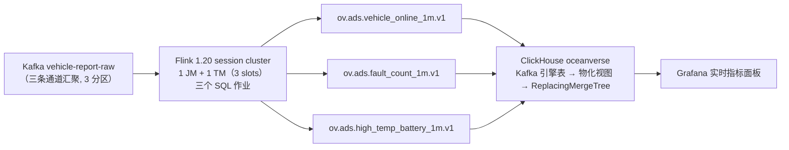

# streaming 流处理 —— Flink SQL 作业（warehouse 层的流处理模块）

> 上位：`../README.md`（warehouse 层定位与分层规约）｜对应《OceanVerse 架构总览》§1.1 实时计算层 / 能力域③计算引擎。
> **本模块职责**：把 `vehicle-report-raw` 里的标准信封（接入层契约）算成**可直接查询的 ADS 指标**，落到 ClickHouse serving 层。
>
> 📚 **简称约定**：《接入层设计》= 《../../ingest/docs/01-接入层设计-v1.md》｜《GB32960 映射》= 《../../ingest/docs/02-GB32960协议规格-v1.md》
> 🧭 上下游关系：接入层只负责"把数据干净地送进 Kafka"，**不做业务判断**；"什么算高温"这类业务口径全部在本模块。

---

## 1. 链路位置



> **为什么结果经 Kafka 再进 ClickHouse**（2026-09-20 实测决策，三条路都试过）：
> Flink 侧没有可用的 ClickHouse SQL 连接器 —— ① `flink-connector-jdbc` 的工厂列表里没有 ClickHouse；
> ② ClickHouse 官方 `flink-connector-clickhouse` 只有 DataStream sink 类、**没有 Table/SQL 工厂**
> （内省 jar 确认）；③ Maven Central 上其余构件都是 StreamX/StreamPark 等框架专用。
> 于是走 ClickHouse 原生范式：**Kafka 引擎表 + 物化视图**（全 SQL、无协议 hack，且结果留在 Kafka 可回放）。

---

## 2. 指标口径（**唯一源**）

> 改口径必须**三处同步**：本表 ／ `sql/00-common.sql`（sink 与字段）／ `clickhouse/init.sql`（表与还原）。
> `scripts/check-docs.sh` 的检查⑨ 会核对三处的表名与 topic 是否一致。

| 指标 | 结果表 | 结果 topic | 窗口 | 口径（精确表述） |
|---|---|---|---|---|
| **车辆在线数** | `ads_vehicle_online_1m` | `ov.ads.vehicle_online_1m.v1` | 1 分钟滚动 | 窗口内**上报过的去重车辆数**（`COUNT(DISTINCT vin)`）。是"活跃车辆数"的近似，**不等于** MQTT 长连接在线数 |
| **故障数** | `ads_fault_count_1m` | `ov.ads.fault_count_1m.v1` | 1 分钟滚动 | 按 `fault_code` 分组的次数与涉及车辆数；**先按 `(vin, ts, code)` 去重**（故障走 QoS1，同一条会重复投递） |
| **高温电池** | `ads_high_temp_battery_1m` | `ov.ads.high_temp_battery_1m.v1` | 1 分钟滚动 | `type=battery_status` 每车窗口内**最高** `temp_max`；`≥45℃ → warn`、`≥55℃ → alarm`（阈值 2026-09-20 定，待电池团队确认后进第 2 阶段口径字典） |

**三条全局口径**（三个作业都适用）：

1. **探针帧必须剔除**：`vin NOT LIKE 'OVPROBE%'` —— `scripts/check-pipeline-health.sh` 的探针会真实走完链路，
   不过滤就会污染在线数/故障数（第十轮已发生过一次真实污染）。
2. **时间语义**：事件时间取契约的 `ts`（Unix 秒），watermark 容忍 **10 秒**乱序/迟到；
   迟到超过 10 秒的数据不进任何窗口（第 1 阶段接受，见 §7）。
3. **时间戳过 Kafka 一律用 epoch 秒（BIGINT）**：避免时间戳类型的 JSON 表示随格式/版本变化；
   ClickHouse 侧 `toDateTime(秒)` 还原。

---

## 3. 目录

```
warehouse/                       ← 数仓层（层手册见 warehouse/README.md）
├── README.md                    #   层定位 / 分层规约 / 模块索引（含"为什么叫 warehouse 不叫 lakehouse"）
└── streaming/                   ← 本模块：流处理
    ├── sql/
    │   ├── 00-common.sql        #   源表(Kafka) + 三个 sink(Kafka) —— 连接参数与字段的**单一源**
    │   ├── 10-online-count.sql  #   作业①：在线数（只有 INSERT）
    │   ├── 20-fault-count.sql   #   作业②：故障数（含 (vin,ts,code) 去重）
    │   └── 30-high-temp.sql     #   作业③：高温电池（45/55 阈值）
    ├── clickhouse/init.sql      #   Kafka 引擎表 + 物化视图 + 目标表（幂等, 可重复执行）
    ├── conf/sql-client-flink-conf.yaml   # 提交容器的客户端配置（连远端 session cluster）
    ├── submit-jobs.sh           #   提交脚本（判据 = 集群里真出现该作业）
    └── README.md                #   本文件（口径唯一源 + 运行/验证手册）
```

> 第 2 阶段的批处理分层（ODS→DWD→DWS、Iceberg 双写）会作为**兄弟模块** `../batch/` 加入，本模块内容不需要迁移。

作业与 Flink 集群的部署件在 `deploy/`：`deploy/flink/Dockerfile`（自建镜像补连接器）、
`deploy/docker-compose.yaml` 的 `flink-jobmanager` / `flink-taskmanager`（**profile `realtime`**）。

---

## 4. 跑起来（四步）

```bash
cd <repo 根>

# ① 起 Flink（基础八容器若没起, 先 docker compose -f deploy/docker-compose.yaml up -d）
docker compose -f deploy/docker-compose.yaml --profile realtime up -d
curl -s http://127.0.0.1:18088/overview    # 期望 taskmanagers=1, slots-total=3
#   注意用 127.0.0.1 不要用 localhost（本机 8081 被公司 Java 服务占着, 见 deploy/README Q18）

# ② 建 ClickHouse 对象（3 目标表 + 3 Kafka 引擎表 + 3 物化视图 = 9 个）
docker exec -i ov-clickhouse clickhouse-client --user ov_admin --password ov_pass_2026 --multiquery < warehouse/streaming/clickhouse/init.sql

# ③ 提交三个作业（判据 = 集群里真出现该作业名）
bash warehouse/streaming/submit-jobs.sh

# ④ 看结果
docker exec ov-clickhouse clickhouse-client --user ov_admin --password ov_pass_2026 \
  --query "SELECT * FROM oceanverse.ads_vehicle_online_1m ORDER BY window_start DESC LIMIT 5 FORMAT PrettyCompact"
#   Grafana: http://localhost:3000 → Dashboards → "realtime 实时指标（在线数 / 故障 / 高温电池）"
#   该看板 realtime-metrics（4 图）：最新在线数 / 在线数趋势 / 故障数按码 / 高温告警表
```

产生测试流量（另开终端；三条通道任选）：

```bash
cd ingest/device-simulator
go run ./cmd/mqtt-simulator -broker tcp://localhost:11883 -devices 40 -interval 5s -duration 120s -fault-pct 8
go run ./cmd/bin-simulator  -broker tcp://localhost:11883 -devices 20 -interval 10s -duration 120s
#   本机 EMQX 明文端口是 11883（deploy/.env 覆盖, 见 deploy/README Q10）
```

> 高温数据：模拟器的 `temp_max` 是 20~45℃（`simdata`），**基本触发不了 45℃ 阈值**。
> 验证作业③请显式注入，例如：
> ```bash
> curl -s -o /dev/null -X POST http://localhost:18080/api/v1/vehicle/report \
>   -H "X-Device-Token: dev-OV00000002" -H 'Content-Type: application/json' \
>   -d "{\"vin\":\"OV00000002\",\"ts\":$(date +%s),\"type\":\"battery_status\",\"data\":{\"temp_max\":58,\"soc\":65}}"
> ```

---

## 5. 验证（2026-09-20 实测，非推演）

**① 端到端三个作业都出数**（40 台 JSON + 20 台二进制模拟器 + 注入高温）：

| 结果表 | 实测 |
|---|---|
| `ads_vehicle_online_1m` | 每分钟 40 台 / 984~1002 条上报（与 40 台 × 5s 上报吻合） |
| `ads_fault_count_1m` | 5 个故障码 × 每分钟 79~116 次、涉及 30~39 台车 |
| `ads_high_temp_battery_1m` | 注入的 6 台车按 47℃→`warn` / 58℃→`alarm` 正确分级 |
| 探针污染 | `WHERE vin LIKE 'OVPROBE%'` 命中 **0 行** ✅ |

**② QoS1 去重（可判定的对照实验）** —— 这是作业②唯一的正确性前提：

```
输入（raw topic 实测 4 条）:  A=(OV…99, T,   ZTEST) ×2  ← 模拟 QoS1 重复投递
                              B=(OV…99, T+1, ZTEST)
                              C=(OV…98, T,   ZTEST)
期望:                         该窗口 ZTEST fault_cnt=3（A 只算 1 次）, vehicle_cnt=2
实测:                         fault_cnt=3, vehicle_cnt=2   ✅
```

**③ 分区与并行度**：三个作业共用同一个源表 DDL（同一 `properties.group.id`），
实测**每个作业都拿到全量流**（30 台车跑 75s → `online_cnt=33`，含对照实验的心跳车；
若被按分区瓜分则只会看到约 1/3）。原因：未开 checkpoint 时 Flink 不提交位移，
Kafka 侧看不到该消费组（`--list --state` 只有 ClickHouse 与 codec 的组）——
**这既是当前"全量消费"的原因，也是 §7 的第一条边界**。

**④ 对账**：网关 `requests_total` ≈ raw topic 消息数（含历史累计）→ 三个结果 topic 条数
→ ClickHouse 行数，逐段可解释（见 `scripts/check-pipeline-health.sh` 的受理==落盘判据）。

**⑤ 看板可用性**：`realtime-metrics` 的 4 张图逐一用 Grafana 的 `/api/ds/query` 跑过 —— 全部返回数据
（1/6/23/9 行）。做这块时**炸出两个历史遗留问题**（都已修，留档免得重踩）：

- **ClickHouse 数据源自 provision 起就是坏的**：插件（v4.21.3）只认 `jsonData.host`，而 provisioning 里
  只写了 `url` + `port` + `protocol` → 任何查询都报 `[config] invalid server host`。
  此前没有一张面板用过它（面板全是 Prometheus 的），所以这个洞躺了一周多才被第一个 CH 面板炸出来
  —— 又一个"结构上存在 ≠ 真能用"的实例。
- **数据源 provisioning 不在线热载**：改完 `datasources/*.yaml` 必须**重启 Grafana** 才生效
  （面板文件走 `updateIntervalSeconds: 10` 会热载，数据源不会）；另外新建的 JSON 文件权限要与既有面板一致
  （644），权限过窄时 Grafana 会静默跳过。

---

## 6. 运维

**停作业**（重提前必须先停，否则同一作业跑两份 = 重复计算）：

```bash
# 列出运行中的作业
curl -s http://127.0.0.1:18088/jobs/overview | python3 -c "
import json,sys
for j in json.load(sys.stdin)['jobs']:
    if j['state']=='RUNNING': print(j['jid'], j['name'])"
# 取消某个作业（mode=cancel 保留 checkpoint/mode=stop 触发 savepoint）
curl -s -X PATCH "http://127.0.0.1:18088/jobs/<jid>?mode=cancel"
```

`submit-jobs.sh` 内置两道**基于活动状态**的判据（都因为踩过同一个坑才加上）：
① **守卫**：同名作业处于活动状态时拒绝提交；
② **回查**：提交后轮询"集群里出现**活动状态**的该作业"才算成功。

> 为什么强调"活动状态"：`/jobs/overview` **会保留已取消/已完成的历史作业**。
> 第一版守卫与回查都只按名字匹配，于是①把刚取消的作业当成"在跑"而拒绝重提，②更糟 ——
> 在一次挂载路径写错、提交其实失败的情况下，被历史作业匹配成 ✅（**假成功**）。
> 两次都是"判据取不到端到端成立的事实"，与本仓 `pipeline-health` 的教训同源。

---

## 7. 已知边界（诚实记录，均为第 2 阶段收口项）

| # | 边界 | 影响 | 收口方式 |
|---|---|---|---|
| 1 | **未开 checkpoint**：窗口状态在 JM/TM 重启后丢失；Kafka 启动位点是 `latest-offset` | 重启期间的半个窗口会丢；不提交位移故 Kafka 侧无 lag 可看 | 第 2 阶段：开 checkpoint（可落 MinIO，镜像自带 S3 插件）+ 恢复位点改 `group-offsets` + 幂等落表 |
| 2 | 结果链路是 **at-least-once**：Flink → Kafka → CH 物化视图 | CH 重启后可能重放少量消息 → 目标表可能有重复 | 目标表已是 `ReplacingMergeTree` + 业务键排序；精确查询用 `FINAL`。更强方案（幂等键/去重表）随第 2 阶段 |
| 3 | **迟到 >10s 的数据不进窗口** | 弱网重传的老数据只进 Kafka、不进指标 | 第 2 阶段：按业务容忍度调 watermark 或用 `allowedLateness` + 侧输出 |
| 4 | 并行度 = 1/作业（3 个作业恰好占满 3 个 slot） | 吞吐上限低（当前量级远未触及） | 扩 TaskManager + 把 `SET 'parallelism.default'` 提到 3（raw topic 已是 3 分区, 可直接吃满） |
| 5 | "在线数"是**活跃车辆数**近似 | 心跳稀疏的车会被算成离线 | 第 2 阶段口径字典加"最近 5 分钟有心跳即在线"，与现口径并存而非替换 |
| 6 | 高温阈值 45/55℃ 未与电池团队确认 | 可能偏离业务定义 | 确认后改进 `30-high-temp.sql` 与 §2 口径表 |

---

## 8. 延伸阅读

- 《接入层设计》—— 上游契约、QoS、探针保留段（`OVPROBE`）的由来
- `deploy/README.md` Q18/Q19 —— 本层踩过的两个环境坑（localhost→`::1`、Flink 角色参数）
- `deploy/flink/Dockerfile` 头注 —— "为什么必须自建 Flink 镜像"与 ClickHouse 连接器的三条死路
